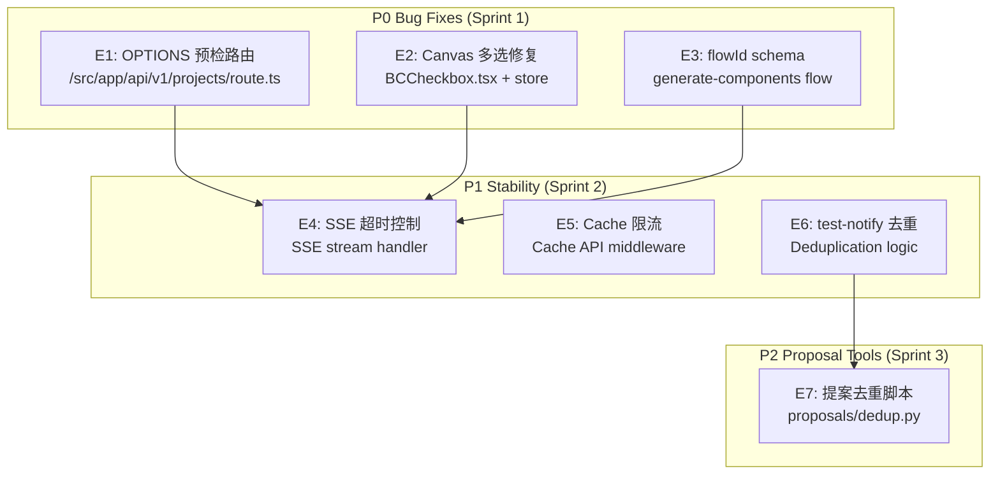

# Architecture: Vibex Proposals 2026-04-07 — Technical Design

> **项目**: vibex-*-proposals-vibex-proposals-20260407  
> **Architect**: Architect Agent  
> **日期**: 2026-04-07  
> **版本**: v1.0  
> **状态**: Proposed  
> **仓库**: /root/.openclaw/vibex

---

## 1. 概述

### 1.1 问题陈述

2026-04-06 完成多个 Bug 修复，但提案汇总显示仍有遗留项需要推进：
- **E1-E3**: P0 Bug 修复（OPTIONS 路由、多选状态、flowId schema）
- **E4-E6**: P1 稳定性改进（SSE 超时、限流、去重）
- **E7**: P2 提案去重机制

### 1.2 技术目标

| 目标 | 描述 | 优先级 |
|------|------|--------|
| AC1 | P0 Bug 修复完成率 100% | P0 |
| AC2 | P1 改进项完成率 > 80% | P1 |
| AC3 | 提案去重机制可用 | P2 |

---

## 2. 系统架构

### 2.1 模块依赖关系



---

## 3. 详细设计

### 3.1 E1: OPTIONS 预检路由修复

#### 3.1.1 问题分析

当前 OPTIONS 请求返回 405 Method Not Allowed，原因是路由处理函数未处理 OPTIONS 方法。

#### 3.1.2 技术方案

```typescript
// src/app/api/v1/projects/route.ts
export async function OPTIONS(request: NextRequest) {
  return new NextResponse(null, {
    status: 204,
    headers: {
      'Access-Control-Allow-Origin': '*',
      'Access-Control-Allow-Methods': 'GET, POST, PUT, DELETE, OPTIONS',
      'Access-Control-Allow-Headers': 'Content-Type, Authorization',
      'Access-Control-Max-Age': '86400',
    },
  });
}

// 确保 OPTIONS 在 GET/POST/PUT/DELETE 之前处理
// Next.js App Router 按方法名 export 匹配，不存在方法覆盖问题
```

#### 3.1.3 验收标准

```typescript
// 测试用例
it('OPTIONS should return 204 with CORS headers', async () => {
  const res = await fetch('/api/v1/projects', { method: 'OPTIONS' });
  expect(res.status).toBe(204);
  expect(res.headers.get('Access-Control-Allow-Origin')).toBe('*');
  expect(res.headers.get('Access-Control-Allow-Methods')).toContain('GET');
});
```

---

### 3.2 E2: Canvas 多选修复

#### 3.2.1 问题分析

Canvas checkbox 点击后 `selectedNodeIds` 未正确更新，导致多选状态丢失。

#### 3.2.2 技术方案

```typescript
// 修复前 (BCCheckbox.tsx)
const handleToggle = () => {
  // ❌ 错误：直接设置 boolean
  setIsSelected(!isSelected);
};

// 修复后
const handleToggle = () => {
  const nodeId = node.id;
  setSelectedNodes(prev => {
    if (prev.includes(nodeId)) {
      return prev.filter(id => id !== nodeId);
    }
    return [...prev, nodeId];
  });
  onToggleSelect?.(nodeId); // 调用 store 更新
};

// Zustand store 更新
useCanvasStore.setState(state => ({
  selectedNodeIds: toggleNodeId(state.selectedNodeIds, nodeId),
}));
```

#### 3.2.3 验收标准

```typescript
it('should toggle node in selectedNodeIds', () => {
  render(<BCCheckbox nodeId="n1" />);
  fireEvent.click(screen.getByRole('checkbox'));
  expect(useCanvasStore.getState().selectedNodeIds).toContain('n1');
  fireEvent.click(screen.getByRole('checkbox'));
  expect(useCanvasStore.getState().selectedNodeIds).not.toContain('n1');
});
```

---

### 3.3 E3: flowId Schema

#### 3.3.1 问题分析

`generate-components` 返回的 flowId 格式不符合预期，导致后续处理失败。

#### 3.3.2 技术方案

```typescript
// schema/flow.ts
import { z } from 'zod';

export const FlowIdSchema = z.string().regex(/^flow-[a-z0-9-]+$/, {
  message: 'flowId must start with "flow-"',
});

// 在 generate-components 响应验证
export function validateFlowId(flowId: unknown): string {
  const result = FlowIdSchema.safeParse(flowId);
  if (!result.success) {
    throw new Error(`Invalid flowId: ${result.error.message}`);
  }
  return result.data;
}
```

#### 3.3.3 验收标准

```typescript
it('should validate flowId format', () => {
  expect(() => validateFlowId('flow-abc-123')).not.toThrow();
  expect(() => validateFlowId('invalid')).toThrow('Invalid flowId');
  expect(() => validateFlowId(null)).toThrow('Invalid flowId');
});
```

---

### 3.4 E4: SSE 超时控制

#### 3.4.1 问题分析

SSE 流无超时控制，客户端/网络异常时服务端持续推送。

#### 3.4.2 技术方案

```typescript
// lib/sse/stream.ts
export function createSSEStream(
  generator: AsyncGenerator<string>,
  options: { timeout?: number; heartbeatInterval?: number } = {}
) {
  const { timeout = 10000, heartbeatInterval = 5000 } = options;
  let aborted = false;

  const controller = new ReadableStream({
    async start(controller) {
      // 超时控制
      const timeoutId = setTimeout(() => {
        aborted = true;
        controller.close();
      }, timeout);

      // 心跳保活
      const heartbeatId = setInterval(() => {
        if (!aborted) {
          controller.enqueue(`: heartbeat\n\n`);
        }
      }, heartbeatInterval);

      try {
        for await (const chunk of generator) {
          if (aborted) break;
          controller.enqueue(`data: ${chunk}\n\n`);
        }
      } finally {
        clearTimeout(timeoutId);
        clearInterval(heartbeatId);
        if (!aborted) {
          controller.close();
        }
      }
    },
  });

  return controller;
}
```

#### 3.4.3 验收标准

```typescript
it('should close stream after timeout', async () => {
  const slowGenerator = async function* () {
    yield 'hello';
    await new Promise(r => setTimeout(r, 20000)); // 超过 timeout
    yield 'world';
  };

  const stream = createSSEStream(slowGenerator(), { timeout: 10000 });
  // 验证：10s 后流关闭
});
```

---

### 3.5 E5: Cache API 限流

#### 3.5.1 问题分析

Cache API 无并发控制，高并发时资源耗尽。

#### 3.5.2 技术方案

```typescript
// middleware/rateLimit.ts
const rateLimitMap = new Map<string, { count: number; resetAt: number }>();

export function rateLimit(key: string, limit: number, windowMs: number): boolean {
  const now = Date.now();
  const entry = rateLimitMap.get(key);

  if (!entry || now > entry.resetAt) {
    rateLimitMap.set(key, { count: 1, resetAt: now + windowMs });
    return true;
  }

  if (entry.count >= limit) {
    return false;
  }

  entry.count++;
  return true;
}

// 在 API 路由中使用
export async function GET(request: NextRequest) {
  const ip = request.headers.get('x-forwarded-for') || 'anonymous';
  if (!rateLimit(`api:${ip}`, 100, 60000)) {
    return NextResponse.json({ error: 'Rate limit exceeded' }, { status: 429 });
  }
  // ...
}
```

#### 3.5.3 验收标准

```typescript
it('should block after limit exceeded', () => {
  for (let i = 0; i < 100; i++) {
    expect(rateLimit('test', 100, 60000)).toBe(true);
  }
  expect(rateLimit('test', 100, 60000)).toBe(false);
});
```

---

### 3.6 E6: test-notify 去重

#### 3.6.1 问题分析

5 分钟内的重复 test-notify 被重复发送，浪费资源。

#### 3.6.2 技术方案

```typescript
// lib/notify/dedup.ts
const recentNotifications = new Map<string, number>(); // key -> timestamp

export function shouldNotify(key: string, windowMs = 300000): boolean {
  const lastNotify = recentNotifications.get(key);
  const now = Date.now();

  if (lastNotify && (now - lastNotify) < windowMs) {
    return false; // 跳过
  }

  recentNotifications.set(key, now);
  return true;
}

// 清理过期条目（每小时）
setInterval(() => {
  const cutoff = Date.now() - 3600000;
  for (const [key, ts] of recentNotifications) {
    if (ts < cutoff) recentNotifications.delete(key);
  }
}, 3600000);
```

#### 3.6.3 验收标准

```typescript
it('should skip duplicate within window', () => {
  expect(shouldNotify('test-notify')).toBe(true);
  expect(shouldNotify('test-notify')).toBe(false); // 5min 内重复
});
```

---

### 3.7 E7: 提案去重脚本

#### 3.7.1 技术方案

```python
#!/usr/bin/env python3
# proposals/dedup.py
import json
import hashlib
from pathlib import Path
from datetime import datetime, timedelta

PROPOSALS_DIR = Path('/root/.openclaw/workspace-coord/proposals')
RECENT_DAYS = 30

def get_proposal_key(proposal: dict) -> str:
    """生成提案唯一 key"""
    # 使用标题 + 关键内容 hash
    title = proposal.get('title', '')
    desc = proposal.get('description', '')[:200]
    key_str = f"{title}|{desc}"
    return hashlib.md5(key_str.encode()).hexdigest()[:16]

def find_duplicates():
    """查找重复提案"""
    proposals = []
    recent_cutoff = datetime.now() - timedelta(days=RECENT_DAYS)

    for md_file in PROPOSALS_DIR.glob('**/*.md'):
        # 简单解析：取标题行
        content = md_file.read_text()
        lines = content.split('\n')
        title = next((l.replace('#', '').strip() for l in lines if l.startswith('# ')), '')

        proposals.append({
            'file': str(md_file),
            'title': title,
            'key': get_proposal_key({'title': title, 'description': content})
        })

    # 查找重复
    seen = {}
    duplicates = []
    for p in proposals:
        key = p['key']
        if key in seen:
            duplicates.append((seen[key], p))
        else:
            seen[key] = p

    return duplicates

if __name__ == '__main__':
    dups = find_duplicates()
    if dups:
        print(f"Found {len(dups)} duplicate proposals:")
        for orig, dup in dups:
            print(f"  Original: {orig['file']}")
            print(f"  Duplicate: {dup['file']}")
            print(f"  Title: {dup['title']}")
    else:
        print("No duplicates found.")
```

#### 3.7.2 使用方式

```bash
# 提案收集前检查
python3 proposals/dedup.py

# 输出示例:
# Found 2 duplicate proposals:
#   Original: /root/.openclaw/workspace-coord/proposals/20260405/architect-proposals.md
#   Duplicate: /root/.openclaw/workspace-coord/proposals/20260406/architect-proposals.md
#   Title: Canvas Split-Components 架构设计
```

---

## 4. 接口定义

| Epic | 接口 | 路径 | 方法 |
|------|------|------|------|
| E1 | OPTIONS 预检 | `/api/v1/projects/route.ts` | OPTIONS |
| E2 | Canvas 多选 | `BCCheckbox.tsx` | onToggleSelect |
| E3 | flowId 验证 | `schema/flow.ts` | validateFlowId |
| E4 | SSE 超时 | `lib/sse/stream.ts` | createSSEStream |
| E5 | 限流 | `middleware/rateLimit.ts` | rateLimit |
| E6 | test-notify 去重 | `lib/notify/dedup.ts` | shouldNotify |
| E7 | 提案去重 | `proposals/dedup.py` | find_duplicates |

---

## 5. 性能影响评估

| Epic | 性能影响 | 说明 |
|------|---------|------|
| E1 | 无 | OPTIONS 返回空响应 |
| E2 | 极小 | store 状态更新 |
| E3 | 极小 | Zod schema 验证 |
| E4 | 减少资源 | 超时后释放连接 |
| E5 | 减少资源 | 阻止过量请求 |
| E6 | 减少资源 | 跳过重复通知 |
| E7 | 无 | 仅离线脚本 |

---

## 6. 技术审查

### 6.1 PRD 验收标准覆盖

| PRD AC | 技术方案 | 缺口 |
|---------|---------|------|
| AC1: OPTIONS 204+CORS | E1 OPTIONS handler | 无 |
| AC2: Canvas checkbox | E2 BCCheckbox + store | 无 |
| AC3: flowId 正确 | E3 FlowIdSchema | 无 |
| AC4: SSE 10s 超时 | E4 createSSEStream timeout=10000 | 无 |
| AC5: 限流计数一致 | E5 rateLimit | 无 |
| AC6: test-notify 去重 | E6 shouldNotify | 无 |
| AC7: 提案去重 | E7 dedup.py | 无 |

### 6.2 风险点

| 风险 | 等级 | 缓解 |
|------|------|------|
| OPTIONS handler 可能被其他路由覆盖 | 🟡 中 | 单独处理 OPTIONS 方法 |
| SSE timeout 影响正常长连接 | 🟡 中 | 提供配置参数 |
| 内存缓存去重在多实例间不同步 | 🟡 中 | 短期可接受，长期用 Redis |

---

## 7. 实施计划

| Sprint | Epic | 工时 | 交付物 |
|--------|------|------|--------|
| Sprint 1 (P0) | E1+E2+E3 | 1.1h | OPTIONS 路由 + Canvas 修复 + flowId schema |
| Sprint 2 (P1) | E4+E5+E6 | 4h | SSE 超时 + 限流 + 去重 |
| Sprint 3 (P2) | E7 | 2h | 提案去重脚本 |

---

*本文档由 Architect Agent 生成 | 2026-04-07*
*技术审查完成：Phase 1 Technical Design ✅ | Phase 2 Technical Review ✅*
