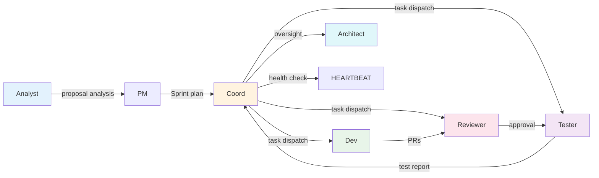

# AGENTS.md: Vibex Analyst Proposals — Sprint Debt Clearance 2026-04-10

**Project**: vibex-analyst-proposals-vibex-proposals-20260410
**Author**: Architect
**Date**: 2026-04-10

---

## 1. Agent Roles Overview



| Agent | Role | Sprint Responsibility |
|-------|------|----------------------|
| **Analyst** | Proposal analysis & methodology | Analyze pending proposals, produce structured analysis |
| **PM** | Product management | Approve proposals, prioritize sprint backlog |
| **Coord** | Orchestration & heartbeat | Dispatch tasks, monitor health, deduplicate |
| **Dev** | Implementation | Execute code changes per implementation plan |
| **Reviewer** | Code review | Approve/reject PRs, enforce standards |
| **Tester** | QA & verification | Write and run E2E tests, verify acceptance criteria |
| **Architect** | System design | Define architecture, validate technical decisions |

---

## 2. Role Responsibilities

### 2.1 Dev Agent

**Primary Responsibility**: Execute Sprint Day 1 & Day 2 implementation tasks

**Sprint Tasks**:

| Story | Tasks | Output |
|-------|-------|--------|
| S1.1 | Migrate Slack token to env var | `git push` succeeds after task_manager.py edit |
| S1.2 | Clean explicit any from 9+ TS files | `pnpm lint` + `tsc --noEmit` pass |
| S2.1 | Unify Tree toolbar buttons | Shared `<TreeButton>` component, 3 trees updated |
| S2.2 | Consolidate selectedNodeIds | `Set<string>` only in treeStore |
| S3.1 | Add componentStore batch methods | `addComponents`/`removeComponents` methods |
| S3.2 | Implement proposal-tracker update | CLI subcommand working |
| S4.1 | Add ComponentRegistry HMR | New components visible without restart |
| S4.2 | Implement reviewer dedup | Dedup logic in Coord scanner |

**DoD Compliance per Story**:
- [ ] Code change committed with message referencing proposal ID (e.g., `fix(A-P0-1): ...`)
- [ ] All unit/integration tests pass (`pnpm test`)
- [ ] TypeScript compilation passes (`npx tsc --noEmit`)
- [ ] Lint passes (`pnpm lint`)
- [ ] E2E tests pass (if applicable)
- [ ] TRACKING.md updated via `proposal_tracker.py update <id> done`
- [ ] No new `any` types introduced in changed files

**Key Files to Modify**:
```
scripts/task_manager.py                              # S1.1
vibex-fronted/src/**/*.tsx (9+ files)                # S1.2
vibex-fronted/src/components/**/BoundedContextTree* # S2.1
vibex-fronted/src/components/**/FlowTree*            # S2.1
vibex-fronted/src/components/**/ComponentTree*       # S2.1
vibex-fronted/src/components/ui/TreeButton.tsx      # S2.1 (new)
vibex-fronted/src/lib/canvas/stores/treeStore.ts    # S2.2
vibex-fronted/src/lib/canvas/stores/canvasStore.ts   # S2.2
vibex-fronted/src/lib/canvas/stores/componentStore.ts # S3.1
scripts/proposal_tracker.py                          # S3.2
vibex-fronted/src/lib/canvas/ComponentRegistry.ts   # S4.1
vibex-fronted/src/components/**/JsonRenderPreview*   # S4.1
scripts/heartbeat-scanner.ts                         # S4.2
```

---

### 2.2 Reviewer Agent

**Primary Responsibility**: Ensure code quality, safety, and standards compliance

**Sprint Responsibilities**:

| Story | Review Focus | Criteria |
|-------|-------------|----------|
| S1.1 | Token migration is safe; no remaining hardcoded secrets | `grep xoxp-` empty in task_manager.py |
| S1.2 | All explicit any removed or justified; type safety improved | No `any` in diff; `tsc --noEmit` passes |
| S2.1 | Shared Button component is generic and reusable | `TreeButton` used consistently across 3 trees |
| S2.2 | No circular dependencies between stores | treeStore is sole source of selectedNodeIds |
| S3.1 | Batch methods are performant (< 100ms) | Perf test included in PR |
| S3.2 | proposal-tracker update is atomic | Temp file + rename pattern used |
| S4.1 | HMR does not break existing component loading | Manual test confirmed |
| S4.2 | Dedup logic is deterministic and safe | Unit test covers edge cases |

**Review Protocol**:
1. Check PR title references proposal ID (e.g., `fix(A-P0-1): ...`)
2. Run `pnpm lint` and `pnpm test` locally against PR branch
3. Verify no new `any` types in diff
4. For S1.2 specifically: audit each type replacement for correctness
5. For S2.2 specifically: verify canvasStore consumers migrated to treeStore
6. Approve with comment or request changes with specific feedback

**Trigger**: Reviewer is assigned via `team-tasks` when Dev creates a PR

---

### 2.3 Tester Agent

**Primary Responsibility**: E2E test coverage and acceptance criteria verification

**Sprint Responsibilities**:

| Story | Test Deliverable | File |
|-------|----------------|------|
| S1.3 | flowId E2E test (primary owner) | `tests/e2e/generate-components-flowid.test.ts` |
| S2.1 | Button interaction E2E (support) | `tests/e2e/tree-buttons.test.ts` |
| S3.1 | Batch method perf test | `tests/unit/stores/componentStore.test.ts` |
| S4.2 | Dedup logic unit test | `tests/unit/dedup.test.ts` |
| Regression | Full regression on Day 2 | All CI gates |

**E2E Test Strategy for S1.3**:
```typescript
// Priority 1: Generate components → verify flowId in database
// Priority 2: Canvas UI → verify component appears under correct Flow node
// Priority 3: Multiple flowIds → verify isolation
```

**Regression Checklist (Day 2 End)**:
- [ ] `npx tsc --noEmit` → 0 errors
- [ ] `pnpm lint` → 0 violations
- [ ] `pnpm test:unit` → all pass
- [ ] `pnpm test:e2e` → all pass
- [ ] `git push` → no secret scanning blocks
- [ ] `proposal_tracker.py list --status=done` → 9 proposals done

---

### 2.4 Coord Agent

**Primary Responsibility**: Task orchestration, heartbeat monitoring, reviewer dedup

**Sprint Responsibilities**:

| Phase | Action | Timing |
|-------|--------|--------|
| Sprint Start | Dispatch all 8 stories to Dev/Tester per IMPLEMENTATION_PLAN | 2026-04-10 09:00 |
| Day 1 | Monitor progress via team-tasks; escalate blockers | Ongoing |
| Day 2 AM | Verify S3.1-S4.2 completion; dispatch Tester for E2E | 2026-04-11 09:00 |
| Day 2 PM | Run full regression; verify TRACKING.md final state | 2026-04-11 14:00 |
| Sprint End | Close project; archive session | 2026-04-11 16:00 |

**Coord-Specific Tasks for This Sprint**:

| Task | Description |
|------|-------------|
| Reviewer Dedup (S4.2) | Ensure same PR is not assigned to multiple reviewer subagents |
| Proposal Lifecycle Closure | Verify all 9 proposals have `proposal_tracker.py update <id> done` |
| TRACKING.md Audit | Verify TRACKING.md reflects true state after sprint |
| Dedup Scanner Deployment | Deploy S4.2 dedup logic to production Coord heartbeat |

**Coord Heartbeat Scan (Sprint Period)**:
```python
# Check every heartbeat during sprint:
# 1. Are all 9 proposals in done/accepted/rejected status? (no "pending" left)
# 2. Are reviewer tasks deduplicated by prId?
# 3. Are Dev tasks progressing? (no stale "in_progress" > 2h)
# 4. Is CI green? (lint + tsc + test)
```

---

## 3. Cross-Agent Collaboration Protocols

### 3.1 Proposal Update Protocol

Every proposal status change must follow this chain:

```
Dev (or Tester) completes story
  → creates PR with proposal ID in title
  → Reviewer approves
  → Dev runs: proposal_tracker.py update <id> done
  → Coord verifies via heartbeat scan
  → TRACKING.md reflects done
```

**Invalid**: Manually editing TRACKING.md or updating task JSON status directly.

### 3.2 Blocker Escalation Protocol

```
Dev encounters blocker
  → sends message to #coord channel: "BLOCKER: S1.2 — <reason>"
  → Coord assesses:
    → If dependency: coord resolves dependency, unblocks Dev
    → If technical: architect provides guidance
    → If scope: PM re-prioritizes
  → Dev unblocked: resumes work
  → Coord logs blocker resolution in project docs
```

### 3.3 Review Assignment Protocol

```
Dev creates PR
  → Coord scans pending reviewer tasks
  → Coord checks prId dedup (S4.2)
  → Coord assigns to available reviewer subagent
  → Reviewer processes review
  → Reviewer posts approval or changes-requested
  → Dev addresses feedback
  → Cycle repeats until approved
```

### 3.4 Sprint End Protocol

| Step | Agent | Action |
|------|-------|--------|
| 1 | Tester | Run full regression suite, report to Coord |
| 2 | Coord | Audit TRACKING.md — all 9 proposals must be done |
| 3 | Coord | Verify CI gates all green |
| 4 | Coord | Close project in team-tasks |
| 5 | Coord | Archive session |
| 6 | Coord | Post sprint summary to #coord |

---

## 4. Proposal Analysis Methodology

This sprint focuses on **proposal analysis methodology and tracking mechanisms**. The key principles:

### 4.1 Proposal Analysis Principles

| Principle | Description | Tool |
|-----------|-------------|------|
| **Root cause identification** | Every proposal must identify the underlying cause, not just symptoms | analyst.md |
| **Priority derivation** | Priority based on impact (team velocity, user experience, revenue) | PRD |
| **Effort estimation** | Hours estimated per story, not per proposal | IMPLEMENTATION_PLAN |
| **Acceptance criteria** | Every story has measurable AC, not subjective | PRD + spec files |
| **Lifecycle closure** | Every proposal must reach terminal state (done/rejected) | proposal-tracker |

### 4.2 Proposal Analysis Process

```
Analyst identifies problem
  → Writes proposal (A-P{0-2}-{N}) with:
      - Problem statement
      - Impact assessment
      - Proposed solution
      - Acceptance criteria
      - Estimated hours
  → PM reviews and approves/rejects
  → Accepted proposals enter TRACKING.md
  → Coord dispatches implementation task
  → Dev implements + runs proposal_tracker.py update
  → Reviewer approves
  → Tester verifies
  → Coord closes
```

### 4.3 Tracking Mechanism

```
TRACKING.md (source of truth)
  ↕ (manual update via CLI)
proposal_tracker.py (CLI tool)
  ↕ (reads/writes)
Team-tasks (task state management)
  ↕ (monitors)
Coord heartbeat (automated oversight)
```

**CLI-First Policy**: All proposal status updates go through `proposal_tracker.py` — no manual TRACKING.md edits.

### 4.4 Metrics (Sprint Goal)

| Metric | Baseline (2026-04-10) | Target (2026-04-11) |
|--------|----------------------|---------------------|
| Proposals in done/rejected status | 2/19 (10%) | 11/19 (58%) |
| proposal-tracker CLI usage | 0% | 100% of updates |
| TypeScript any violations | 9+ files | 0 files |
| E2E coverage for critical paths | Partial | Full (S1.3) |
| Git push blocks (secret scanning) | 1 file | 0 files |

---

## 5. Definition of Done

### Sprint DoD

- [ ] All 9 proposals reach terminal state (done/rejected)
- [ ] All CI gates green (lint + tsc + test)
- [ ] TRACKING.md updated via `proposal_tracker.py` for all 9 proposals
- [ ] No `any` types introduced in sprint changes
- [ ] Sprint retrospective notes recorded

### Story DoD (per story)

- [ ] Code committed with proposal ID in commit message
- [ ] Tests pass locally and in CI
- [ ] TypeScript compilation clean
- [ ] Lint clean
- [ ] E2E tests pass (if applicable)
- [ ] TRACKING.md updated
- [ ] Reviewer approved

---

## 6. Communication Channels

| Channel | Purpose | Cadence |
|---------|---------|---------|
| `#coord` | Sprint coordination, blocker escalation | As needed |
| `#architect` | Architecture questions, ADR discussions | As needed |
| team-tasks | Task dispatch and status | Every heartbeat |
| PR reviews | Code review comments | Per PR |
| TRACKING.md | Proposal status visibility | Updated per story |

---

*Architect — 2026-04-10*
