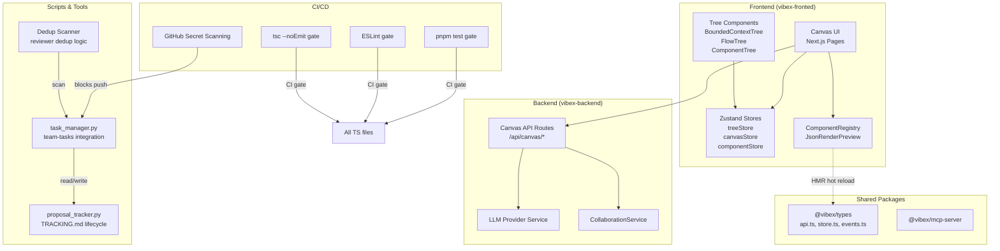
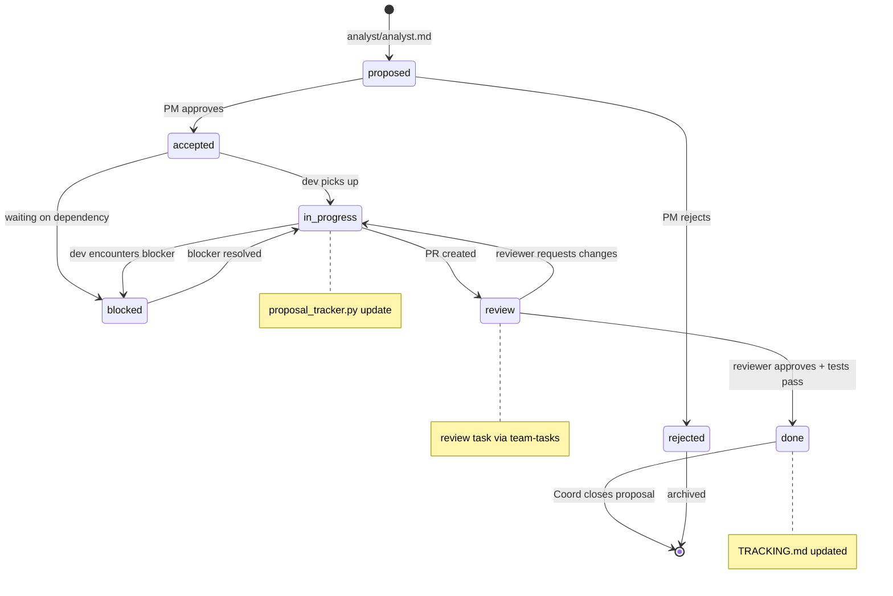

# Architecture: Vibex Analyst Proposals — Sprint Debt Clearance 2026-04-10

**Project**: vibex-analyst-proposals-vibex-proposals-20260410
**Author**: Architect
**Date**: 2026-04-10
**Status**: Ready for Sprint

---

## 1. Tech Stack

| Layer | Technology | Version | Rationale |
|-------|-----------|---------|-----------|
| **Runtime** | Node.js | v22.x | LTS, ESM support |
| **Package Manager** | pnpm | 10.32.x | Workspace support, strict hoisting |
| **Language** | TypeScript | 5.x | Type safety baseline (this sprint's goal) |
| **Linter** | ESLint + typescript-eslint | 9.x | `no-explicit-any` enforcement |
| **Type Checker** | tsc (noEmit) | 5.x | CI gate for type safety |
| **Test Runner** | Vitest | 2.x | Unit/integration tests |
| **E2E** | Playwright | 1.58.x | flowId E2E, canvas interactions |
| **Frontend** | Next.js (vibex-fronted) | 15.x | Canvas, Tree components |
| **Backend** | Next.js API Routes (vibex-backend) | 15.x | Canvas API, component generation |
| **State** | Zustand (via treeStore/canvasStore) | 4.x | Frontend state management |
| **CLI Scripts** | Python 3 | 3.11+ | task_manager.py, proposal_tracker.py |
| **CI/CD** | GitHub Actions | — | Secret scanning, pnpm test gates |

---

## 2. System Architecture

### 2.1 High-Level Component Map



### 2.2 Store Architecture (Zustand)

```mermaid
classDiagram
    class treeStore {
        +selectedNodeIds: Set~string~
        +setSelectedNodeIds(ids: Set~string~): void
        +addSelectedNodeId(id: string): void
        +removeSelectedNodeId(id: string): void
        +clearSelection(): void
    }

    class canvasStore {
        -- REMOVED: selectedNodeIds duplicate --
        +flowId: string
        +setFlowId(id: string): void
    }

    class componentStore {
        +components: Map~string, Component~
        +addComponent(c: Component): void
        +addComponents(cs: Component[]): void  -- S3.1
        +removeComponent(id: string): void
        +removeComponents(ids: string[]): void  -- S3.1
        +getById(id: string): Component | undefined
        +clear(): void
    }

    treeStore --|> "owns selection"
    canvasStore --|> "owns flow context"
    componentStore --|> "owns component registry"
```

### 2.3 Proposal Lifecycle State Machine



---

## 3. API Definitions

### 3.1 Proposal Tracker CLI (proposal-tracker.py)

```python
# scripts/proposal_tracker.py

# Existing subcommands
python3 scripts/proposal_tracker.py list [--status=<status>] [--priority=<priority>]
python3 scripts/proposal_tracker.py show <proposal_id>

# New subcommand (S3.2 — this sprint)
python3 scripts/proposal_tracker.py update <proposal_id> <status> [--message=<msg>]

# Status enum
# "proposed" | "accepted" | "in_progress" | "review" | "done" | "blocked" | "rejected"
```

**`update` subcommand spec**:
- Reads TRACKING.md
- Finds row by `<proposal_id>` (e.g., `A-P0-1`)
- Replaces status column atomically
- Writes back to TRACKING.md
- Exit code 0 on success, non-zero on failure (invalid id, invalid status)

### 3.2 Canvas API (component generation)

```typescript
// packages/types/src/api/canvas.ts

interface GenerateComponentsRequest {
  flowId: string;       // Required — identifies the flow
  componentSpec: string;
  count?: number;       // default: 1
}

interface GenerateComponentsResponse {
  components: Array<{
    id: string;
    name: string;
    flowId: string;      // Must match request.flowId
    createdAt: string;
  }>;
  generationId: string;
}
```

### 3.3 Task Manager CLI (task_manager.py)

```python
# scripts/task_manager.py — Token retrieval

# Current (hardcoded — fix in S1.1)
SLACK_TOKEN = "xoxp-..."

# Target (S1.1)
import os
SLACK_TOKEN = os.environ.get('SLACK_TOKEN', '')  # empty string fallback
```

### 3.4 Component Store Batch Methods

```typescript
// vibex-fronted/src/lib/canvas/stores/componentStore.ts

interface Component {
  id: string;
  name: string;
  flowId: string;
  schema: Record<string, unknown>;
}

interface ComponentStore {
  // New batch methods (S3.1)
  addComponents(components: Component[]): void;      // < 100ms for 100 items
  removeComponents(ids: string[]): void;

  // Existing single-item methods
  addComponent(component: Component): void;
  removeComponent(id: string): Component | undefined;
  getById(id: string): Component | undefined;
  clear(): void;
}
```

### 3.5 Reviewer Dedup API

```typescript
// team-tasks coordinator scan

interface ReviewTask {
  id: string;
  type: 'review';
  prId: string;
  status: 'pending' | 'in_progress' | 'done' | 'blocked';
  assignee?: string;
}

// Dedup rule: same prId → max 1 pending review task
function scanAndDedupReviewTasks(tasks: ReviewTask[]): DedupResult {
  const pendingByPrId = new Map<string, ReviewTask>();
  const duplicates: ReviewTask[] = [];

  for (const task of tasks.filter(t => t.status === 'pending' && t.type === 'review')) {
    if (pendingByPrId.has(task.prId)) {
      duplicates.push(task);
    } else {
      pendingByPrId.set(task.prId, task);
    }
  }
  return { kept: [...pendingByPrId.values()], duplicates };
}
```

---

## 4. Data Model

### 4.1 Proposal Tracking (TRACKING.md)

```markdown
| ID | 优先级 | 状态 | 负责人 | 关联Epic | 验收标准 |
|----|--------|------|--------|----------|---------|
| A-P0-1 | P0 | pending | Dev | E-A1 | grep 无 xoxp- |
| A-P0-2 | P0 | pending | Dev | E-A1 | tsc --noEmit 通过 |
```

**Schema**:
- `ID`: `A-P{0-2}-{seq}` (e.g., A-P0-1)
- `优先级`: P0 | P1 | P2
- `状态`: proposed → accepted → in_progress → review → done | blocked | rejected
- `负责人`: Dev | Reviewer | Tester
- `关联Epic`: E-A1 through E-A4

### 4.2 TypeScript Types (proposal tracking)

```typescript
// packages/types/src/api.ts

interface Proposal {
  id: string;              // e.g., "A-P0-1"
  priority: 'P0' | 'P1' | 'P2';
  status: ProposalStatus;
  owner: string;
  epicId: string;           // e.g., "E-A1"
  acceptanceCriteria: string[];
  estimatedHours: number;
  createdAt: string;
  updatedAt: string;
}

type ProposalStatus =
  | 'proposed'
  | 'accepted'
  | 'in_progress'
  | 'review'
  | 'done'
  | 'blocked'
  | 'rejected';

interface ProposalUpdate {
  id: string;
  status: ProposalStatus;
  message?: string;
  timestamp: string;
}
```

### 4.3 Component Registry (HMR)

```typescript
// vibex-fronted/src/lib/canvas/ComponentRegistry.ts

interface ComponentDefinition {
  id: string;
  name: string;
  schema: ComponentSchema;
  preview: string;          // component name for JsonRenderPreview
  version: string;          // incremented on update for HMR
}

interface ComponentRegistry {
  entries: Map<string, ComponentDefinition>;
  register(def: ComponentDefinition): void;  // HMR-compatible
  unregister(id: string): void;
  get(id: string): ComponentDefinition | undefined;
  getAll(): ComponentDefinition[];
}

// HMR Strategy: module-level Map, re-evaluated on import
// New entries via: import.meta_hot.accept() in JsonRenderPreview
```

### 4.4 Tree Selection State

```typescript
// vibex-fronted/src/lib/canvas/stores/treeStore.ts

interface TreeStore {
  selectedNodeIds: Set<string>;  // S2.2: Set<string>, not string[]
  expandedNodeIds: Set<string>;
  // ... other tree state
}

// S2.2: selectedNodeIds consolidation
// Before: treeStore.selectedNodeIds: Set<string>
//         canvasStore.selectedNodeIds: string[]
// After:  ONLY treeStore.selectedNodeIds: Set<string>
//         canvasStore.selectedNodeIds: REMOVED
```

---

## 5. Testing Strategy

### 5.1 Test Pyramid

```
        /\
       /E2E\       ← 3 tests (Playwright)
      /------\
     /        \     ← 8 tests (Vitest unit + integration)
    /----------\
   /  No TS    \   ← 0 tests (type-check replaces some)
  /  errors     \
 /______________\
```

### 5.2 Coverage Requirements

| Layer | Tool | Coverage Target |
|-------|------|----------------|
| Unit/Integration | Vitest + c8 | > 80% statement |
| E2E | Playwright | 3 critical paths |
| Type safety | tsc --noEmit | 0 errors |
| Lint | ESLint | 0 no-explicit-any |

### 5.3 Test Cases by Story

| Story | Test Type | File | Key Assertion |
|-------|-----------|------|---------------|
| S1.1 | Manual | — | `grep xoxp- task_manager.py` empty after fix |
| S1.2 | CI Gate | `pnpm lint` | no explicit any violations |
| S1.3 | E2E | `tests/e2e/generate-components-flowid.test.ts` | all components have correct flowId |
| S2.1 | Unit + E2E | `tests/unit/hooks/canvas/useTreeToolbarActions.test.ts` | TreeButton used in all 3 trees |
| S2.2 | Unit | `tests/unit/stores/treeStore.test.ts` | selectedNodeIds is Set, only in treeStore |
| S3.1 | Unit | `tests/unit/stores/componentStore.test.ts` | 100-component batch < 100ms |
| S3.2 | Integration | `scripts/proposal_tracker_test.py` | update subcommand works end-to-end |
| S4.1 | Manual | — | New component in catalog visible without restart |
| S4.2 | Unit | `tests/unit/dedup.test.ts` | duplicate prId rejected from pending queue |

### 5.4 CI Pipeline

```yaml
# .github/workflows/sprint-debt-clearance.yml
stages:
  - lint:
      command: pnpm lint
      fails_on: non-zero

  - type-check:
      command: npx tsc --noEmit
      fails_on: non-zero

  - test-unit:
      command: pnpm test:unit
      coverage_target: 80%

  - test-e2e:
      command: pnpm test:e2e
      browser: chromium
```

---

## 6. Key Architectural Decisions

### ADR-001: selectedNodeIds Single Source of Truth

**Decision**: `selectedNodeIds` lives ONLY in `treeStore` as `Set<string>`.
**Rationale**: Eliminates type inconsistency (Set vs string[]), removes duplicate state that must be kept in sync. Canvas components read from treeStore via crossStoreSync.
**Consequence**: `canvasStore.selectedNodeIds` must be removed; all consumers migrated to `treeStore.selectedNodeIds`.

### ADR-002: proposal-tracker.py Atomic Update

**Decision**: TRACKING.md updates are atomic (read-modify-write in one shot).
**Rationale**: Multiple agents may update TRACKING.md concurrently; file locking is not available in all environments.
**Consequence**: Use temporary file + atomic rename for write safety.

### ADR-003: ComponentRegistry HMR via Module-Level State

**Decision**: ComponentRegistry uses a module-level `Map` rather than a Zustand store.
**Rationale**: HMR in Vite/Next.js works naturally with ES module scope; Zustand stores are less transparent to HMR events.
**Consequence**: `JsonRenderPreview` must re-import registry on HMR event; no reactive updates needed.

---

*Architect — 2026-04-10*
