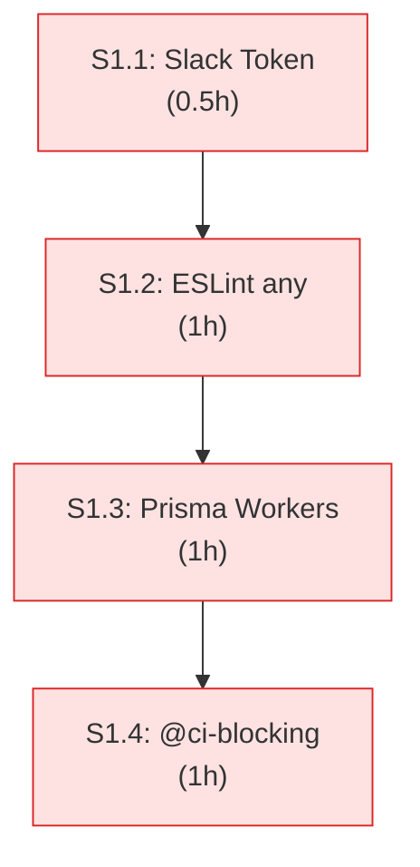

# Architecture: VibeX Analyst Proposals — Execution Closure 2026-04-11

> **项目**: vibex-analyst-proposals-vibex-proposals-20260411  
> **作者**: Architect  
> **日期**: 2026-04-11  
> **版本**: v1.0

---

## 执行决策

| 决策 | 状态 | 执行项目 | 执行日期 |
|------|------|----------|----------|
| Option A 止血方案 | **已采纳** | vibex-analyst-proposals-vibex-proposals-20260411 | 2026-04-11 |
| CLI CI 集成 | **已采纳** | vibex-analyst-proposals-vibex-proposals-20260411 | 2026-04-11 |

---

## 1. Tech Stack

| 组件 | 技术选型 | 说明 |
|------|----------|------|
| **提案追踪** | CLI + TRACKING.md | 执行闭环 |
| **类型校验** | ESLint + Zod | any 清理 |
| **部署** | wrangler | CF Workers |

---

## 2. 架构图

### 2.1 P0 修复顺序



---

## 3. P0 修复详细设计

### 3.1 Slack Token 环境变量化

```python
# task_manager.py
import os

SLACK_TOKEN = os.environ.get('SLACK_TOKEN', os.environ.get('SLACK_BOT_TOKEN', ''))
if not SLACK_TOKEN:
    raise ValueError('SLACK_TOKEN or SLACK_BOT_TOKEN environment variable is required')
```

### 3.2 ESLint any 清理

```bash
# 找到所有 any
grep -rn "as any\|: any\|any)" vibex-fronted/src/ vibex-backend/src/ | grep -v node_modules

# 替换策略
# 1. 具体类型替换
# 2. unknown + 类型守卫
# 3. @ts-expect-error（需评审）
```

### 3.3 PrismaClient Workers 守卫

```typescript
// lib/prisma.ts
export function getPrisma(): PrismaClient {
  const isWorkers = typeof globalThis !== 'undefined' && 'caches' in globalThis;
  if (isWorkers) return new PrismaClient();
  if (!globalThis.__prisma) globalThis.__prisma = new PrismaClient();
  return globalThis.__prisma;
}
```

### 3.4 @ci-blocking 批量移除

```bash
# 统计 @ci-blocking 测试
grep -rn "@ci-blocking" tests/e2e/ --include="*.spec.ts" | wc -l
# 输出: 35+

# 逐文件评估修复
# 1. flaky test → 修复或移到单独的 flaky suite
# 2. 环境依赖 → mock 或 skip with reason
# 3. 暂时无法修复 → 评估后决定保留或移除
```

---

## 4. 提案闭环机制

### 4.1 CLI CI 集成

```yaml
# .github/workflows/proposal-tracking.yml
- name: Proposal Tracking
  run: |
    node scripts/proposal-cli.js check --sprint=${{ github.event.pull_request.number }}
    # 验证 TRACKING.md 是否更新
```

```typescript
// proposal-cli.js
import { readFileSync, writeFileSync } from 'fs';

interface Proposal {
  id: string;
  status: 'pending' | 'in-progress' | 'done';
  assignee: string;
  updatedAt: string;
}

export async function check(sprint: string) {
  const tracking = JSON.parse(readFileSync('TRACKING.md', 'utf-8'));
  const pending = tracking.proposals.filter(p => p.status === 'pending');
  
  if (pending.length > 0) {
    console.error(`❌ ${pending.length} proposals still pending`);
    process.exit(1);
  }
}
```

---

## 5. 验收标准

| 检查项 | 命令 | 目标 |
|--------|------|------|
| Slack Token | `grep "xoxp" task_manager.py` | 无结果 |
| ESLint any | `pnpm exec tsc --noEmit` | 0 errors |
| Prisma Workers | `pnpm run deploy` | 成功 |
| @ci-blocking | `grep "@ci-blocking" tests/ \| wc -l` | 0 |
| CLI CI | `git push` | 自动检查 |

---

*文档版本: v1.0 | 最后更新: 2026-04-11*
