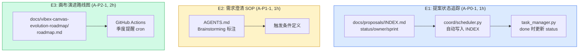

# Architecture: Analyst Proposals — 2026-04-12 Sprint

**Project**: vibex-analyst-proposals-vibex-proposals-20260412
**Stage**: architect-review
**Architect**: Architect
**Date**: 2026-04-07
**Version**: v1.0
**Status**: Proposed

---

## 执行决策

| 决策 | 状态 | 执行项目 | 执行日期 |
|------|------|----------|----------|
| A-P0-1: 提案状态追踪机制 | **待评审** | vibex-analyst-proposals-vibex-proposals-20260412 | 待定 |
| A-P1-1: 需求澄清 SOP 标准化 | **待评审** | vibex-analyst-proposals-vibex-proposals-20260412 | 待定 |
| A-P2-1: 画布演进路线图文档化 | **待评审** | vibex-analyst-proposals-vibex-proposals-20260412 | 待定 |

---

## 1. Tech Stack

| 组件 | 技术选型 | 说明 |
|------|----------|------|
| **coord** | task_manager.py | INDEX.md 自动更新 |
| **文件系统** | Markdown | INDEX.md + roadmap.md |
| **GitHub Actions** | cron | 季度提醒 |
| **文档** | Mermaid | 路线图可视化 |

---

## 2. Architecture Diagram



---

## 3. Module Design

### 3.1 A-P0-1: 提案状态追踪机制

#### 3.1.1 INDEX.md 模板

```markdown
# VibeX 提案索引

## 状态说明
| 状态 | 含义 |
|------|------|
| pending | 已提交，待评审 |
| in-progress | 已采纳，实施中 |
| done | 已完成 |
| rejected | 已驳回 |

## 提案列表
| ID | 标题 | Sprint | 状态 | Owner | 创建时间 | 更新时间 |
|----|------|--------|------|-------|----------|----------|
| A-P0-1 | 提案状态追踪机制 | 20260412 | pending | Analyst | 2026-04-07 | — |
```

#### 3.1.2 coord 自动写入

```python
# coord/scheduler.py — create_project() 新增
def create_project(project_data: dict):
    project_id = project_data['id']
    title = project_data.get('title', '')
    sprint = project_data.get('sprint', '')
    owner = project_data.get('owner', '')

    entry = f"| {project_id} | {title} | {sprint} | pending | {owner} | {date_today()} | — |"
    
    with open('docs/proposals/INDEX.md', 'a') as f:
        f.write(entry + '\n')
```

#### 3.1.3 task done 时自动更新

```python
# task_manager.py — update() 新增
if status == 'done':
    update_index_status(project, 'done')
    update_index_timestamp(project, date_today())

def update_index_status(project_id: str, new_status: str):
    """用 sed 原地更新 INDEX.md"""
    subprocess.run(
        ['sed', '-i', f'/| {project_id} |/s/pending\|in-progress\|done\|rejected/{new_status}/', 
         'docs/proposals/INDEX.md'],
        check=True
    )
```

---

### 3.2 A-P1-1: 需求澄清 SOP

```markdown
## 需求澄清 SOP

### 触发条件（满足任一即触发）
1. 需求描述包含歧义（无具体指标）
2. 涉及多个方案权衡，无明显最优解
3. PRD 中存在"待确认"项
4. 涉及新领域，团队缺乏上下文

### Brainstorming 流程
1. 触发 → #vibex @analyst "需要 brainstorm: <需求>"
2. 分析 → gstack browse 验证问题真实性
3. 提案 → 2-3 个方案 + 权衡分析
4. 决策 → PM 选择方案，更新 PRD
5. 记录 → 写入对应提案的 ANALYSIS.md
```

---

### 3.3 A-P2-1: 画布演进路线图

```markdown
# VibeX Canvas 演进路线图

## 当前状态 (2026-Q1)
- 三树并行（Context / Flow / Component）
- AI 原型生成
- DDD 领域建模

## 目标状态 (2026-Q4)
- 多人实时协作
- 版本历史
- 组件市场

## 演进路径
### Q2: 稳定性优先
- 修复现有 bug，提升测试覆盖率

### Q3: 协作功能
- 实时协作、评论功能

### Q4: 生态扩展
- 组件市场、第三方集成
```

---

## 4. Data Model

```typescript
interface ProposalIndexEntry {
  id: string;       // "A-P0-1"
  title: string;
  sprint: string;    // "20260412"
  status: 'pending' | 'in-progress' | 'done' | 'rejected';
  owner: string;
  createdAt: string; // YYYY-MM-DD
  updatedAt: string;  // YYYY-MM-DD
}
```

---

## 5. Performance Impact

| Epic | 影响 | 说明 |
|------|------|------|
| A-P0-1 INDEX | < 10ms | 文件追加 |
| A-P1-1 SOP | 无 | 文档变更 |
| A-P2-1 Roadmap | 无 | 文档变更 |
| **总计** | **无影响** | |

---

## 6. Risk Assessment

| # | 风险 | 概率 | 影响 | 缓解 |
|---|------|------|------|------|
| R1 | INDEX.md 并发写入冲突 | 低 | 低 | coord 单点写入 |
| R2 | 季度提醒被忽略 | 中 | 低 | Slack 双重通知 |
| R3 | roadmap 过期 | 中 | 低 | 季度 cron 提醒 |

---

## 7. Testing Strategy

| Epic | 验证 |
|------|------|
| A-P0-1 | 模拟 create_project，INDEX.md 有条目 |
| A-P1-1 | AGENTS.md grep 验证 |
| A-P2-1 | roadmap.md 存在性 + Mermaid 可渲染 |

---

## 8. Implementation Phases

| Phase | Epic | 工时 | 产出 |
|-------|------|------|------|
| 1 | A-P0-1 提案追踪 | 1h | INDEX.md + coord 集成 |
| 2 | A-P1-1 SOP | 1h | AGENTS.md 更新 |
| 3 | A-P2-1 路线图 | 2h | roadmap.md + quarterly.yml |
| **Total** | | **4h** | |

---

## 9. PRD AC 覆盖

| AC | 技术方案 | 状态 |
|----|---------|------|
| AC1: INDEX 自动添加条目 | coord create_project 自动写入 | ✅ |
| AC2: INDEX status 自动更新 | task_manager.py done 时更新 | ✅ |
| AC3: INDEX.md 100% 覆盖 | 模板 + 自动机制 | ✅ |
| AC4: Brainstorming 标注 | AGENTS.md SOP 章节 | ✅ |
| AC5: roadmap 内容完整 | Mermaid 路线图 | ✅ |
| AC6: 季度提醒 | GitHub Actions cron | ✅ |
