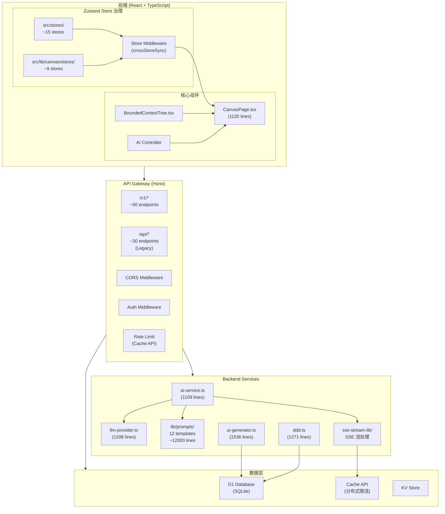
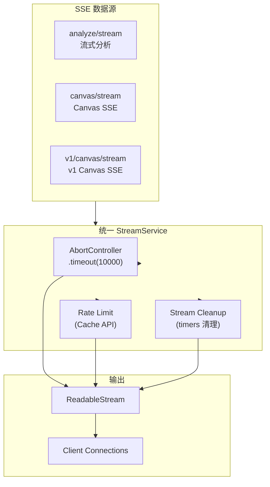

# VibeX 技术架构文档

> **项目**: vibex-architect-proposals-vibex-proposals-20260406  
> **版本**: v1.0  
> **日期**: 2026-04-06  
> **作者**: architect agent

---

## 执行决策

| 决策 | 状态 | 执行项目 | 执行日期 |
|------|------|----------|----------|
| Store 治理规范制定 | **已采纳** | vibex-store-governance | 待定 |
| AI Service 测试基础设施 | **已采纳** | vibex-ai-service-testing | 待定 |
| 统一 API 响应格式 | **已采纳** | vibex-api-response-unification | 待定 |
| E2E 测试可运行化 | **已采纳** | vibex-e2e-test-fix | 待定 |
| generate-components 合并 | **已采纳** | vibex-generate-components-consolidation | 待定 |
| 消除双 API 路由体系 | **待评审** | vibex-api-routing-unification | 2026-04-13 |
| Prompt 模板分层 | **待评审** | vibex-prompt-refactor | 2026-04-20 |
| D1 Repository 层统一 | **已拒绝** | — | — |
| Durable Objects 状态迁移 | **已拒绝** | — | — |

---

## 问题背景

### P0: 阻塞性问题（立即处理）

**P0-1: 29 个 Zustand Store 碎片化**

当前前端存在 **29 个 Zustand store**，分散在两个目录：

| 目录 | 数量 | 代表性 store |
|------|------|-------------|
| `src/stores/` | ~15 个 | `designStore`, `navigationStore`, `previewStore` |
| `src/lib/canvas/stores/` | ~9 个 | `contextStore`, `flowStore`, `componentStore` |

**根因**: 历史演进中按功能逐步拆分，缺乏统一的 Store 治理规范。

**风险**:
- 跨 store 数据同步依赖 `canvasStore.getState()` 直接调用 + `crossStoreSync.ts`
- 数据流不透明，难以追踪状态变化链路
- `simplifiedFlowStore.ts` 和 `flowStore.ts` 两个 flow store 并存

**P0-2: OPTIONS 预检路由被 401 拦截**

- 根因: `protected_.options` 在 `authMiddleware` 之后注册
- 影响: 所有跨域 POST/PUT/DELETE 被拦截
- 修复: 调整 `gateway.ts` 中路由注册顺序

**P0-3: Canvas Context 多选 checkbox 无响应**

- 根因: `BoundedContextTree.tsx` checkbox `onChange` 调用 `toggleContextNode` 而非 `onToggleSelect`
- 影响: 用户无法选择性发送上下文
- 修复: 绑定正确的 `onToggleSelect` handler

**P0-4: generate-components flowId 为 unknown**

- 根因: AI schema 缺少 `flowId` 字段定义，prompt 未要求输出
- 影响: AI 组件输出缺少 flowId 标识
- 修复: schema 添加 `flowId: string`，prompt 明确要求输出

**P0-5: 双重 API 路由体系共存**

后端存在两套 API 路由系统：

| 路由系统 | 路径 | 数量 |
|---------|------|------|
| 新路由 | `/v1/*` (Hono) | ~50 个 |
| 旧路由 | `/api/*` (Next.js) | ~30 个 |

**风险**: API 重复实现，客户端需同时对接两套 API。

---

### P1: 近期优化（1 个月内）

| # | 问题 | 影响 |
|---|------|------|
| P1-1 | SSE 超时控制缺失，Worker 可能挂死 | 服务稳定性 |
| P1-2 | 分布式限流使用内存 Map，跨 Worker 不共享 | 限流失效 |
| P1-3 | test-notify 缺少 5 分钟去重 | 重复通知 |
| P1-4 | CanvasPage 1120 行过于臃肿 | 可维护性 |
| P1-5 | Prompt 模板 12,000 行无测试覆盖 | 回归风险 |
| P1-6 | API 响应格式不统一 | 客户端处理困难 |

---

### P2: 中期改进（1-3 个月）

| # | 问题 | 影响 |
|---|------|------|
| P2-1 | SSE 流处理分散在多处，缺少统一抽象 | 维护成本 |
| P2-2 | D1 数据库访问分散，无统一 Repository 层 | 事务边界不清晰 |
| P2-3 | wrangler 部署无分环境策略 | 部署风险 |
| P2-4 | E2E 测试不稳定（flaky test）| CI 信心 |
| P2-5 | Prompt 注入防护不足 | 安全风险 |
| P2-6 | 内联 style 违反规范 | 代码一致性 |

---

### P3: 长期规划（3 个月以上）

| # | 问题 | 影响 |
|---|------|------|
| P3-1 | REST 30 个端点存在 N+1 查询问题 | 考虑 GraphQL |
| P3-2 | 多 Worker 共享状态问题 | 考虑 Durable Objects |
| P3-3 | 缺乏线上数据追踪 | Analytics 基础设施 |

---

## Tech Stack

| 层级 | 技术选型 | 版本 | 选型理由 |
|------|---------|------|----------|
| **前端框架** | React + TypeScript | React 19 | 高性能组件化 |
| **状态管理** | Zustand | v4 | 轻量级、类型安全 |
| **后端框架** | Hono | v4 | Cloudflare Workers 原生高性能 |
| **部署平台** | Cloudflare Workers | — | 边缘计算、低延迟 |
| **数据库** | D1 (SQLite) | — | Serverless 原生支持 |
| **AI 服务** | AI Gateway | — | 多 Provider 抽象 |
| **流处理** | SSE (ReadableStream) | — | 实时 AI 响应 |
| **测试框架** | Vitest + Jest | — | 单元测试 + E2E |
| **E2E 测试** | Playwright | — | 跨浏览器自动化 |
| **突变测试** | Stryker-mutator | — | 测试质量保障 |
| **样式方案** | CSS Modules + CSS Variables | — | 模块化 + 主题化 |
| **API 文档** | OpenAPI v3 | — | 标准化接口定义 |

---

## 架构图

### 整体系统架构



### Store 治理架构

```mermaid
flowchart LR
    subgraph Before["当前状态 (混乱)"]
        S1["designStore"]
        S2["navigationStore"]
        S3["previewStore"]
        S4["contextStore"]
        S5["flowStore"]
        S6["componentStore"]
        S7["simplifiedFlowStore\n(冗余)"]
        
        C1["canvasStore.ts\n(43 lines)"]
        SYNC["crossStoreSync.ts"]
        
        S1 -.->|getState()| C1
        S2 -.->|getState()| C1
        S3 -.->|getState()| C1
        S4 -.->|getState()| C1
        S5 -.->|getState()| C1
        S6 -.->|getState()| C1
        C1 -.-> SYNC
    end
    
    subgraph After["目标状态 (治理后)"]
        NS1["统一 Store\n命名规范"]
        NS2["类型化 Selector\n导出"]
        NS3["Middleware\n事件总线"]
        NS4["合并冗余\nsimplifiedFlowStore"]
        
        NP1["CanvasStore\n(治理后)"]
        NP2["FlowStore\n(合并后)"]
        NP3["ContextStore"]
    end
    
    Before -->|"ADR-ARCH-001\nStore 治理规范"| After
```

### API 路由统一架构

```mermaid
flowchart TB
    subgraph Current["当前 (双路由体系)"]
        NB["Next.js\n/api/*"]
        HB["Hono\n/v1/*"]
        COMP["兼容层\n/api/v1/*"]
    end
    
    subgraph Proposed["目标 (统一路由)"]
        HN["Hono\n/v1/*"]
        DEP["废弃 /api/*\n迁移到 /v1/*"]
    end
    
    NB -.->|"废弃| DEP
    HB -.->|"合并| DEP
    COMP -.->|"简化| DEP
```

### SSE 流服务架构



---

## 核心模块设计

### 1. Store 治理模块

```typescript
// 统一 Store 规范 (ADR-ARCH-001)
interface StoreConfig<T> {
  name: string;           // 必须唯一，前缀: use{Entity}Store
  selector: (state: T) => T;  // 必须导出类型化 selector
  middleware: Middleware[];   // 可选 middleware
}

// 禁止: 直接调用 getState().xxx
// 允许: useStore(state => state.xxx)
// 允许: 跨 store 同步通过 middleware 或事件总线

// 冗余 store 合并计划
// simplifiedFlowStore + flowStore → flowStore
```

### 2. API 统一响应格式

```typescript
// 统一响应格式
interface APIResponse<T> {
  success: boolean;
  data?: T;
  error?: {
    code: ErrorCode;
    message: string;
  };
  timestamp: string;
}

type ErrorCode = 
  | 'VALIDATION_ERROR'    // 400
  | 'AUTH_ERROR'          // 401
  | 'FORBIDDEN'           // 403
  | 'NOT_FOUND'           // 404
  | 'RATE_LIMITED'        // 429
  | 'INTERNAL_ERROR'       // 500
  | 'OPTIONS_SUCCESS';    // 204

// 示例
// 成功: { success: true, data: {...}, timestamp: "2026-04-06T12:00:00Z" }
// 错误: { success: false, error: { code: "NOT_FOUND", message: "..." }, timestamp: "..." }
```

### 3. SSE 流服务接口

```typescript
// 统一的 SSE 流服务
interface StreamService {
  // 创建流，支持超时控制
  createStream(options: StreamOptions): ReadableStream;
  
  // 客户端断开连接回调
  onClientDisconnect(callback: () => void): void;
  
  // 限流检查
  checkRateLimit(identifier: string): RateLimitResult;
  
  // 流清理（断开时调用）
  cleanup(streamId: string): void;
}

interface StreamOptions {
  timeout: number;      // 默认 10000ms
  rateLimit: number;     // 默认 60/min
  provider: 'openai' | 'anthropic';
}
```

### 4. D1 Repository 层

```typescript
// 统一的 Repository 模式
interface Repository<T, ID> {
  findById(id: ID): Promise<T | null>;
  findAll(filters?: QueryFilters): Promise<T[]>;
  create(data: CreateDTO): Promise<T>;
  update(id: ID, data: UpdateDTO): Promise<T>;
  delete(id: ID): Promise<void>;
}

// 示例: ContextRepository
class ContextRepository implements Repository<Context, string> {
  constructor(private db: D1Database) {}
  
  findById(id: string): Promise<Context | null> { /* ... */ }
  findByProject(projectId: string): Promise<Context[]> { /* ... */ }
  create(data: CreateContextDTO): Promise<Context> { /* ... */ }
  // ...
}
```

### 5. Prompt 模板架构

```
src/
├── lib/prompts/
│   ├── templates/           # 结构化 prompt 模板（JSON/YAML）
│   │   ├── bug-detection.yaml
│   │   ├── flow-execution.yaml
│   │   └── ...
│   ├── renderers/           # prompt 渲染引擎
│   │   └── index.ts
│   ├── validators/          # prompt 输出验证 (Zod schema)
│   │   └── schemas/
│   └── versions/             # prompt 版本记录 (git blame 替代)
```

---

## 技术审查（风险评估）

### 高风险项

| # | 风险 | 严重度 | 影响范围 | 缓解措施 |
|---|------|--------|----------|----------|
| R1 | OPTIONS 修改破坏其他中间件 | **高** | gateway.ts | 仅调整顺序，测试覆盖 |
| R2 | Store 治理重构破坏现有功能 | **高** | 所有前端 store 调用 | 渐进式迁移，先建立规范后合并 |
| R3 | 双重 API 路由消除后客户端不兼容 | **高** | 移动端/第三方集成 | 保留兼容层，渐进废弃 |

### 中风险项

| # | 风险 | 严重度 | 缓解措施 |
|---|------|--------|----------|
| R4 | SSE 超时修改破坏事件顺序 | **中** | 外层 try-catch，不影响内部 |
| R5 | Cache API 部署配置缺失 | **中** | wrangler 默认启用，测试验证 |
| R6 | Prompt 重构影响 AI 输出质量 | **中** | Golden test + A/B 测试 |
| R7 | D1 Repository 重构事务边界 | **中** | 保留现有封装，逐步迁移 |

### 低风险项

| # | 风险 | 缓解措施 |
|---|------|----------|
| R8 | wrangler 环境配置修改 | 保留 wrangler.toml 备份 |
| R9 | 内联 style 检测误报 | 设置白名单机制 |

---

## 测试策略

### 测试金字塔

```
        ┌─────────────────────────────────┐
        │         E2E (Playwright)         │  ~5% 覆盖率，聚焦核心流程
        ├─────────────────────────────────┤
        │      Integration (Vitest)       │  ~60% 覆盖率，API + DB
        ├─────────────────────────────────┤
        │        Unit (Vitest/Jest)        │  ~80% 覆盖率，核心逻辑
        └─────────────────────────────────┘
```

### 测试框架配置

```typescript
// vitest.config.ts
export default defineConfig({
  test: {
    environment: 'miniflare',     // Cloudflare Workers 模拟
    coverage: {
      provider: 'v8',
      thresholds: {
        lines: 80,
        functions: 80,
        branches: 70,
      },
    },
    setupFiles: ['./tests/setup.ts'],
  },
});
```

### 核心测试用例

#### 1. OPTIONS 预检路由测试

```typescript
// tests/routes/gateway.options.test.ts
describe('OPTIONS Pre-flight', () => {
  it('should return 204 for OPTIONS requests', async () => {
    const res = await OPTIONS('/v1/projects');
    expect(res.status).toBe(204);
  });
  
  it('should include CORS headers', async () => {
    const res = await OPTIONS('/v1/projects');
    expect(res.headers['Access-Control-Allow-Origin']).toBe('*');
    expect(res.headers['Access-Control-Allow-Methods']).toContain('GET');
  });
  
  it('should not be intercepted by auth middleware', async () => {
    const res = await OPTIONS('/v1/projects');
    expect(res.status).not.toBe(401);
  });
});
```

#### 2. Canvas Context 多选测试

```typescript
// tests/components/BoundedContextTree.test.tsx
describe('BoundedContextTree', () => {
  it('checkbox should call onToggleSelect on change', async () => {
    const onToggleSelect = vi.fn();
    render(<BoundedContextTree onToggleSelect={onToggleSelect} />);
    
    const checkbox = screen.getByRole('checkbox');
    await userEvent.click(checkbox);
    
    expect(onToggleSelect).toHaveBeenCalledWith(expect.any(String));
    expect(toggleContextNode).not.toHaveBeenCalled();
  });
});
```

#### 3. SSE 超时测试

```typescript
// tests/services/stream.test.ts
describe('StreamService', () => {
  it('should timeout after 10 seconds', async () => {
    vi.useFakeTimers();
    const stream = createStream({ timeout: 10000 });
    
    // 模拟 10s 无响应
    vi.advanceTimersByTime(10001);
    
    expect(stream.controller.state).toBe('closed');
    vi.useRealTimers();
  });
  
  it('should cleanup timers on cancel', async () => {
    const clearSpy = vi.spyOn(global, 'clearTimeout');
    const stream = createStream({ timeout: 10000 });
    
    stream.cancel();
    
    expect(clearSpy).toHaveBeenCalled();
  });
});
```

#### 4. 限流一致性测试

```typescript
// tests/services/rateLimit.test.ts
describe('RateLimit (Cache API)', () => {
  it('should be consistent across workers', async () => {
    // 模拟 100 并发请求
    const promises = Array.from({ length: 100 }, () => 
      checkRateLimit('test-key')
    );
    
    const results = await Promise.all(promises);
    const allowedCount = results.filter(r => r.allowed).length;
    
    expect(allowedCount).toBeLessThanOrEqual(60); // 60/min
  });
});
```

#### 5. flowId 输出测试

```typescript
// tests/services/generateComponents.test.ts
describe('generate-components', () => {
  it('should output flowId in response', async () => {
    const response = await generateComponents({
      requirement: 'test requirement',
    });
    
    expect(response.flowId).toMatch(/^flow-/);
    expect(response.flowId).not.toBe('unknown');
  });
});
```

### 测试覆盖率目标

| 模块 | 当前覆盖率 | 目标覆盖率 | 优先度 |
|------|-----------|------------|--------|
| ai-service.ts | ~15% | 80% | **P0** |
| llm-provider.ts | ~15% | 80% | **P0** |
| SSE Stream Services | ~10% | 70% | P1 |
| API Routes (/v1/*) | ~10% | 60% | P1 |
| Prompt Templates | **0%** | 60% (Golden test) | P1 |
| D1 Repositories | ~5% | 70% | P2 |
| Zustand Stores | ~30% | 80% | P2 |

---

## 实施计划（P0-P3）

### Phase 0: P0 修复（立即，1.1h）

| # | 任务 | 工时 | 负责人 | 验收标准 |
|---|------|------|--------|----------|
| P0-1 | OPTIONS 预检路由修复 | 0.5h | dev | `curl -X OPTIONS -I /v1/projects` 返回 204 |
| P0-2 | Canvas checkbox onChange 修复 | 0.3h | dev | checkbox 点击 → selectedNodeIds 更新 |
| P0-3 | generate-components flowId 修复 | 0.3h | dev | flowId 不再是 unknown |

### Phase 1: P1 稳定性（1 个月内，4h）

| # | 任务 | 工时 | 负责人 | 验收标准 |
|---|------|------|--------|----------|
| P1-1 | SSE 超时 + 连接清理 | 1.5h | dev | 10s 超时，cancel() 清理 timers |
| P1-2 | 分布式限流 (Cache API) | 1.5h | dev | 跨 Worker 限流一致 |
| P1-3 | test-notify 去重 | 1h | dev | 5 分钟窗口内重复跳过 |

### Phase 2: P1 架构改进（1-3 个月）

| # | 任务 | 工时 | 负责人 | 验收标准 |
|---|------|------|--------|----------|
| P2-1 | E2E 测试可运行化 | 2h | tester+dev | Playwright in Jest 正常执行，CI gate 建立 |
| P2-2 | generate-components 合并 | 1h | dev | 统一实现，冗余代码删除 |
| P2-3 | 统一 API 响应格式 | 2h | dev | 所有 /v1/* 端点统一响应格式 |
| P2-4 | Store 治理规范制定 | 1d | dev | ADR-ARCH-001 落地，合并冗余 store |
| P2-5 | Prompt 注入防护增强 | 2h | dev | 检测模式覆盖主流注入类型 |

### Phase 3: P2 中期改进（3-6 个月）

| # | 任务 | 工时 | 负责人 | 验收标准 |
|---|------|------|--------|----------|
| P3-1 | SSE 流服务统一抽象 | 1d | dev | StreamService 接口统一 |
| P3-2 | Prompt 模板分层 | 2d | dev | templates/renderers/validators 分离 |
| P3-3 | D1 Repository 层统一 | 1d | dev | 统一的 Repository 模式 |
| P3-4 | wrangler 环境配置 | 4h | dev | dev/staging/production 环境区分 |
| P3-5 | CanvasPage 分解 | 1d | dev | 按 hooks/components 拆分 |
| P3-6 | 内联 style 检测加入 CI | 2h | dev | grep 检测 + CI 失败 |

### Phase 4: P3 长期规划（6 个月以上）

| # | 任务 | 工时 | 验收标准 |
|---|------|------|----------|
| P4-1 | AI Service 测试基础设施 | 3d | Mock 框架 + 80% 覆盖率 |
| P4-2 | E2E 测试稳定性治理 | 1d | flaky rate < 1% |
| P4-3 | GraphQL 评估 | 1w | N+1 查询问题解决 |
| P4-4 | Durable Objects 评估 | 2d | 多 Worker 状态共享方案 |
| P4-5 | Analytics 基础设施 | 2d | 线上数据追踪 |

---

## ADR 索引

| ID | 标题 | 状态 | 日期 |
|----|------|------|------|
| ADR-ARCH-001 | Canvas Store 治理规范 | **Proposed** | 2026-04-06 |
| ADR-ARCH-002 | API 版本统一 | **Proposed** | 2026-04-06 |
| ADR-ARCH-003 | SSE 流服务统一抽象 | **Proposed** | 2026-04-06 |
| ADR-ARCH-004 | 统一 API 响应格式 | **Proposed** | 2026-04-06 |
| ADR-ARCH-005 | D1 Repository 层规范 | **Rejected** | 2026-04-06 |

---

*文档版本: v1.0 | Architect | 2026-04-06*
