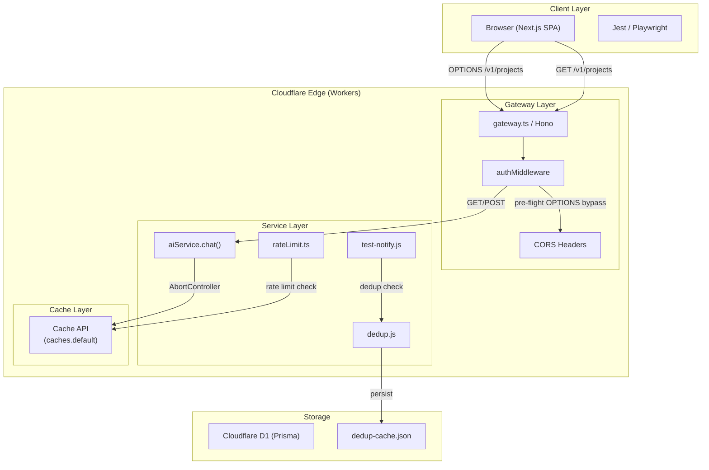
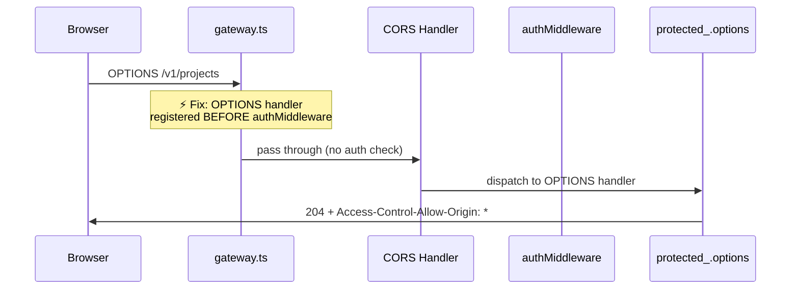
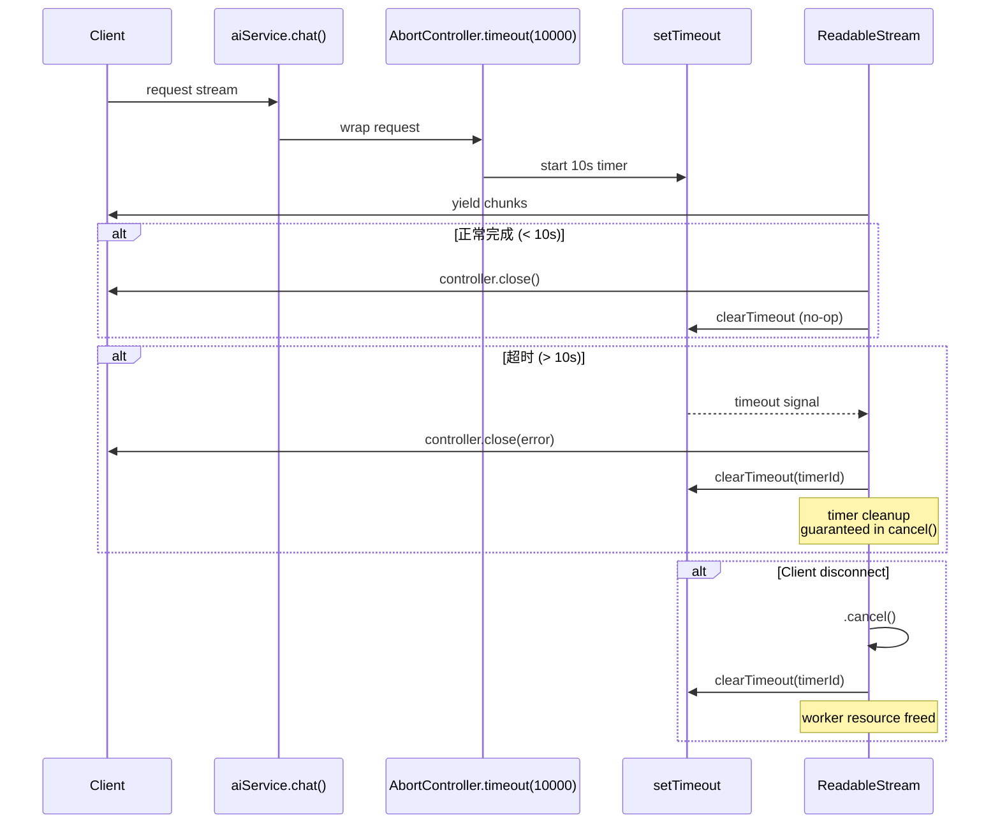
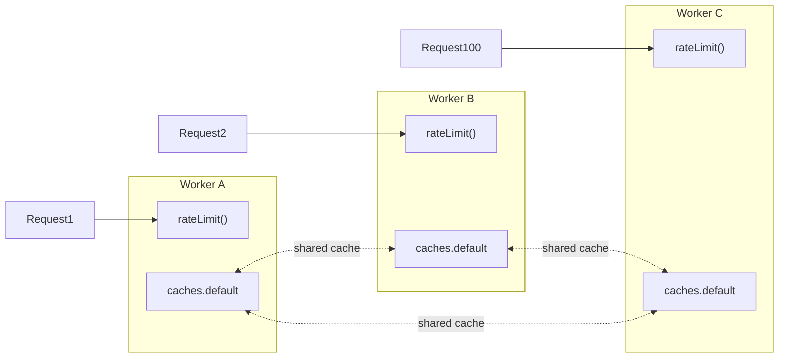

# VibeX Proposals 2026-04-06 — Architecture Document

> **项目**: vibex-architect-proposals-vibex-proposals-20260406  
> **类型**: Bug Fix Sprint Architecture  
> **作者**: architect agent  
> **日期**: 2026-04-06  
> **版本**: v1.0

---

## 1. 执行摘要

本次架构设计针对 6 个 Epic（P0 × 3 + P1 × 3），全部为 Bug Fix 和小规模改进，无架构级重构。6 个 Epic 涉及 4 个代码域：网关中间件（E1）、前端组件（E2）、AI 服务层（E3 + E4）、后端服务（E5 + E6）。架构策略为**最小侵入修复**——每个 Epic 在已知代码路径内调整，不引入新抽象，不改变模块边界。

---

## 2. Tech Stack

| 层级 | 技术 | 版本 | 选型理由 |
|------|------|------|----------|
| 前端框架 | Next.js 15 | App Router | CLAUDE.md 指定 |
| 状态管理 | Zustand | latest | 前端组件本地状态 |
| API 客户端 | TanStack Query | latest | E2 涉及的前端 API 交互 |
| 后端框架 | Hono | ^4.12.5 | 轻量、高性能边缘函数 |
| 运行时 | Cloudflare Workers | — | E1/E4/E5 涉及 Workers 特定 API |
| 缓存 | Cache API (Workers) | — | E5 分布式限流替代内存 Map |
| 数据库 | Prisma + D1 | ^5.22 | E6 去重持久化可选 |
| 测试框架 | Jest | latest | 后端单测 + 前端组件测试 |
| E2E 测试 | Playwright | ^1.58 | Canvas 交互端到端验证 |
| 类型检查 | TypeScript strict | 5.x | 全项目强制严格模式 |
| 格式化 | Prettier + ESLint | — | CLAUDE.md 规范 |
| CI/CD | Wrangler | — | Workers 部署 |

### E4 SSE 超时技术决策

| 方案 | 优点 | 缺点 | 决策 |
|------|------|------|------|
| `setTimeout` + 全局 Map | 简单 | 内存泄漏风险 | ❌ |
| `AbortController` | 标准 API、取消语义清晰 | Workers 环境兼容性需验证 | ✅ |
| `ReadableStream.cancel()` | 统一取消信号 | 需确保 timer 在 cancel 中清理 | ✅ |

**最终方案**: `AbortController.timeout(10000)` 包装 `aiService.chat()` + `cancel()` 中 `clearTimeout`。

---

## 3. Mermaid 架构图

### 3.1 系统上下文图



### 3.2 E1 OPTIONS 请求流程（修复后）



### 3.3 E4 SSE 超时 + 清理流程



### 3.4 E5 分布式限流架构



---

## 4. 接口定义

### 4.1 E1: OPTIONS 路由（网关层）

**文件**: `vibex-backend/src/app/gateway.ts`

```typescript
// 修复前（问题代码）
app.use(authMiddleware)           // ← authMiddleware 先注册
app.options('*', corsHandler)     // ← OPTIONS 被 401 拦截

// 修复后（正确顺序）
app.options('*', corsHandler)     // ← CORS handler 先注册，确保预检通过
app.use(authMiddleware)           // ← authMiddleware 后续注册
```

**验收接口签名**:
```typescript
// GET /v1/projects — 不受影响
GET /v1/projects
Headers: Authorization: Bearer <token>
Response: 200 | 401

// OPTIONS /v1/projects — 修复后
OPTIONS /v1/projects
Response:
  Status: 204
  Headers:
    Access-Control-Allow-Origin: *
    Access-Control-Allow-Methods: GET, POST, PUT, DELETE, OPTIONS
    Access-Control-Allow-Headers: Content-Type, Authorization
```

### 4.2 E2: Canvas 多选（前端组件）

**文件**: `vibex-fronted/src/components/BoundedContextTree.tsx`

```typescript
// 修复前（问题代码）
<Checkbox
  checked={selectedNodeIds.includes(node.id)}
  onChange={() => toggleContextNode(node.id)}  // ❌ 错误
/>

// 修复后（正确实现）
<Checkbox
  checked={selectedNodeIds.includes(node.id)}
  onChange={() => onToggleSelect(node.id)}      // ✅ 正确
/>
```

**相关接口**:
```typescript
// Zustand store contract
interface CanvasStore {
  selectedNodeIds: string[];
  toggleContextNode(nodeId: string): void;   // 不应被 checkbox 直接调用
  onToggleSelect(nodeId: string): void;       // ✅ checkbox 应调用此方法
}

// Props contract
interface BoundedContextTreeProps {
  nodes: ContextNode[];
  selectedNodeIds: string[];
  onToggleSelect: (nodeId: string) => void;  // ✅ 必填
  toggleContextNode?: (nodeId: string) => void; // 可选，仅降级兼容
}
```

### 4.3 E3: generate-components flowId（AI 服务）

**文件**: `vibex-backend/src/schemas/ai-component.ts` + prompt

```typescript
// schema 修复
const AIComponentSchema = z.object({
  id: z.string(),
  name: z.string(),
  type: z.enum(['bounded-context', 'flow', 'service', 'gateway']),
  flowId: z.string().regex(/^flow-/, "flowId must start with 'flow-'"), // ✅ 新增
  position: z.object({ x: z.number(), y: z.number() }),
});

// prompt 指令
const COMPONENT_PROMPT = `
生成组件时必须包含 flowId 字段，格式为 "flow-{uuid}"。
flowId 用于关联组件与所属流程，确保 AI 输出不是 "unknown"。
`;

// 生成函数签名
async function generateComponents(
  context: GenerationContext,
  signal?: AbortSignal
): Promise<AIComponent[]> {
  const result = await ai.chat({
    messages: [{ role: 'user', content: COMPONENT_PROMPT + context.prompt }],
    schema: AIComponentSchema,
    signal,
  });
  return result.components;
}
```

### 4.4 E4: SSE 超时（AI 服务）

**文件**: `vibex-backend/src/services/aiService.ts`

```typescript
interface AIService {
  chat(options: ChatOptions): Promise<ReadableStream>;
  chatWithTimeout(options: ChatOptions, timeoutMs?: number): Promise<ReadableStream>;
}

interface ChatOptions {
  messages: Message[];
  schema?: z.ZodType;
  onChunk?: (chunk: string) => void;
}

interface TimeoutController {
  signal: AbortSignal;
  cancel: () => void;    // ✅ 必须清理 timer
}

// 修复后实现
function chatWithTimeout(
  options: ChatOptions,
  timeoutMs = 10_000
): TimeoutController {
  const controller = new AbortController();
  let timerId: ReturnType<typeof setTimeout> | null = null;

  timerId = setTimeout(() => {
    controller.abort('timeout');
  }, timeoutMs);

  const cancel = () => {
    if (timerId !== null) {
      clearTimeout(timerId);   // ✅ 清理 timer
      timerId = null;
    }
  };

  return {
    signal: controller.signal,
    cancel,
  };
}

// ReadableStream.cancel() 确保清理
async function* streamAIResponse(
  options: ChatOptions,
  timeoutMs = 10_000
): AsyncGenerator<string> {
  const { signal, cancel } = chatWithTimeout(options, timeoutMs);
  let reader: ReadableStreamDefaultReader | null = null;

  try {
    const response = await fetch(AI_ENDPOINT, { signal });
    const stream = response.body;

    if (!stream) throw new Error('No response body');

    reader = stream.getReader();
    const decoder = new TextDecoder();

    while (true) {
      const { done, value } = await reader.read();
      if (done) break;
      yield decoder.decode(value, { stream: true });
    }
  } catch (err) {
    if ((err as Error).name === 'AbortError') {
      throw new TimeoutError('AI response timeout after ' + timeoutMs + 'ms');
    }
    throw err;
  } finally {
    // ReadableStream.cancel() 时清理
    if (reader) {
      reader.releaseLock();
    }
    cancel();   // ✅ 无论成功/失败都清理 timer
  }
}
```

### 4.5 E5: 分布式限流（缓存层）

**文件**: `vibex-backend/src/lib/rateLimit.ts`

```typescript
interface RateLimitOptions {
  key: string;          // 限流 key（如 IP、userId、endpoint）
  limit: number;       // 允许的最大请求数
  windowMs: number;    // 时间窗口（毫秒）
}

interface RateLimitResult {
  allowed: boolean;    // 是否允许通过
  remaining: number;   // 剩余请求数
  resetAt: number;     // 重置时间戳（Unix ms）
  total: number;       // 当前窗口总请求数
}

// 修复前（问题）
const memoryMap = new Map<string, { count: number; resetAt: number }>();
// ❌ Workers 多实例不共享内存，限流失效

// 修复后
async function checkRateLimit(options: RateLimitOptions): Promise<RateLimitResult> {
  const cacheKey = `ratelimit:${options.key}`;
  const cache = caches.default;

  // 读取当前计数
  const cached = await cache.match(cacheKey);
  let data: { count: number; resetAt: number };

  if (cached) {
    data = await cached.json();
  } else {
    data = { count: 0, resetAt: Date.now() + options.windowMs };
  }

  // 检查是否过期
  if (Date.now() > data.resetAt) {
    data = { count: 0, resetAt: Date.now() + options.windowMs };
  }

  // 检查限流
  if (data.count >= options.limit) {
    return { allowed: false, remaining: 0, resetAt: data.resetAt, total: data.count };
  }

  data.count++;

  // 写回 Cache API（跨 Worker 共享）
  const response = new Response(JSON.stringify(data), {
    headers: { 'Content-Type': 'application/json' },
  });
  await cache.put(cacheKey, response);

  return {
    allowed: true,
    remaining: options.limit - data.count,
    resetAt: data.resetAt,
    total: data.count,
  };
}

// 导出接口
export { checkRateLimit, RateLimitOptions, RateLimitResult };
```

### 4.6 E6: test-notify 去重（通知服务）

**文件**: `vibex-backend/src/lib/dedup.ts`

```typescript
const DEDUP_WINDOW_MS = 5 * 60 * 1000; // 5 分钟
const DEDUP_CACHE_FILE = '.dedup-cache.json';

interface DedupRecord {
  key: string;        // 去重 key（通常为 eventId 或 content hash）
  sentAt: number;     // 发送时间戳
  skipped: boolean;   // 是否跳过
}

interface DedupResult {
  skipped: boolean;
  reason?: string;
  nextAllowedAt?: number;
}

// 内存缓存（单次进程内快速路径）
const memoryCache = new Map<string, DedupRecord>();

async function checkDedup(key: string): Promise<DedupResult> {
  const now = Date.now();

  // 快速路径：内存缓存命中
  const memEntry = memoryCache.get(key);
  if (memEntry && now - memEntry.sentAt < DEDUP_WINDOW_MS) {
    return { skipped: true, reason: 'in-memory duplicate' };
  }

  // 持久化路径：文件缓存
  const cache = await loadDedupCache();
  const fileEntry = cache[key];

  if (fileEntry && now - fileEntry.sentAt < DEDUP_WINDOW_MS) {
    // 内存缓存未命中，更新内存
    memoryCache.set(key, fileEntry);
    return { skipped: true, reason: 'file duplicate', nextAllowedAt: fileEntry.sentAt + DEDUP_WINDOW_MS };
  }

  return { skipped: false };
}

async function recordSend(key: string): Promise<void> {
  const now = Date.now();
  const record: DedupRecord = { key, sentAt: now, skipped: false };

  // 更新内存缓存
  memoryCache.set(key, record);

  // 更新文件缓存
  const cache = await loadDedupCache();
  cache[key] = record;
  await saveDedupCache(cache);
}

// 集成 test-notify.js
async function testNotify(event: TestEvent): Promise<void> {
  const dedupKey = hashEvent(event);

  const result = await checkDedup(dedupKey);
  if (result.skipped) {
    console.log(`[dedup] Skipped duplicate: ${dedupKey} (${result.reason})`);
    return;
  }

  await sendWebhook(event);
  await recordSend(dedupKey);
}

export { checkDedup, recordSend, testNotify, DedupResult, DEDUP_WINDOW_MS };
```

---

## 5. 数据流说明

### 5.1 OPTIONS 请求数据流

```
OPTIONS /v1/projects
  → Hono App (gateway.ts)
  → CORS Handler (registered before authMiddleware) ✅
  → 204 + CORS headers
  → No auth check (preflight bypass)
```

### 5.2 Canvas 多选数据流

```
User clicks checkbox
  → BoundedContextTree onChange
  → onToggleSelect(nodeId)  ✅
  → CanvasStore.selectedNodeIds updated
  → Tree re-renders with new selection
```

### 5.3 AI component 生成数据流

```
User triggers generate-components
  → aiService.chatWithTimeout(prompt + schema)
  → AbortController.timeout(10000)
  → AI model generates component
  → Schema validated (includes flowId check)
  → Flow ID assigned (not "unknown")
  → Component returned
```

### 5.4 SSE 超时数据流

```
Client connects SSE
  → aiService.chat() with AbortController
  → setTimeout(10000) starts
  → AI chunks stream to client

Scenario A: Complete in < 10s
  → controller.close()
  → clearTimeout() (no-op)
  → Worker clean

Scenario B: Timeout > 10s
  → AbortController aborts
  → ReadableStream.cancel()
  → clearTimeout(timerId) ← timer cleanup
  → Worker clean

Scenario C: Client disconnects
  → ReadableStream.cancel()
  → clearTimeout(timerId) ← guaranteed cleanup
  → Worker clean
```

### 5.5 限流数据流

```
Request arrives
  → checkRateLimit(key, limit, window)
  → Cache API read (shared across Workers)
  → Count incremented
  → Cache API write
  → 429 if over limit
```

### 5.6 test-notify 去重数据流

```
test-notify triggered
  → hashEvent(event) → dedupKey
  → checkDedup(dedupKey)
    ├── memoryCache hit → skipped
    └── fileCache hit → skipped
    └── no hit → proceed
  → sendWebhook(event)
  → recordSend(dedupKey)
    → memoryCache.set
    → .dedup-cache.json write
```

---

## 6. 风险评估

| Epic | 风险 | 概率 | 影响 | 缓解措施 |
|------|------|------|------|----------|
| E1 | 中间件顺序调整影响其他路由 | 低 | 高 | 仅调整顺序，额外增加 OPTIONS 特定测试用例 |
| E2 | checkbox 修复影响 toggleContextNode | 低 | 中 | 保留 toggleContextNode 能力，确保不调用链破坏 |
| E3 | schema 变更导致历史 AI 输出验证失败 | 中 | 中 | 添加向后兼容：fallback flowId = 'unknown' + warning log |
| E4 | AbortController 在 Workers 环境不生效 | 低 | 高 | 先在本地 Wrangler dev 验证，再部署到 staging |
| E4 | cancel() 中的 clearTimeout 存在竞态 | 低 | 中 | 使用 timerId 变量确保只清理自己的 timer |
| E5 | Cache API 在某些 Worker 冷启动失败 | 低 | 中 | 添加 try-catch fallback 到内存 Map + metrics 告警 |
| E6 | .dedup-cache.json 并发写入冲突 | 中 | 中 | 使用文件锁或 D1 替代文件存储 |
| All | 修改引入回归 | 中 | 高 | 每个 Epic 完成后立即运行完整测试套件 |

### 关键风险: E5 Cache API 冷启动

```typescript
// 缓解：fallback 机制
async function checkRateLimit(options: RateLimitOptions): Promise<RateLimitResult> {
  try {
    const cache = caches.default;
    // ... Cache API logic
  } catch (err) {
    console.warn('[rateLimit] Cache API unavailable, using memory fallback');
    return rateLimitMemoryFallback(options); // 降级到内存 Map + 告警
  }
}
```

---

## 7. 测试策略

### 7.1 测试框架

| 测试类型 | 框架 | 覆盖率目标 | 说明 |
|----------|------|------------|------|
| 单元测试 | Jest | > 80% | 所有 service/lib 函数 |
| 组件测试 | Jest + RTL | > 80% | E2 组件逻辑 |
| 集成测试 | Jest | > 80% | E1/E4/E5/E6 端到端逻辑 |
| E2E 测试 | Playwright | 核心流程 | Canvas checkbox 选择流程 |

### 7.2 测试用例示例

#### E1: OPTIONS 路由测试

```typescript
// __tests__/gateway/options-handler.test.ts
describe('OPTIONS preflight handler', () => {
  it('returns 204 for OPTIONS requests', async () => {
    const res = await fetch('/v1/projects', { method: 'OPTIONS' });
    expect(res.status).toBe(204);
  });

  it('includes CORS headers', () => {
    expect(res.headers.get('Access-Control-Allow-Origin')).toBe('*');
    expect(res.headers.get('Access-Control-Allow-Methods')).toContain('GET');
  });

  it('does not return 401 for OPTIONS', async () => {
    const res = await fetch('/v1/projects', { method: 'OPTIONS' });
    expect(res.status).not.toBe(401);
  });

  it('GET requests still require auth', async () => {
    const res = await fetch('/v1/projects', { method: 'GET' });
    expect(res.status).toBe(401); // no token
  });
});
```

#### E2: Canvas 多选测试

```typescript
// __tests__/components/BoundedContextTree.test.tsx
describe('BoundedContextTree checkbox selection', () => {
  it('checkbox calls onToggleSelect on change', async () => {
    const onToggleSelect = jest.fn();
    render(<BoundedContextTree nodes={mockNodes} onToggleSelect={onToggleSelect} />);
    
    const checkbox = screen.getByRole('checkbox');
    await userEvent.click(checkbox);
    
    expect(onToggleSelect).toHaveBeenCalledWith('node-1');
  });

  it('checkbox does not call toggleContextNode directly', async () => {
    const toggleContextNode = jest.fn();
    render(
      <BoundedContextTree
        nodes={mockNodes}
        onToggleSelect={() => {}}
        toggleContextNode={toggleContextNode}
      />
    );
    
    const checkbox = screen.getByRole('checkbox');
    await userEvent.click(checkbox);
    
    expect(toggleContextNode).not.toHaveBeenCalled();
  });

  it('selectedNodeIds updates after checkbox click', async () => {
    const { result } = renderHook(() => useCanvasStore());
    const checkbox = screen.getByRole('checkbox');
    
    await userEvent.click(checkbox);
    
    expect(result.current.selectedNodeIds).toContain('node-1');
  });
});
```

#### E3: flowId 生成测试

```typescript
// __tests__/services/aiService.flowId.test.ts
describe('generate-components flowId', () => {
  it('returns flowId starting with "flow-"', async () => {
    const components = await generateComponents(mockContext);
    components.forEach(c => {
      expect(c.flowId).toMatch(/^flow-/);
      expect(c.flowId).not.toBe('unknown');
    });
  });
});
```

#### E4: SSE 超时测试

```typescript
// __tests__/services/aiService.timeout.test.ts
describe('SSE timeout and cleanup', () => {
  let timerCleanupMock: jest.Mock;

  beforeEach(() => {
    jest.useFakeTimers();
    timerCleanupMock = jest.fn();
  });

  afterEach(() => jest.useRealTimers());

  it('times out after 10 seconds', async () => {
    const slowStream = createNeverEndingStream();
    const promise = streamAIResponse(slowStream);

    await jest.advanceTimersByTimeAsync(10_000);

    await expect(promise).rejects.toThrow('timeout after 10000ms');
  });

  it('clears timer on cancel', async () => {
    const { cancel, signal } = chatWithTimeout({ messages: [] });

    // Start timer
    await jest.advanceTimersByTimeAsync(100);
    expect(clearTimeout).not.toHaveBeenCalled();

    // Cancel before timeout
    cancel();
    expect(clearTimeout).toHaveBeenCalled();
  });
});
```

#### E5: 分布式限流测试

```typescript
// __tests__/lib/rateLimit.test.ts
describe('Distributed rate limit via Cache API', () => {
  it('uses Cache API for rate limit storage', async () => {
    const mockCache = { match: jest.fn(), put: jest.fn() };
    global.caches = { default: mockCache } as any;

    await checkRateLimit({ key: 'test-key', limit: 10, windowMs: 60_000 });
    expect(mockCache.match).toHaveBeenCalled();
  });

  it('returns 429 when limit exceeded', async () => {
    // Pre-populate cache
    await cache.put('ratelimit:test', new Response(JSON.stringify({ count: 10, resetAt: Date.now() + 60_000 })));

    const result = await checkRateLimit({ key: 'test', limit: 10, windowMs: 60_000 });
    expect(result.allowed).toBe(false);
  });

  it('falls back to memory when Cache API unavailable', async () => {
    const originalCaches = global.caches;
    global.caches = undefined;

    const result = await checkRateLimit({ key: 'test', limit: 10, windowMs: 60_000 });
    expect(result.allowed).toBe(true);
    expect(result.total).toBe(1);

    global.caches = originalCaches;
  });
});
```

#### E6: 去重测试

```typescript
// __tests__/lib/dedup.test.ts
describe('test-notify deduplication', () => {
  const mockCache: Record<string, DedupRecord> = {};

  beforeEach(() => {
    jest.spyOn(fs, 'readFile').mockResolvedValue(JSON.stringify(mockCache));
    jest.spyOn(fs, 'writeFile').mockResolvedValue();
  });

  it('skips duplicate within 5 minute window (memory)', async () => {
    // First send
    await recordSend('event-1');
    
    // Duplicate within window
    const result = await checkDedup('event-1');
    expect(result.skipped).toBe(true);
  });

  it('allows after 5 minutes', async () => {
    mockCache['event-1'] = { key: 'event-1', sentAt: Date.now() - 6 * 60 * 1000, skipped: false };
    
    const result = await checkDedup('event-1');
    expect(result.skipped).toBe(false);
  });

  it('records send to .dedup-cache.json', async () => {
    await recordSend('event-2');
    expect(fs.writeFile).toHaveBeenCalledWith(
      '.dedup-cache.json',
      expect.stringContaining('event-2')
    );
  });
});
```

### 7.3 覆盖率要求

| Epic | 覆盖要求 | 关键指标 |
|------|----------|----------|
| E1 | 100% | OPTIONS 204、CORS headers、非 401 |
| E2 | > 90% | checkbox → onToggleSelect、selectedNodeIds 更新 |
| E3 | > 80% | flowId 格式验证 |
| E4 | > 90% | 超时触发、cancel 清理 |
| E5 | > 80% | Cache API 调用、fallback 降级 |
| E6 | > 90% | 5 分钟窗口、去重持久化 |

**整体覆盖率**: 所有涉及文件 > 80%

### 7.4 自动化测试命令

```bash
# 单元测试
pnpm --filter vibex-backend test -- --coverage

# 组件测试
pnpm --filter vibex-fronted test -- --coverage

# E2E 测试
pnpm --filter vibex-fronted test:e2e --grep "canvas"

# 完整测试套件（CI）
pnpm test -- --coverage --coverageThreshold='{"global":{"branches":80,"functions":80,"lines":80,"statements":80}}'
```

---

## 8. 模块关系

```
vibex-backend/src/
├── app/
│   └── gateway.ts              ← E1: OPTIONS handler 注册顺序
├── services/
│   └── aiService.ts            ← E3: flowId schema + E4: SSE timeout
├── lib/
│   ├── rateLimit.ts            ← E5: Cache API 分布式限流
│   ├── dedup.ts                ← E6: 去重模块
│   └── dedup.test.ts
└── routes/
    └── test-notify.ts          ← E6: 集成去重

vibex-fronted/src/
└── components/
    └── BoundedContextTree.tsx  ← E2: checkbox onChange 修复
```

---

## 9. 执行决策

- **决策**: 已采纳
- **执行项目**: team-tasks 项目 ID 待分配
- **执行日期**: 2026-04-06
