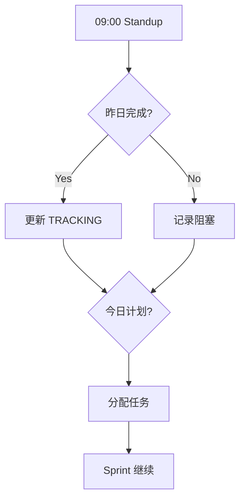
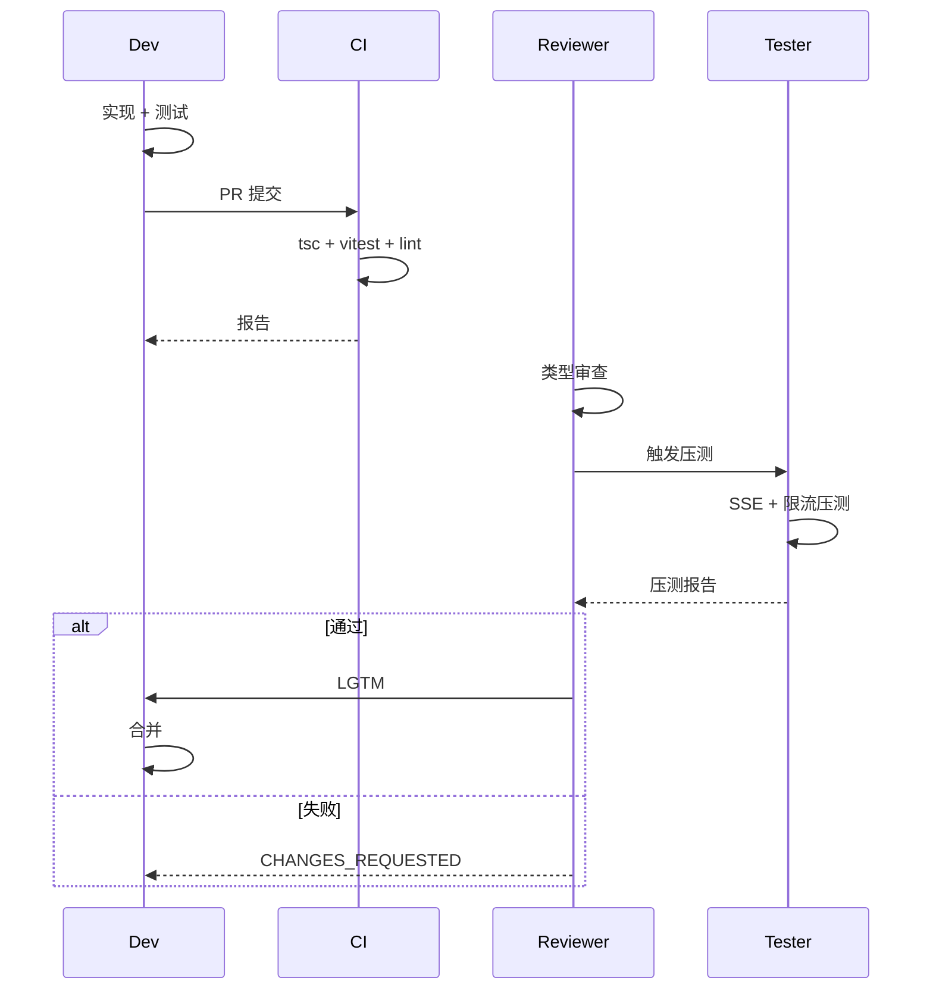

# AGENTS.md: VibeX 架构修复提案实施 2026-04-10

> **项目**: vibex-architect-proposals-vibex-proposals-20260410  
> **作者**: Architect  
> **日期**: 2026-04-10  
> **版本**: v1.0

---

## 1. 角色定义

| 角色 | 负责人 | 职责范围 |
|------|--------|----------|
| **Dev1** | @dev | 类型系统 + SSE + 限流 |
| **Dev2** | @dev | Vitest 迁移 + Options + SSR 规范 |
| **Reviewer** | @reviewer | 代码审查 + 类型安全 |
| **Tester** | @tester | E2E + 压测 |
| **Coord** | @coord | 进度追踪 |

---

## 2. Dev 职责

### 2.1 Sprint 1 任务分配

| Story | Dev | 工时 | 关键产出 |
|-------|-----|------|---------|
| ST-01 @vibex/types | Dev1 | 4h | packages/types 包 |
| ST-02 Zod Schema | Dev1 | 8h | 统一 Schema |
| ST-04 AI Timeout | Dev1 | 4h | 可配置 timeout |
| ST-05 OPTIONS 修复 | Dev2 | 2h | CORS 200 |

### 2.2 Sprint 2 任务分配

| Story | Dev | 工时 | 关键产出 |
|-------|-----|------|---------|
| ST-03 SSE Abort | Dev1 | 6h | 无 zombie |
| ST-06 Cache 限流 | Dev1 | 6h | 分布式限流 |
| ST-07 Vitest 迁移 | Dev2 | 8h | 删除 Jest |

### 2.3 Sprint 3 任务分配

| Story | Dev | 工时 | 关键产出 |
|-------|-----|------|---------|
| ST-08 SSR 规范 | Dev1 | 8h | 规范文档 |
| ST-09 Health | Dev2 | 4h | /health 端点 |

### 2.4 提交规范

```bash
# 格式: <type>(<scope>): <ticket> <description>
# 示例:
git commit -m "feat(types): ST-01 init @vibex/types package"
git commit -m "fix(sse): ST-03 add AbortController to streamChat"
git commit -m "refactor(tests): ST-07 migrate from jest to vitest"
git commit -m "docs(ssr): ST-08 add SSR-safe coding guidelines"
```

### 2.5 Workers 兼容性红线

| 禁止模式 | 正确替代 |
|---------|---------|
| `require()` | `import from` ESM |
| `fs.*` | `env.KV.get/put` |
| `setInterval` | 主动清理 + AbortController |
| `Buffer` | `TextEncoder` |

---

## 3. Reviewer 职责

### 3.1 类型安全审查

**每个 PR 必须通过**:

```bash
# T-01: @vibex/types 导入
grep -rn "import.*from '@vibex/types'" vibex-backend/src/ vibex-fronted/src/

# T-02: Zod Schema 验证
grep -rn "safeParse\|parse" vibex-backend/src/ --include="*.ts" | wc -l
# 应该 > 0（有验证）

# T-03: SSE AbortController
grep -rn "AbortController\|signal" vibex-backend/src/services/ai-service.ts

# T-04: Cache API 限流
grep -rn "CACHE.get\|CACHE.put" vibex-backend/src/lib/rateLimit.ts
# 应该 > 0
grep -rn "new Map()" vibex-backend/src/lib/rateLimit.ts
# 应该 = 0（禁止内存 Map）
```

### 3.2 驳回条件

1. PR 引入 `sessionId` drift（应为 `generationId`）
2. SSE 无 AbortController signal
3. RateLimiter 使用内存 Map 而非 Cache API
4. Vitest 测试有 failures
5. 无 Story ID 在 commit message

---

## 4. Tester 职责

### 4.1 SSE 压测

```typescript
// tests/load/sse-zombie.test.ts
describe('SSE Zombie Connection Load Test', () => {
  it('should cleanup all streams on timeout', async () => {
    const service = new AIService(env);
    const CONCURRENT_REQUESTS = 100;
    const TIMEOUT_MS = 100;

    // 发起 100 个请求，全部 timeout
    const promises = Array.from({ length: CONCURRENT_REQUESTS }, (_, i) =>
      service.streamChat(`prompt-${i}`, { timeout: TIMEOUT_MS })
        .catch(() => {}) // ignore errors
    );

    await Promise.all(promises);
    await sleep(200); // 等待清理

    // 验证无 zombie
    const activeStreams = service.getActiveStreamCount();
    expect(activeStreams).toBe(0);
  });
});
```

### 4.2 限流准确性测试

```typescript
// tests/load/rate-limit.test.ts
it('should be accurate across instances', async () => {
  const limiter = new RateLimiter(cache);
  const USER_ID = 'load-test-user';
  const LIMIT = 100;
  const WINDOW_MS = 60000;

  // 模拟 1000 个请求
  let allowed = 0;
  for (let i = 0; i < 1000; i++) {
    const result = await limiter.check(USER_ID, { limit: LIMIT, windowMs: WINDOW_MS });
    if (result.allowed) allowed++;
  }

  const accuracy = allowed / LIMIT;
  expect(accuracy).toBeLessThanOrEqual(1.01); // 误差 < 1%
  expect(allowed).toBe(LIMIT); // 应该刚好 LIMIT
});
```

### 4.3 覆盖率要求

| 模块 | 覆盖率目标 |
|------|-----------|
| ai-service.ts | >85% |
| rateLimit.ts | >90% |
| types/schemas/*.ts | 100% |

---

## 5. Coord 职责

### 5.1 每日检查

```bash
# 检查 TypeScript 编译
cd vibex-backend && pnpm tsc --noEmit

# 检查 Vitest
cd vibex-backend && pnpm test 2>&1 | grep -E "Tests:|Suites:"

# 检查 Health 端点
curl -s http://localhost:8787/health | jq '.'
```

### 5.2 阻塞升级

| 阻塞类型 | 升级到 | SLA |
|---------|--------|-----|
| 类型系统争议 | Architect | 30min |
| SSE 行为异常 | Architect | 1h |
| CI 红 | Dev + Reviewer | 2h |

---

## 6. Sprint 协作流程

### 6.1 Daily Standup



### 6.2 PR 流程



---

## 7. Definition of Done

### 7.1 Sprint DoD

- [ ] 所有 9 个 Story 验收通过
- [ ] `pnpm tsc --noEmit` 无 error
- [ ] Vitest 0 failures（Jest 删除）
- [ ] SSE 压测无 zombie
- [ ] Cache API 限流误差 < 1%
- [ ] Health 端点返回 200

### 7.2 Epic DoD

| Epic | DoD |
|------|-----|
| E1 类型系统 | `@vibex/types` 前后端可导入，Schema drift 为零 |
| E2 SSE 可靠性 | 100 次 timeout 压测无 zombie |
| E3 测试统一 | `jest.config.js` 删除，仅 Vitest 运行 |
| E4 运维基础设施 | OPTIONS 返回 200，限流跨实例 |
| E5 质量保障 | SSR 规则部署，Health 端点生产验证 |

---

## 8. 文件清单

| 文件 | 路径 | 负责人 |
|------|------|--------|
| packages/types | `packages/types/` | Dev1 |
| ai-service.ts | `vibex-backend/src/services/` | Dev1 |
| rateLimit.ts | `vibex-backend/src/lib/` | Dev1 |
| vitest.config.ts | `vibex-backend/` | Dev2 |
| gateway.ts | `vibex-backend/src/` | Dev2 |
| health.ts | `vibex-backend/src/routes/` | Dev2 |
| ssr-safe-guidelines.md | `docs/` | Dev1 |

---

*文档版本: v1.0 | 最后更新: 2026-04-10*
