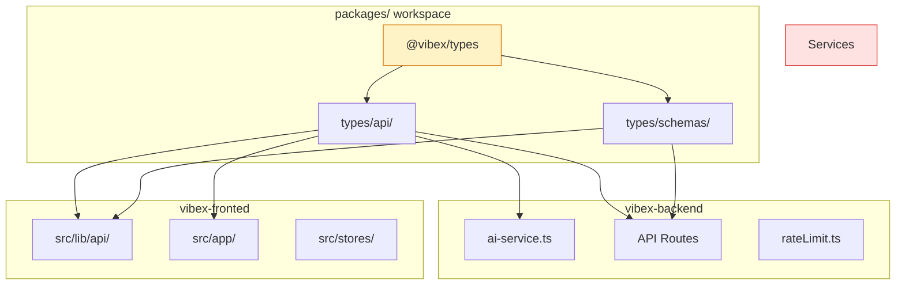
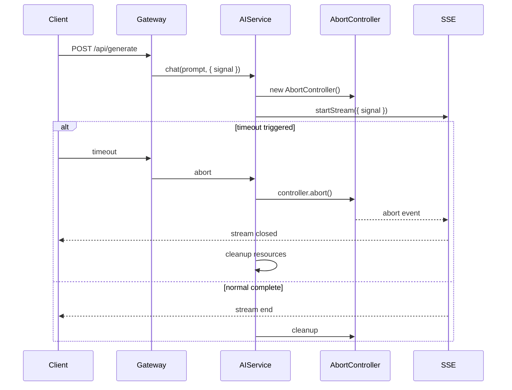
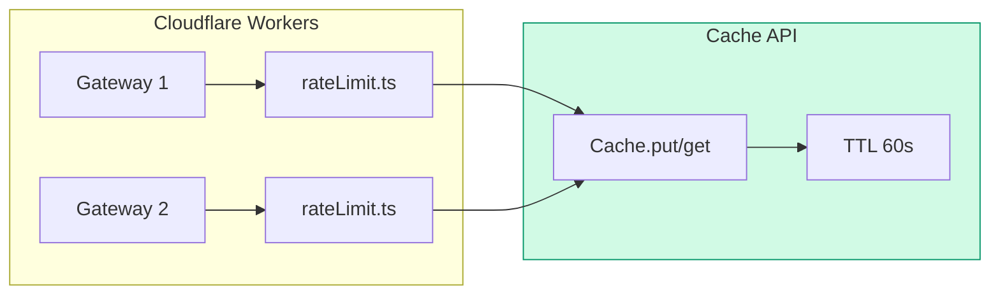
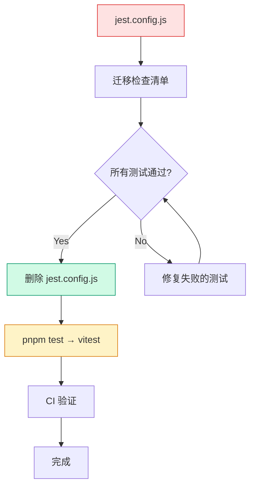
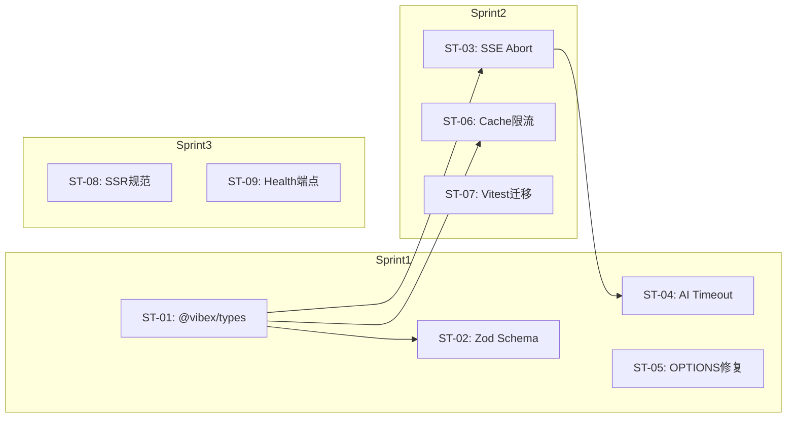

# Architecture: VibeX 架构修复提案实施 2026-04-10

> **项目**: vibex-architect-proposals-vibex-proposals-20260410  
> **作者**: Architect  
> **日期**: 2026-04-10  
> **版本**: v1.0

---

## 执行决策

| 决策 | 状态 | 执行项目 | 执行日期 |
|------|------|----------|----------|
| 建立 `@vibex/types` workspace 包 | **已采纳** | vibex-type-system | Sprint 1 |
| Vitest 全面替代 Jest | **已采纳** | vibex-test-unification | Sprint 2 |
| SSE AbortController 集成 | **已采纳** | vibex-sse-reliability | Sprint 2 |
| Cache API 分布式限流 | **已采纳** | vibex-rate-limit | Sprint 2 |

---

## 1. Tech Stack

| 组件 | 技术选型 | 版本 | 说明 |
|------|----------|------|------|
| **类型系统** | TypeScript + Zod | ^5.5 / ^3 | 运行时验证 |
| **Backend** | Hono | ^4.0 | Cloudflare Workers |
| **前端** | Next.js | ^15.0 | App Router |
| **测试** | Vitest | ^1.42 | Jest 替代 |
| **类型包** | pnpm workspace | — | monorepo |
| **限流** | Cache API | — | Workers KV 替代 |
| **Linting** | ESLint | ^9.0 | SSR 安全规则 |

---

## 2. 架构图

### 2.1 类型系统架构



### 2.2 SSE AbortController 集成



### 2.3 分布式限流架构



### 2.4 Vitest 迁移



---

## 3. API 定义

### 3.1 @vibex/types 包结构

```typescript
// packages/types/src/index.ts
export * from './api/';
export * from './schemas/';

// packages/types/src/api/index.ts
export { type GenerationOptions } from './generation';
export { type CanvasSnapshot, type CanvasNode, type CanvasEdge } from './canvas';

// packages/types/src/schemas/index.ts
export { GenerationOptionsSchema } from './generation';
export { CanvasSnapshotSchema } from './canvas';
```

### 3.2 Zod Schema 示例

```typescript
// packages/types/src/schemas/canvas.ts
import { z } from 'zod';

export const CanvasNodeSchema = z.object({
  id: z.string(),
  type: z.string(),
  label: z.string(),
  position: z.object({ x: z.number(), y: z.number() }),
  data: z.record(z.unknown()).optional(),
});

export const CanvasEdgeSchema = z.object({
  id: z.string(),
  source: z.string(),
  target: z.string(),
  label: z.string().optional(),
});

export const CanvasSnapshotSchema = z.object({
  id: z.string(),
  projectId: z.string(),
  name: z.string(),
  nodes: z.array(CanvasNodeSchema),
  edges: z.array(CanvasEdgeSchema),
  createdAt: z.string(),
  updatedAt: z.string(),
});

export type CanvasSnapshot = z.infer<typeof CanvasSnapshotSchema>;
```

### 3.3 AI Service 类型

```typescript
// packages/types/src/api/ai-service.ts
export interface GenerationOptions {
  prompt: string;
  model?: string;
  temperature?: number;
  maxTokens?: number;
  timeout?: number; // ms
  signal?: AbortSignal; // SSE AbortController
}

export interface ChatResponse {
  content: string;
  usage: {
    promptTokens: number;
    completionTokens: number;
    totalTokens: number;
  };
  finishReason: 'stop' | 'length' | 'content_filter';
}
```

### 3.4 Health Check 端点

| Method | Path | Response |
|--------|------|----------|
| GET | `/health` | `{ db: ServiceStatus, kv: ServiceStatus, ai: ServiceStatus }` |

```typescript
// GET /health
interface HealthResponse {
  db: { status: 'ok' | 'error'; latencyMs?: number };
  kv: { status: 'ok' | 'error'; latencyMs?: number };
  ai: { status: 'ok' | 'error'; latencyMs?: number };
  timestamp: string;
}
```

---

## 4. 数据模型

### 4.1 Rate Limit 存储

```typescript
// Before: In-memory Map
class RateLimiter {
  private counts = new Map<string, number>(); // ❌ 多实例不同步
}

// After: Cache API
interface RateLimitEntry {
  count: number;
  resetAt: number;
}

async function checkRateLimit(
  key: string,
  limit: number,
  windowMs: number
): Promise<{ allowed: boolean; remaining: number }> {
  const cacheKey = `ratelimit:${key}`;
  const entry = await CACHE.get(cacheKey, 'json') as RateLimitEntry | null;
  
  if (!entry || Date.now() > entry.resetAt) {
    // New window
    await CACHE.put(cacheKey, JSON.stringify({
      count: 1,
      resetAt: Date.now() + windowMs,
    }), { expirationTtl: Math.ceil(windowMs / 1000) });
    return { allowed: true, remaining: limit - 1 };
  }
  
  if (entry.count >= limit) {
    return { allowed: false, remaining: 0 };
  }
  
  entry.count++;
  await CACHE.put(cacheKey, JSON.stringify(entry), { 
    expirationTtl: Math.ceil((entry.resetAt - Date.now()) / 1000) 
  });
  
  return { allowed: true, remaining: limit - entry.count };
}
```

### 4.2 SSE Abort Signal 传播

```typescript
// services/ai-service.ts
export class AIService {
  async *streamChat(
    prompt: string,
    options: GenerationOptions = {}
  ): AsyncGenerator<string> {
    const controller = new AbortController();
    const timeout = options.timeout ?? parseInt(env.AI_TIMEOUT_MS ?? '60000');
    
    // 合并外部 signal 和内部 timeout
    const mergedSignal = this.mergeSignals(
      controller.signal,
      options.signal,
      AbortSignal.timeout(timeout)
    );

    const timeoutHandle = setTimeout(() => {
      controller.abort();
    }, timeout);

    try {
      const response = await fetch(env.AI_API_URL, {
        method: 'POST',
        headers: { 'Content-Type': 'application/json' },
        body: JSON.stringify({ prompt, ...options }),
        signal: mergedSignal,
      });

      if (!response.ok) {
        throw new AIError(`AI API error: ${response.status}`);
      }

      const reader = response.body?.getReader();
      if (!reader) throw new AIError('No response body');

      const decoder = new TextDecoder();
      let buffer = '';

      while (true) {
        const { done, value } = await reader.read();
        if (done) break;

        buffer += decoder.decode(value, { stream: true });
        const lines = buffer.split('\n');
        buffer = lines.pop() ?? '';

        for (const line of lines) {
          if (line.startsWith('data: ')) {
            const data = line.slice(6);
            if (data === '[DONE]') return;
            yield this.parseSSEData(data);
          }
        }
      }
    } finally {
      clearTimeout(timeoutHandle);
      // 确保 AbortController 被清理
      if (!controller.signal.aborted) {
        controller.abort();
      }
    }
  }
}
```

---

## 5. 测试策略

### 5.1 Vitest 配置

```typescript
// vitest.config.ts
import { defineConfig } from 'vitest/config';

export default defineConfig({
  test: {
    globals: true,
    environment: 'node',
    include: ['src/**/*.test.{ts,tsx}', 'tests/**/*.test.{ts,tsx}'],
    exclude: [
      'node_modules',
      'dist',
      '**/*.backup-*',
      '.stryker-tmp/**',
    ],
    coverage: {
      provider: 'v8',
      reporter: ['text', 'lcov', 'html'],
      include: ['src/**/*.{ts,tsx}'],
      exclude: ['**/*.d.ts', '**/*.backup-*'],
    },
    testTimeout: 10000,
  },
});
```

### 5.2 SSE 测试

```typescript
// tests/unit/ai-service.test.ts
describe('AIService', () => {
  it('should abort stream on timeout', async () => {
    const service = new AIService({ timeout: 100 }); // 100ms timeout
    
    const startTime = Date.now();
    let chunksReceived = 0;
    
    try {
      for await (const chunk of service.streamChat('test prompt')) {
        chunksReceived++;
      }
    } catch (error) {
      if (error instanceof DOMException && error.name === 'AbortError') {
        const elapsed = Date.now() - startTime;
        expect(elapsed).toBeLessThan(500); // 应在 timeout 内中止
        expect(chunksReceived).toBeGreaterThanOrEqual(0);
      }
    }
    
    // 验证无 zombie 连接
    expect(service.getActiveStreams()).toBe(0);
  });
});
```

### 5.3 Rate Limit 测试

```typescript
// tests/unit/rate-limit.test.ts
describe('RateLimiter (Cache API)', () => {
  it('should count across instances', async () => {
    // 模拟两个 Worker 实例
    const limiter1 = new RateLimiter();
    const limiter2 = new RateLimiter();
    
    // Instance 1: 3 requests
    for (let i = 0; i < 3; i++) {
      const result = await limiter1.check('user-123', { limit: 5, windowMs: 60000 });
      expect(result.allowed).toBe(true);
    }
    
    // Instance 2: 应该看到 Instance 1 的计数
    const result = await limiter2.check('user-123', { limit: 5, windowMs: 60000 });
    expect(result.allowed).toBe(true);
    expect(result.remaining).toBe(2); // 5 - 3 = 2
  });
});
```

---

## 6. 风险评估

| Epic | 风险 | 概率 | 影响 | 缓解 |
|------|------|------|------|------|
| E1 | Schema 重构破坏现有 API | 中 | 高 | 渐进迁移，版本字段 |
| E2 | AbortController 传播链断裂 | 中 | 高 | 全链路 audit |
| E3 | Vitest 迁移期间 CI 红 | 中 | 中 | 双框架并行验证 |
| E4 | Cache API 计数不准确 | 低 | 中 | KV fallback |
| E5 | SSR 规则误报 | 低 | 低 | 宽容阈值 |

---

## 7. 依赖关系



---

*文档版本: v1.0 | 最后更新: 2026-04-10*
