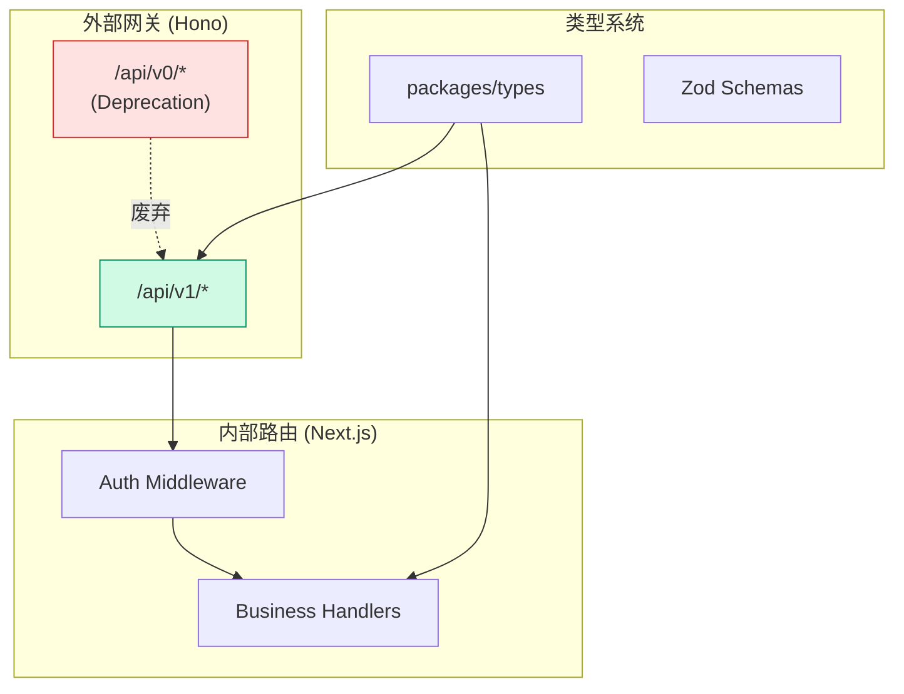
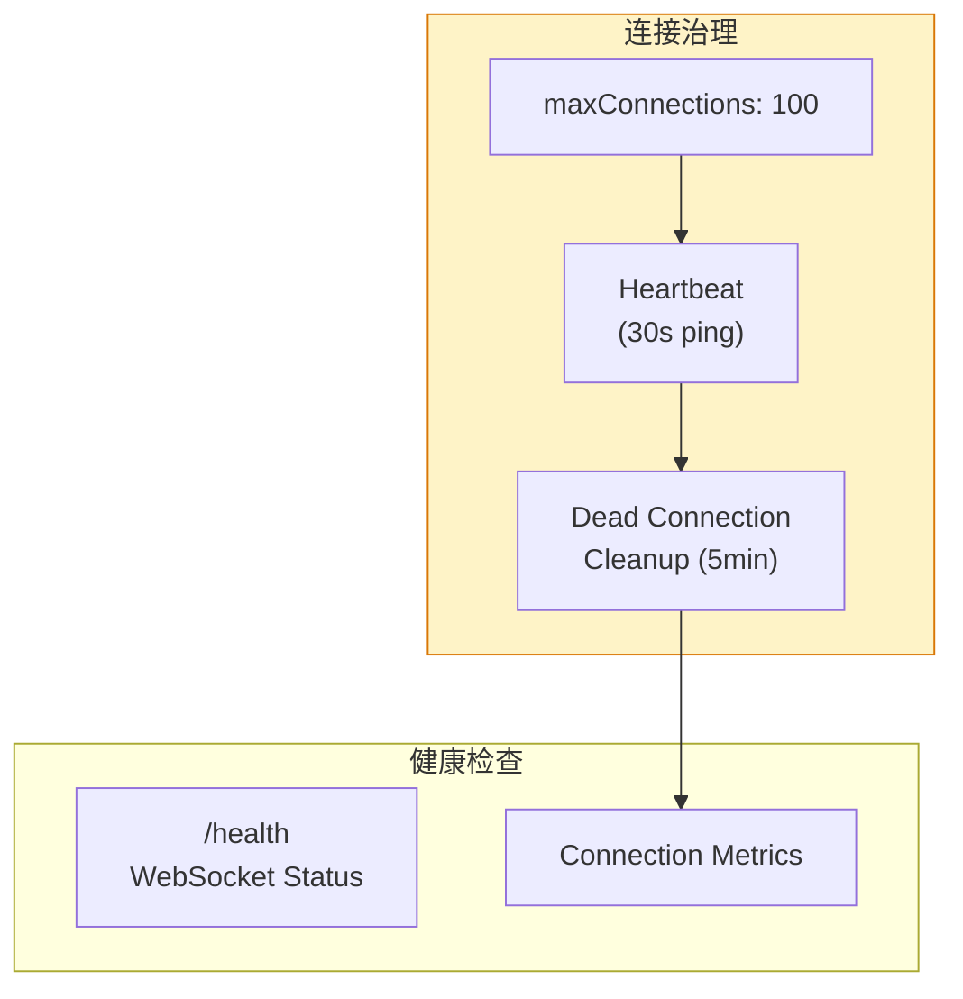

# Architecture: VibeX 架构提案实施 2026-04-11

> **项目**: vibex-architect-proposals-vibex-proposals-20260411  
> **作者**: Architect  
> **日期**: 2026-04-11  
> **版本**: v1.0

---

## 执行决策

| 决策 | 状态 | 执行项目 | 执行日期 |
|------|------|----------|----------|
| v0 路由渐进废弃 | **已采纳** | vibex-architect-proposals-vibex-proposals-20260411 | 2026-04-11 |
| WebSocket 连接治理 | **已采纳** | vibex-architect-proposals-vibex-proposals-20260411 | 2026-04-11 |
| packages/types 统一 | **已采纳** | vibex-architect-proposals-vibex-proposals-20260411 | 2026-04-11 |

---

## 1. Tech Stack

| 组件 | 技术选型 | 说明 |
|------|----------|------|
| **API** | Hono + Next.js | 双路由分层 |
| **WebSocket** | ws | 连接治理 |
| **类型共享** | packages/types | workspace 共享 |
| **AST** | @babel/parser | 提示词安全 |
| **监控** | pino | 结构化日志 |

---

## 2. 架构图

### 2.1 API 路由分层



### 2.2 WebSocket 连接治理



---

## 3. Epic 详细设计

### 3.1 E1: API v0/v1 双路由治理（4h）

```typescript
// v0 路由添加 Deprecation header
// middleware/deprecation.ts
export function withDeprecationHeaders(
  handler: (c: Context) => Promise<Response>
) {
  return async (c: Context): Promise<Response> => {
    const response = await handler(c);
    response.headers.set('Deprecation', 'true');
    response.headers.set('Sunset', 'Sat, 31 Dec 2026 23:59:59 GMT');
    response.headers.set('Link', '</api/v1/agents>; rel="successor-version"');
    return response;
  };
}

// 使用
router.get('/v0/agents', withDeprecationHeaders(getAgentsHandler));
```

### 3.2 E2: WebSocket 连接治理（6h）

```typescript
// services/WebSocketManager.ts
export class WebSocketManager {
  private connections = new Map<string, WebSocket>();
  private heartbeats = new Map<string, number>();
  
  static MAX_CONNECTIONS = 100;
  static HEARTBEAT_INTERVAL = 30000; // 30s
  static DEAD_CONNECTION_TIMEOUT = 300000; // 5min

  accept(socket: WebSocket, id: string): boolean {
    if (this.connections.size >= WebSocketManager.MAX_CONNECTIONS) {
      socket.close(1008, 'Too many connections');
      return false;
    }
    this.connections.set(id, socket);
    this.startHeartbeat(id);
    return true;
  }

  private startHeartbeat(id: string) {
    const interval = setInterval(() => {
      const socket = this.connections.get(id);
      if (!socket || socket.readyState !== WebSocket.OPEN) {
        this.remove(id);
        return;
      }
      socket.ping();
      this.heartbeats.set(id, Date.now());
    }, WebSocketManager.HEARTBEAT_INTERVAL);
  }

  cleanupDeadConnections() {
    const now = Date.now();
    for (const [id, lastPing] of this.heartbeats) {
      if (now - lastPing > WebSocketManager.DEAD_CONNECTION_TIMEOUT) {
        this.remove(id);
        logger.warn('dead_connection_removed', { id, idleMs: now - lastPing });
      }
    }
  }
}
```

### 3.3 E3: packages/types 集成（3h）

```typescript
// packages/types/src/index.ts
export * from './schemas/canvas';
export * from './schemas/chat';
export * from './schemas/project';

// packages/types/package.json
{
  "name": "@vibex/types",
  "version": "1.0.0",
  "exports": {
    ".": "./src/index.ts",
    "./schemas/*": "./src/schemas/*.ts"
  }
}

// vibex-backend/package.json
{
  "dependencies": {
    "@vibex/types": "workspace:*"
  }
}
```

### 3.4 E4: Hono/Next.js 路由分层（4h）

```typescript
// Hono: 外部网关（认证 + CORS）
// app/api/gateway.ts
const gateway = new Hono();

gateway.use('*', corsMiddleware());
gateway.use('*', withAuth());  // 统一认证

gateway.on(['POST', 'GET'], '/v1/*', async (c) => {
  const path = c.req.path.replace('/v1', '');
  return NextJSHandler.handle(path, c.req.raw);
});

// Next.js: 内部业务路由
// app/api/v1/agents/route.ts
export async function GET(request: Request) {
  // 不再需要重复认证
  const agents = await getAgents();
  return Response.json(agents);
}
```

### 3.5 E5: CompressionEngine 质量评分（5h）

```typescript
// lib/qualityScore.ts
export interface CompressionResult {
  qualityScore: number;  // 0-100
  originalTokens: number;
  compressedTokens: number;
  compressionRatio: number;
}

export function calculateQualityScore(result: CompressionResult): number {
  const { originalTokens, compressedTokens, entities, relationships } = result;
  
  const coverageScore = (entities.length + relationships.length) > 0 
    ? Math.min(100, (entities.length + relationships.length) * 10) 
    : 0;
  
  const ratioScore = originalTokens > 0
    ? (1 - compressedTokens / originalTokens) * 100
    : 0;
  
  return Math.round((coverageScore * 0.6 + ratioScore * 0.4));
}

// 使用
const result = await compressContext(entities, relationships);
if (result.qualityScore < 70) {
  logger.warn('low_compression_quality', { qualityScore: result.qualityScore });
  // 降级为全量上下文
  return fullContext;
}
```

### 3.6 E6: Prompts 安全 AST 扫描（4h）

```typescript
// lib/promptSecurity.ts
import { parse } from '@babel/parser';
import traverse from '@babel/traverse';

export function scanForDangerousPatterns(code: string): DangerousPattern[] {
  const patterns: DangerousPattern[] = [];
  
  try {
    const ast = parse(code, { sourceType: 'module' });
    
    traverse(ast, {
      CallExpression(path) {
        const name = path.node.callee.type;
        if (name === 'Identifier' && ['eval', 'Function'].includes(path.node.callee.name)) {
          patterns.push({
            type: 'DANGEROUS_FUNCTION',
            name: path.node.callee.name,
            line: path.node.loc?.start.line ?? 0,
          });
        }
      },
      NewExpression(path) {
        if (path.node.callee.type === 'Identifier' && path.node.callee.name === 'Function') {
          patterns.push({
            type: 'DANGEROUS_NEW_FUNCTION',
            line: path.node.loc?.start.line ?? 0,
          });
        }
      },
    });
  } catch (error) {
    logger.error('prompt_parse_error', { error });
  }
  
  return patterns;
}
```

### 3.7 E7: MCP Server 可观测性（3h）

```typescript
// mcp-server/health.ts
export async function GET(request: Request): Promise<Response> {
  const checks = await Promise.allSettled([
    checkDatabase(),
    checkWebSocket(),
    checkExternalServices(),
  ]);
  
  const results = checks.map((result, i) => ({
    name: CHECK_NAMES[i],
    status: result.status === 'fulfilled' ? 'ok' : 'error',
    duration: result.status === 'fulfilled' ? result.value.duration : undefined,
    error: result.status === 'rejected' ? result.reason.message : undefined,
  }));
  
  const allHealthy = results.every(r => r.status === 'ok');
  
  return Response.json({
    status: allHealthy ? 'healthy' : 'unhealthy',
    timestamp: new Date().toISOString(),
    checks: results,
  }, { status: allHealthy ? 200 : 503 });
}
```

---

## 4. 工时汇总

| Epic | 主题 | 工时 | 优先级 |
|------|------|------|--------|
| E1 | API v0/v1 双路由治理 | 4h | P0 |
| E2 | WebSocket 连接治理 | 6h | P0 |
| E3 | packages/types 集成 | 3h | P1 |
| E4 | Hono/Next.js 路由分层 | 4h | P1 |
| E5 | CompressionEngine 质量评分 | 5h | P2 |
| E6 | Prompts 安全 AST 扫描 | 4h | P2 |
| E7 | MCP Server 可观测性 | 3h | P2 |

**总计**: 29h | **团队**: 1 Dev

---

## 5. 验收标准

| 检查项 | 命令 | 目标 |
|--------|------|------|
| v0 Deprecation header | `curl -I /api/v0/agents` | 有 Deprecation + Sunset |
| WebSocket 连接限制 | 并发 > 100 连接 | 拒绝第 101 个 |
| 类型共享 | `grep "@vibex/types" vibex-backend/src/` | >0 结果 |
| qualityScore | 触发 < 70 分 | 降级全量上下文 |
| AST 扫描 | eval 代码 | 被检测 |
| MCP /health | `curl /health` | 200 + checks |

---

*文档版本: v1.0 | 最后更新: 2026-04-11*
