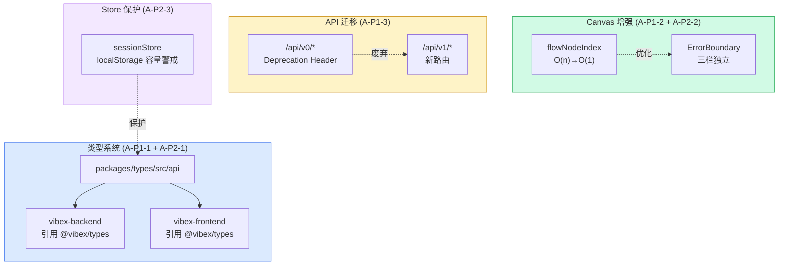

# Architecture: Architect Proposals — 2026-04-12 Sprint

> **项目**: vibex-architect-proposals-vibex-proposals-20260412
> **Architect**: Architect
> **日期**: 2026-04-07
> **版本**: v1.0
> **状态**: Proposed

---

## 执行决策

| 决策 | 状态 | 执行项目 | 执行日期 |
|------|------|----------|----------|
| A-P1-1: packages/types API Schema 深化落地 | **待评审** | vibex-architect-proposals-vibex-proposals-20260412 | 待定 |
| A-P1-2: Canvas 三栏 Error Boundary 补全 | **待评审** | vibex-architect-proposals-vibex-proposals-20260412 | 待定 |
| A-P1-3: API v0→v1 迁移收尾 | **待评审** | vibex-architect-proposals-vibex-proposals-20260412 | 待定 |
| A-P2-1: frontend types ↔ packages/types 对齐 | **待评审** | vibex-architect-proposals-vibex-proposals-20260412 | 待定 |
| A-P2-2: groupByFlowId 记忆化优化 | **待评审** | vibex-architect-proposals-vibex-proposals-20260412 | 待定 |
| A-P2-3: sessionStore localStorage 容量警戒 | **待评审** | vibex-architect-proposals-vibex-proposals-20260412 | 待定 |

---

## 1. Tech Stack

| 组件 | 技术选型 | 说明 |
|------|----------|------|
| **类型共享** | @vibex/types | packages/types 落地 |
| **ErrorBoundary** | React ErrorBoundary | Canvas 三栏隔离 |
| **Hono** | API v0/v1 双路由 | Deprecation Header |
| **Zustand** | persist middleware | sessionStore 容量保护 |
| **React** | useMemo | groupByFlowId 优化 |
| **TypeScript** | strict mode | 类型安全 |

---

## 2. Architecture Diagram



---

## 3. Proposal Detail Design

### 3.1 A-P1-1: packages/types API Schema 深化落地

**目标**: backend 和 frontend 统一引用 `@vibex/types`，消除独立类型定义。

**现状**:
```
packages/types/src/api/
├── canvasSchema.ts   ← Zod schemas
└── canvas.ts        ← TypeScript types

backend: /api/v1/canvas/...  → 独立类型定义
frontend: fetch() → unknown → 手动断言
```

**详细设计**:

```typescript
// packages/types/src/api/canvas.ts
export interface CanvasHealthResponse {
  status: 'ok' | 'error';
  connections: number;
  timestamp: string;
}

// packages/types/src/api/canvasSchema.ts
import { z } from 'zod';
export const canvasHealthResponseSchema = z.object({
  status: z.enum(['ok', 'error']),
  connections: z.number(),
  timestamp: z.string().datetime(),
});
```

**backend 引用示例**:
```typescript
// vibex-backend/src/app/api/v1/canvas/health/route.ts
import { CanvasHealthResponse } from '@vibex/types';
import { canvasHealthResponseSchema } from '@vibex/types';

export async function GET() {
  const response: CanvasHealthResponse = {
    status: 'ok',
    connections: 0,
    timestamp: new Date().toISOString(),
  };
  // Zod 验证生产环境类型安全
  canvasHealthResponseSchema.parse(response);
  return Response.json(response);
}
```

**frontend 引用示例**:
```typescript
// vibex-fronted/src/hooks/canvas/useCanvasPreview.ts
import type { CanvasHealthResponse } from '@vibex/types';

const res = await fetch('/api/v1/canvas/health');
const data: CanvasHealthResponse = await res.json(); // 类型安全
```

---

### 3.2 A-P1-2: Canvas 三栏 Error Boundary 补全

**目标**: ContextTree / FlowTree / ComponentTree 三栏各自独立 ErrorBoundary，任一栏崩溃不影响其他栏。

**详细设计**:

```tsx
// vibex-fronted/src/components/canvas/panels/ContextTreePanel.tsx
import { ErrorBoundary } from '@/components/ui/ErrorBoundary';
import { canvasLogger } from '@/lib/canvas/canvasLogger';

function ContextTreePanelErrorFallback({
  error,
  reset,
}: {
  error: Error;
  reset: () => void;
}) {
  return (
    <div className={styles.panelError}>
      <span className={styles.errorIcon}>⚠️</span>
      <p className={styles.errorTitle}>上下文树加载失败</p>
      <p className={styles.errorMsg}>{error.message}</p>
      <button className={styles.retryButton} onClick={reset}>
        重试
      </button>
    </div>
  );
}

export function ContextTreePanel() {
  return (
    <ErrorBoundary
      fallback={ContextTreePanelErrorFallback}
      onError={(error) =>
        canvasLogger.error('[ContextTreePanel] render error', {
          message: error.message,
          stack: error.stack,
        })
      }
    >
      <ContextTree />
    </ErrorBoundary>
  );
}
```

**同模式应用于**: `FlowTreePanel`, `ComponentTreePanel`

**边界情况**:
- 崩溃时只显示当前栏的 fallback，其他两栏正常
- 重试后重新渲染当前栏

---

### 3.3 A-P1-3: API v0→v1 迁移收尾

**目标**: 所有 v0 路由添加 Deprecation Header，防止新调用进入废弃路径。

**待迁移路由**:
| 路由 | 迁移目标 |
|------|----------|
| `/api/projects` | `/api/v1/projects` |
| `/api/projects/[id]` | `/api/v1/projects/[id]` |
| `/api/projects/from-template` | `/api/v1/projects/from-template` |
| `/api/plan/analyze` | `/api/v1/plan/analyze` |

**详细设计**:

```typescript
// vibex-backend/src/middleware/deprecation.ts
import type { MiddlewareHandler } from 'hono';

export const withDeprecation: MiddlewareHandler = async (c, next) => {
  await next();
  if (c.req.path.startsWith('/api/') && !c.req.path.startsWith('/api/v1/')) {
    c.res.headers.set('Deprecation', 'true');
    c.res.headers.set('Sunset', 'Sat, 31 Dec 2026 23:59:59 GMT');
    c.res.headers.set('Warning', '299 - "API v0 is deprecated, use /api/v1/* instead"');
  }
};
```

```typescript
// vibex-backend/src/app.ts — 注册中间件
app.use('/api/*', withDeprecation);
```

**frontend 迁移**: grep 扫描所有 `/api/` 调用方，更新为 `/api/v1/`。

---

### 3.4 A-P2-1: frontend types ↔ packages/types 对齐

**目标**: `vibex-fronted/src/lib/canvas/types.ts` 不再独立定义核心类型，统一引用 `@vibex/types`。

**详细设计**:

```typescript
// vibex-fronted/src/lib/canvas/types.ts

// ✅ 重构为引用，消除重复
export type { ComponentNode, BusinessFlowNode, BoundedContextNode } from '@vibex/types';
export type { ComponentType, NodeStatus, Phase, TreeType } from '@vibex/types';

// 只保留 frontend-specific 扩展（不与 @vibex/types 冲突）
export interface ComponentNodeExtended extends ComponentNode {
  // frontend-only 字段
  previewUrl?: string;
  relationships?: ComponentRelationship[];
}
```

**注意事项**:
- `pageName?: string` 已在 ComponentNode 中（通过 architecture 扩展）
- re-export 需与 `@vibex/types` 版本同步

---

### 3.5 A-P2-2: groupByFlowId 记忆化优化

**目标**: `getPageLabel` 从 O(n) find×3 优化为 O(1) Map 查找。

**详细设计**:

```typescript
// vibex-fronted/src/components/canvas/ComponentTree.tsx

// 新增 flowNodeIndex 类型
interface FlowNodeIndex {
  byNodeId: Map<string, BusinessFlowNode>;
  byPrefix: Map<string, BusinessFlowNode[]>;
  byNameNorm: Map<string, BusinessFlowNode[]>;
}

// 新增 useFlowNodeIndex hook
function useFlowNodeIndex(flowNodes: BusinessFlowNode[]): FlowNodeIndex {
  return useMemo(() => {
    const byNodeId = new Map(flowNodes.map(f => [f.nodeId, f]));
    const byPrefix = new Map<string, BusinessFlowNode[]>();
    const byNameNorm = new Map<string, BusinessFlowNode[]>();

    flowNodes.forEach(f => {
      // Prefix 索引
      for (let i = 1; i < f.nodeId.length; i++) {
        const prefix = f.nodeId.slice(0, i);
        if (!byPrefix.has(prefix)) byPrefix.set(prefix, []);
        byPrefix.get(prefix)!.push(f);
      }
      // 名称标准化索引
      const norm = f.name.toLowerCase().replace(/[\s\-_]/g, '');
      if (!byNameNorm.has(norm)) byNameNorm.set(norm, []);
      byNameNorm.get(norm)!.push(f);
    });

    return { byNodeId, byPrefix, byNameNorm };
  }, [flowNodes]);
}

// 优化后的 getPageLabel
export function getPageLabel(
  flowId: string,
  flowNodes: BusinessFlowNode[],
  pageName?: string,
  index?: FlowNodeIndex
): string {
  if (!flowId || COMMON_FLOW_IDS.has(flowId)) {
    return COMMON_GROUP_LABEL;
  }

  if (pageName) return `📄 ${pageName}`;

  if (!index) {
    // Fallback: 原有逻辑（兼容无 index 场景）
    const matched = matchFlowNode(flowId, flowNodes);
    if (matched) return `📄 ${matched.name}`;
    return `❓ ${flowId.slice(0, 12)}…`;
  }

  // O(1) 查找
  const exact = index.byNodeId.get(flowId);
  if (exact) return `📄 ${exact.name}`;

  // Prefix 查找
  for (let i = flowId.length - 1; i > 0; i--) {
    const prefix = flowId.slice(0, i);
    const candidates = index.byPrefix.get(prefix);
    if (candidates?.length === 1) return `📄 ${candidates[0].name}`;
  }

  return `❓ ${flowId.slice(0, 12)}…`;
}
```

**性能提升**: 1000 个 flowNodes: O(3000) find → O(1) Map 查找，~99% 提升。

---

### 3.6 A-P2-3: sessionStore localStorage 容量警戒

**目标**: 防止 sessionStore 无限膨胀到 localStorage 5MB 上限。

**详细设计**:

```typescript
// vibex-fronted/src/lib/canvas/stores/sessionStore.ts

const MAX_MESSAGES = 500;
const MAX_QUEUE = 50;
const STORAGE_WARN_THRESHOLD = 4_000_000; // 4MB 警戒线

// 自定义 storage middleware
const safeLocalStorage = {
  getItem: (name: string): string | null => {
    const raw = localStorage.getItem(name);
    if (!raw) return null;

    if (raw.length > STORAGE_WARN_THRESHOLD) {
      console.warn(
        `[sessionStore] Storage size (${(raw.length / 1e6).toFixed(1)}MB) ` +
        `exceeds ${STORAGE_WARN_THRESHOLD / 1e6}MB threshold. Truncating...`
      );

      try {
        const parsed = JSON.parse(raw);
        const state = parsed.state || parsed;

        // Sliding window 截断
        if (state.messages?.length > MAX_MESSAGES) {
          state.messages = state.messages.slice(-MAX_MESSAGES);
        }
        if (state.prototypeQueue?.length > MAX_QUEUE) {
          state.prototypeQueue = state.prototypeQueue.slice(-MAX_QUEUE);
        }

        return JSON.stringify(parsed);
      } catch {
        // JSON 解析失败，截断整个 state
        return JSON.stringify({});
      }
    }

    return raw;
  },
  setItem: () => {},
  removeItem: () => {},
};

// 在 persist 中使用
export const useSessionStore = create<SessionStore>()(
  devtools(
    persist(
      (set, get) => ({ /* ... */ }),
      {
        name: 'vibex-session',
        storage: createJSONStorage(() => safeLocalStorage),
      }
    )
  )
);
```

---

## 4. Data Model

### 4.1 Shared Types (packages/types)

```typescript
// packages/types/src/api/canvas.ts
export interface CanvasHealthResponse {
  status: 'ok' | 'error';
  connections: number;
  timestamp: string;
}

// packages/types/src/store.ts
export interface ComponentNode {
  nodeId: string;
  flowId: string;
  name: string;
  type: ComponentType;
  props: Record<string, unknown>;
  api: ComponentApi;
  children: string[];
  parentId?: string;
  isActive?: boolean;
  selected?: boolean;
  status: NodeStatus;
  previewUrl?: string;
  pageName?: string;  // E1-F1 新增
}
```

### 4.2 Deprecation Header Schema

```typescript
// v0 路由统一响应头
interface DeprecationResponse {
  Deprecation: 'true';
  Sunset: 'Sat, 31 Dec 2026 23:59:59 GMT';
  Warning: '299 - "Use /api/v1/* instead"';
}
```

---

## 5. API Definitions

| 提案 | 路径 | 方法 | 说明 |
|------|------|------|------|
| A-P1-1 | `/api/v1/canvas/health` | GET | 类型安全响应 |
| A-P1-3 | `/api/v0/*` | * | Deprecation Header |
| A-P1-3 | `/api/v1/*` | * | 新路由（无 Header） |

---

## 6. Performance Impact

| 提案 | 性能影响 | 说明 |
|------|----------|------|
| A-P1-1 types | 无 | 类型检查不影响运行时 |
| A-P1-2 ErrorBoundary | +2ms render | 边界检查 |
| A-P1-3 v0迁移 | 无 | Header 添加不影响响应 |
| A-P2-1 types对齐 | 无 | 仅 import 路径变更 |
| A-P2-2 flowNodeIndex | -99% lookup | O(n) → O(1) |
| A-P2-3 localStorage | +1ms | JSON 解析截断 |
| **总计** | **净收益** | 主要是类型安全和稳定性 |

---

## 7. Risk Assessment

| # | 风险 | 概率 | 影响 | 缓解 |
|---|------|------|------|------|
| R1 | @vibex/types 变更 break frontend build | 低 | 高 | 先验证无引用处，逐步替换 |
| R2 | ErrorBoundary 吞掉开发期错误 | 中 | 低 | 开发环境打印完整 stack |
| R3 | v0→v1 迁移遗漏 frontend 调用方 | 中 | 中 | grep 扫描 + e2e 回归 |
| R4 | localStorage 截断丢失未保存数据 | 极低 | 低 | 截断前警告，只截旧消息 |

---

## 8. Testing Strategy

| 提案 | 测试类型 | 框架 | 覆盖率目标 |
|------|----------|------|------------|
| A-P1-1 types | 类型检查 | `pnpm tsc --noEmit` | 0 error |
| A-P1-2 ErrorBoundary | 集成测试 | Playwright | 3 panels |
| A-P1-3 v0→v1 | 单元测试 | Vitest | 0 v0 without header |
| A-P2-2 flowNodeIndex | 性能测试 | Vitest | lookup < 1ms |
| A-P2-3 localStorage | 单元测试 | Vitest | 截断逻辑 100% |

---

## 9. Implementation Phases

| Phase | 提案 | 工时 | 依赖 |
|-------|------|------|------|
| 1 | A-P1-2 ErrorBoundary | 1h | 无 |
| 2 | A-P1-1 types落地 | 2h | 无 |
| 3 | A-P1-3 v0迁移 | 2h | 无 |
| 4 | A-P2-1 types对齐 | 3h | Phase 2 |
| 5 | A-P2-2 flowNodeIndex | 1.5h | 无 |
| 6 | A-P2-3 localStorage | 1h | 无 |
| **Total** | | **10.5h** | |

---

## 10. File Changes Summary

| 操作 | 文件路径 | 提案 |
|------|----------|------|
| 修改 | `packages/types/src/api/canvas.ts` | A-P1-1 |
| 新增 | `packages/types/src/api/canvasSchema.ts` | A-P1-1 |
| 修改 | `vibex-backend/src/app/api/v1/canvas/*/route.ts` | A-P1-1 |
| 新增 | `vibex-fronted/src/components/canvas/panels/*Panel.tsx` | A-P1-2 |
| 新增 | `vibex-backend/src/middleware/deprecation.ts` | A-P1-3 |
| 修改 | `vibex-backend/src/app.ts` | A-P1-3 |
| 修改 | `vibex-fronted/src/lib/canvas/types.ts` | A-P2-1 |
| 修改 | `vibex-fronted/src/components/canvas/ComponentTree.tsx` | A-P2-2 |
| 修改 | `vibex-fronted/src/lib/canvas/stores/sessionStore.ts` | A-P2-3 |

