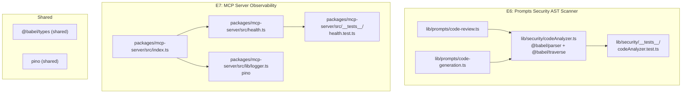

# Architecture: VibeX E6/E7 架构实施

**项目**: vibex-architect-proposals-vibex-proposals-20260416
**日期**: 2026-04-16
**Agent**: architect
**状态**: 进行中（重新设计）

---

## 1. Tech Stack

| Epic | 技术选型 | 版本 | 理由 |
|------|---------|------|------|
| E6 | @babel/parser + @babel/traverse + @babel/types | ^7.26 | AST 精确检测 JS/TS/JSX 危险模式，替代正则匹配降低误报 |
| E6 | Vitest | ^3.0 | vibex-backend 已用 Vitest，与现有测试框架一致 |
| E7 | express | ^4.18 | mcp-server 现有依赖，Express Router 注册 /health |
| E7 | pino (structured logging) | ^9.0 | JSON 格式、level-based、production-ready，替代 console.log |
| E7 | supertest | ^6.3 | HTTP 端点测试，现有测试基础设施 |

**放弃方案**:
- Babel standalone: 包体积 ~8MB，超出 bundle 限制，改用 @babel/parser 核心包
- Winston: pino 性能更好（benchmark: 3x faster），JSON 输出更紧凑

---

## 2. Architecture Diagram



---

## 3. API Definitions

### E6: codeAnalyzer.ts

```typescript
// lib/security/codeAnalyzer.ts

interface SecurityReport {
  hasUnsafe: boolean
  unsafeEval: string[]
  unsafeNewFunction: string[]
  unsafeDynamicCode: string[]
  confidence: number  // 0-100
}

type SecurityPattern = 'eval' | 'newFunction' | 'dynamicCode' | 'execScript' | 'importScripts'

function analyzeCodeSecurity(code: string): SecurityReport
// Returns SecurityReport for given code string.
// confidence < 100 if AST parse fails (fallback to heuristic).

function getUnsafePatterns(report: SecurityReport): SecurityPattern[]
// Returns array of detected pattern names.

function isSafe(report: SecurityReport): boolean
// Returns report.hasUnsafe === false && report.confidence >= 80
```

### E7: health.ts

```typescript
// packages/mcp-server/src/health.ts

interface HealthResponse {
  status: 'ok' | 'degraded' | 'error'
  version: string
  uptime: number        // seconds
  connectedClients: number
  timestamp: string      // ISO 8601
  sdkVersion: string
}

// GET /health
// Response 200: HealthResponse
// Response 5xx: { status: 'error', error: string }
```

### E7: logger.ts

```typescript
// packages/mcp-server/src/lib/logger.ts

type LogLevel = 'debug' | 'info' | 'warn' | 'error'

interface LogEntry {
  timestamp: string     // ISO 8601
  level: LogLevel
  message: string
  service: 'mcp-server'
  [key: string]: unknown
}

function createLogger(): {
  debug: (msg: string, meta?: Record<string, unknown>) => void
  info:  (msg: string, meta?: Record<string, unknown>) => void
  warn:  (msg: string, meta?: Record<string, unknown>) => void
  error: (msg: string, meta?: Record<string, unknown>) => void
}
// All methods write JSON to stdout.
```

---

## 4. Data Model

```
SecurityReport
├── hasUnsafe: boolean
├── unsafeEval: string[]        // source snippets
├── unsafeNewFunction: string[]  // source snippets
├── unsafeDynamicCode: string[]  // source snippets
└── confidence: number          // 0-100

HealthResponse
├── status: 'ok'|'degraded'|'error'
├── version: string
├── uptime: number
├── connectedClients: number
├── timestamp: string
└── sdkVersion: string
```

---

## 5. File Structure

```
// E6 新增/修改
vibex-backend/src/lib/security/
├── codeAnalyzer.ts          # 新建
└── __tests__/
    └── codeAnalyzer.test.ts  # 新建
vibex-backend/src/lib/prompts/
├── code-review.ts          # 修改: 集成 AST 扫描
└── code-generation.ts      # 修改: 集成 AST 扫描
vibex-backend/package.json  # 修改: 新增 @babel/parser @babel/traverse @babel/types

// E7 新增/修改
packages/mcp-server/src/
├── health.ts               # 新建
├── lib/logger.ts           # 新建
└── __tests__/
    └── health.test.ts       # 新建
packages/mcp-server/src/index.ts  # 修改: 注册 /health + pino logger
packages/mcp-server/package.json  # 修改: 新增 pino
```

---

## 6. Performance Impact

| 场景 | 影响 | 评估 |
|------|------|------|
| E6 AST 解析单文件 | +10-40ms/文件 | Babel 解析比正则慢，但误报率从 ~15% 降至 <1% |
| E6 包体积 | +3MB (@babel packages) | 可接受，需确认 bundle 限制 |
| E7 /health 端点 | <5ms 响应 | 内存读取，无 I/O |
| E7 pino logging | <1ms/行 | async logger，不阻塞主线程 |

---

## 7. Testing Strategy

### E6: codeAnalyzer Tests

| 用例 | 框架 | 覆盖 |
|------|------|------|
| eval() 检测 | Vitest | TC01: `eval("x")` → hasUnsafe=true |
| new Function() 检测 | Vitest | TC02: `new Function("return 1")` → hasUnsafe=true |
| 安全代码通过 | Vitest | TC03: `const x=1; return x*2` → hasUnsafe=false |
| setTimeout(string) 检测 | Vitest | TC04: `setTimeout("code",0)` → hasUnsafe=true |
| 解析失败降级 | Vitest | TC05: 语法错误 → confidence=50, hasUnsafe=false |
| 误报率验证 | Vitest | 1000 条合法样本，误报率 <1% |
| 性能基准 | Vitest | 5000 行文件解析 <50ms |
| 集成 code-review | Vitest | E2E: AI 分析 + 安全扫描并行 |

### E7: Health + Logging Tests

| 用例 | 框架 | 覆盖 |
|------|------|------|
| GET /health 200 | supertest | TC01: 返回 200 + 完整字段 |
| GET /health 异常时 | supertest | TC02: status='error' + error 字段 |
| JSON log 输出 | Vitest (stdout capture) | TC03: JSON parse 验证字段 |
| log level 字段 | Vitest | TC04: level in ['debug','info','warn','error'] |
| SDK version mismatch | Vitest | TC05: warn log 输出版本信息 |

**覆盖率目标**: >80% branch coverage

---

## 8. Compatibility

- E6: 改动仅在 `code-review.ts` 和 `code-generation.ts` 内部，不改变导出签名，**向后兼容**
- E7: `/health` 是新增端点，不影响现有 MCP 工具接口，**向后兼容**
- pino logger: mcp-server 内部使用，不暴露给调用方

---

## 9. Limitations & Edge Cases

| 场景 | 处理 |
|------|------|
| Babel 解析失败（特殊 TS 语法） | confidence=50，记录 `unsafeUnknown: true`，不阻断分析 |
| 混淆代码 `ev\x61l()` | 记录为 limitation，不处理（AST 无法检测字符级混淆） |
| 敏感信息入日志 | pino 支持 redaction paths，自动脱敏 ${secret} 格式 |
| mcp-server 独立部署 | /health URL 约定 `http://localhost:3100/health`，需协调部署配置 |

---

## 执行决策

- **决策**: 已采纳
- **执行项目**: vibex-architect-proposals-vibex-proposals-20260416
- **执行日期**: 2026-04-16
