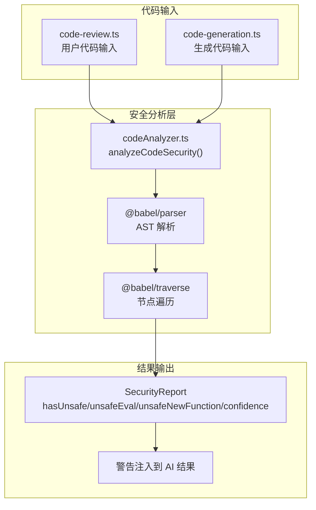
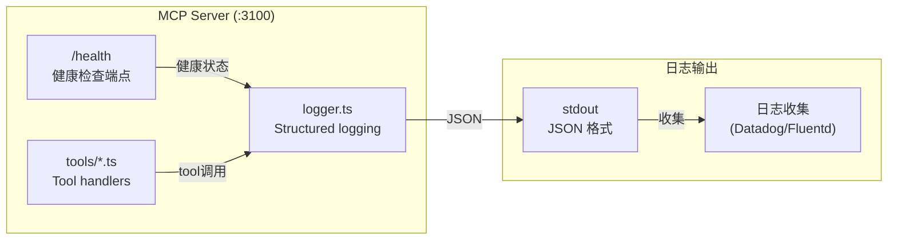

# VibeX E6/E7 技术架构设计

**项目**: vibex-architect-proposals-vibex-proposals-20260416
**日期**: 2026-04-16
**作者**: Architect

---

## 执行决策

- **决策**: 待评审
- **执行项目**: 无
- **执行日期**: 待定

---

## 1. Tech Stack

### 1.1 技术选型总览

| Epic | 技术选型 | 理由 |
|------|----------|------|
| **E6** | @babel/parser + @babel/traverse + @babel/types | AST 解析替代正则，精确检测 eval/new Function；Babel 是业界标准，TypeScript/JSX 支持好 |
| **E7** | Express.js + 自研 logger.ts | MCP Server 已有 Express 基础，logger 用 console.log(JSON) 写 stdout 兼容日志收集 |

### 1.2 技术栈详情

- **Frontend**: N/A（本轮纯后端）
- **Backend**: Node.js 20 LTS, TypeScript 5
- **E6 AST**: @babel/parser ^7.24, @babel/traverse ^7.24, @babel/types ^7.24
- **E7 MCP**: Express 4.x, @modelcontextprotocol/sdk ^0.5.0
- **Testing**: Vitest（单元）
- **Lint**: ESLint + TypeScript strict

### 1.3 约束

- Babel 包体积 ~5MB，bundle size 需监控（参考 E6 CI 基线）
- 日志禁止输出 token/secret 等敏感数据
- Babel 解析失败时 confidence 降至 50，不阻断流程

---

## 2. Architecture Diagram

### 2.1 E6 安全扫描数据流



### 2.2 E7 MCP 可观测性架构



---

## 3. API Definitions

### 3.1 E6: SecurityReport 接口

```typescript
// vibex-backend/src/lib/security/codeAnalyzer.ts

interface SecurityReport {
  /** 是否检测到危险模式 */
  hasUnsafe: boolean
  /** eval() 调用位置列表 */
  unsafeEval: string[]
  /** new Function() 调用位置列表 */
  unsafeNewFunction: string[]
  /** setTimeout/setInterval 字符串参数调用 */
  unsafeDynamicCode: string[]
  /** 置信度 0-100，解析失败时降为 50 */
  confidence: number
}

/**
 * 分析代码安全性
 * @param code - 待分析的代码字符串
 * @returns SecurityReport
 */
function analyzeCodeSecurity(code: string): SecurityReport
```

### 3.2 E7: /health 响应格式

```typescript
// packages/mcp-server/src/health.ts

interface HealthResponse {
  /** 服务状态 */
  status: 'ok'
  /** 服务版本 */
  version: string
  /** 已连接客户端数 */
  connectedClients: number
  /** 进程运行秒数 */
  uptime: number
  /** ISO 8601 时间戳 */
  timestamp: string
  /** MCP SDK 版本 */
  sdkVersion: string
}

// GET /health → 200 OK + HealthResponse
// GET /health → 503 Service Unavailable（启动失败时）
```

### 3.3 E7: Structured Log 格式

```typescript
// packages/mcp-server/src/lib/logger.ts

interface LogEntry {
  /** ISO 8601 时间戳 */
  timestamp: string
  /** 日志级别 */
  level: 'debug' | 'info' | 'warn' | 'error'
  /** 日志消息（事件名） */
  message: string
  /** 服务标识 */
  service: 'mcp-server'
  /** 调用工具名（可选） */
  tool?: string
  /** 执行时长 ms（可选） */
  duration?: number
  /** 调用结果（可选） */
  success?: boolean
  /** 客户端 ID（可选） */
  clientId?: string
  /** 扩展字段 */
  [key: string]: unknown
}

const logger = {
  debug: (message: string, meta?: Record<string, unknown>) => void
  info: (message: string, meta?: Record<string, unknown>) => void
  warn: (message: string, meta?: Record<string, unknown>) => void
  error: (message: string, meta?: Record<string, unknown>) => void
}
```

---

## 4. Data Model

### 4.1 E6 SecurityReport 结构

```typescript
// SecurityReport 字段说明

interface SecurityReport {
  hasUnsafe: boolean          // 任意危险模式检测到时为 true
  unsafeEval: string[]       // eval() 调用源码列表
  unsafeNewFunction: string[] // new Function() 调用源码列表
  unsafeDynamicCode: string[] // setTimeout(fn, ms) 字符串参数调用
  confidence: number         // 0-100，解析失败时降为 50
}
```

### 4.2 E7 HealthResponse 结构

```typescript
interface HealthResponse {
  status: 'ok' | 'degraded' | 'unhealthy'
  version: string           // MCP Server 版本（环境变量 MCP_VERSION，默认 0.5.0）
  connectedClients: number  // 当前连接数
  uptime: number            // process.uptime() 秒数
  timestamp: string         // new Date().toISOString()
  sdkVersion: string        // @modelcontextprotocol/sdk 版本
}
```

---

## 5. Testing Strategy

### 5.1 测试框架

- **单元测试**: Vitest（codeAnalyzer.ts, logger.ts, health.ts）
- **覆盖率要求**: 核心逻辑 > 80%（AST 解析路径、危险模式检测、日志输出）

### 5.2 E6 核心测试用例

```typescript
describe('analyzeCodeSecurity', () => {
  it('should detect eval()', () => {
    const report = analyzeCodeSecurity('eval("alert(1)")')
    expect(report.hasUnsafe).toBe(true)
    expect(report.unsafeEval.length).toBeGreaterThan(0)
  })

  it('should detect new Function()', () => {
    const report = analyzeCodeSecurity('new Function("return 1")')
    expect(report.hasUnsafe).toBe(true)
    expect(report.unsafeNewFunction.length).toBeGreaterThan(0)
  })

  it('should detect setTimeout(string, 0)', () => {
    const report = analyzeCodeSecurity('setTimeout("code", 0)')
    expect(report.hasUnsafe).toBe(true)
    expect(report.unsafeDynamicCode.length).toBeGreaterThan(0)
  })

  it('should NOT detect safe code as unsafe', () => {
    const report = analyzeCodeSecurity('const x = 1; return x * 2')
    expect(report.hasUnsafe).toBe(false)
    expect(report.unsafeEval).toHaveLength(0)
  })

  it('should handle syntax error gracefully', () => {
    const report = analyzeCodeSecurity('=== not valid js ===')
    expect(report.confidence).toBeLessThan(100)
    expect(report.hasUnsafe).toBe(false)
  })

  it('should have false positive rate < 1% on 1000 safe samples', () => {
    const safeSamples = loadSafeCodeSamples(1000)
    const falsePositives = safeSamples
      .map(code => analyzeCodeSecurity(code))
      .filter(r => r.hasUnsafe).length
    const rate = falsePositives / safeSamples.length
    expect(rate).toBeLessThan(0.01)
  })

  it('should parse 5000-line file < 50ms', () => {
    const largeCode = generateLargeCodeFile(5000)
    const start = Date.now()
    analyzeCodeSecurity(largeCode)
    expect(Date.now() - start).toBeLessThan(50)
  })
})
```

### 5.3 E7 核心测试用例

```typescript
describe('GET /health', () => {
  it('should return 200 with status ok', async () => {
    const res = await fetch('http://localhost:3100/health')
    expect(res.status).toBe(200)
    const body = await res.json()
    expect(body.status).toBe('ok')
  })

  it('should include version, uptime, timestamp fields', async () => {
    const res = await fetch('http://localhost:3100/health')
    const body = await res.json()
    expect(body.version).toBeDefined()
    expect(typeof body.uptime).toBe('number')
    expect(body.uptime).toBeGreaterThan(0)
    expect(body.timestamp).toMatch(/^\d{4}-\d{2}-\d{2}T/)
  })

  it('should include connectedClients', async () => {
    const res = await fetch('http://localhost:3100/health')
    const body = await res.json()
    expect(typeof body.connectedClients).toBe('number')
  })

  it('should include sdkVersion', async () => {
    const res = await fetch('http://localhost:3100/health')
    const body = await res.json()
    expect(body.sdkVersion).toMatch(/^\d+\.\d+.\d+$/)
  })
})

describe('Structured Logging', () => {
  it('should output JSON to stdout with all required fields', () => {
    const logOutput = captureStdout(() => {
      logger.info('tool_called', { tool: 'test', duration: 42, success: true })
    })
    const parsed = JSON.parse(logOutput.trim())
    expect(parsed.level).toBe('info')
    expect(parsed.message).toBe('tool_called')
    expect(parsed.service).toBe('mcp-server')
    expect(parsed.tool).toBe('test')
    expect(parsed.duration).toBe(42)
    expect(parsed.success).toBe(true)
    expect(parsed.timestamp).toMatch(/^\d{4}-\d{2}-\d{2}T/)
  })

  it('should include error level logs', () => {
    const logOutput = captureStdout(() => {
      logger.error('connection_failed', { clientId: 'c1', error: 'timeout' })
    })
    const parsed = JSON.parse(logOutput.trim())
    expect(parsed.level).toBe('error')
    expect(parsed.message).toBe('connection_failed')
    expect(parsed.clientId).toBe('c1')
  })

  it('should NOT output sensitive data in logs', () => {
    const logOutput = captureStdout(() => {
      logger.info('auth_attempt', { token: 'secret123', password: 'hunter2' })
    })
    const parsed = JSON.parse(logOutput.trim())
    // 敏感字段应被过滤或未出现在日志中
    expect(Object.keys(parsed)).not.toContain('token')
    expect(Object.keys(parsed)).not.toContain('password')
  })
})
```

### 5.4 覆盖率目标

| Epic | 关键路径 | 覆盖率目标 |
|------|----------|------------|
| E6 | AST 解析 → 危险模式检测 → SecurityReport | > 85% |
| E7 | /health 响应, logger 输出, 敏感数据过滤 | > 80% |

---

## 6. 风险评估

| 风险 | Epic | 影响 | 缓解措施 |
|------|------|------|----------|
| Babel 包体积 ~5MB 导致 bundle size regression | E6 | bundlesize CI 失败 | 确认 E6 基线，用 tree-shaking 按需导入 |
| Babel 解析失败阻断流程 | E6 | 安全扫描失效 | confidence 降为 50，不抛异常 |
| Unicode 逃逸绕过检测（ev\x61l） | E6 | 漏报 | 记录为 limitations，后续版本增强 |
| 日志聚合基础设施缺失 | E7 | 日志无法收集 | 初期输出到 stdout 即可，兼容现有收集管道 |
| SDK 版本不匹配 | E7 | 功能异常 | 启动时检查并 warn 日志输出 |

---

## 执行决策

- **决策**: 待评审
- **执行项目**: 无
- **执行日期**: 待定
