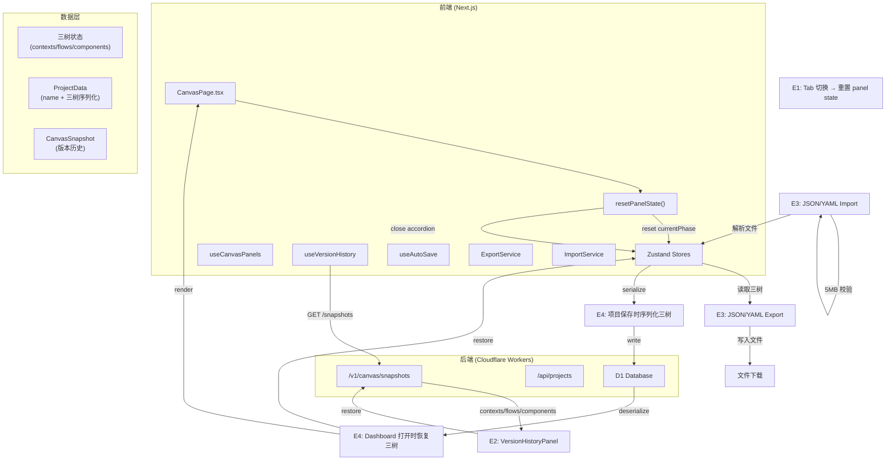
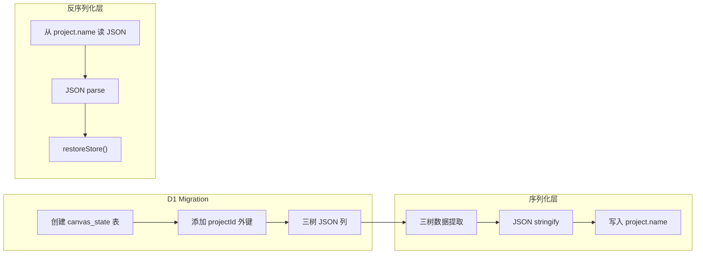

# VibeX Sprint 2 技术架构设计

**项目**: vibex-sprint2
**日期**: 2026-04-16
**作者**: Architect

---

## 执行决策

- **决策**: 待评审
- **执行项目**: 无
- **执行日期**: 待定

---

## 1. Tech Stack

### 1.1 技术选型总览

| Epic | 技术选型 | 理由 |
|------|----------|------|
| **E1** | React useEffect + Zustand selective reset | Tab 切换重置逻辑集中于 CanvasPage，避免改动 canvasStore 核心；依赖现有 `useCanvasPanels.resetPanelState()` |
| **E2** | 前端集成现有 Hono API + 自研 Diff UI | Snapshot API 后端已实现（`/v1/canvas/snapshots`），前端只需消费；Diff 使用 `json-diff` 库做结构化比较 |
| **E3** | 纯前端序列化（JSZip + yaml 库） | 项目数据全在 Zustand 三树状态中，前端直接序列化；无需后端改动；5MB 限制在写入前校验 |
| **E4** | Cloudflare D1 Migration + 前端序列化 | Canvas 创建时写入 D1，三树数据随 Project 表一并存储；Migration 先本地验证再合入 |

### 1.2 技术栈详情

- **Frontend**: Next.js 14 (App Router), TypeScript, React 18, Zustand 4
- **Backend**: Hono (Cloudflare Workers), D1 (SQLite), TypeScript
- **Export**: JSZip 3.x, yaml (js-yaml)
- **Diff**: json-diff 或手写递归比较
- **Testing**: Vitest (单元), Playwright (E2E)
- **CI**: 已有 bundlesize 基线（E6 CI 门控继承）

---

## 2. Architecture Diagram

### 2.1 系统数据流图



### 2.2 E4 模块依赖图



---

## 3. API Definitions

### 3.1 E2: 版本历史 API（前端消费，后端已实现）

```typescript
// GET /v1/canvas/snapshots?projectId=xxx
interface SnapshotListResponse {
  snapshots: Array<{
    snapshotId: string;
    projectId: string;
    label: string;
    trigger: 'manual' | 'auto' | 'ai_complete';
    createdAt: string;         // ISO 8601
    version: number;
    contextCount: number;
    flowCount: number;
    componentCount: number;
    isAutoSave: boolean;
  }>;
  total: number;
  limit: number;
  offset: number;
}

// GET /v1/canvas/snapshots/:id
interface SnapshotDetailResponse {
  success: true;
  snapshot: {
    snapshotId: string;
    projectId: string;
    label: string;
    trigger: 'manual' | 'auto' | 'ai_complete';
    createdAt: string;
    version: number;
    contextCount: number;
    contextNodes: unknown[];    // 完整数据
    flowNodes: unknown[];      // 完整数据
    componentNodes: unknown[];
  };
}

// POST /v1/canvas/snapshots/:id/restore
interface RestoreSnapshotResponse {
  success: true;
  contextNodes: BoundedContextNode[];
  flowNodes: BusinessFlowNode[];
  componentNodes: ComponentNode[];
}
```

### 3.2 E3: 导入导出 API（纯前端）

```typescript
// 导出格式
interface ProjectExport {
  version: '1.0.0';
  exportedAt: string;        // ISO 8601
  projectName: string;
  projectId?: string;
  data: {
    contexts: BoundedContextNode[];
    flows: BusinessFlowNode[];
    components: ComponentNode[];
  };
  metadata: {
    appVersion: string;
    format: 'json' | 'yaml';
    nodeCount: {
      contexts: number;
      flows: number;
      components: number;
    };
  };
}

// 导出服务签名
interface ExportService {
  exportAsJSON(projectName: string): Promise<Blob>;
  exportAsYAML(projectName: string): Promise<Blob>;
  validateFileSize(file: File): boolean;  // 5MB limit
  validateFormat(content: string): boolean;
}

// 导入服务签名
interface ImportService {
  parseJSON(content: string): ProjectExport;
  parseYAML(content: string): ProjectExport;
  roundTripTest(project: ProjectExport): boolean;  // serialize → deserialize = original
}
```

### 3.3 E4: 三树持久化（前端写入，后端读取）

```typescript
// Project API（已有）
interface ProjectResponse {
  id: string;
  name: string;            // 包含序列化三树数据的 JSON 字符串
  createdAt: string;
  updatedAt: string;
}

// E4 序列化格式（存入 project.name 字段）
interface ThreeTreesPayload {
  version: 1;
  contextNodes: BoundedContextNode[];
  flowNodes: BusinessFlowNode[];
  componentNodes: ComponentNode[];
  savedAt: string;          // ISO 8601
}

// D1 存储结构（通过 Migration 创建）
interface CanvasStateRow {
  id: string;
  projectId: string;        // FK → Project.id
  contextNodes: string;     // JSON
  flowNodes: string;       // JSON
  componentNodes: string;   // JSON
  savedAt: string;
}
```

---

## 4. Data Model

### 4.1 核心实体关系（ER 图）

```mermaid
erDiagram
    Project {
        string id PK
        string name          -- 包含序列化三树数据（E4 Payload）或纯名称
        datetime createdAt
        datetime updatedAt
        string userId
    }

    CanvasSnapshot {
        string id PK
        string projectId FK
        int version
        string name
        string description
        string data          -- JSON: {contexts, flows, components, _trigger, _label}
        datetime createdAt
        bool isAutoSave
    }

    CanvasState {
        string id PK
        string projectId FK  -- 与 Project 一对一（E4 新增）
        string contextNodes   -- JSON 数组
        string flowNodes      -- JSON 数组
        string componentNodes -- JSON 数组
        datetime savedAt
    }

    Project ||--o{ CanvasSnapshot : "has"
    Project ||--|| CanvasState : "stores"
```

### 4.2 三树节点数据结构

```typescript
// 限界上下文节点
interface BoundedContextNode {
  nodeId: string;
  name: string;
  description: string;
  type: 'core' | 'supporting' | 'generic';
  status: 'pending' | 'confirmed' | 'rejected';
  isActive: boolean;
  children: BoundedContextNode[];
}

// 业务流程节点
interface BusinessFlowNode {
  nodeId: string;
  name: string;
  contextId: string;        // 关联 BoundedContext
  steps: FlowStep[];
  status: 'pending' | 'confirmed';
}

// 组件节点
interface ComponentNode {
  nodeId: string;
  name: string;
  flowId: string;          // 关联 BusinessFlow
  type: 'page' | 'component' | 'api';
  props: Record<string, unknown>;
  api: { method: string; path: string; params: unknown[] };
}
```

---

## 5. Testing Strategy

### 5.1 测试框架

- **单元测试**: Vitest（Zustand store、序列化/反序列化、Diff 逻辑）
- **集成测试**: Playwright（Tab 切换、导入导出 round-trip、Dashboard 打开恢复）
- **覆盖率要求**: 核心逻辑 > 80%（Diff 算法、三树序列化/反序列化、Tab 重置逻辑）

### 5.2 核心测试用例

#### E1: Tab State 修复

```typescript
describe('CanvasPage Tab State Reset', () => {
  it('should reset currentPhase to context when switching tabs', async () => {
    // Arrange: 设置 phase 为 flow
    // Act: 点击 context tab
    // Assert: phase === 'context'
  });

  it('should close Prototype accordion when leaving prototype tab', async () => {
    // Arrange: queuePanelExpanded = true, phase = 'prototype'
    // Act: 点击 context tab
    // Assert: queuePanelExpanded === false
  });

  it('should reset all panel states on tab switch', async () => {
    // Arrange: 多个面板状态为非默认值
    // Act: setActiveTab('flow')
    // Assert: resetPanelState() 被调用，phase → flow
  });
});
```

#### E2: 版本历史集成

```typescript
describe('VersionHistory Integration', () => {
  it('should fetch snapshot list from API', async () => {
    // Mock GET /v1/canvas/snapshots
    // Assert: snapshots 正确渲染
  });

  it('should render diff between two versions', async () => {
    // Arrange: 两个 snapshot 有不同内容
    // Act: 选择两个版本
    // Assert: diff 面板显示 added/removed/changed
  });

  it('should restore snapshot and update store', async () => {
    // Mock POST /v1/canvas/snapshots/:id/restore
    // Assert: contextNodes/flowNodes/componentNodes 被更新
  });
});
```

#### E3: 导入导出

```typescript
describe('Import/Export', () => {
  it('should export project as JSON', async () => {
    // Arrange: 三树有数据
    // Act: exportAsJSON()
    // Assert: 文件内容包含 version/exportedAt/data
  });

  it('should export project as YAML', async () => {
    // Act: exportAsYAML()
    // Assert: YAML 格式正确，可被 yaml.load() 解析
  });

  it('should pass round-trip: serialize → deserialize = original', () => {
    const original: ProjectExport = { /* ... */ };
    const jsonStr = JSON.stringify(original);
    const parsed = JSON.parse(jsonStr);
    expect(parsed).toEqual(original);
  });

  it('should reject files larger than 5MB', () => {
    // Assert: validateFileSize() 对 >5MB 返回 false
  });
});
```

#### E4: 三树持久化

```typescript
describe('Three Trees Persistence', () => {
  it('should serialize three trees to JSON string', () => {
    const payload = serializeThreeTrees(contextNodes, flowNodes, componentNodes);
    expect(payload.version).toBe(1);
    expect(typeof payload.contextNodes).toBe('object');
  });

  it('should deserialize JSON string to store state', () => {
    const jsonStr = '{"version":1,"contextNodes":[]}';
    const state = deserializeThreeTrees(jsonStr);
    expect(state.contextNodes).toEqual([]);
  });

  it('should restore three trees when opening project on Dashboard', async () => {
    // E2E: create project → add nodes → close → reopen → assert nodes present
  });

  it('should handle empty three trees gracefully', () => {
    const payload = serializeThreeTrees([], [], []);
    expect(JSON.stringify(payload)).toBeTruthy();
  });
});
```

### 5.3 覆盖率目标

| Epic | 关键路径 | 覆盖率目标 |
|------|----------|------------|
| E1 | Tab 切换 → resetPanelState → phase 重置 | > 90% |
| E2 | snapshot list → render → restore | > 85% |
| E3 | JSON export, YAML export, round-trip, 5MB limit | > 90% |
| E4 | serialize, deserialize, D1 write, D1 read | > 85% |

---

## 执行决策

- **决策**: 待评审
- **执行项目**: 无
- **执行日期**: 待定