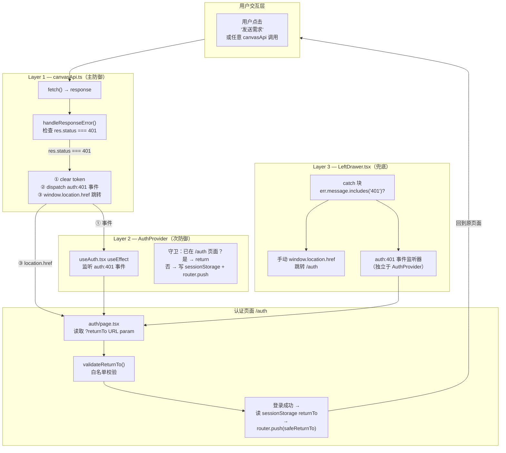
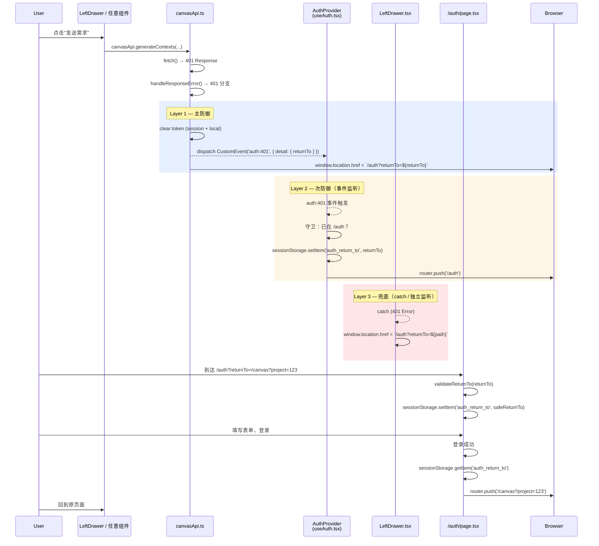

# VibeX 401 自动重定向 — 架构设计文档

**项目**: vibex-auth-401-redirect
**阶段**: design-architecture
**Architect**: Architect
**日期**: 2026-04-13
**基于**: PRD (`prd.md`) + 分析报告 (`analysis.md`)
**推荐方案**: 方案 A — 三层联动防御

---

## 1. Tech Stack

| 技术 | 版本 | 选型理由 |
|------|------|---------|
| Next.js | 16.2.0 | 现有框架，App Router，`window.location.href` 跳转在服务端可安全兜底 |
| React | 19 | 现有版本，支持 `useEffect` 清理函数 |
| TypeScript | strict | 现有配置，`CustomEvent<{ returnTo: string }>` 泛型保证类型安全 |
| Vitest | latest | 现有测试框架，单元测试 `validateReturnTo` 纯函数 |
| Playwright | latest | 现有 E2E 框架，`page.goto` + `expect(page).toHaveURL` 覆盖 AC 全场景 |

**无新增依赖**。所有能力通过 `window.dispatchEvent` / `window.location.href` / React `useEffect` 实现。

---

## 2. 架构图（Mermaid）

### 2.1 三层防御架构



### 2.2 401 触发完整数据流



---

## 3. 模块划分

| 模块 | 文件 | 职责 | 改动类型 |
|------|------|------|---------|
| Layer 1 主防御 | `src/lib/canvas/api/canvasApi.ts` | 401 时事件分发 + 双重跳转 | 修改 `handleResponseError` |
| Layer 1 校验 | `src/lib/canvas/api/canvasApi.ts` | `validateReturnTo()` 白名单校验 | 新增辅助函数（也可放在 `useAuth.tsx` 共享） |
| Layer 2 挂载 | `src/app/layout.tsx` | `<AuthProvider>` 挂载 | 包裹 `<ToastProvider>` |
| Layer 3 兜底 | `src/components/canvas/leftDrawer/LeftDrawer.tsx` | catch 401 跳转 + 独立事件监听 | 新增 `useEffect` + catch 分支 |
| 登录跳转 | `src/app/auth/page.tsx` | returnTo 读 + validate + 登录后跳转 | 已有实现，需验证 `validateReturnTo` 对齐 |

**注意**: `useAuth.tsx` 中的 `auth:401` 监听器（行 60-77）**无需修改**，只需 AuthProvider 挂载后自动生效。

---

## 4. 接口定义

### 4.1 `auth:401` CustomEvent 类型

```typescript
// src/types/auth-401.d.ts
declare global {
  interface WindowEventMap {
    'auth:401': CustomEvent<{ returnTo: string }>;
  }
}

export {};
```

**事件签名**:
- Event name: `'auth:401'`
- Payload: `{ returnTo: string }` — 当前页面路径 + 查询参数（不含 origin）
- 触发时机: canvasApi.ts 401 分支

### 4.2 `validateReturnTo` 函数签名

```typescript
// 位于 src/lib/auth/validateReturnTo.ts（共享模块）
// 也可直接内联到 canvasApi.ts 和 auth/page.tsx
export function validateReturnTo(returnTo: string | null | undefined): string {
  const DEFAULT = '/canvas';

  if (!returnTo) return DEFAULT;
  if (typeof returnTo !== 'string') return DEFAULT;
  if (!returnTo.trim()) return DEFAULT;

  // 白名单：以 / 开头且非协议相对 URL
  if (!returnTo.startsWith('/') || returnTo.startsWith('//')) {
    return DEFAULT;
  }

  // 拦截危险协议
  if (/^(https?|javascript:|data:)/i.test(returnTo)) {
    return DEFAULT;
  }

  // 拦截路径穿越
  if (returnTo.includes('/../') || returnTo.endsWith('/..')) {
    return DEFAULT;
  }

  // 处理双重编码（decode 后再验一次）
  try {
    const decoded = decodeURIComponent(returnTo);
    if (decoded !== returnTo) {
      if (!decoded.startsWith('/') || decoded.startsWith('//')) return DEFAULT;
      if (/^(https?|javascript:|data:)/i.test(decoded)) return DEFAULT;
      if (decoded.includes('/../') || decoded.endsWith('/..')) return DEFAULT;
    }
  } catch {
    return DEFAULT;
  }

  return returnTo;
}
```

### 4.3 `canvasApi.ts` handleResponseError 变更后签名

```typescript
// 位于 src/lib/canvas/api/canvasApi.ts
function handleResponseError(res: Response, defaultMsg: string): never {
  if (res.status === 401) {
    if (typeof window !== 'undefined') {
      sessionStorage.removeItem('auth_token');
      localStorage.removeItem('auth_token');
      const returnTo = window.location.pathname + window.location.search;
      window.dispatchEvent(
        new CustomEvent('auth:401', { detail: { returnTo } })
      );
      window.location.href = `/auth?returnTo=${encodeURIComponent(returnTo)}`;
    }
    throw new Error('登录已过期，请重新登录'); // 不执行，阻止 TS never 警告
  }
  // ... 其他分支不变
}
```

### 4.4 `auth/page.tsx` 登录成功跳转签名

```typescript
// 位于 src/app/auth/page.tsx
// validateReturnTo 已在行 10-26 定义（已有实现）
// handleSubmit 已在行 42+ 实现登录后读 returnTo
// 需验证现有 validateReturnTo 与本架构定义的 validateReturnTo 对齐
```

---

## 5. 数据流

### 5.1 401 触发路径

```
用户点击"发送需求"
  → canvasApi.generateContexts()
    → fetch() → HTTP 401 Response
      → handleResponseError(res, ...)
        → Layer 1: clear token (session + local)
        → Layer 1: dispatch('auth:401', { returnTo: '/canvas?project=123' })
        → Layer 1: location.href = '/auth?returnTo=%2Fcanvas%3Fproject%3D123'
        → Layer 2: useAuth useEffect 触发（如果 AuthProvider 已挂载）
        → Layer 2: sessionStorage.setItem('auth_return_to', ...)
        → Layer 2: router.push('/auth')
        → Layer 3: LeftDrawer catch 触发（兜底）
        → Layer 3: location.href = '/auth?returnTo=%2Fcanvas'
```

### 5.2 returnTo 参数生命周期

```
Step 1: canvasApi 401 分支
  returnTo = window.location.pathname + window.location.search
  → /auth?returnTo=<encoded>

Step 2: /auth/page.tsx useEffect
  returnToParam = searchParams.get('returnTo')
  safe = validateReturnTo(returnToParam)
  → sessionStorage.setItem('auth_return_to', safe)

Step 3: 登录成功后 handleSubmit
  returnTo = sessionStorage.getItem('auth_return_to')
  safeReturnTo = validateReturnTo(returnTo)  // 二次校验
  → sessionStorage.removeItem('auth_return_to')
  → router.push(safeReturnTo)
```

---

## 6. 测试策略

### 6.1 测试金字塔

```
         ▲ E2E (Playwright)
        ▲▲▲  场景: AC-1~AC-7 全链路
       ▲▲▲▲▲▲ Integration (Vitest + MSW)
      ▲▲▲▲▲▲▲▲▲  组件: AuthProvider, useAuth, LeftDrawer
     ▲▲▲▲▲▲▲▲▲▲▲▲▲  Unit (Vitest)
    ▲▲▲▲▲▲▲▲▲▲▲▲▲▲▲  纯函数: validateReturnTo
```

### 6.2 单元测试（Vitest）

**文件**: `src/lib/auth/__tests__/validateReturnTo.test.ts`

```typescript
import { describe, it, expect } from 'vitest';
import { validateReturnTo } from '../validateReturnTo';

describe('validateReturnTo', () => {
  // AC-7: 开放重定向防护
  it('AC-7: 拒绝协议相对 URL //evil.com', () => {
    expect(validateReturnTo('//evil.com')).toBe('/canvas');
  });
  it('AC-7: 拒绝 https:// 绝对 URL', () => {
    expect(validateReturnTo('https://evil.com')).toBe('/canvas');
  });
  it('AC-7: 拒绝 javascript: 协议', () => {
    expect(validateReturnTo('javascript:alert(1)')).toBe('/canvas');
  });
  it('AC-7: 拒绝路径穿越 /canvas/../..', () => {
    expect(validateReturnTo('/canvas/../..')).toBe('/canvas');
  });
  it('AC-7: 拒绝路径穿越 /canvas/../auth', () => {
    expect(validateReturnTo('/canvas/../auth')).toBe('/canvas');
  });

  // 合法路径
  it('AC-2: 接受 /canvas', () => {
    expect(validateReturnTo('/canvas')).toBe('/canvas');
  });
  it('AC-2: 接受含查询参数的路径', () => {
    expect(validateReturnTo('/canvas?project=123')).toBe('/canvas?project=123');
  });
  it('AC-2: 接受含 hash 的路径', () => {
    expect(validateReturnTo('/canvas#section')).toBe('/canvas#section');
  });

  // 边界情况
  it('null/undefined/空字符串 → /canvas', () => {
    expect(validateReturnTo(null)).toBe('/canvas');
    expect(validateReturnTo(undefined)).toBe('/canvas');
    expect(validateReturnTo('')).toBe('/canvas');
    expect(validateReturnTo('   ')).toBe('/canvas');
  });

  it('双重编码路径通过校验', () => {
    const encoded = encodeURIComponent('/canvas?a=1&b=2');
    expect(validateReturnTo(encoded)).toBe(encoded);
  });
});
```

**文件**: `src/lib/canvas/api/__tests__/canvasApi-401.test.ts`

```typescript
import { describe, it, expect, vi, beforeEach } from 'vitest';
import { handleResponseError } from '../canvasApi';

describe('canvasApi handleResponseError — 401 分支', () => {
  beforeEach(() => {
    vi.stubGlobal('sessionStorage', { removeItem: vi.fn() });
    vi.stubGlobal('localStorage', { removeItem: vi.fn() });
    vi.stubGlobal('window', {
      ...window,
      dispatchEvent: vi.fn(),
      location: { href: '' },
    });
  });

  it('401 时清除 sessionStorage 和 localStorage token', () => {
    const mockResponse = new Response('', { status: 401 });
    try {
      handleResponseError(mockResponse, 'default');
    } catch {}
    expect(sessionStorage.removeItem).toHaveBeenCalledWith('auth_token');
    expect(localStorage.removeItem).toHaveBeenCalledWith('auth_token');
  });

  it('401 时 dispatch auth:401 事件', () => {
    const mockResponse = new Response('', { status: 401 });
    const dispatchSpy = vi.spyOn(window, 'dispatchEvent');
    try {
      handleResponseError(mockResponse, 'default');
    } catch {}
    expect(dispatchSpy).toHaveBeenCalledWith(
      expect.objectContaining({ type: 'auth:401' })
    );
  });

  it('401 时设置 location.href', () => {
    const mockResponse = new Response('', { status: 401 });
    try {
      handleResponseError(mockResponse, 'default');
    } catch {}
    expect(window.location.href).toMatch(/^\/auth\?returnTo=/);
  });
});
```

### 6.3 E2E 测试（Playwright）

**文件**: `e2e/auth-redirect.spec.ts`

```typescript
import { test, expect, Page } from '@playwright/test';

const clearTokens = (page: Page) =>
  page.evaluate(() => {
    localStorage.removeItem('auth_token');
    sessionStorage.removeItem('auth_token');
    sessionStorage.removeItem('auth_return_to');
  });

test.describe('AC-1~AC-7: 401 自动重定向 + returnTo 完整流程', () => {

  test('AC-1: 未登录点击发送需求 → 自动跳转 /auth?returnTo=/canvas', async ({ page }) => {
    await page.goto('/canvas');
    clearTokens(page);
    await page.goto('/canvas'); // 重新加载页面以清除内存状态
    await page.click('button:has-text("发送需求")');
    await expect(page).toHaveURL(/\/auth\?returnTo=\/canvas/);
  });

  test('AC-2: returnTo 含查询参数 → 登录后回正确页面', async ({ page }) => {
    await page.goto('/canvas?project=123');
    clearTokens(page);
    await page.goto('/canvas?project=123');
    await page.click('button:has-text("发送需求")');
    await page.waitForURL(/\/auth\?returnTo=.*canvas%3Fproject%3D123/);
    // Mock 登录（实际项目需要真实 API 或 MSW）
    await page.fill('[name="email"]', 'test@example.com');
    await page.fill('[name="password"]', 'password123');
    await page.click('[type="submit"]');
    await expect(page).toHaveURL(/\/canvas\?project=123/);
  });

  test('AC-4: 登录成功后返回原页面（/canvas）', async ({ page }) => {
    await page.goto('/canvas');
    clearTokens(page);
    await page.goto('/canvas');
    await page.click('button:has-text("发送需求")');
    await page.waitForURL(/\/auth/);
    await page.fill('[name="email"]', 'test@example.com');
    await page.fill('[name="password"]', 'password123');
    await page.click('[type="submit"]');
    await expect(page).toHaveURL('/canvas');
  });

  test('AC-5: logout 不触发 redirect', async ({ page }) => {
    // 先登录（设置 token）
    await page.goto('/canvas');
    await page.evaluate(() => {
      localStorage.setItem('auth_token', 'mock-token');
    });
    // 触发 logout（点击登出按钮）
    await page.click('button:has-text("登出")');
    // 不应跳转到 /auth
    await expect(page).not.toHaveURL(/\/auth/);
  });

  test('AC-6: version history 401 跳转', async ({ page }) => {
    await page.goto('/canvas');
    clearTokens(page);
    await page.goto('/canvas');
    await page.click('button:has-text("历史版本")');
    await expect(page).toHaveURL(/\/auth/);
  });

  test('AC-7: returnTo 为外部域名 → fallback /auth', async ({ page }) => {
    // 直接访问带恶意 returnTo 的 auth 页面
    await page.goto('/auth?returnTo=//evil.com');
    const returnToInStorage = await page.evaluate(() =>
      sessionStorage.getItem('auth_return_to')
    );
    // 应 fallback 到 /canvas，而非 //evil.com
    expect(returnToInStorage).toBe('/canvas');
  });
});
```

**E2E 运行命令**:
```bash
cd vibex-fronted
npx playwright test e2e/auth-redirect.spec.ts --project=chromium
```

### 6.4 覆盖率要求

| 层级 | 覆盖率目标 |
|------|-----------|
| `validateReturnTo` 纯函数 | 100% |
| `handleResponseError` 401 分支 | 100% |
| `auth/page.tsx` returnTo 逻辑 | 覆盖正常路径 + 恶意路径 |
| E2E 全链路 | AC-1~AC-7 × 2（正常 + 边界） |

---

## 7. 风险评估

### 7.1 风险矩阵

| ID | 风险 | 可能性 | 影响 | 缓解方案 |
|----|------|--------|------|---------|
| R1 | logout 误触发 401 跳转 | 低 | 中 | `auth:401` 监听器已有 `pathname === '/auth'` 守卫；logout 流程已在 `authStore` 中设置 `auth_is_logout` 标记（已有） |
| R2 | 三层同时跳转导致重复页面访问 | 中 | 低 | Layer 1 `location.href` 同步跳转，Layer 2 `router.push` 异步；在 `/auth` 页面时 Layer 2 守卫会 return |
| R3 | `AuthProvider` 引入破坏现有 auth 状态管理 | 低 | 高 | 先在 staging 测试；现有 auth 逻辑主要在 `stores`（zustand）而非 context，AuthProvider 仅挂载 `useAuth`，不改变 store |
| R4 | `validateReturnTo` 遗漏边缘情况 | 低 | 高 | 双重解码校验 + 覆盖协议/路径穿越/空白/非字符串全部场景 |
| R5 | returnTo 过长导致 URL 超限 | 低 | 低 | URLSearchParams 有浏览器限制，通常不是问题 |
| R6 | SSR 场景（`typeof window === 'undefined'`） | 低 | 低 | 所有 401 分支已有 `typeof window !== 'undefined'` 守卫 |

### 7.2 logout 与 401 隔离策略

```
logout 流程（已有）:
  authStore.logout() → clear token + clear cookies + 设置标记
  → 停留在当前页或跳转首页

401 流程（本次修复）:
  handleResponseError → clear token → dispatch auth:401 → location.href
  → AuthProvider 监听器 → router.push('/auth')

隔离机制:
  AuthProvider 监听器已有 pathname === '/auth' 守卫
  logout 跳转首页不会触发 401 流程
  401 跳转时 logout 标记已清除（因为 logout 本身已清理 token）
```

---

## 8. 关键文件索引（最终版）

| 文件 | 位置 | 改动 | 优先级 |
|------|------|------|--------|
| `canvasApi.ts` | `src/lib/canvas/api/canvasApi.ts` | `handleResponseError` 401 分支增加事件分发 + location.href | P0 |
| `layout.tsx` | `src/app/layout.tsx` | 包裹 `<AuthProvider>` | P0 |
| `LeftDrawer.tsx` | `src/components/canvas/leftDrawer/LeftDrawer.tsx` | catch 兜底 + 独立事件监听 | P1 |
| `auth/page.tsx` | `src/app/auth/page.tsx` | 验证 `validateReturnTo` 对齐 | P1 |
| `useAuth.tsx` | `src/hooks/useAuth.tsx` | 无需改动（已有 auth:401 监听器） | — |
| `validateReturnTo` | `src/lib/auth/validateReturnTo.ts` | 新增共享模块（或内联到调用处） | P0 |

---

## 执行决策

- **决策**: 已采纳
- **执行项目**: team-tasks vibex-auth-401-redirect / tab-bar-unified
- **执行日期**: 2026-04-13
- **推荐 Epic 顺序**: S1.1 → S1.2 → S2.1 → S3.1 → S3.2 → S3.3（Epic 内部 S1 → S2 → S3，但 S2.1 可以在 S1.2 后并行）
