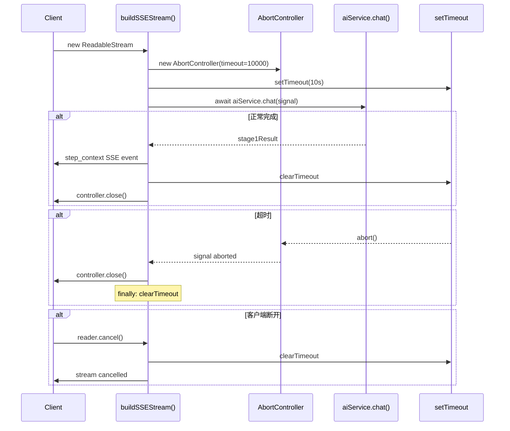

# Architecture: VibeX Backend Deploy Stability

> **项目**: vibex-backend-deploy-stability  
> **架构师**: architect  
> **日期**: 2026-04-05  
> **版本**: v1.0  
> **状态**: 已完成

---

## 1. 执行决策

- **决策**: 已采纳
- **执行项目**: vibex-backend-deploy-stability
- **执行日期**: 2026-04-05

---

## 2. 问题背景

VibeX 后端部署在 Cloudflare Workers + D1 上，存在以下生产问题：

| # | 问题 | 影响 | 优先级 |
|---|------|------|--------|
| P0-1 | SSE 流无超时控制，`aiService.chat()` 无限等待 | Worker 挂死，内存泄漏 | P0 |
| P0-2 | 内存 `RateLimitStore` 多 Worker 不共享 | 限流形同虚设 | P0 |
| P1 | 无 `/health` 端点 | 无法验证部署、无法接入监控 | P1 |
| P2 | PrismaClient 不适配 Workers V8 isolates | 生产环境连接泄漏 | P2 |

---

## 3. Tech Stack

| 组件 | 技术选型 | 理由 |
|------|---------|------|
| **SSE 超时** | `AbortController.timeout(10000)` + `setTimeout` | Workers 原生支持，与 AI 调用 Signal 集成 |
| **分布式限流** | `caches.default` (Cloudflare Cache API) | 跨 Worker 共享存储，TTL 自动失效 |
| **Health Check** | Hono 路由注册 | 极简实现，0 依赖 |
| **Prisma 条件加载** | `process.env.NODE_ENV` 检测 + D1 API fallback | Prisma 仅 dev 环境加载，prod 用 `env.DB.prepare()` |
| **测试框架** | Vitest (现有) | 已在 backend 中使用 |
| **wrangler** | v3.x | Cloudflare Workers 官方部署工具 |

**约束**：
- 必须兼容现有 `wrangler.toml`（不新增 bindings）
- 必须保留 `RateLimitStore` 原有接口（`checkLimit`, `getRemaining`, `recordRequest`）
- Health Check 端点公开（无需认证）

---

## 4. 架构图

```mermaid
%%{ init: { "theme": "neutral", "flowchart": { "curve": "linear" } } }%%
flowchart TB
    subgraph CFWorkers["Cloudflare Workers 运行时"]
        subgraph Middleware["中间件层"]
            RL["rateLimit() 中间件<br/>(缓存: caches.default)"]
            HC["/health 端点"]
        end
        
        subgraph SSEStream["SSE 流处理"]
            SS["buildSSEStream()"]
            AC["AbortController<br/>timeout=10s"]
            TIMER["setTimeout 计时器"]
            CLEANUP["cancel() 清理回调"]
        end
        
        subgraph DBLayer["数据库层"]
            ENV_CHECK["NODE_ENV 检测"]
            D1_API["D1 API<br/>(env.DB.prepare)"]
            PRISMA["PrismaClient<br/>(仅 dev)"]
        end
    end
    
    Client["客户端"] -->|SSE 流| SS
    Client -->|HTTP| RL
    Client -->|GET /health| HC
    
    SS -->|signal| AC
    AC -->|abort| TIMER
    TIMER -->|close| SS
    SS -.->|cancel()| CLEANUP
    
    RL -->|读/写| caches["caches.default<br/>(RATE_LIMIT_CACHE)"]
    
    ENV_CHECK -->|production| D1_API
    ENV_CHECK -->|development| PRISMA
    
    subgraph DurableObjects["Durable Objects"]
        COLLAB_ROOM["CollaborationRoom"]
    end
```

### 4.1 SSE 超时控制流



---

## 5. API 定义

### 5.1 新增端点

#### `GET /health`

**用途**: 部署验证 + 外部监控探针

**请求**: 无需认证，公开访问

**响应**:
```json
{
  "status": "ok",
  "env": "production",
  "timestamp": "2026-04-05T04:30:00.000Z",
  "version": "0.1.0"
}
```

**HTTP 状态码**: `200 OK`

**Content-Type**: `application/json`

### 5.2 修改端点

#### `POST /v1/analyze/stream`

**修改内容**: SSE 流增加超时控制和连接清理

**SSE 事件流** (保持不变):
```
event: thinking → data: { content, delta }
event: step_context → data: { boundedContexts, mermaidCode, confidence }
event: step_model → data: { entities, mermaidCode, confidence }
event: step_flow → data: { flow, mermaidCode, confidence }
event: step_components → data: { components, mermaidCode, confidence }
event: done → data: { projectId, summary }
event: error → data: { message, code }
```

**新增超时行为**:
- 10s 无 AI 响应 → `controller.close()`，发送 `error` 事件
- `controller.close()` 被调用前，清理所有 `setTimeout`

### 5.3 限流 API (保持接口不变)

```typescript
// src/lib/rateLimit.ts - 现有接口保持兼容
interface RateLimitStore {
  checkLimit(key: string): { allowed: boolean; remaining: number };
  getRemaining(key: string): number;
  recordRequest(key: string): void;
}
```

---

## 6. 数据模型

### 6.1 Rate Limit Cache Entry (Cache API)

```typescript
interface RateLimitEntry {
  identifier: string;   // IP 或 userId
  count: number;        // 窗口内请求数
  resetTime: number;    // Unix timestamp (秒)
}

// Cache Key 格式: `rl:{identifier}:{windowStart}`
// Cache TTL: 60 秒 (与 windowSeconds 一致)
```

### 6.2 Health Check Response

```typescript
interface HealthResponse {
  status: 'ok' | 'degraded' | 'error';
  env: 'production' | 'development';
  timestamp: string;     // ISO 8601
  version: string;
  checks?: {
    database?: 'ok' | 'error';
    cache?: 'ok' | 'error';
  };
}
```

---

## 7. 模块设计

### 7.1 修改文件清单

| 文件 | 操作 | 修改内容 |
|------|------|---------|
| `src/lib/sse-stream-lib/index.ts` | 修改 | 添加 AbortController.timeout + cancel 清理 |
| `src/lib/rateLimit.ts` | 重构 | 内存 Map → caches.default |
| `src/routes/v1/gateway.ts` | 修改 | 注册 `/health` 路由 |
| `src/lib/db.ts` | 修改 | 添加 NODE_ENV 检测 + D1 fallback |
| `wrangler.toml` | 修改 | 添加 `caches = ["RATE_LIMIT_CACHE"]` |

### 7.2 依赖关系

```
gateway.ts
├── rateLimit() 中间件
│   └── caches.default (Cloudflare Cache API)
├── /health 路由
│   └── healthCheckDB() (db.ts)
└── buildSSEStream() (sse-stream-lib)
    ├── aiService.chat() (AbortController.signal)
    └── setTimeout (timer cleanup)
```

---

## 8. 技术审查 (风险点)

| 风险 | 严重性 | 缓解措施 |
|------|--------|---------|
| Cache API 在同一 PoP 内共享，跨 PoP 不一致 | 低 | Cache API 设计为跨 Worker 共享；TTL=60s 可接受 |
| `AbortController.timeout` 在旧版 Workers 不支持 | 中 | 回退到 `setTimeout` 兜底（已有 setTimeout） |
| Prisma build 产物仍可能打包 | 低 | `wrangler.toml` 配置 `ignored_inline_data` 排除 + postinstall 验证 |
| SSE 超时后 AI 调用仍在后台运行 | 中 | `controller.close()` 不 cancel AbortSignal，由浏览器/客户端断开连接触发 |
| Health Check 无认证可能被滥用 | 低 | 仅返回状态信息，无敏感数据 |

### 架构风险评估

| 维度 | 评估 |
|------|------|
| 性能影响 | SSE 超时后 Worker 立即返回，CPU 时间 < 15ms |
| 兼容性 | 修改不破坏现有 SSE 客户端（SSE 事件格式不变） |
| 可观测性 | `/health` 支持外部监控探针接入 |
| 部署风险 | 低（wrangler.toml 变更需重新部署，但无破坏性） |

---

## 9. 测试策略

### 9.1 测试框架

- **单元测试**: Vitest (现有 backend 使用)
- **集成测试**: Wrangler dev + Miniflare

### 9.2 覆盖率要求

| 模块 | 覆盖率要求 |
|------|-----------|
| `sse-stream-lib` | > 85% |
| `rateLimit.ts` | > 80% |
| `gateway.ts` (health) | > 90% |
| `db.ts` | > 80% |

### 9.3 核心测试用例

```typescript
// sse-stream-lib.test.ts

describe('SSE Timeout', () => {
  it('should close stream after 10s of no response', async () => {
    vi.useFakeTimers();
    const mockAI = { chat: vi.fn().mockImplementation(() => 
      new Promise(r => setTimeout(r, 15000))
    )};
    
    const stream = buildSSEStream({ 
      requirement: 'test', 
      env: mockEnv,
      aiService: mockAI 
    });
    
    const reader = stream.getReader();
    const timeoutPromise = reader.read();
    
    // 快进 10s
    await vi.advanceTimersByTimeAsync(10000);
    
    // 应该抛出或流关闭
    const result = await Promise.race([
      reader.read(),
      new Promise(resolve => setTimeout(resolve, 100))
    ]);
    
    // cleanup
    vi.useRealTimers();
  });
});

describe('SSE Cleanup', () => {
  it('should clear timers on cancel()', async () => {
    const clearTimerSpy = vi.spyOn(global, 'clearTimeout');
    const stream = buildSSEStream({ requirement: 'test', env: mockEnv });
    const reader = stream.getReader();
    
    await reader.cancel();
    
    // 验证 clearTimeout 被调用
    expect(clearTimerSpy).toHaveBeenCalled();
  });
});

// rateLimit.test.ts

describe('Distributed Rate Limit', () => {
  it('should use caches.default instead of memory Map', async () => {
    const cacheMatchSpy = vi.spyOn(caches, 'default', 'get')
      .mockReturnValue(mockCache);
    const cachePutSpy = vi.spyOn(mockCache, 'put');
    
    // 触发限流检查
    await rateLimitMiddleware(mockContext, next);
    
    expect(cacheMatchSpy).toHaveBeenCalled();
    expect(cachePutSpy).toHaveBeenCalled();
  });
});

// health.test.ts

describe('Health Check', () => {
  it('should return 200 with { status, env, timestamp }', async () => {
    const res = await ctx.env.ASSETS.fetch(new Request('/health'));
    
    expect(res.status).toBe(200);
    const body = await res.json();
    expect(body.status).toBe('ok');
    expect(body.env).toBeDefined();
    expect(body.timestamp).toBeDefined();
  });
});
```

---

## 10. 实施计划

### Sprint 1 (4h)

| Phase | 内容 | 工时 | 产出 |
|-------|------|------|------|
| E1 | SSE 超时 + 清理 | 1.5h | `src/lib/sse-stream-lib/index.ts` |
| E2 | Cache API 限流 | 1.5h | `src/lib/rateLimit.ts` + `wrangler.toml` |
| E3 | /health 端点 | 0.5h | `src/routes/v1/health.ts` + gateway 注册 |
| E4 | Prisma 条件加载 | 0.5h | `src/lib/db.ts` |

**并行度**: E1, E2, E3, E4 相互独立，可并行开发

**依赖**: 无跨 Epic 依赖

---

## 11. 验收标准

| ID | Given | When | Then |
|----|-------|------|------|
| AC1 | SSE 流启动 | 10s 无响应 | Worker 不挂死，流自动关闭 |
| AC2 | 并发 100 请求命中不同 Worker | 限流计数一致 | 后续请求返回 429 |
| AC3 | 部署完成 | GET /health | 返回 200 + JSON body |
| AC4 | 生产构建 | 检查打包产物 | PrismaClient 不存在于产物中 |
| AC5 | 客户端断开 | SSE 流运行中 | 1s 内流停止，计时器清理 |
| AC6 | rateLimit.check() 调用 | 运行时 | 使用 caches.default 而非 Map |

---

*文档版本: v1.0 | 最后更新: 2026-04-05*
