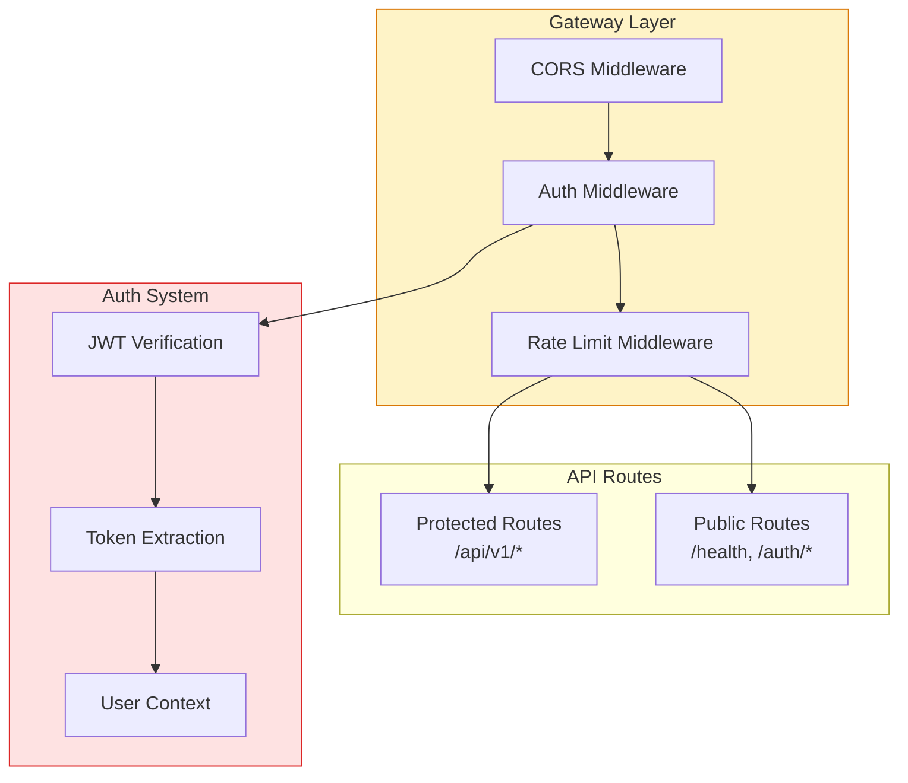
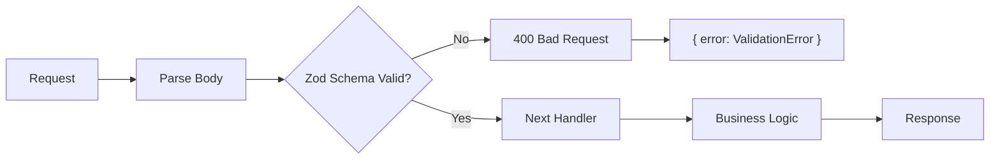
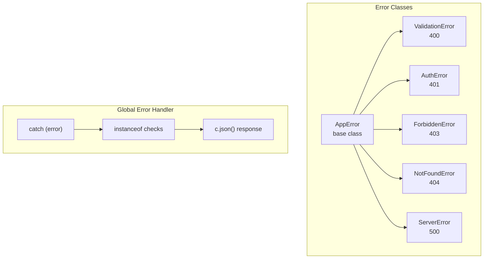

# Architecture: VibeX Backend Fixes 2026-04-10

> **项目**: vibex-backend-fixes-20260410  
> **作者**: Architect  
> **日期**: 2026-04-10  
> **版本**: v1.0

---

## 执行决策

| 决策 | 状态 | 执行项目 | 执行日期 |
|------|------|----------|----------|
| 统一 Auth 中间件 | **已采纳** | vibex-backend-fixes-20260410 | 2026-04-10 |
| 输入校验层 | **已采纳** | vibex-backend-fixes-20260410 | 2026-04-10 |

---

## 1. Tech Stack

| 组件 | 技术选型 | 版本 | 说明 |
|------|----------|------|------|
| **后端框架** | Hono | ^4.0 | Cloudflare Workers |
| **认证** | JWT + middleware | — | 统一认证中间件 |
| **输入校验** | Zod | ^3.23 | 运行时 Schema 校验 |
| **错误处理** | 自定义错误类 | — | AppError 体系 |
| **类型系统** | TypeScript | ^5.5 | 严格模式 |

---

## 2. 架构图

### 2.1 Auth 中间件架构



### 2.2 输入校验流程



### 2.3 错误处理体系



---

## 3. API 定义

### 3.1 认证中间件

```typescript
// lib/middleware/auth.ts
export function withAuth(
  handler: (request: Request, env: Env, ctx: Context, auth: AuthUser) => Promise<Response>
) {
  return async (request: Request, env: Env, ctx: Context): Promise<Response> => {
    const token = extractBearerToken(request.headers.get('Authorization'));
    
    if (!token) {
      return c.json({ error: 'Unauthorized', code: 'MISSING_TOKEN' }, 401);
    }

    try {
      const payload = await verifyJWT(token, env.JWT_SECRET);
      const auth: AuthUser = {
        userId: payload.sub,
        email: payload.email,
        roles: payload.roles ?? [],
      };
      return handler(request, env, ctx, auth);
    } catch (error) {
      if (error instanceof JWTError) {
        return c.json({ error: 'Unauthorized', code: 'INVALID_TOKEN' }, 401);
      }
      throw error;
    }
  };
}

// 豁免路由（无需认证）
const PUBLIC_PATHS = [
  '/health',
  '/auth/login',
  '/auth/register',
  '/auth/refresh',
];

export function isPublicPath(path: string): boolean {
  return PUBLIC_PATHS.some(p => path.startsWith(p));
}
```

### 3.2 输入校验中间件

```typescript
// lib/middleware/validate.ts
export function validateBody<T extends z.ZodSchema>(
  schema: T
) {
  return async (request: Request, env: Env, ctx: Context): Promise<Response> => {
    if (request.method === 'GET' || request.method === 'DELETE') {
      return c.next(); // GET/DELETE 无 body，跳过校验
    }

    try {
      const body = await request.json();
      const result = schema.safeParse(body);
      
      if (!result.success) {
        return c.json({
          error: 'Validation Error',
          code: 'INVALID_REQUEST',
          details: result.error.flatten(),
        }, 400);
      }

      // 将校验后的数据注入到 context
      ctx.set('validatedBody', result.data);
      return c.next();
    } catch (error) {
      if (error instanceof SyntaxError) {
        return c.json({
          error: 'Invalid JSON',
          code: 'MALFORMED_JSON',
        }, 400);
      }
      throw error;
    }
  };
}
```

### 3.3 错误类型定义

```typescript
// lib/errors.ts
export class AppError extends Error {
  constructor(
    public readonly code: string,
    message: string,
    public readonly statusCode: number = 500,
    public readonly details?: unknown
  ) {
    super(message);
    this.name = 'AppError';
  }
}

export class ValidationError extends AppError {
  constructor(message: string, details?: unknown) {
    super('VALIDATION_ERROR', message, 400, details);
    this.name = 'ValidationError';
  }
}

export class AuthError extends AppError {
  constructor(message: string = 'Unauthorized') {
    super('AUTH_ERROR', message, 401);
    this.name = 'AuthError';
  }
}

export class ForbiddenError extends AppError {
  constructor(message: string = 'Forbidden') {
    super('FORBIDDEN', message, 403);
    this.name = 'ForbiddenError';
  }
}

export class NotFoundError extends AppError {
  constructor(resource: string) {
    super('NOT_FOUND', `${resource} not found`, 404);
    this.name = 'NotFoundError';
  }
}
```

### 3.4 需要认证的 API Routes

| Method | Path | 校验 Schema | Auth |
|--------|------|-------------|------|
| POST | `/api/v1/chat` | ChatSchema | ✅ |
| POST | `/api/v1/canvas/generate` | GenerateSchema | ✅ |
| POST | `/api/v1/canvas/generate-contexts` | GenerateContextsSchema | ✅ |
| POST | `/api/v1/canvas/generate-components` | GenerateComponentsSchema | ✅ |
| POST | `/api/v1/canvas/generate-flows` | GenerateFlowsSchema | ✅ |
| POST | `/api/v1/canvas/stream` | StreamSchema | ✅ |
| GET | `/api/v1/canvas/status` | — | ✅ |
| POST | `/api/v1/canvas/export` | ExportSchema | ✅ |
| GET | `/api/v1/canvas/project` | — | ✅ |
| POST | `/api/v1/ai-ui-generation` | AIGenerationSchema | ✅ |
| GET | `/api/v1/domain-model/:projectId` | — | ✅ |
| POST | `/api/v1/prototype-snapshots` | SnapshotSchema | ✅ |
| GET | `/api/v1/agents` | — | ✅ |
| GET | `/api/v1/pages` | — | ✅ |

---

## 4. 数据模型

### 4.1 认证相关

```typescript
interface AuthUser {
  userId: string;
  email: string;
  roles: string[];
}

interface JWTPayload {
  sub: string;      // userId
  email: string;
  roles: string[];
  iat: number;
  exp: number;
}
```

### 4.2 校验 Schema 示例

```typescript
// schemas/canvas.ts
import { z } from 'zod';

export const GenerateComponentsSchema = z.object({
  projectId: z.string().min(1, 'projectId is required'),
  prompt: z.string().min(1, 'prompt is required').max(5000),
  context: z.object({
    existingNodes: z.array(z.object({
      id: z.string(),
      type: z.string(),
    })).optional(),
    domainModel: z.record(z.unknown()).optional(),
  }).optional(),
  options: z.object({
    count: z.number().int().min(1).max(20).optional(),
    style: z.enum(['minimal', 'detailed', 'mobile']).optional(),
  }).optional(),
});

export const ChatSchema = z.object({
  projectId: z.string().min(1),
  message: z.string().min(1).max(10000),
  history: z.array(z.object({
    role: z.enum(['user', 'assistant']),
    content: z.string(),
  })).optional(),
});
```

---

## 5. 测试策略

### 5.1 Auth Middleware 测试

```typescript
// tests/unit/auth.test.ts
describe('Auth Middleware', () => {
  it('should reject request without token', async () => {
    const response = await fetch('/api/v1/chat', {
      method: 'POST',
      body: JSON.stringify({ projectId: '1', message: 'test' }),
    });
    expect(response.status).toBe(401);
  });

  it('should reject request with invalid token', async () => {
    const response = await fetch('/api/v1/chat', {
      method: 'POST',
      headers: { 'Authorization': 'Bearer invalid-token' },
      body: JSON.stringify({ projectId: '1', message: 'test' }),
    });
    expect(response.status).toBe(401);
  });

  it('should allow request with valid token', async () => {
    const token = await createTestToken({ sub: 'user-1', email: 'test@example.com' });
    const response = await fetch('/api/v1/chat', {
      method: 'POST',
      headers: { 'Authorization': `Bearer ${token}` },
      body: JSON.stringify({ projectId: '1', message: 'test' }),
    });
    expect(response.status).toBe(200);
  });
});
```

### 5.2 Validation 测试

```typescript
describe('Validation Middleware', () => {
  it('should reject invalid projectId', async () => {
    const response = await fetch('/api/v1/canvas/generate', {
      method: 'POST',
      headers: { 'Authorization': `Bearer ${token}` },
      body: JSON.stringify({ projectId: '', message: 'test' }),
    });
    expect(response.status).toBe(400);
    const body = await response.json();
    expect(body.code).toBe('VALIDATION_ERROR');
  });

  it('should accept valid input', async () => {
    const response = await fetch('/api/v1/canvas/generate', {
      method: 'POST',
      headers: { 'Authorization': `Bearer ${token}` },
      body: JSON.stringify({ projectId: 'proj-123', message: 'generate button' }),
    });
    expect(response.status).toBe(200);
  });
});
```

---

## 6. 风险评估

| Epic | 风险 | 概率 | 影响 | 缓解 |
|------|------|------|------|------|
| Auth | 破坏现有 API 兼容性 | 中 | 高 | 白名单豁免 + 灰度 |
| Validation | 误判正常请求为无效 | 低 | 中 | 宽松校验 + 错误信息清晰 |
| XSS | Mermaid 渲染 XSS | 高 | 高 | DOMPurify sanitization |

---

## 7. 验收标准

| 检查项 | 命令 | 目标 |
|--------|------|------|
| Auth 中间件覆盖 | `grep -rn "withAuth" vibex-backend/src/app/api/` | >0 结果 |
| 豁免路由测试 | `curl -X GET /health -i` | 200 无 token |
| 受保护路由无 token | `curl -X POST /api/v1/chat` | 401 |
| Zod Schema 校验 | 发送无效 JSON | 400 + VALIDATION_ERROR |
| catch instanceof | `grep -rn "instanceof AppError" vibex-backend/src/` | >0 结果 |

---

*文档版本: v1.0 | 最后更新: 2026-04-10*
