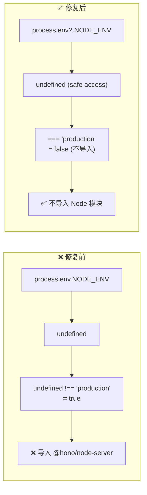

# Architecture: VibeX Backend OPTIONS + CORS Fix

> **项目**: vibex-backend-p0-20260405  
> **架构师**: architect  
> **日期**: 2026-04-05  
> **版本**: v1.0  
> **状态**: 已完成

---

## 1. 执行决策

- **决策**: 已采纳
- **执行项目**: vibex-backend-p0-20260405
- **执行日期**: 2026-04-05

---

## 2. 问题背景

VibeX API 所有 OPTIONS 预检请求返回 HTTP 500（Cloudflare 1101），导致浏览器跨域 POST/PUT/DELETE 请求被拦截。

| # | 问题 | 根因 | 优先级 |
|---|------|------|--------|
| P0-1 | OPTIONS 返回 HTTP 500 | `protected_.options` 在 `authMiddleware` 之后注册 | P0 |
| P1-1 | 全局 CORS 覆盖不完整 | `app.options('/*')` 缺失 | P1 |
| P1-2 | NODE_ENV 检测错误 | `undefined !== 'production'` 为 true | P1 |
| P1-3 | JWT_SECRET 缺失返回 500 INTERNAL_ERROR | code 应为 CONFIG_ERROR | P1 |

---

## 3. Tech Stack

| 组件 | 技术选型 | 理由 |
|------|---------|------|
| **OPTIONS 修复** | Hono middleware 顺序调整 | 零成本，代码调整 |
| **CORS** | `hono/cors` + 显式 `options` 路由 | 兜底 + 明确控制 |
| **环境检测** | `process.env?.NODE_ENV === 'production'` | optional chaining 安全检测 |
| **JWT 错误** | 修改 `code` 字段为 CONFIG_ERROR | 明确错误类型 |
| **测试框架** | Vitest (现有) | 已在 backend 中使用 |

**约束**:
- 不破坏现有 GET/POST/PUT/DELETE 路由逻辑
- 不移除现有认证和限流中间件
- 不引入新的 npm 依赖

---

## 4. 架构图

### 4.1 当前问题链路

```mermaid
%%{ init: { "theme": "neutral" } }%%
flowchart TB
    subgraph Current["❌ 当前请求链路 (有 BUG)"]
        O1["OPTIONS /v1/projects"]
        V1O["v1.options('/*')\n✅ 在 authMiddleware 之前"]
        PM["protected_.use('*', auth)\n❌ 先拦截所有请求"]
        PO["protected_.options('/*')\n❌ 在 authMiddleware 之后"]
        R401["返回 401"]
        R500["HTTP 500\n(Cloudflare 1101)"]
        
        O1 --> V1O
        O1 --> PM
        PM -->|"无 Auth header|401|"
        PM --> PO
        PO -.->|"永远不会执行"| R401
    end
```

### 4.2 修复后请求链路

```mermaid
%%{ init: { "theme": "neutral" } }%%
flowchart TB
    subgraph Fixed["✅ 修复后请求链路"]
        O2["OPTIONS /v1/projects"]
        V1O2["v1.options('/*')\n✅ 设置 CORS headers"]
        PM2["protected_.use('*', auth)\n✅ 认证中间件"]
        PO2["protected_.options('/*')\n✅ 在 authMiddleware 之前注册 → 先匹配"]
        R204["HTTP 204\n+ CORS headers"]
        
        O2 --> V1O2
        O2 --> PO2
        PO2 -->|"匹配到|204|"
        PO2 -.->|"不执行"| PM2
        PM2 -->|"非 OPTIONS|检查 token"| R204
    end
```

### 4.3 NODE_ENV 检测修复



---

## 5. API 定义

### 5.1 OPTIONS 预检响应 (修改)

**请求**:
```http
OPTIONS /v1/projects HTTP/1.1
Origin: https://vibex-app.pages.dev
Access-Control-Request-Method: POST
Access-Control-Request-Headers: Content-Type, Authorization
```

**响应** (修改后):
```http
HTTP/1.1 204 No Content
Access-Control-Allow-Origin: *
Access-Control-Allow-Methods: GET, POST, PUT, DELETE, OPTIONS
Access-Control-Allow-Headers: Content-Type, Authorization
Access-Control-Max-Age: 86400
```

**关键变更**: 响应状态码从 401/500 改为 204

### 5.2 JWT 配置错误响应 (修改)

**请求**:
```http
GET /v1/projects HTTP/1.1
```

**响应** (修改后):
```json
{
  "success": false,
  "error": "JWT_SECRET not configured. Please run: wrangler secret put JWT_SECRET",
  "code": "CONFIG_ERROR"
}
```

**关键变更**: `code` 从 `INTERNAL_ERROR` 改为 `CONFIG_ERROR`

---

## 6. 数据模型

无数据模型变更 — 本次为纯路由/中间件修复。

---

## 7. 模块设计

### 7.1 修改文件清单

| 文件 | 操作 | 修改内容 |
|------|------|---------|
| `src/routes/v1/gateway.ts` | 修改 | `protected_.options` 移到 `authMiddleware` 之前 |
| `src/index.ts` | 修改 | 添加 `app.options('/*')` + 修复 NODE_ENV 检测 |
| `src/lib/auth.ts` | 修改 | JWT_SECRET 缺失时 `code` 改为 `CONFIG_ERROR` |

### 7.2 修改点详细说明

#### gateway.ts (E1 核心修复)

```typescript
// 修复前（错误顺序）
const protected_ = new Hono<{ Bindings: CloudflareEnv }>();
protected_.use('*', authMiddleware);        // ← 第 111 行，先拦截
protected_.options('/*', (c) => { ... });  // ← 第 119 行，永远不执行

// 修复后（正确顺序）
const protected_ = new Hono<{ Bindings: CloudflareEnv }>();
protected_.options('/*', (c) => {           // ← 先匹配 OPTIONS
  c.res.headers.set('Access-Control-Allow-Origin', '*');
  c.res.headers.set('Access-Control-Allow-Methods', 'GET, POST, PUT, DELETE, OPTIONS');
  c.res.headers.set('Access-Control-Allow-Headers', 'Content-Type, Authorization');
  return c.text('', 204);
});
protected_.use('*', authMiddleware);        // ← 然后才是认证
```

#### index.ts (E2 修复)

```typescript
// 修复前（NODE_ENV 检测错误）
if (process.env.NODE_ENV !== 'production') {   // undefined !== 'production' = true → 误导入
  import('@hono/node-server')...
}

// 修复后（安全的 optional chaining）
const isWorkers = typeof globalThis.caches !== 'undefined';  // Cloudflare Workers 有 caches
const isProduction = process.env?.NODE_ENV === 'production';  // 仅当明确设置且为 production 时

if (!isWorkers && !isProduction) {             // 本地 dev 环境才导入
  import('@hono/node-server')...
}

// 显式 OPTIONS handler（E2.1）
app.options('/*', (c) => {
  c.res.headers.set('Access-Control-Allow-Origin', '*');
  c.res.headers.set('Access-Control-Allow-Methods', 'GET, POST, PUT, DELETE, OPTIONS');
  c.res.headers.set('Access-Control-Allow-Headers', 'Content-Type, Authorization');
  return c.text('', 204);
});
```

#### auth.ts (E2.3 修复)

```typescript
// 修复前
if (!jwtSecret) {
  return c.json(
    { success: false, error: 'Server configuration error', code: 'INTERNAL_ERROR' }, 500
  );
}

// 修复后
if (!jwtSecret) {
  console.error('[Auth] JWT_SECRET not configured. Run: wrangler secret put JWT_SECRET');
  return c.json(
    { success: false, error: 'JWT_SECRET not configured. Please run: wrangler secret put JWT_SECRET', code: 'CONFIG_ERROR' }, 500
  );
}
```

### 7.3 依赖关系

```
gateway.ts (E1)
└── protected_ Hono 实例
    ├── options('/*') ← 移到这里
    └── use('*', authMiddleware)

index.ts (E2)
├── app.options('/*') ← 新增
├── app.use('*', cors())
└── NODE_ENV 检测 ← 修复

auth.ts (E2.3)
└── verifyToken() / authMiddleware()
    └── JWT_SECRET 检查 ← 修改 code
```

---

## 8. 技术审查

### 8.1 风险评估

| 风险 | 严重性 | 缓解措施 |
|------|--------|---------|
| 调整 middleware 顺序破坏其他路由 | 低 | 仅移动 `protected_.options`，其他中间件顺序不变 |
| 显式 `app.options('/*')` 与 `cors()` 冲突 | 低 | `cors()` 对 OPTIONS 已返回 204，显式 handler 可覆盖 |
| NODE_ENV 修复后本地无法启动 dev server | 低 | 条件判断 `!isWorkers && !isProduction` 保留 dev 逻辑 |
| JWT_SECRET CONFIG_ERROR 用户可见 | 低 | 仅部署阶段可见，生产正常情况下 JWT_SECRET 已配置 |

### 8.2 兼容性

| 场景 | 修复前 | 修复后 |
|------|--------|--------|
| GET 请求 | ✅ 正常 | ✅ 正常 |
| POST/PUT/DELETE (无 CORS) | ✅ 正常 | ✅ 正常 |
| OPTIONS 预检 | ❌ 返回 500/401 | ✅ 返回 204 + CORS headers |
| 跨域 POST/PUT/DELETE | ❌ 被浏览器拦截 | ✅ 正常 |

---

## 9. 测试策略

### 9.1 测试框架

- **单元测试**: Vitest
- **集成测试**: `wrangler dev` 本地验证

### 9.2 覆盖率要求

| 文件 | 覆盖率要求 |
|------|-----------|
| `gateway.ts` | > 90% |
| `index.ts` | > 80% |
| `auth.ts` | > 90% |

### 9.3 核心测试用例

```typescript
// gateway-cors.test.ts

describe('OPTIONS Preflight Fix', () => {
  it('should return 204 for OPTIONS on protected route without auth', async () => {
    const res = await app.request('/v1/projects', { method: 'OPTIONS' });
    expect(res.status).toBe(204);
  });

  it('should include CORS headers in OPTIONS response', async () => {
    const res = await app.request('/v1/projects', { method: 'OPTIONS' });
    expect(res.headers.get('Access-Control-Allow-Origin')).toBe('*');
    expect(res.headers.get('Access-Control-Allow-Methods')).toContain('POST');
    expect(res.headers.get('Access-Control-Allow-Headers')).toContain('Authorization');
  });

  it('should NOT return 401 for OPTIONS without auth', async () => {
    const res = await app.request('/v1/projects', { method: 'OPTIONS' });
    expect(res.status).not.toBe(401);
  });
});

// index.test.ts

describe('NODE_ENV detection', () => {
  it('should not import @hono/node-server in Workers env', async () => {
    // 模拟 Cloudflare Workers 环境
    const isWorkers = typeof globalThis.caches !== 'undefined';
    expect(isWorkers).toBe(true); // Cloudflare Workers 有 caches 全局
  });
});

// auth.test.ts

describe('JWT_SECRET missing', () => {
  it('should return CONFIG_ERROR code when JWT_SECRET is missing', async () => {
    const res = await app.request('/v1/projects', {
      method: 'GET',
      env: { JWT_SECRET: undefined } as any
    });
    const body = await res.json();
    expect(body.code).toBe('CONFIG_ERROR');
    expect(body.error).toContain('wrangler secret put JWT_SECRET');
    expect(res.status).toBe(500);
  });
});
```

---

## 10. 实施计划

| Phase | 内容 | 工时 | 产出 |
|-------|------|------|------|
| E1 | OPTIONS handler 顺序调整 | 0.5h | `gateway.ts` 修复 |
| E2.1 | 全局 CORS + OPTIONS handler | 0.3h | `index.ts` 添加 options 路由 |
| E2.2 | NODE_ENV 修复 | 0.3h | `index.ts` 条件检测 |
| E2.3 | JWT_SECRET 错误码 | 0.4h | `auth.ts` 修改 |

**并行度**: E2.1/E2.2/E2.3 可并行，E1 独立

---

## 11. 验收标准

| ID | Given | When | Then |
|----|-------|------|------|
| AC1 | OPTIONS 请求 | `curl -X OPTIONS /v1/projects` | 返回 204 |
| AC2 | OPTIONS 响应 | 检查 headers | `Access-Control-Allow-Origin: *` |
| AC3 | OPTIONS 无认证 | 无 Authorization header | 返回 204（非 401）|
| AC4 | POST 跨域预检 | 浏览器发送 OPTIONS | 预检通过 |
| AC5 | 生产构建 | 检查打包产物 | 不含 `@hono/node-server` |
| AC6 | JWT_SECRET 缺失 | 启动 API | 返回 `CONFIG_ERROR` |

---

## 12. 验证命令

```bash
# E1 验证
curl -X OPTIONS 'https://api.vibex.top/v1/projects' \
  -H 'Origin: https://vibex-app.pages.dev' \
  -H 'Access-Control-Request-Method: POST' -v
# 期望: HTTP/1.1 204 No Content

# E2.3 验证
curl 'https://api.vibex.top/v1/projects'
# 期望 (JWT_SECRET 缺失时): {"code": "CONFIG_ERROR", ...}

# E4 验证 (wrangler deploy --dry-run)
wrangler deploy --dry-run --env production
# 期望: 产物不含 @hono/node-server
```

---

*文档版本: v1.0 | 最后更新: 2026-04-05*
