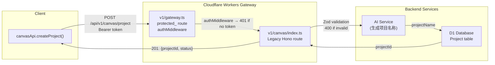
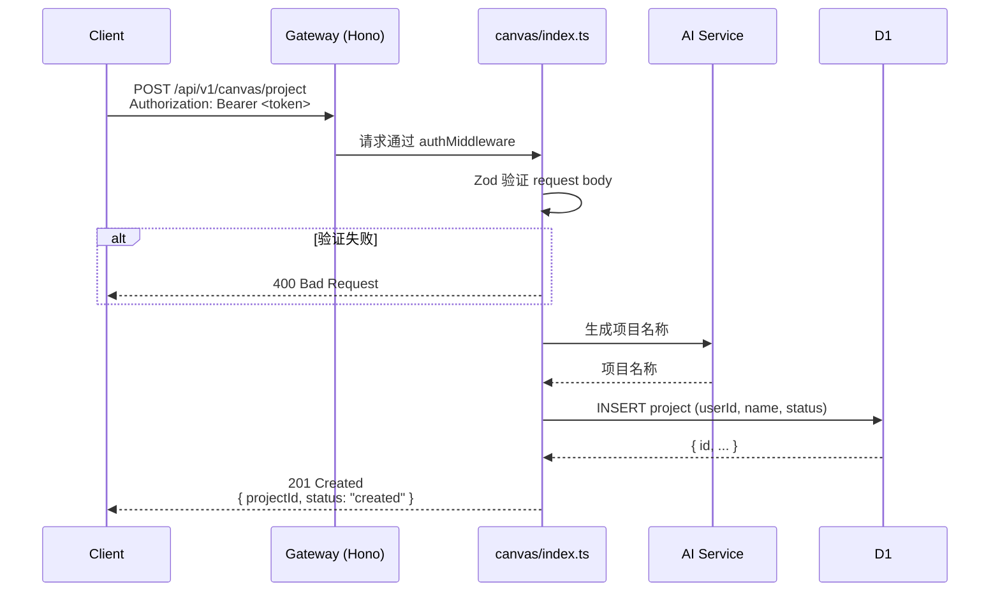

# POST /api/v1/canvas/project 端点修复 — 技术架构

## 1. 问题背景

**问题**：用户点击"创建项目"按钮 → `canvasApi.createProject()` → `POST /api/v1/canvas/project` → **404**

**根因**：
- App Router `src/app/api/v1/canvas/project/route.ts` 从未接入 Cloudflare Workers 网关
- 实际运行的是 Legacy Hono canvas route（`src/routes/v1/canvas/index.ts`）
- Legacy route 缺少 `/project` 端点

**定位**：在 Legacy Hono canvas route 中添加 `POST /project` 端点，回归单一职责原则，不动 App Router。

---

## 2. 技术决策

### D1: 修改范围锁定在 Legacy Hono route

**决策**：只在 `src/routes/v1/canvas/index.ts` 中添加端点，不触碰 App Router `route.ts`。

**理由**：
- App Router route.ts 目前未接入 Workers 网关，动它不能解决问题
- 改动范围最小，风险可控
- 与 PRD 约束一致（明确要求不修改 `route.ts`）

### D2: 复用现有 schema（Project 模型已存在）

**决策**：使用 `prisma/schema.prisma` 中的 `Project` 模型，通过 Hono 的 D1 binding 直接操作。

**理由**：
- `Project` 模型字段完整（id, name, description, userId, status, etc.）
- 不需要新增 schema 迁移
- 与现有 D1 绑定方式保持一致（`c.env.DB`）

### D3: 复用现有验证模式

**决策**：使用 `withValidation` helper + Zod schema 进行请求体验证。

**理由**：
- `generate-contexts` / `generate-flows` / `generate-components` 均已使用此模式
- 统一错误处理风格（400 Bad Request）
- 与 PRD VA-004 一致

### D4: 复用 authMiddleware

**决策**：使用 `c.get('user').userId` 获取当前用户 ID。

**理由**：
- `authMiddleware` 已在 gateway.ts 中对整个 `/canvas` 路由生效
- 无需额外认证逻辑
- 返回 401 与其他端点一致

---

## 3. 架构图





---

## 4. API 定义

### Endpoint

```
POST /api/v1/canvas/project
Authorization: Bearer <JWT>
Content-Type: application/json
```

### Request

```typescript
interface CreateProjectRequest {
  requirementText: string;    // 需求文本，必填
  contexts: unknown[];        // 限界上下文，可选（支持旧版前端传参）
  flows: unknown[];           // 业务流程，可选
  components: unknown[];      // 组件，可选
}
```

### Response

**201 Created**
```json
{
  "projectId": "cuid-xxx",
  "status": "created"
}
```

**400 Bad Request**（验证失败）
```json
{
  "success": false,
  "error": "缺少必填字段 requirementText"
}
```

**401 Unauthorized**（无认证）
```json
{
  "success": false,
  "error": "Authentication required",
  "code": "UNAUTHORIZED"
}
```

---

## 5. 数据模型

**Project 模型**（已存在于 `prisma/schema.prisma`）

```prisma
model Project {
  id          String    @id @default(cuid())
  name        String
  description String?
  userId      String
  status      String    @default("draft")
  isTemplate  Boolean   @default(false)
  isPublic    Boolean   @default(false)
  createdAt   DateTime  @default(now())
  updatedAt   DateTime  @updatedAt
  // ... relations
}
```

**本端点写入字段**：

| 字段 | 来源 | 说明 |
|------|------|------|
| `id` | `cuid()` 自动生成 | 作为 `projectId` 返回 |
| `name` | AI 生成 | 从 `requirementText` 提炼项目名称 |
| `userId` | `c.get('user').userId` | 当前认证用户 |
| `description` | `requirementText` 截取前 200 字符 | 存储需求概要 |
| `status` | 固定 `"draft"` | 新项目初始状态 |

**无 schema 迁移需求**。

---

## 6. 测试策略

### 测试框架
- 单元测试：`Vitest`（Hono handler 测试）
- 类型检查：`pnpm run type-check`

### 覆盖率要求
- 端点 handler：≥ 90% 行覆盖率
- 验证 schema：边界用例全覆盖

### 核心测试用例

| ID | 场景 | 预期 | 测试方式 |
|----|------|------|---------|
| T1 | 正常请求，有认证 | 201 + `{projectId, status:'created'}` | Vitest + D1 mock |
| T2 | 无 Authorization header | 401 Unauthorized | Vitest |
| T3 | 无效 token | 401 Unauthorized | Vitest |
| T4 | body 缺少 `requirementText` | 400 Bad Request | Vitest |
| T5 | AI 服务异常 | 500 Internal Server Error | Vitest + error mock |
| T6 | D1 写入失败 | 500 Internal Server Error | Vitest + DB error mock |

### 回归测试
- 现有端点 `POST /generate-contexts`、`POST /generate-flows`、`POST /generate-components` 均不受影响
- authMiddleware 行为不变

---

## 7. 性能影响评估

| 维度 | 影响 | 说明 |
|------|------|------|
| 冷启动延迟 | +50~200ms | AI 生成项目名称增加一次 LLM 调用 |
| D1 写入 | +5~20ms | 单条 project 插入，量级小 |
| 带宽 | 极小 | 请求体 ~1KB，响应体 ~100B |

**结论**：性能影响极小，属于正常 API 调用范围。

---

## 8. 文件变更

| 文件 | 操作 | 说明 |
|------|------|------|
| `src/routes/v1/canvas/index.ts` | 修改 | 添加 `POST /project` 端点 |
| `src/routes/v1/canvas/__tests__/project.test.ts` | 新增 | 端点单元测试 |

---

## 9. 风险评估

| 风险 | 概率 | 影响 | 缓解 |
|------|------|------|------|
| AI 服务不可用导致 500 | 低 | 中 | 捕获异常，返回 500 + 错误信息 |
| D1 写入失败 | 极低 | 中 | 同上 |
| 破坏现有端点 | 低 | 高 | 严格增量修改，提交前跑全量测试 |
| userId 为空 | 低 | 高 | authMiddleware 已保证 token 有效 |

**回滚方案**：删除新增端点代码即可，无需数据库回滚。

---

## 10. 备选方案分析

| 方案 | 描述 | 结论 |
|------|------|------|
| A：在 Legacy Hono route 添加端点 | 本方案，最小改动 | ✅ 采纳 |
| B：修复 App Router `route.ts` 并接入网关 | 改动网关路由 + App Router，风险高 | 放弃：与 PRD 约束冲突 |
| C：让 App Router route.ts 真正接入网关 | 需要修改 gateway.ts，改变架构 | 放弃：超出 scope |

**方案 A 是唯一符合约束的路径**。

---

## 执行决策

- **决策**：已采纳
- **执行项目**：vibex-canvas-404-post-project
- **执行日期**：2026-04-16
