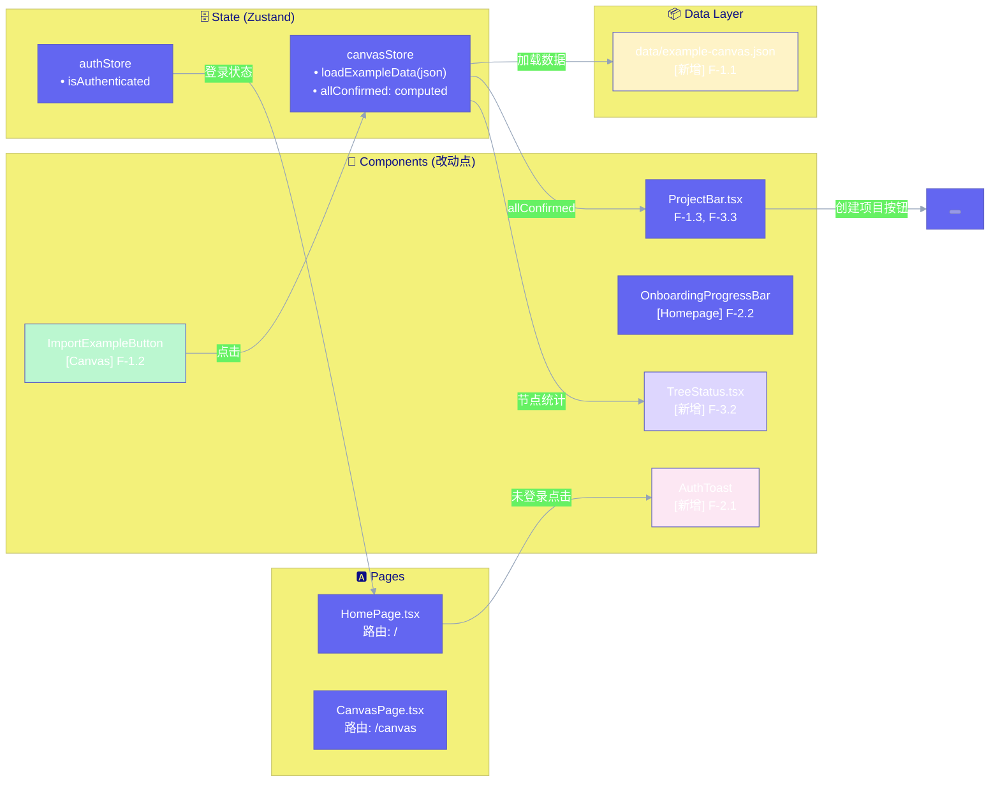

# Architecture: vibex-canvas-analysis

**Project**: VibeX 新画布到创建项目流程优化
**Architect**: Architect Agent
**Date**: 2026-03-27
**Status**: ✅ Complete

---

## 1. Tech Stack

| 组件 | 版本 | 选择理由 |
|------|------|----------|
| TypeScript | 现有 5.x | 保持一致，严格模式 |
| Zustand | 现有~4.x | canvasStore 已用 |
| React | 现有 18.x | 保持一致 |
| Vite | 现有 5.x | 保持一致 |
| Playwright | 现有 | gstack browse 已配置 |
| JSON | 现有 | 示例数据存储（无后端改动）|

**关键约束**: 本次修改**不涉及** AI 生成逻辑、DDD 数据模型变更、游客模式完整实现。

---

## 2. Architecture Diagram



---

## 3. Module Design

### 3.1 ExampleDataLoader (F-1.1)

**文件**: `src/data/example-canvas.json` (新增)

```typescript
// 核心数据结构
interface ExampleCanvasData {
  requirement: string;
  contextNodes: CanvasNode[];
  flowNodes: CanvasNode[];
  componentNodes: CanvasNode[];
}

interface CanvasNode {
  id: string;
  type: 'context' | 'flow' | 'component';
  label: string;
  confirmed: boolean; // 预设 true
  position?: { x: number; y: number };
  data?: Record<string, unknown>;
}
```

### 3.2 CanvasStore Extension (F-1.2)

**文件**: `src/lib/canvas/canvasStore.ts`

```typescript
// 新增 Action
loadExampleData(example: ExampleCanvasData): void

// 扩展现有 slices
interface CanvasStore {
  // 现有...
  contextNodes: CanvasNode[];
  flowNodes: CanvasNode[];
  componentNodes: CanvasNode[];

  // 新增 computed
  allConfirmed: boolean; // get() { return [...contextNodes, ...flowNodes, ...componentNodes].every(n => n.confirmed) }
  nodeCounts: { context: number; flow: number; component: number };

  // 新增 actions
  loadExampleData: (example: ExampleCanvasData) => void;
}
```

**实现要点**:
- `loadExampleData` 合并而非替换现有节点（保留用户输入）
- 加载后自动设置 `phase` 为相关阶段

### 3.3 ProjectBar Enhancement (F-1.3, F-3.3)

**文件**: `src/components/project/ProjectBar.tsx`

```typescript
// 按钮状态联动
const allConfirmed = useCanvasStore(s => s.allConfirmed);

// disabled 时添加 title
<button
  data-testid="create-project-btn"
  disabled={!allConfirmed}
  title={!allConfirmed ? '请先确认所有节点' : undefined}
  onClick={handleCreateProject}
>
  创建项目
</button>
```

### 3.4 AuthToast (F-2.1)

**文件**: `src/components/auth/AuthToast.tsx` (新增)

```typescript
// 复用现有 toast 机制
interface AuthToastProps {
  message?: string;
}

// Homepage 改造
const handleStartClick = () => {
  if (!authStore.isAuthenticated) {
    toast.show({
      message: '请先登录',
      type: 'warning',
      'data-testid': 'auth-toast',
    });
    return;
  }
  navigate('/canvas');
};
```

### 3.5 OnboardingProgressBar Fix (F-2.2)

**文件**: `src/components/home/OnboardingProgressBar.tsx` (修改)

**问题**: 遮挡"开始使用"按钮
**方案**: 调整 z-index 或添加 `pointer-events: none` 到非活跃阶段

```css
/* 修复遮挡 */
.onboarding-progress-bar .inactive-step {
  pointer-events: none;
}
```

### 3.6 TreeStatus Component (F-3.2)

**文件**: `src/components/canvas/TreeStatus.tsx` (新增)

```typescript
// 显示三树确认进度
interface TreeStatusProps {
  className?: string;
}

const TreeStatus: React.FC<TreeStatusProps> = ({ className }) => {
  const nodeCounts = useCanvasStore(s => s.nodeCounts);
  return (
    <div data-testid="tree-status" className={className}>
      <span>上下文 {nodeCounts.context} 个节点</span>
      <span>流程 {nodeCounts.flow} 个节点</span>
      <span>组件 {nodeCounts.component} 个节点</span>
    </div>
  );
};
```

### 3.7 Disabled Step Tooltip (F-3.1)

**文件**: 相关 Step 组件

```typescript
// 禁用步骤按钮添加 title
<button
  disabled={isStepDisabled(step)}
  title={isStepDisabled(step) ? getDisabledReason(step) : undefined}
>
  {step.label}
</button>
```

---

## 4. Data Flow

### F-1.1 ~ F-1.3 核心流程

```
用户点击"导入示例"
  → CanvasPage ImportButton onClick
  → canvasStore.loadExampleData(exampleCanvasData)
  → 三树节点合并到 store
  → allConfirmed computed = true
  → ProjectBar <button disabled={!allConfirmed}> → enabled
  → 用户可点击"创建项目"
```

### F-2.1 ~ F-2.2 未登录流程

```
用户点击"开始使用"
  → HomePage handleStartClick
  → authStore.isAuthenticated check
  → 未登录: toast.show('请先登录'), 不跳转
  → 已登录: navigate('/canvas')
```

---

## 5. Key Trade-offs

| 决策 | 选择 | 权衡 |
|------|------|------|
| 示例数据存储格式 | JSON 文件 | 简单无后端，但不可定制；适合 MVP 阶段 |
| 示例数据与 store 合并策略 | 合并而非替换 | 保留用户已有输入，体验更好 |
| TreeStatus 组件 | 新增独立组件 | 最小改动，不破坏现有组件 |
| Toast 复用 vs 新写 | 复用现有 toast | 依赖现有 toast API 是否稳定 |
| OnboardingProgressBar 遮挡修复 | CSS pointer-events | 快但治标；建议后续重构 |

---

## 6. Non-Functional Requirements

| 维度 | 要求 |
|------|------|
| 示例数据加载 | < 500ms |
| 页面加载性能 | 首屏 < 2s（不引人新依赖）|
| 阻断性 console error | 0 个 |
| 测试覆盖率 | 每个 Epic 至少 1 个 E2E |

---

## 7. ADR

### ADR-001: 示例数据不触发 AI 覆盖

**Context**: 后续 AI 生成逻辑可能覆盖用户导入的示例数据。

**Decision**: 示例数据使用独立的 store branch（`isExampleMode: true`），AI 生成时跳过 `isExampleMode=true` 的节点。

**Consequences**: + 示例数据不会被 AI 意外覆盖；- 需要在 AI 生成逻辑中添加条件判断。

---

*Architect — 2026-03-27*
