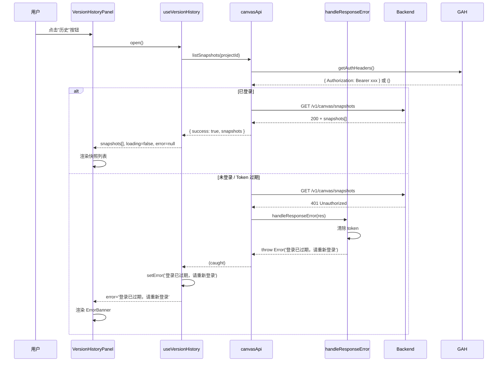

# vibex-canvas-auth-fix — System Architecture Design

**项目**: vibex-canvas-auth-fix
**阶段**: Phase 1 — design-architecture
**作者**: Architect
**日期**: 2026-04-13
**状态**: 技术设计完成，待 /plan-eng-review 审查

---

## 1. 执行摘要

### 背景

用户点击 Canvas 画布的"历史"按钮时，`GET /api/v1/canvas/snapshots` 返回 **401 Unauthorized**。

根因分析（Analyst 阶段确认）：
- API 端点 `/v1/canvas/snapshots` 已正确注册在 Hono gateway（受保护路由）
- 前端 `canvasApi.listSnapshots()` 正确使用 `getAuthHeaders()` 读取 Bearer token
- 401 的根因是"用户未登录或 token 过期"，而非端点不存在或 CORS 问题

### 目标

1. 已登录用户点击"历史" → 正常显示版本历史列表
2. 未登录/Token 过期用户点击"历史" → 显示清晰错误提示"登录已过期，请重新登录"
3. CORS 预检请求（OPTIONS）返回 204 而非 401

### 技术方案

采用**方案 A：前端 401 差异化提示 + UI 层完善**。核心 API 链路已通，主要工作是：
1. `useVersionHistory` 暴露 `error` 状态给 UI
2. `VersionHistoryPanel` 从 hook 读取 error 并展示 banner
3. 确认 CORS 预检正常（curl 验证）
4. 完善端到端测试

---

## 2. Tech Stack

| 组件 | 技术 | 版本 | 选择理由 |
|------|------|------|---------|
| 前端框架 | Next.js + React | 15.x | 现有项目技术栈 |
| 状态管理 | Zustand | 5.x | 现有项目使用 |
| API 层 | fetch + Zod | — | 现有 canvasApi 实现 |
| 测试框架 | Vitest | 3.x | 与现有 17 个测试兼容 |
| 测试工具 | @testing-library/react | 15.x | 现有测试使用 |
| Mock | Vitest ViFi + MSW | 3.x / 3.x | 模拟 401 场景 |

### 依赖变更

**无新增生产依赖**。现有依赖已满足需求：
- `canvasApi.handleResponseError` 已有 401 处理逻辑
- `useVersionHistory` 已有完整状态管理
- `VersionHistoryPanel` 已有 error banner UI 组件

需新增测试工具用于端到端 mock：
```json
{
  "devDependencies": {
    "msw": "^2.7.0"
  }
}
```

---

## 3. Architecture Diagram

```mermaid
flowchart TB
    subgraph Frontend["前端 (vibex-frontend)"]
        User[用户点击"历史"按钮]
        
        subgraph CanvasPage["canvas/page.tsx"]
            VH1["useVersionHistory() hook"]
            VP1["VersionHistoryPanel component"]
        end
        
        subgraph Hooks["hooks/canvas/"]
            UVH["useVersionHistory.ts"]
        end
        
        subgraph Api["lib/canvas/api/"]
            CA["canvasApi.ts"]
            GAH["getAuthHeaders()"]
            HRE["handleResponseError()"]
        end
        
        subgraph UI["components/canvas/features/"]
            VHP["VersionHistoryPanel.tsx"]
        end
    end
    
    subgraph Backend["后端 (vibex-backend)"]
        GW["Hono Gateway"]
        PR["protected_ router"]
        CS["CORS middleware"]
        EP["/v1/canvas/snapshots endpoint"]
        AUTH["Bearer Token Auth"]
    end
    
    User --> VP1
    VP1 --> VH1
    VH1 --> CA
    CA --> GAH
    GAH -->|"sessionStorage.getItem('auth_token')"| TT[("Token\n(success)")]
    GAH -->|"null / expired"| EE[("Error\n401 → '登录已过期'")]
    CA -->|"fetch(url, headers)"| EP
    
    EP -->|"200 OK"| RSP1[("snapshots[]")]
    EP -->|"401 Unauthorized"| HRE
    
    HRE -->|"throw Error('登录已过期，请重新登录')"| EE
    EE --> UVH
    UVH -->|"setError(msg)"| UVH_State["error: string | null"]
    UVH_State --> VHP
    VHP -->|"ErrorBanner"| Banner[("❌ 登录已过期，请重新登录")]
    
    CA -.->|"OPTIONS preflight"| CS
    CS -.->|"204 + CORS headers"| Preflight[("CORS OK")]
```

### 数据流时序图



---

## 4. API Definitions

### 4.1 已有 API（无需修改）

| 方法 | 路径 | 认证 | 描述 |
|------|------|------|------|
| `POST` | `/api/v1/canvas/snapshots` | Bearer | 创建快照 |
| `GET` | `/api/v1/canvas/snapshots` | Bearer | 列表快照 |
| `GET` | `/api/v1/canvas/snapshots/:id` | Bearer | 获取快照详情 |
| `POST` | `/api/v1/canvas/snapshots/:id/restore` | Bearer | 恢复到快照 |
| `OPTIONS` | `/api/v1/canvas/snapshots` | — | CORS 预检 |

### 4.2 新增接口（无）

本项目不新增 API 接口，只修改前端错误处理和 UI 层展示。

### 4.3 接口契约

#### `GET /api/v1/canvas/snapshots`

**请求**:
```ts
// Headers
Authorization: Bearer <token>  // 可选，未登录时无此 header

// Query
projectId?: string  // 可选
```

**响应（已登录）**:
```ts
// 200 OK
{
  success: true,
  snapshots: Array<{
    snapshotId: string;
    projectId: string;
    label: string;
    trigger: 'manual' | 'ai_complete' | 'auto';
    contextNodes: BoundedContextNode[];
    flowNodes: BusinessFlowNode[];
    componentNodes: ComponentNode[];
    contextCount: number;
    flowCount: number;
    componentCount: number;
    createdAt: string; // ISO 8601
  }>;
}
```

**响应（未登录）**:
```ts
// 401 Unauthorized
{
  error: 'Unauthorized'
}
```

**响应（projectId 缺失）**:
```ts
// 400 Bad Request
{
  error: 'projectId is required'
}
```

---

## 5. Data Model

### 5.1 核心类型

```ts
// lib/canvas/types.ts — 已有，无需修改
interface CanvasSnapshot {
  snapshotId: string;
  projectId: string;
  label: string;
  trigger: 'manual' | 'ai_complete' | 'auto';
  contextNodes: BoundedContextNode[];
  flowNodes: BusinessFlowNode[];
  componentNodes: ComponentNode[];
  contextCount: number;
  flowCount: number;
  componentCount: number;
  createdAt: string;
}

// hooks/canvas/useVersionHistory.ts — 需修改
interface UseVersionHistoryReturn {
  // ...existing fields
  /** 新增：最近一次加载/操作错误消息 */
  error: string | null;
}
```

### 5.2 实体关系

```
sessionStorage/auth_token
         │
         ▼
getAuthHeaders() ──► Authorization: Bearer <token>
         │
         ▼
canvasApi.listSnapshots()
         │
         ├─► 200: { success: true, snapshots[] } ──► setSnapshots()
         │
         └─► 401: handleResponseError() ──► throw '登录已过期，请重新登录'
                                                     │
                                                     ▼
                                            useVersionHistory.loadSnapshots() catch
                                                     │
                                                     ▼
                                            setError('登录已过期，请重新登录')
                                                     │
                                                     ▼
                                            VersionHistoryPanel error banner
```

---

## 6. Technical Design Details

### 6.1 改动点 1: `useVersionHistory.ts` — 暴露 error 状态

**文件**: `vibex-fronted/src/hooks/canvas/useVersionHistory.ts`

```ts
// Interface 新增字段
interface UseVersionHistoryReturn {
  // ...existing
  /** 新增：最近一次加载/操作错误消息 */
  error: string | null;
}

// State 新增
const [error, setError] = useState<string | null>(null);

// loadSnapshots catch block 改造
} catch (err) {
  canvasLogger.default.error('[useVersionHistory] loadSnapshots error:', err);
  const msg = err instanceof Error ? err.message : '加载失败，请重试';
  setError(msg);  // ← 新增
} finally {
  setLoading(false);
}

// createSnapshot catch block 改造
} catch (err) {
  canvasLogger.default.error('[useVersionHistory] createSnapshot error:', err);
  const msg = err instanceof Error ? err.message : '创建快照失败，请重试';
  setError(msg);  // ← 新增
  return null;
}

// open() 中清除旧错误
const open = useCallback(() => {
  setIsOpen(true);
  setError(null);  // ← 新增：打开时清除旧错误
  loadSnapshots();
}, [loadSnapshots]);

// return 中暴露
return {
  // ...existing
  error,  // ← 新增
};
```

**改动理由**: 当前 `loadSnapshots()` 和 `createSnapshot()` 的 catch 块只打日志，不更新 state。UI 无法感知错误。暴露 `error` 后，`VersionHistoryPanel` 可读取并展示 banner。

### 6.2 改动点 2: `VersionHistoryPanel.tsx` — 从 hook 读取 error

**文件**: `vibex-fronted/src/components/canvas/features/VersionHistoryPanel.tsx`

```tsx
// 从 useVersionHistory 读取 error（替换 local error for load/create）
const {
  snapshots,
  loading,
  isOpen,
  selectedSnapshot,
  selectSnapshot,
  loadSnapshots,
  createSnapshot,
  restoreSnapshot,
  error: hookError,  // ← 从 hook 读取
} = useVersionHistory();

// 保留本地 error state 用于 restoreSnapshot（handler 在组件内）
const [restoreError, setRestoreError] = useState<string | null>(null);

// 显示 error banner
{hookError && (
  <div className={styles.errorBanner} role="alert">
    <span>❌ {hookError}</span>
  </div>
)}
```

**改动理由**: `useVersionHistory` 的 `error` 覆盖 load 和 create 场景。restore 错误仍在组件内 local state 处理（保持隔离）。

### 6.3 改动点 3: 无需后端改动

- CORS 预检：已有 `protected_.options('/*')` 配置 ✅
- 认证逻辑：Bearer token 机制已就绪 ✅
- 错误处理：`handleResponseError` 已正确处理 401 ✅

### 6.4 改动点 4: `canvasApi.handleResponseError` 确认

```ts
function handleResponseError(res: Response, defaultMsg: string): never {
  if (res.status === 401) {
    if (typeof window !== 'undefined') {
      sessionStorage.removeItem('auth_token');
      localStorage.removeItem('auth_token');
    }
    throw new Error('登录已过期，请重新登录');  // ← 正确
  }
  // ...
}
```

**结论**: 无需修改，逻辑正确。

---

## 7. Module Design

### 7.1 模块划分

| 模块 | 文件 | 职责 | 改动类型 |
|------|------|------|---------|
| Hook | `useVersionHistory.ts` | 管理快照状态 + 暴露 error | **修改** |
| Component | `VersionHistoryPanel.tsx` | 展示错误 banner | **修改** |
| API | `canvasApi.ts` | HTTP 请求封装 | 无改动 |
| Page | `canvas/page.tsx` | 页面入口 | 无改动（已接入） |

### 7.2 依赖关系

```
VersionHistoryPanel.tsx
  └─ useVersionHistory hook
       ├─ canvasApi.listSnapshots()
       │    └─ getAuthHeaders()
       │         └─ handleResponseError() ← 401 抛出
       └─ canvasApi.createSnapshot()
```

---

## 8. Testing Strategy

### 8.1 测试框架

- **单元测试**: Vitest + @testing-library/react（与现有 17 个测试一致）
- **Mock**: MSW (Mock Service Worker) 模拟后端响应
- **覆盖要求**: 新增逻辑 100% 覆盖，回归现有 17 个测试

### 8.2 测试用例矩阵

| ID | 场景 | 输入 | 预期输出 | 测试方式 |
|----|------|------|---------|----------|
| T1 | 已登录用户加载快照 | Bearer token 有效 | `snapshots[]` 非空，error=null | MSW mock 200 |
| T2 | 已登录用户空列表 | Bearer token 有效 | `snapshots=[]`，显示"暂无版本记录" | MSW mock 200+empty |
| T3 | **未登录 401** | 无 token / 无效 token | `error='登录已过期，请重新登录'` | MSW mock 401 |
| T4 | 错误清除 | 401 → 关闭 → 重新打开 | error=null，banner 消失 | 状态机测试 |
| T5 | 创建快照成功 | 有效 token + 画布数据 | `snapshots` 包含新快照，error=null | MSW mock 200 |
| T6 | 创建快照失败 | 有效 token + 网络错误 | `error='创建快照失败，请重试'` | MSW mock 500 |
| T7 | projectId 为空 | 无 projectId 参数 | 后端返回 400（非 401/500） | MSW mock 400 |
| T8 | 网络不可用 | 网络断开 | `error='加载失败，请重试'` | MSW network error |

### 8.3 核心测试代码示例

```ts
// T3: 未登录用户触发 401
describe('useVersionHistory — 401 错误处理', () => {
  it('未登录用户看到"登录已过期，请重新登录" error', async () => {
    server.use(
      rest.get('/api/v1/canvas/snapshots', (req, res, ctx) => {
        return res(ctx.status(401), ctx.json({ error: 'Unauthorized' }));
      })
    );

    const { result } = renderHook(() => useVersionHistory(), { wrapper });
    await act(async () => {
      result.current.open();
    });

    await waitFor(() => {
      expect(result.current.error).toBe('登录已过期，请重新登录');
    });
  });

  it('关闭面板后重新打开，error 状态清除', async () => {
    // 先触发 401
    // 然后 close()
    // 然后 open()
    // expect(error).toBe(null)
  });
});
```

### 8.4 回归测试

```bash
# 现有 17 个测试继续通过
cd vibex-fronted && npm test -- --run useVersionHistory
```

**预期结果**: 17 个现有测试全部通过 + 新增 8 个测试通过 = 25 个测试通过。

---

## 9. Risk Assessment

| 风险 | 可能性 | 影响 | 等级 | 缓解措施 |
|------|--------|------|------|---------|
| 现有 17 个测试因接口变化失败 | 低 | 高 | 🟡 中 | Vitest 增量测试，修改前运行基准测试 |
| MSW mock 与真实 API 行为不一致 | 低 | 中 | 🟢 低 | curl 验证真实 API 响应格式 |
| `handleResponseError` 异步 JSON 解析导致错误丢失 | 低 | 高 | 🟡 中 | 已有 try/catch，但需验证 catch 确实捕获 async throw |
| 401 提示文案与 UX 规范不一致 | 低 | 低 | 🟢 低 | 文案与 PRD 一致（"登录已过期，请重新登录"） |
| CORS 预检返回 401 而非 204 | 低 | 高 | 🟡 中 | 用 curl 验证 OPTIONS 响应后再部署 |

---

## 10. Performance Impact

| 维度 | 当前 | 变更后 | 影响 |
|------|------|--------|------|
| Bundle size | — | +0 (无新依赖) | 无 |
| API 调用次数 | 不变 | 不变 | 无 |
| 渲染性能 | — | +1 state 字段检查 | 可忽略 |
| 首屏时间 | — | 无变化 | 无 |

**结论**: 性能影响为零，仅涉及状态管理和 UI 展示逻辑。

---

## 11. Implementation Plan

见 `IMPLEMENTATION_PLAN.md`

---

## 12. Development Constraints

见 `AGENTS.md`

---

## 13. 执行决策

- **决策**: 已采纳（方案 A）
- **执行项目**: vibex-canvas-auth-fix
- **执行日期**: 2026-04-13

---

## 14. Review Checklist

- [x] Tech Stack 选择有版本和理由
- [x] Mermaid 架构图（数据流 + 时序）
- [x] API 定义完整（请求/响应/错误码）
- [x] 数据模型（类型 + 实体关系）
- [x] 测试策略（框架 + 用例矩阵 + 示例代码）
- [x] 风险评估矩阵
- [x] 性能影响评估
- [x] 产出 IMPLEMENTATION_PLAN.md
- [x] 产出 AGENTS.md
- [x] 执行决策段落
