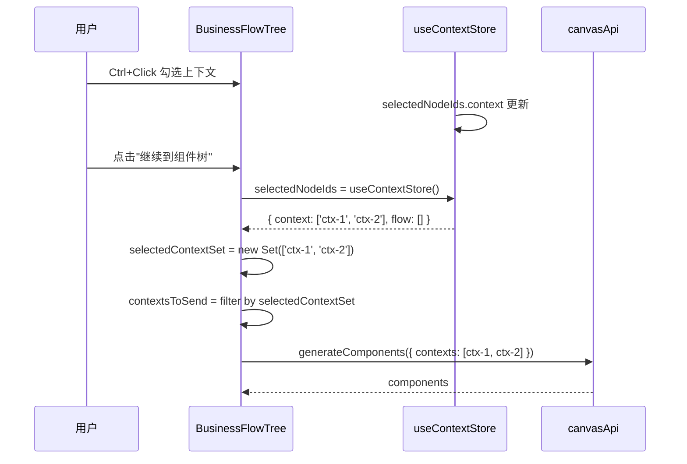

# Architecture: VibeX Canvas Context Selection Bug 修复

> **项目**: vibex-canvas-context-selection  
> **架构师**: architect  
> **日期**: 2026-04-05  
> **版本**: v1.0  
> **状态**: 已完成

---

## 1. 执行决策

- **决策**: 已采纳
- **执行项目**: vibex-canvas-context-selection
- **执行日期**: 2026-04-05

---

## 2. 问题背景

`BusinessFlowTree.tsx` 的 `handleContinueToComponents` 直接发送全部 `contextNodes`，未读取 `selectedNodeIds.context`，导致：

1. 用户选中上下文后点击继续，发送了**全部**上下文而非选中的
2. `contextNodes` 为空时发送空数组，API 报错无反馈

`CanvasPage.tsx` 的相同函数**已正确**读取 `selectedNodeIds`，只需对齐。

---

## 3. Tech Stack

| 组件 | 技术选型 | 理由 |
|------|---------|------|
| **状态管理** | Zustand (`useContextStore`) | 已有，`selectedNodeIds.context` 已可用 |
| **测试框架** | Vitest + React Testing Library (现有) | `vibex-fronted` 已使用 |
| **Toast** | 现有 `toast.showToast()` | 已有 UI 反馈机制 |

**约束**:
- 不破坏 `CanvasPage.tsx` 现有行为
- 不修改 API 接口签名
- 不引入新依赖

---

## 4. 架构图

### 4.1 根因定位

```mermaid
%%{ init: { "theme": "neutral" } }%%
flowchart TB
    subgraph BusinessFlowTree["❌ BusinessFlowTree.tsx (有 BUG)"]
        B1["handleContinueToComponents()"]
        B2["contextNodes.map()\n→ 发送全部上下文"]
        B3["❌ 未读取 selectedNodeIds.context"]
    end
    
    subgraph CanvasPage["✅ CanvasPage.tsx (正确)"]
        C1["handleContinueToComponents()"]
        C2["selectedNodeIds.context\n→ Set<string>"]
        C3["selectedContextSet.size > 0\n? filter by selection\n: activeContexts"]
    end
    
    B1 --> B2
    B2 -.->|"根因| B3
    
    C1 --> C2 --> C3
```

### 4.2 修复后数据流



---

## 5. API 定义

无新增 API — 修复仅调整请求参数。

### 5.1 修改后的请求

**Endpoint**: `POST /api/v1/canvas/generate-components` (不变)

**修改前** (BusinessFlowTree.tsx 第 767-771):
```typescript
const mappedContexts = contextNodes.map((ctx) => ({
  id: ctx.nodeId,
  name: ctx.name,
  description: ctx.description ?? '',
  type: ctx.type,
}));
// ❌ 发送全部 contextNodes
```

**修改后**:
```typescript
const selectedContextSet = new Set(selectedNodeIds.context);
const activeContexts = contextNodes.filter((ctx) => ctx.isActive !== false);
const contextsToSend = selectedContextSet.size > 0
  ? activeContexts.filter((ctx) => selectedContextSet.has(ctx.nodeId))
  : activeContexts;  // fallback: 发送全部

const mappedContexts = contextsToSend.map((ctx) => ({
  id: ctx.nodeId,
  name: ctx.name,
  description: ctx.description ?? '',
  type: ctx.type,
}));
// ✅ 发送选中的上下文
```

---

## 6. 数据模型

无变更。`selectedNodeIds` 类型已存在：

```typescript
interface SelectedNodeIds {
  context: string[];  // 选中的 context nodeId 列表
  flow: string[];    // 选中的 flow nodeId 列表
}
```

---

## 7. 模块设计

### 7.1 修改文件清单

| 文件 | 行号 | 修改内容 |
|------|------|---------|
| `vibex-fronted/src/components/canvas/BusinessFlowTree.tsx` | 757-801 | `handleContinueToComponents` 替换 `contextNodes.map()` 为 selection-aware 逻辑 |
| `vibex-fronted/src/components/canvas/BusinessFlowTree.tsx` | 757-801 | 添加空上下文 toast 错误提示 |

### 7.2 依赖关系

```
BusinessFlowTree.tsx
└── useContextStore (已有)
    ├── selectedNodeIds.context → 用于过滤 contexts
    └── selectedNodeIds.flow → 用于过滤 flows (已有)
```

---

## 8. 技术审查

### 8.1 风险评估

| 风险 | 严重性 | 缓解 |
|------|--------|------|
| fallback 发送全部上下文（用户未选）| 低 | 预期行为，与 CanvasPage 一致 |
| 修改破坏 BusinessFlowTree 其他逻辑 | 低 | 仅改 `handleContinueToComponents` 内部逻辑 |
| `selectedNodeIds` 在 SSR 时未定义 | 低 | `useContextStore()` 始终返回默认空对象 |

### 8.2 行为一致性

| 场景 | CanvasPage.tsx | BusinessFlowTree.tsx (修复后) |
|------|----------------|-------------------------------|
| 选中 2 个 context | 发送 2 个 | 发送 2 个 ✅ |
| 未选中任何 context | 发送全部 | 发送全部 ✅ |
| contextNodes 为空 | toast 错误 | toast 错误 ✅ |

---

## 9. 测试策略

### 9.1 测试文件

```
src/components/canvas/BusinessFlowTree.test.tsx
```

### 9.2 核心测试用例

```typescript
describe('handleContinueToComponents', () => {
  it('should send only selected contexts when selectedNodeIds.context has items', async () => {
    // selectedNodeIds.context = ['ctx-1', 'ctx-2']
    // contextNodes = [ctx-1, ctx-2, ctx-3]
    // 期望: 只发送 ctx-1, ctx-2
  });

  it('should send all active contexts when nothing selected (fallback)', async () => {
    // selectedNodeIds.context = []
    // contextNodes = [ctx-1, ctx-2]
    // 期望: 发送全部
  });

  it('should show error toast and not call API when contextNodes is empty', async () => {
    // contextNodes = []
    // 期望: toast.showToast('请先生成上下文树', 'error')
    // 期望: setComponentGenerating(false)
    // 期望: 不调用 API
  });
});
```

---

## 10. 实施计划

| Phase | 内容 | 工时 | 产出 |
|-------|------|------|------|
| E1 | 修复 `handleContinueToComponents` | 0.5h | BusinessFlowTree.tsx |
| E2 | Toast 错误提示 | 0.5h | 空上下文错误反馈 |

**并行度**: E2 可合并到 E1

---

## 11. 验收标准

| ID | Given | When | Then |
|----|-------|------|------|
| AC1 | 选中 2 个上下文 | 点击继续 | API 发送 2 个选中 contexts |
| AC2 | 未选中 | 点击继续 | API 发送全部 contexts |
| AC3 | contextNodes 为空 | 点击继续 | toast 错误 + 不调用 API |

---

*文档版本: v1.0 | 最后更新: 2026-04-05*
