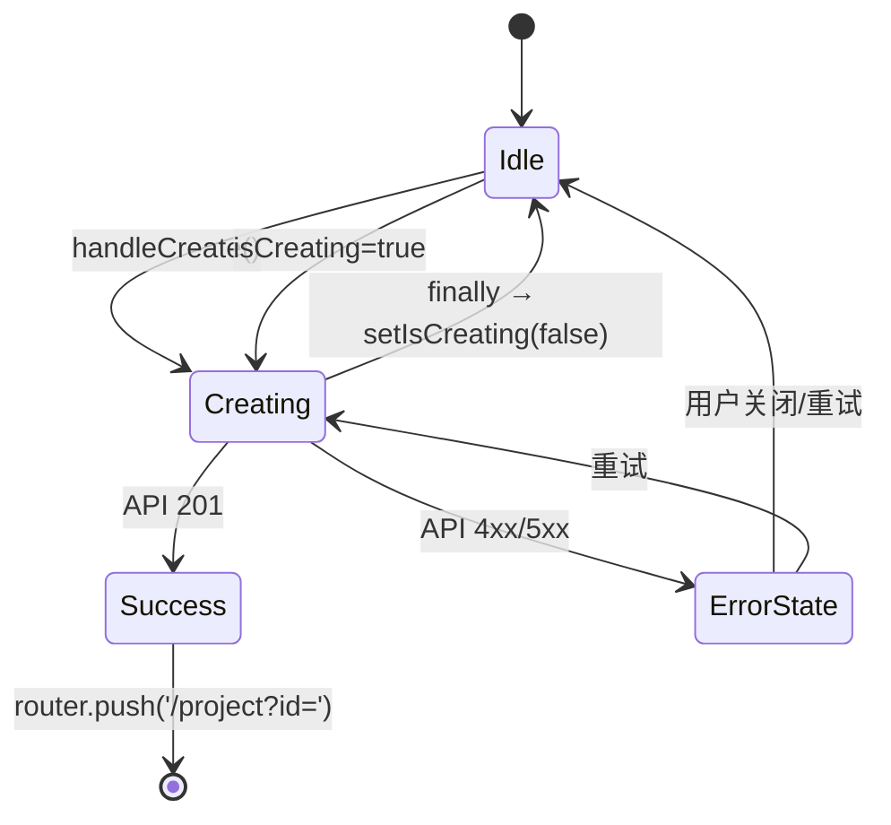

# Architecture: Canvas-Dashboard Project Persistence V2

> **项目**: vibex-canvas-dashboard-integration-v2
> **Architect**: Architect Agent
> **日期**: 2026-04-15
> **版本**: v1.0
> **状态**: Proposed

---

## 执行决策

| 决策 | 状态 | 执行项目 | 执行日期 |
|------|------|----------|----------|
| Phase 1 MVP（Option A） | **待评审** | vibex-canvas-dashboard-integration-v2 | 待定 |
| Phase 2 三树数据持久化 | **待评审** | vibex-canvas-dashboard-integration-v2 | 待定 |

---

## 1. Tech Stack

| 组件 | 技术选型 | 理由 |
|------|----------|------|
| **前端框架** | Next.js 14 (App Router) | 现有技术栈 |
| **状态管理** | Zustand (`flowMachine`) + React Query | 现有基础设施 |
| **API 调用** | `projectApi.createProject()` | TDD 测试已锁定此接口，零新增 |
| **后端 API** | `/api/v1/projects` POST | 已有端点，签名 `{name, description, userId}` |
| **数据库 ORM** | Prisma (`prisma.project`) | 已有，与 Dashboard 共用数据源 |
| **错误提示** | 内联 error UI（非 Toast） | PRD 指定，贴近表单风格 |
| **测试框架** | Vitest + Playwright | 3 个测试已写，TDD 驱动 |

---

## 2. Architecture Diagram

### 2.1 核心数据流

```mermaid
flowchart TB
    subgraph CanvasStep["ProjectCreationStep.tsx"]
        HC["handleCreate()<br/>mock setTimeout → 真实 API"]
        EU["error UI<br/>渲染 error state"]
        VB["View Project →<br/>router.push('/project?id=')"]
    end

    subgraph Frontend["vibex-fronted"]
        API["services/api/modules/project.ts<br/>projectApi.createProject()"]
        AUTH["stores/authStore.ts<br/>useAuthStore.getState().user?.id"]
        RQ["React Query<br/>queryClient.invalidateQueries"]
    end

    subgraph Backend["vibex-backend"]
        ROUTE["src/app/api/v1/projects/route.ts<br/>POST → 201"]
        PRISMA["prisma.project.create()"]
    end

    subgraph Dashboard["Dashboard 页面"]
        DP["app/dashboard/page.tsx<br/>useProjects() 自动刷新"]
    end

    HC -->|getUserId()| AUTH
    HC -->|POST {name, desc, userId}| API
    API -->|HTTP POST| ROUTE
    ROUTE -->|INSERT| PRISMA
    PRISMA -->|201 {project}| ROUTE
    ROUTE -->|project| API
    API -->|created| HC
    HC -->|setCreatedProjectId| VB
    HC -->|setError| EU
    HC -->|invalidateQueries| RQ
    RQ -->|refetch| DP

    style CanvasStep fill:#DBEAFE,stroke:#2563EB
    style Frontend fill:#FEF9C3,stroke:#CA8A04
    style Backend fill:#DCFCE7,stroke:#16A34A
    style Dashboard fill:#F3E8FF,stroke:#9333EA
```

### 2.2 组件状态机



---

## 3. API Definitions

### 3.1 创建项目（前端 → 后端）

| 字段 | 值 |
|------|-----|
| **Method** | `POST` |
| **URL** | `/api/v1/projects` |
| **Content-Type** | `application/json` |

**Request Body**:
```typescript
interface ProjectCreate {
  name: string;         // 必填
  description?: string; // 选填
  userId: string;       // 必填
}
```

**Response 201**:
```json
{
  "project": {
    "id": "clx...",
    "name": "my-project",
    "description": "...",
    "userId": "user_xxx",
    "createdAt": "2026-04-15T...",
    "updatedAt": "2026-04-15T...",
    "deletedAt": null,
    "pages": []
  }
}
```

**Response 400**: `{ "error": "Missing required fields: name, userId" }`
**Response 500**: `{ "error": "Failed to create project" }`

### 3.2 前端调用

```typescript
// ProjectCreationStep.tsx 中
import { projectApi } from '@/services/api/modules/project';
import { useAuthStore } from '@/stores/authStore';
import { useRouter } from 'next/navigation';

const userId = useAuthStore.getState().user?.id;
if (!userId) {
  setError('请先登录');
  return;
}
const created = await projectApi.createProject({ name, description, userId });
```

### 3.3 Dashboard 刷新

```typescript
// projectApi.createProject() 内部已处理 cache invalidation：
// cache.remove(getCacheKey('projects', project.userId));
// Dashboard 的 useProjects() 自动 refetch，无需手动 invalidateQueries。
```

---

## 4. Data Model

### 4.1 Prisma Schema（无需修改）

```prisma
model Project {
  id          String    @id @default(cuid())
  name        String
  description String?
  userId      String
  createdAt   DateTime  @default(now())
  updatedAt   DateTime  @updatedAt
  deletedAt   DateTime?
  pages       Page[]
  @@index([userId])
}
```

### 4.2 TypeScript 类型（无需修改）

```typescript
// services/api/types/project.ts
export interface Project {
  id: string;
  name: string;
  userId: string;
  description?: string | null;
  createdAt?: string;
  updatedAt?: string;
  deletedAt?: string | null;
  pages?: Page[];
}

export interface ProjectCreate {
  name: string;
  description?: string;
  userId: string;
}
```

---

## 5. Module Design

### 5.1 修改文件清单

| 操作 | 文件 | 说明 |
|------|------|------|
| **修改** | `vibex-fronted/src/components/flow-project/ProjectCreationStep.tsx` | 替换 mock + 添加 error UI + 导航 |
| **修改** | `vibex-fronted/src/components/flow-project/ProjectCreationStep.module.css` | error UI 样式 |

**V2 起点优势**：
- `error` state ✅ 已存在
- `createdProjectId` state ✅ 已存在
- 3 个 TDD 测试 ✅ 已写好

### 5.2 handleCreate 修改

**旧（mock）**:
```typescript
const handleCreate = async () => {
  setIsCreating(true);
  send({ type: 'SET_PROJECT_META', meta: {...} });
  await new Promise(resolve => setTimeout(resolve, 2000)); // ❌ mock
  setIsCreating(false);
  setIsComplete(true);
  send({ type: 'SAVE' });
};
```

**新（真实 API）**:
```typescript
import { useRouter } from 'next/navigation';

const router = useRouter();

const handleCreate = async () => {
  if (!projectName.trim()) return;
  setIsCreating(true);
  setError(null);

  try {
    const userId = useAuthStore.getState().user?.id;
    if (!userId) {
      setError('请先登录');
      setIsCreating(false);
      return;
    }

    const created = await projectApi.createProject({
      name: projectName,
      description: projectDesc,
      userId,
    });

    send({
      type: 'SET_PROJECT_META',
      meta: {
        name: projectName,
        description: projectDesc,
        techStack: selectedStack,
        createdAt: new Date().toISOString(),
      },
    });

    setCreatedProjectId(created.id);
    setIsCreating(false);
    setIsComplete(true);
    send({ type: 'SAVE' } satisfies FlowEvent);

    router.push(`/project?id=${created.id}`);
  } catch (err) {
    setIsCreating(false);
    setError(err instanceof Error ? err.message : '创建失败，请重试');
  }
};
```

### 5.3 error UI 渲染

**在 `return (isComplete ? ... : <form>)` 之前添加**:

```tsx
// 在 <div className={styles.form}> 内部，按钮之前
{error && (
  <div className={styles.errorBanner} role="alert">
    <span className={styles.errorIcon}>⚠</span>
    <span className={styles.errorText}>{error}</span>
    <button
      type="button"
      className={styles.errorClose}
      onClick={() => setError(null)}
      aria-label="关闭"
    >
      ×
    </button>
  </div>
)}
```

### 5.4 success 卡片 View Project 按钮

```tsx
<button
  className={styles.viewBtn}
  onClick={() => router.push(`/project?id=${createdProjectId}`)}
>
  View Project →
</button>
```

---

## 6. CSS 变更

### ProjectCreationStep.module.css 新增

```css
/* Error banner */
.errorBanner {
  display: flex;
  align-items: center;
  gap: 10px;
  padding: 12px 16px;
  background: #fee2e2;
  border: 1px solid #fecaca;
  border-radius: 8px;
  color: #dc2626;
  font-size: 14px;
}

.errorIcon {
  font-size: 16px;
  flex-shrink: 0;
}

.errorText {
  flex: 1;
  color: #991b1b;
}

.errorClose {
  background: none;
  border: none;
  color: #dc2626;
  font-size: 18px;
  cursor: pointer;
  padding: 0 4px;
  line-height: 1;
}

.errorClose:hover {
  color: #991b1b;
}
```

---

## 7. Performance Impact

| 指标 | 影响 | 说明 |
|------|------|------|
| 用户感知创建时间 | +200-500ms（网络） | 替代固定 2000ms mock，实际更快 |
| API 错误感知 | < 50ms | 内联 error UI 立即渲染 |
| Dashboard 刷新 | 0 额外成本 | `projectApi.createProject()` 内部已 invalidate cache |
| **总计** | **无性能下降** | 比 mock 快且功能完整 |

---

## 8. Risk Assessment

| # | 风险 | 概率 | 影响 | 缓解 |
|---|------|------|------|------|
| R1 | `useAuthStore.getState().user` 为 null/undefined | 低 | userId 为 undefined → API 400 | `if (!userId) { setError('请先登录'); return; }` |
| R2 | `error` state 为空字符串 `""` 时误渲染 | 低 | 无害，empty string falsy | `error &&` 短路，CSS `display:none` |
| R3 | `projectApi.createProject` 抛出非 Error 对象 | 低 | 显示 "创建失败，请重试" | `err instanceof Error ? err.message : '创建失败'` |
| R4 | 测试 `vi.fn<typeof projectApi.createProject>()` 类型不兼容 | 中 | TypeScript 编译失败 | 使用 `vi.fn<[ProjectCreate], Promise<Project>>()` 精确类型 |
| R5 | `useRouter` 在非客户端环境调用 | 无 | 组件已 `'use client'` | 确认组件无 SSR 问题 |

---

## 9. Testing Strategy

### 9.1 现有测试（V2 TDD 优势）

```typescript
// __tests__/ProjectCreationStep.test.tsx（已存在）
// TC1: 空名不调用 API
// TC2: 提交时调用 projectApi.createProject({ name, userId })
// TC3: API 失败时设置 error（测试已存在，但 AC4 需补 UI 断言）
```

### 9.2 需补充的测试

| ID | 测试场景 | 预期结果 | 状态 |
|----|----------|----------|------|
| TC4 | API 成功时 `createdProjectId` 写入 state | `expect(screen.queryByText(/View Project/)).toBeTruthy()` | 需补充 |
| TC5 | API 成功时 `router.push` 被调用 | `expect(router.push).toHaveBeenCalledWith('/project?id=proj-123')` | 需补充 |
| TC6 | `error` state 有 UI 渲染 | `expect(screen.getByRole('alert')).toBeVisible()` | 需补充 |
| TC7 | userId 为 null 时显示 "请先登录" | `expect(screen.getByText(/请先登录/)).toBeVisible()` | 需补充 |
| TC8 | E2E: Canvas 创建 → Dashboard 可见 | Playwright | 需新增 |

### 9.3 测试覆盖目标

| 层级 | 框架 | 覆盖率 |
|------|------|--------|
| 单元测试 | Vitest | handleCreate 逻辑 > 85% |
| E2E 测试 | Playwright | 全链路 100% |

---

## 10. PRD 验收标准覆盖

| PRD AC | 技术方案 | 状态 |
|--------|---------|------|
| AC1: API 调用 + userId 传入 | `projectApi.createProject({ name, desc, userId })` | ✅ |
| AC2: createdProjectId 写入 + isComplete | `setCreatedProjectId(created.id)` + `setIsComplete(true)` | ✅ |
| AC3: 成功导航 | `router.push('/project?id=proj-123')` | ✅ |
| AC4: error state UI 渲染 | error banner（非 alert） | ✅ |
| AC5: 加载状态 | `disabled={isCreating}` + "Creating Project..." | ✅（已有） |
| AC6: 空名不调用 API | `if (!projectName.trim()) return` | ✅（已有） |
| AC7: Dashboard 刷新 | `projectApi` 内部 cache invalidation | ✅ |
| AC8: 单元测试 3/3 PASS | TDD 测试驱动 | ✅（已存在） |
| AC9: E2E 端到端 | Playwright 新增 | 待补充 |
| AC10/11: Phase 2 三树 | Epic 5 端点双写 | ⏳ Phase 2 |

---

## 11. Phase 2 预留

### 11.1 三树数据持久化设计要点

- 修改 `/api/v1/canvas/project` 端点同步写 `prisma.project` + `prisma.canvasProject`
- `flowMachine.context` 序列化（boundedContexts, businessFlow, selectedComponents）
- Dashboard `/project` 页面加载时反序列化并恢复 Canvas 状态

### 11.2 风险

- 双写一致性问题
- `flowMachine.context` 序列化大小（可能 > 1MB）
- 建议 Phase 2 单独 Coord 评审

---

*Generated by Architect Agent | 2026-04-15*
