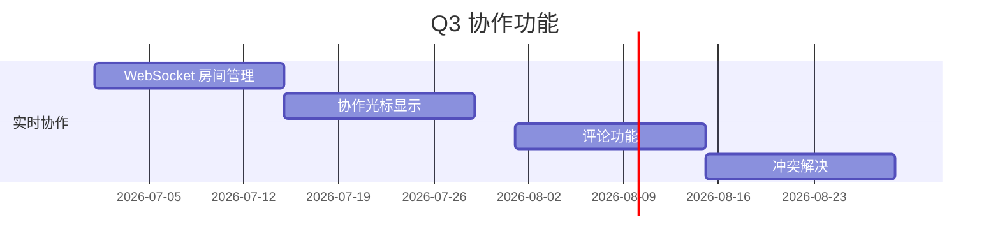

# VibeX 画布演进路线图

> 维护者：Product + Architect  
> 更新频率：每季度一次（由 quarterly-reminder.yml 自动提醒）

---

## 当前状态 (2026-Q1)

### 产品定位
- **目标用户**：产品经理、设计师
- **核心价值**：AI 驱动的页面原型生成，通过 DDD 领域建模将需求转化为可执行代码

### 核心功能
- 三树并行（Context / Flow / Component）
- DDD 限界上下文建模
- AI 原型生成（Next.js + Tailwind）
- 实时预览与导出

### 技术栈
- Frontend: Next.js 16, React 19, Zustand, Tailwind
- Backend: Hono v4 (Cloudflare Workers), Prisma, SSE
- AI: Claude API, 流式响应

---

## 目标状态 (2026-Q4)

### 新增功能
| 功能 | 描述 | 优先级 |
|------|------|--------|
| 多人协作 | 实时协作编辑，WebSocket 同步 | P0 |
| 版本历史 | 每个提案完整版本记录 | P1 |
| 组件市场 | 可复用组件库，支持社区分享 | P1 |
| 团队空间 | 多项目管理，权限控制 | P2 |
| API 集成 | Figma/Zodoc 双向同步 | P2 |

---

## 演进路径

### Q2 (2026-Q2): 稳定性优先 ⭐

**主题**：修复现有问题，建立质量基线

| 功能 | 描述 | 来源 |
|------|------|------|
| TypeScript 零错误 | 修复所有 TS 编译错误 | Dev |
| Auth Mock 修复 | 恢复 94 个测试通过 | Tester |
| Proposal INDEX | 提案状态追踪机制 | Analyst |
| 需求澄清 SOP | 标准化需求澄清流程 | Analyst |
| Canvas ErrorBoundary | 三栏独立崩溃隔离 | Architect |
| Console 日志清理 | 移除所有未包装 console.* | Reviewer |

### Q3 (2026-Q3): 协作功能 🚀

**主题**：多人实时协作基础能力

**技术要点**：
- Cloudflare Durable Objects 协作房间
- CRDT 冲突解决（Yjs 集成）
- WebSocket 重连与状态同步

### Q4 (2026-Q4): 生态扩展 🌍

**主题**：开放生态，连接外部工具

| 功能 | 描述 | 第三方依赖 |
|------|------|------------|
| Figma 导入 | 从 Figma 设计稿导入 | Figma API |
| 组件市场 | 发布/安装可复用组件 | GitHub Packages |
| API 开放 | RESTful API 供第三方调用 | OpenAPI 3.0 |
| Zapier 集成 | 自动化工作流 | Zapier Webhooks |

---

## 已完成里程碑

| 日期 | 版本 | 内容 |
|------|------|------|
| 2026-01 | v0.1 | 三树建模基础功能 |
| 2026-02 | v0.2 | AI 生成 + 流式响应 |
| 2026-03 | v0.3 | DDD 完整流程 + Canvas 重构 |
| 2026-04 | v0.4 | 稳定性提升 + 测试基础设施 |

---

## 技术债务

| ID | 描述 | 影响 | 预计工时 |
|----|------|------|----------|
| TD-1 | TypeScript 编译错误（206 lines） | 高 | 2-3 weeks |
| TD-2 | Zod v4 迁移 | 高 | 1 week |
| TD-3 | waitForTimeout E2E 重构（87处） | 中 | 4h |
| TD-4 | Jest → Vitest 统一 | 低 | 2h |

---

## 决策记录

| 日期 | 决策 | 理由 |
|------|------|------|
| 2026-03-15 | 选择 React Flow 而非自研流程引擎 | 社区成熟，定制灵活 |
| 2026-03-20 | 采用 Zustand 而非 Redux | 轻量，TypeScript 支持好 |
| 2026-04-01 | Cloudflare Workers 替代 Vercel | 冷启动更快，Workers 定价更优 |

---

*最后更新：2026-04-07*
*下次更新：2026-07-01*
