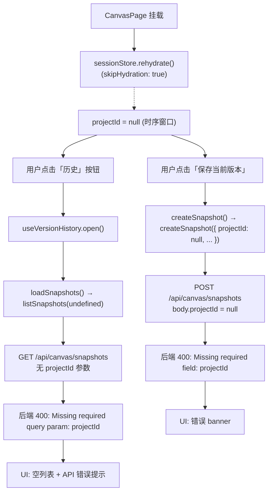
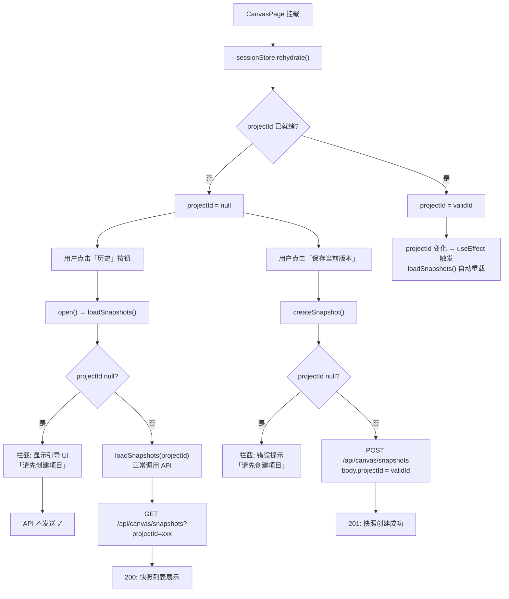
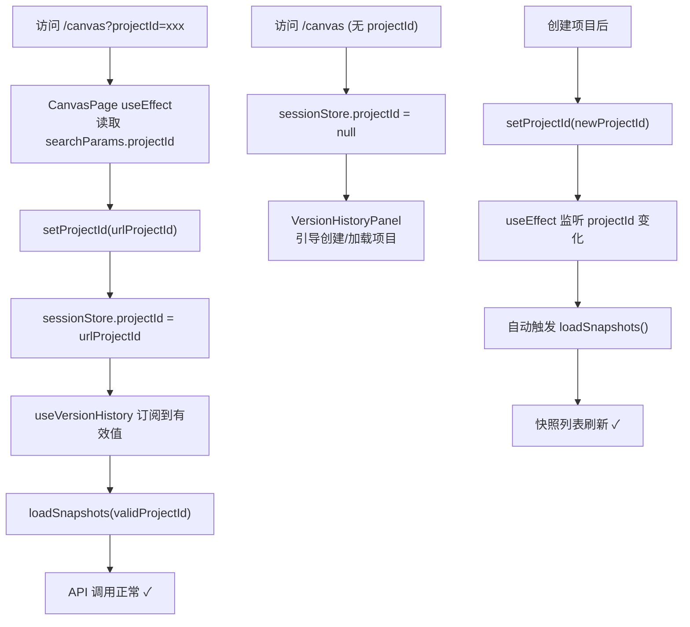

# vibex-canvas-history-projectid — 架构设计方案

**项目**: vibex-canvas-history-projectid
**任务**: design-architecture
**日期**: 2026-04-14
**作者**: Architect Agent
**状态**: ✅ 完成

---

## 1. 执行摘要

Canvas 页面"保存历史版本"和"获取历史版本"功能因 `projectId` 传递链路断裂导致 API 400 错误。

**根因**: `sessionStore.projectId` 初始值为 `null`，`skipHydration: true` 引入 rehydrate 时序窗口，导致 Hook 层订阅到 `null` 时仍发送无效请求。

**决策**:
- Phase 1: Hook 层空值防护（方案 A）+ UX 增强引导（方案 C），0.5d 止血
- Phase 2: URL `?projectId=` 注入，从根本上解决时序问题，2d 根治

---

## 2. Tech Stack

| 层级 | 技术选型 | 理由 |
|------|----------|------|
| Hook 层 | React `useCallback` + `useEffect` | 订阅 `projectId` 变化，自动重载 |
| 状态层 | Zustand `sessionStore` | 已有，修改最小 |
| API 层 | 已有 `canvasApi` | 无需改动 |
| 后端 | 已有 `/api/canvas/snapshots` | 正确校验 projectId，职责清晰 |
| UI 层 | VersionHistoryPanel 扩展 | 增加引导状态展示 |
| 测试 | Vitest (单元) + Playwright (E2E) | 已有测试栈 |

**不做变更**: 现有 Zustand store 架构、API 接口签名、后端校验逻辑。

---

## 3. 架构图（Mermaid）

### 3.1 当前数据流（问题链路）



### 3.2 Phase 1 修复后数据流（Hook 层拦截）



### 3.3 Phase 2 修复后数据流（URL 注入）



---

## 4. API 定义

### 4.1 受影响接口（无需修改）

| 接口 | 行为 | 约束 |
|------|------|------|
| `GET /api/canvas/snapshots?projectId=xxx` | 正常返回快照列表 | projectId 必填 |
| `POST /api/canvas/snapshots` | 正常创建快照 | body.projectId 必填 |

### 4.2 Hook 层新增行为

| 方法 | 空值行为 | 返回值 |
|------|----------|--------|
| `loadSnapshots()` | projectId=null → 拦截，展示引导 UI | `Promise<void>` (resolved) |
| `createSnapshot(label?)` | projectId=null → reject + 错误消息 | `Promise<null>` |

---

## 5. 数据模型

无新增实体。改动仅限于前端 Hook 和 UI 层。

---

## 6. 关键代码变更

### 6.1 Phase 1 — `useVersionHistory.ts` (Hook 层)

```typescript
// src/hooks/canvas/useVersionHistory.ts

// 新增: 错误类型区分
type NoProjectError = 'NO_PROJECT';

const loadSnapshots = useCallback(async () => {
  // === Phase 1 修复: 空值拦截 ===
  if (!projectId) {
    setError('请先创建项目后再查看历史版本');
    setLoading(false);
    setSnapshots([]);
    return; // 不发送 API 请求
  }
  // ... 原有 API 调用逻辑
}, [projectId]);

const createSnapshot = useCallback(async (label?: string) => {
  // === Phase 1 修复: 空值拦截 ===
  if (!projectId) {
    setError('请先创建项目后再保存历史版本');
    return null; // 不发送 API 请求
  }
  // ... 原有 API 调用逻辑
}, [projectId, contextNodes, flowNodes, componentNodes]);

// === Phase 1 修复: projectId 变化自动重载 ===
useEffect(() => {
  // projectId 从 null → 有效值时，或从 A → B 时，自动重载
  if (projectId && isOpen) {
    loadSnapshots();
  }
}, [projectId, isOpen, loadSnapshots]);
```

### 6.2 Phase 1 — `VersionHistoryPanel.tsx` (UI 层)

```typescript
// src/components/canvas/features/VersionHistoryPanel.tsx

// 新增: 引导状态渲染
const NO_PROJECT_GUIDE = '请先创建项目后再查看历史版本';

{hookError?.includes('请先创建项目') ? (
  <div className={styles.noProjectGuide} role="alert">
    <span aria-hidden="true">🏗️</span>
    <span>{hookError}</span>
    <button
      type="button"
      onClick={/* 导航到创建项目入口 */ }
    >
      前往创建项目
    </button>
  </div>
) : null}
```

### 6.3 Phase 2 — `CanvasPage.tsx` (URL 注入)

```typescript
// src/components/canvas/CanvasPage.tsx

// === Phase 2: 从 URL 读取 projectId 并初始化 sessionStore ===
useEffect(() => {
  const params = new URLSearchParams(window.location.search);
  const urlProjectId = params.get('projectId');
  if (urlProjectId && urlProjectId !== projectId) {
    setProjectId(urlProjectId);
  }
}, [searchParams, projectId, setProjectId]);
```

---

## 7. 测试策略

### 7.1 测试框架
- **单元测试**: Vitest（已有）
- **E2E 测试**: Playwright（已有 `version-history-panel.spec.ts`）

### 7.2 覆盖率要求
- `useVersionHistory.ts`: > 80% 分支覆盖
- `VersionHistoryPanel.tsx`: 交互路径覆盖

### 7.3 核心测试用例

```typescript
// useVersionHistory.test.ts

describe('projectId null 防护', () => {
  it('loadSnapshots: projectId=null 时不调用 API，error 设置引导消息', async () => {
    // Given: store projectId = null
    useSessionStore.setState({ projectId: null });
    const { loadSnapshots } = renderHook(() => useVersionHistory());
    
    // When
    await act(async () => { await loadSnapshots(); });
    
    // Then
    expect(canvasApi.listSnapshots).not.toHaveBeenCalled();
    expect(screen.queryByText(/请先创建项目/i)).toBeInTheDocument();
  });

  it('createSnapshot: projectId=null 时不调用 API，error 设置引导消息', async () => {
    // Given
    useSessionStore.setState({ projectId: null });
    const { createSnapshot } = renderHook(() => useVersionHistory());
    
    // When
    const result = await act(async () => { return await createSnapshot(); });
    
    // Then
    expect(canvasApi.createSnapshot).not.toHaveBeenCalled();
    expect(result).toBeNull();
  });

  it('projectId 从 null → 有效值时，useEffect 自动触发 loadSnapshots', async () => {
    // Given: projectId = null, isOpen = true
    useSessionStore.setState({ projectId: null });
    const { result } = renderHook(() => useVersionHistory());
    act(() => { result.current.open(); });
    
    // When: projectId 变为有效值
    useSessionStore.setState({ projectId: 'valid-project-123' });
    
    // Then: loadSnapshots 被调用
    await waitFor(() => {
      expect(canvasApi.listSnapshots).toHaveBeenCalledWith('valid-project-123');
    });
  });
});
```

### 7.4 E2E 测试用例

```typescript
// version-history-no-project.spec.ts (新增)

test('场景A: 无 projectId 打开历史面板 → 显示引导 UI', async ({ page }) => {
  await page.goto('/canvas'); // 无 projectId
  await page.getByTestId('history-btn').click(); // 快速点击
  await expect(page.getByText(/请先创建项目/i)).toBeVisible();
  // 网络日志中无 400 错误
});

test('场景B: 有 projectId 正常保存快照', async ({ page }) => {
  await page.goto('/canvas?projectId=test-project-123');
  await page.getByTestId('history-btn').click();
  await page.getByTestId('create-snapshot-btn').click();
  await expect(page.getByText(/保存成功|快照已创建/i)).toBeVisible();
});
```

---

## 8. 性能影响评估

| 操作 | 影响 | 评估 |
|------|------|------|
| 空值检查 | 无 | 纯内存条件判断，O(1) |
| projectId 变化监听 | 无 | 复用现有 useEffect 机制 |
| 引导 UI 渲染 | 极小 | 仅 3 个 DOM 节点 |
| URL 解析 | 极小 | 单次 `searchParams.get()`，App 启动时 |

**结论**: Phase 1 对性能无负面影响。

---

## 9. 风险评估

| 风险 | 等级 | 缓解 |
|------|------|------|
| 快速点击时序问题（场景B）| 中 | Phase 1 的 useEffect 监听 + Phase 2 的 URL 注入 |
| 多标签页 projectId 不一致 | 低 | 不在本次修复范围，sessionStore 架构问题 |
| 回归：已有 E2E 测试失败 | 低 | 先跑现有测试，再追加新测试 |

---

## 10. 不兼容变更

**无**。Phase 1 和 Phase 2 均为前端 Hook/UI 层改动，不影响 API 接口，不影响已有功能。

---

## 11. 执行决策

- **决策**: 已采纳（Phase 1）
- **执行项目**: vibex-canvas-history-projectid
- **执行日期**: 2026-04-14
- **Phase 2 待办**: 方案 B（URL 注入），执行日期待定
