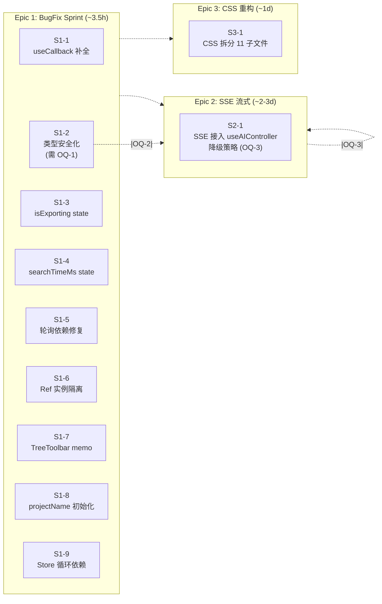
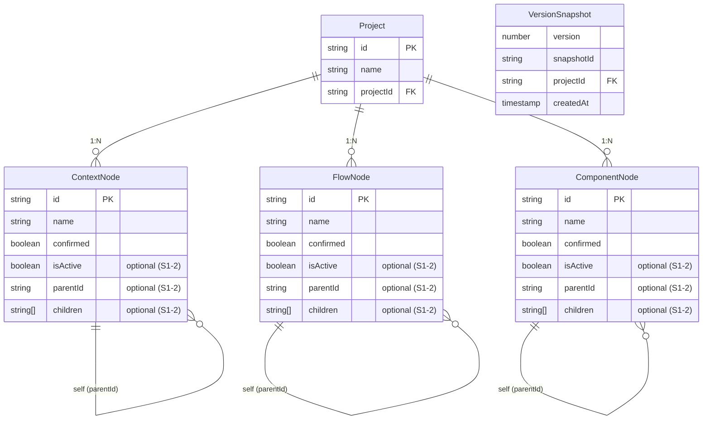

# Architecture — VibeX Canvas Implementation Fix

**Project**: vibex-canvas-implementation-fix
**Agent**: Architect
**Date**: 2026-04-11
**Code Baseline**: `79ebe010`
**Status**: Ready for Sprint 0

---

## 1. Tech Stack

| Layer | Technology | Version | Rationale |
|-------|-----------|---------|-----------|
| Runtime | React | 19.2.3 | Current project version; 0 new deps |
| Language | TypeScript | ^5 | Current project version; strict mode enabled |
| Build | Vite | ^6.4.1 | Current project version |
| Testing (Unit) | Vitest | latest | Project already uses Vitest + @testing-library/react; no migration needed |
| Testing (E2E) | gstack browse | — | Project skill; headless browser for Canvas interaction tests |
| State | Zustand | — | Already in use; no change |
| Styling | CSS Modules | — | Already in use; refactor only (no new tech) |
| SSE Client | canvasSseApi.ts | already implemented | Already exists at `src/lib/canvas/api/canvasSseApi.ts` |

**No new dependencies.** All changes are within existing technology choices.

---

## 2. Architecture Diagram

```mermaid
C4Context
  title Canvas Architecture (Post-Fix)

  Container_Boundary(canvas, "Canvas Boundary") {
    Component(canvasPage, "CanvasPage", "React Component", "Root canvas layout + requirement input")
    Component(toolbar, "CanvasToolbar", "React Component", "Action buttons: 生成/导出/搜索")
    Component(treeToolbar, "TreeToolbar", "React Component", "记忆化 renderContextTreeToolbar (S1-7)")

    Container_Boundary(hooks, "Hooks Layer") {
      Component(aiController, "useAIController", "Hook", "AI 生成入口 (Epic 2: SSE 接入点)")
      Component(canvasRenderer, "useCanvasRenderer", "Hook", "三树渲染 (S1-2: 类型安全)")
      Component(canvasExport, "useCanvasExport", "Hook", "导出功能 (S1-3: isExporting state)")
      Component(canvasSearch, "useCanvasSearch", "Hook", "搜索 (S1-4: searchTimeMs state)")
      Component(autoSave, "useAutoSave", "Hook", "版本轮询 + 快照 (S1-5/S1-6: 稳定性+隔离)")
      Component(canvasPanels, "useCanvasPanels", "Hook", "面板管理 (S1-8: projectName 初始化)")
    }

    Container_Boundary(stores, "Zustand Stores") {
      Component(contextStore, "contextStore", "Store", "Context/Model/Flow 树数据 (S1-9: 循环依赖修复)")
      Component(flowStore, "flowStore", "Store", "Flow/Component 树数据")
      Component(uiStore, "uiStore", "Store", "AI thinking / generating 状态")
      Component(sessionStore, "sessionStore", "Store", "projectName (S1-8)")
    }
  }

  Container_Boundary(api, "API Layer") {
    Component(canvasSseApi, "canvasSseApi", "SSE Client", "已实现: thinking/step_context/step_flow/step_components/done/error")
    Component(canvasApi, "canvasApi", "REST Client", "同步 fallback (OQ-3 降级策略)")
  }

  External(extBackend, "Backend", "SSE 端点 /api/v1/canvas/stream (OQ-2)")

  canvasPage --> toolbar
  canvasPage --> treeToolbar
  canvasPage --> hooks
  toolbar --> aiController
  hooks --> stores
  hooks --> api
  api --> canvasSseApi
  api --> extBackend
  canvasSseApi --> stores

  note top of canvasPage
    S1-1: handleRegenerateContexts useCallback 补全依赖
    S1-7: renderContextTreeToolbar useCallback 包裹
  end note

  note top of hooks
    所有 hook 变更: 无新增依赖，纯修复
  end note

  note top of stores
    S1-9: contextStore 用 getFlowStore().getState() 延迟获取
  end note
```



---

## 3. API Definitions

### 3.1 Canvas Hooks (Existing, Modified)

#### `useAIController.ts` — SSE Integration Point

```typescript
// 签名不变，新增 SSE 接入
interface AIControllerOptions {
  projectId: string
  requirementText: string
  onThinking?: (message: string) => void
  onDone?: () => void
  onError?: (err: Error) => void
}

type GeneratingState = 'idle' | 'streaming' | 'thinking' | 'done' | 'error' | 'fallback'

// 关键: handleRegenerateContexts 签名 (S1-1)
const handleRegenerateContexts = useCallback(
  async (options?: { requirementText?: string }) => {
    // 依赖: [aiThinking, isQuickGenerating, requirementText, toast]
  },
  [aiThinking, isQuickGenerating, requirementText, toast]
)
```

#### `useCanvasRenderer.ts` — Type Safe (S1-2)

```typescript
// 替换前 (类型不安全)
confirmed: (n as unknown as { isActive?: boolean }).isActive !== false,
parentId: (n as unknown as { parentId?: string }).parentId,
children: (n as unknown as { children?: string[] }).children ?? [],

// 替换后 (类型安全)
confirmed: n.isActive !== false,
parentId: n.parentId,
children: n.children ?? [],
```

#### `useCanvasExport.ts` — Reactive State (S1-3)

```typescript
// 替换前
const isExportingRef = useRef(false)
const isExporting = isExportingRef.current  // 非响应式

// 替换后
const [isExporting, setIsExporting] = useState(false)
const isExportingRef = useRef(false) // 仅内部防重入
```

#### `useCanvasSearch.ts` — Reactive State (S1-4)

```typescript
// 替换前
const searchTimeRef = useRef<number | null>(null)
const searchTimeMs = searchTimeRef.current

// 替换后
const [searchTimeMs, setSearchTimeMs] = useState<number | null>(null)
const searchTimeRef = useRef<number | null>(null)
```

#### `useAutoSave.ts` — Stable Polling + Instance Isolation (S1-5, S1-6)

```typescript
// S1-5: 替换前
}, [projectId, saveStatus])

// S1-5: 替换后
}, [projectId])

// S1-6: 替换前
const lastSnapshotVersionRef = { current: 0 }  // 模块级单例

// S1-6: 替换后
const lastSnapshotVersionRef = useRef(0)  // 实例级
```

#### `useCanvasPanels.ts` — Store Initialization (S1-8)

```typescript
// 替换前
const [projectName, setProjectName] = useState('我的项目')

// 替换后
const session = useSessionStore()
const [projectName, setProjectName] = useState(session.projectName || '我的项目')
```

### 3.2 Store — Delayed Access (S1-9)

```typescript
// contextStore.ts — 替换前
import { useFlowStore } from './flowStore'
const flowStore = useFlowStore.getState()

// contextStore.ts — 替换后
const getFlowStore = () => require('./flowStore').useFlowStore
// 使用处
const flowStore = getFlowStore().getState()
```

### 3.3 SSE API Contract

```typescript
// canvasSseApi.ts — 已实现
interface SSEEvents {
  thinking: { message: string }
  step_context: { nodes: BoundedContextNode[] }
  step_model: { nodes: BoundedContextNode[] }
  step_flow: { nodes: BusinessFlowNode[] }       // S1-2 类型安全
  step_components: { nodes: ComponentNode[] }    // S1-2 类型安全
  done: { summary: string }
  error: { code: string; message: string }
}

streamGenerate(opts: {
  requirement: string
  onThinking: (msg: string) => void
  onStepContext: (nodes: BoundedContextNode[]) => void
  onStepModel: (nodes: BoundedContextNode[]) => void
  onStepFlow: (nodes: BusinessFlowNode[]) => void
  onStepComponents: (nodes: ComponentNode[]) => void
  onDone: () => void
  onError: (err: Error) => void
}): Promise<void>
```

### 3.4 Data Model — Node Types

```typescript
// types.ts — S1-2 变更

interface BoundedContextNode {
  id: string
  name: string
  confirmed?: boolean
  isActive?: boolean   // 新增
  parentId?: string    // 新增
  children?: string[]  // 新增
  description?: string
}

interface BusinessFlowNode {
  id: string
  name: string
  confirmed?: boolean
  isActive?: boolean   // 新增 (需 OQ-1 澄清语义)
  parentId?: string    // 新增
  children?: string[]  // 新增
  // ... 其他已有字段
}

interface ComponentNode {
  id: string
  name: string
  confirmed?: boolean
  isActive?: boolean   // 新增 (需 OQ-1 澄清语义)
  parentId?: string    // 新增
  children?: string[]  // 新增
  // ... 其他已有字段
}
```

---

## 4. Data Model (Entity Relationships)



---

## 5. Testing Strategy

### 5.1 Testing Framework

| Layer | Framework | Why |
|-------|-----------|-----|
| Unit / Integration | Vitest | 项目已有；Vite 原生集成；`@testing-library/react` |
| E2E / Visual | gstack browse | 项目 skill；headless browser；截图对比 |
| Type Safety | `tsc --noEmit` | TypeScript strict mode；零新增错误 |

### 5.2 Test Coverage Requirements

- **Epic 1 BugFix**: 每个 Story ≥ 1 个 Vitest 单元测试；gstack E2E 手动回归
- **Epic 2 SSE**: Vitest mock SSE + gstack E2E happy path + 降级路径
- **Epic 3 CSS**: gstack 逐组件截图对比（0 视觉差异）
- **覆盖率目标**: ≥ 80%（Canvas hooks + stores）

### 5.3 Test Case Examples

#### S1-1: handleRegenerateContexts 防重入

```typescript
// tests/unit/hooks/canvas/useAIController.bugfix.test.tsx
import { renderHook, act } from '@testing-library/react'
import { useAIController } from '@/hooks/canvas/useAIController'

vi.mock('@/lib/canvas/api/canvasSseApi', () => ({
  canvasSseApi: {
    streamGenerate: vi.fn().mockImplementation(() => new Promise(r => setTimeout(r, 100)))
  }
}))

it('防重入: 连续调用仅触发一次', async () => {
  const { result } = renderHook(() => useAIController({ projectId: 'p1', requirementText: 'test' }))
  const [gen, { handleRegenerateContexts }] = result.current

  // 模拟连续点击
  const promise1 = act(async () => { await handleRegenerateContexts() })
  const promise2 = act(async () => { await handleRegenerateContexts() })

  await act(async () => { await promise1 })

  // 第二次调用应被防重入阻断
  const { canvasSseApi } = vi.mocked
  expect(canvasSseApi.streamGenerate).toHaveBeenCalledTimes(1)
})

it('依赖变化: requirementText 变化后生成内容匹配', async () => {
  const { result, rerender } = renderHook(
    ({ req }) => useAIController({ projectId: 'p1', requirementText: req }),
    { initialProps: { req: 'first' } }
  )
  const [, { handleRegenerateContexts }] = result.current

  await act(async () => { await handleRegenerateContexts() })

  rerender({ req: 'second' })
  await act(async () => { await handleRegenerateContexts() })

  const calls = vi.mocked(canvasSseApi.streamGenerate).mock.calls
  expect(calls[1][0].requirement).toBe('second')
})
```

#### S1-3: isExporting 响应式

```typescript
// tests/unit/hooks/canvas/useCanvasExport.bugfix.test.tsx
it('导出按钮点击后立即 disabled', async () => {
  render(<CanvasExport projectId="p1" />)
  const btn = screen.getByRole('button', { name: /导出/ })

  await userEvent.click(btn)
  expect(btn).toBeDisabled() // 立即响应

  await waitFor(() => expect(btn).toBeEnabled(), { timeout: 10000 })
})
```

#### S1-5: 版本轮询稳定性

```typescript
// tests/unit/hooks/canvas/useAutoSave.bugfix.test.tsx
it('轮询不因 saveStatus 变化重置', () => {
  const saveStatus = { current: 0 }
  const { rerender } = renderHook(
    ({ status }) => useAutoSave({ projectId: 'p1', saveStatus: status }),
    { initialProps: { status: 0 } }
  )

  const polling1 = getPollingInterval()

  // saveStatus 变化不应重建轮询
  rerender({ status: 1 })
  const polling2 = getPollingInterval()

  expect(polling1).toBe(polling2) // 同一定时器实例
})
```

#### S1-6: 多标签页版本隔离

```typescript
it('多实例版本追踪独立', () => {
  const { result: r1 } = renderHook(() => useAutoSave({ projectId: 'p1' }))
  const { result: r2 } = renderHook(() => useAutoSave({ projectId: 'p1' }))

  const v1 = r1.current[2].getLastSnapshotVersion() // lastSnapshotVersionRef.current
  const v2 = r2.current[2].getLastSnapshotVersion()

  expect(v1).toBeDefined()
  expect(v2).toBeDefined()
  expect(v1).not.toBe(v2) // 各实例独立
})
```

#### S2-1: SSE 流式 (gstack E2E)

```typescript
// tests/canvas/sse-streaming.test.ts (gstack)
it('SSE happy path: Thinking → 树填充 → done', async () => {
  await goto('/canvas/new')
  await fill('[data-testid="requirement-input"]', '用户登录流程')
  await click('button:has-text("开始生成")')

  // Thinking 面板可见
  await waitFor(() => {
    const el = document.querySelector('[data-testid="ai-thinking"]')
    expect(el?.textContent?.length).toBeGreaterThan(0)
  }, { timeout: 30000 })

  // 树节点填充
  await waitFor(() => {
    const items = document.querySelectorAll('[role="treeitem"]')
    return items.length > 0
  }, { timeout: 60000 })

  // 完成状态
  await waitFor(() => {
    return document.body.textContent?.match(/生成完成|done/i)
  }, { timeout: 90000 })
})
```

#### S3-1: CSS 拆分 (gstack Visual)

```typescript
// tests/canvas/css-refactor.test.ts (gstack)
it('拆分后样式一致', async () => {
  const baselines = [
    'canvas-baseline-fullpage.png',
    'canvas-baseline-toolbar.png',
    'canvas-baseline-context-tree.png',
    'canvas-baseline-flow-tree.png',
  ]

  await goto('/canvas/delivery/seed-project')
  await screenshot('canvas-refactored-fullpage.png')

  for (const base of baselines) {
    const refactored = base.replace('-baseline-', '-refactored-')
    expect(gstack.screenshot(refactored)).toMatchImage(base)
  }
})
```

---

## 6. Risk Assessment

| Risk | Likelihood | Impact | Mitigation |
|------|-----------|--------|------------|
| **SSE 后端端点不存在** (OQ-2) | Medium | High | Sprint 0 结束后，Dev 立即 `curl` 验证 `/api/v1/canvas/stream` |
| **S1-2 isActive 语义错误** (OQ-1) | Medium | High | PM 澄清前不合并 S1-2；S1-1 先跑通 |
| **CSS 拆分样式丢失** | Medium | High | 逐文件迁移 + gstack 截图对比；每个 CSS 文件独立 commit |
| **SSE 降级逻辑引入循环** | Low | Medium | 降级仅调用现有 `canvasApi.generateContexts`；单层 fallback |
| **useCallback 补全引入循环依赖** | Low | Low | S1-1 补全的依赖都是 primitive，不会引入新引用 |
| **版本轮询 ref 修复破坏多标签页** | Low | High | S1-6 修复后手动测试双标签页冲突场景 |
| **TypeScript 类型变更引发级联错误** | Low | Medium | `tsc --noEmit` + Vitest 验证每个 Story |

---

## 7. Open Questions (Pre-Execution)

| # | Question | Owner | Blocker for |
|---|----------|-------|------------|
| OQ-1 | `isActive` 在 `BusinessFlowNode`/`ComponentNode` 中的语义？是否等同于 `confirmed`？ | PM | S1-2 |
| OQ-2 | SSE 后端 `/api/v1/canvas/stream` 是否已部署并可用？ | Dev | S2-1 |
| OQ-3 | SSE 失败降级策略：自动切同步 API 还是报错提示？ | PM | S2-1 UI |
| OQ-4 | CSS 拆分粒度：PRD 说 6 个文件，Epic3 Spec 说 11 个子文件，以哪个为准？ | Architect | S3-1 |

**OQ-4 决策**: 以 Epic3 Spec 为准（11 个子文件），更合理的粒度覆盖所有组件场景。

---

## 8. 执行决策

- **决策**: 已采纳（分三阶段执行）
- **执行项目**: `vibex-canvas-implementation-fix`
- **执行日期**: 2026-04-11

| Phase | Sprint | 内容 | 工期 | 前置条件 |
|-------|--------|------|------|----------|
| Sprint 0 | Epic 1 | BugFix Sprint (S1-1 ~ S1-9) | ~3.5h | S1-2 需 OQ-1 澄清 |
| Sprint 1 | Epic 2 | SSE 流式生成 (S2-1) | ~2-3 days | OQ-2 验证 |
| Sprint 2 | Epic 3 | CSS 架构重构 (S3-1) | ~1 day | 无 |
