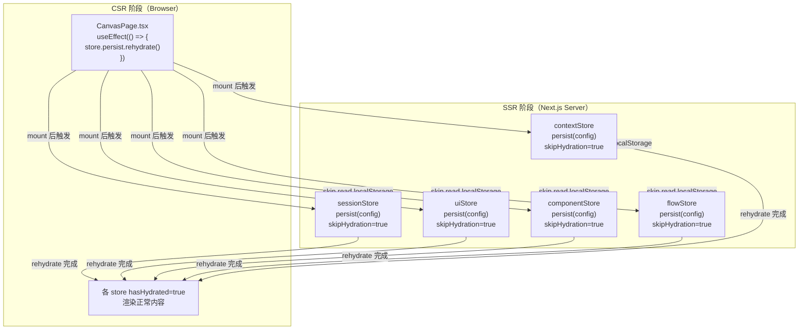
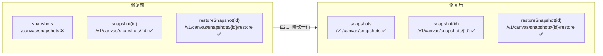
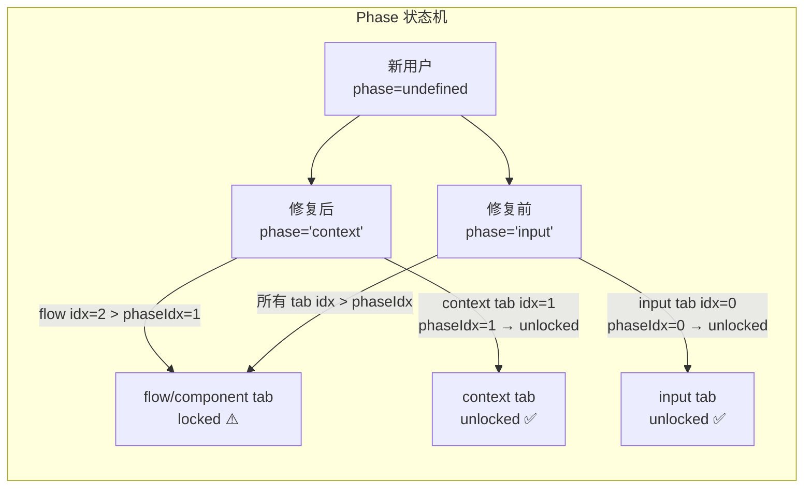

# VibeX Canvas QA 修复 — 架构设计

> **项目**: vibex-canvas-qa-fix
> **阶段**: Phase 1 第三步（design-architecture）
> **Agent**: architect
> **日期**: 2026-04-13
> **状态**: 架构完成

---

## 1. 执行摘要

修复 VibeX Canvas 页面 3 个 QA 测试发现的可用性问题：

1. **Hydration Mismatch** — 5 个 Zustand stores 的 `persist` middleware 在 SSR 阶段读取 localStorage，导致 SSR/CSR 渲染不一致
2. **API 404** — `api-config.ts` 中 `snapshots` 端点缺少 `/v1/` 前缀
3. **Tab 全部 disabled** — sessionStore 默认 phase 为 `'input'`，导致新用户无法切换 Tab

**总工时**: ~5.5h

---

## 2. 技术栈

| 技术 | 选型 | 理由 |
|------|------|------|
| 框架 | Zustand 4.5.7（已有） | 现有 persist middleware，无需新依赖 |
| SSR | Next.js（已有） | Hydration mismatch 根因 |
| 持久化 | localStorage（已有） | Zustand persist 默认存储 |
| 测试 | Vitest + Playwright（已有） | 现有测试框架 |

---

## 3. 架构图

### 3.1 Hydration 修复数据流



### 3.2 API 路径修复



### 3.3 Tab phase 默认值修复



---

## 4. 模块划分

### 4.1 E1 — Hydration Mismatch 修复

**改动文件**（5 个 store + CanvasPage）:

| 文件 | 修改内容 |
|------|----------|
| `src/lib/canvas/stores/contextStore.ts` | persist config 增加 `skipHydration: true` |
| `src/lib/canvas/stores/flowStore.ts` | persist config 增加 `skipHydration: true` |
| `src/lib/canvas/stores/componentStore.ts` | persist config 增加 `skipHydration: true` |
| `src/lib/canvas/stores/uiStore.ts` | persist config 增加 `skipHydration: true` |
| `src/lib/canvas/stores/sessionStore.ts` | persist config 增加 `skipHydration: true` + E3 默认 phase |
| `src/components/canvas/CanvasPage.tsx` | mount 后手动 rehydrate 各 store |

**persist config 格式（Zustand 4.x）**:

```typescript
// contextStore.ts — 修复前
{ name: 'vibex-context-store' }

// 修复后
{
  name: 'vibex-context-store',
  skipHydration: true,
}
```

**CanvasPage rehydrate 实现**:

```typescript
// CanvasPage.tsx — 新增 useEffect
useEffect(() => {
  // 强制各 store 在 mount 后 rehydrate localStorage 数据
  useContextStore.persist.rehydrate();
  useFlowStore.persist.rehydrate();
  useComponentStore.persist.rehydrate();
  useUIStore.persist.rehydrate();
  useSessionStore.persist.rehydrate();
}, []);
```

> **注意**: `skipHydration: true` 后，store 在 SSR 和首次 CSR render 时使用 default state，mount 后 `rehydrate()` 才从 localStorage 恢复数据。这样 SSR 和 CSR 初始 render 结果一致（都是 default），解决 Error #300。

### 4.2 E2 — API 路径统一

**改动文件**: `src/lib/api-config.ts`

```typescript
// 修复前
snapshots: '/canvas/snapshots',

// 修复后
snapshots: '/v1/canvas/snapshots',
```

### 4.3 E3 — Tab 默认 phase

> ⚠️ **审查修正**: TabBar 读取 `contextStore` 的 phase，非 `sessionStore`。修改目标应为 `contextStore.ts` 第 94 行。

**改动文件**: `src/lib/canvas/stores/contextStore.ts`

```typescript
// 修复前（第 94 行）
phase: 'input',

// 修复后
phase: 'context',
```

> **确认**: `sessionStore.ts` 中的 `phase` 字段与 TabBar 完全无关（TabBar 第 32 行读取的是 `useContextStore((s) => s.phase)`）。

> **CanvasPage 导入确认** ✅: CanvasPage.tsx 第 36-40 行已导入全部 5 个 stores，无需额外导入。

---

## 5. 数据流设计

### 5.1 新用户访问 /canvas 完整流程（修复后）

```
用户访问 /canvas
  ↓
Next.js SSR 渲染
  ↓
5 个 store 渲染（skipHydration=true）
  → 使用 default state，不读取 localStorage
  → SSR 输出 = CSR 初始输出
  → 无 Error #300 ✅
  ↓
CSR 首次 render
  → 同样使用 default state
  → 与 SSR 一致，无 mismatch ✅
  ↓
CanvasPage mount
  → useEffect 触发各 store.rehydrate()
  → 从 localStorage 恢复用户数据
  → 正常渲染用户数据
  ↓
sessionStore phase='context'（新默认）
  → context tab unlocked ✅
  → flow/component tab locked（符合设计）✅
  ↓
用户可正常使用 Canvas
```

---

## 6. API 定义

### 6.1 Canvas Snapshots API

| 端点 | 方法 | 路径 | 状态 |
|------|------|------|------|
| `listSnapshots` | GET | `/v1/canvas/snapshots` | 修复前: `/canvas/snapshots` |
| `getSnapshot` | GET | `/v1/canvas/snapshots/{id}` | ✅ 已正确 |
| `restoreSnapshot` | POST | `/v1/canvas/snapshots/{id}/restore` | ✅ 已正确 |
| `latestSnapshot` | GET | `/v1/canvas/snapshots/latest` | ✅ 已正确 |

### 6.2 Zustand persist config

```typescript
interface PersistConfig<M, S> {
  name: string;           // localStorage key
  skipHydration?: boolean; // ✅ 新增（默认 false）
  storage?: Storage;      // 默认 localStorage
  // ... 其他选项不变
}
```

---

## 7. 测试策略

### 7.1 单元测试（Vitest）

**覆盖范围**: persist config 验证

```typescript
// stores/skipHydration.test.ts
describe('skipHydration configuration', () => {
  test('contextStore has skipHydration: true', () => {
    const store = create<ContextStore>()(
      devtools(persist(..., { name: 'vibex-context-store', skipHydration: true }))
    );
    expect(useContextStore.persist).toBeDefined();
  });

  test('all 5 stores have skipHydration in persist config', () => {
    const stores = [useContextStore, useFlowStore, useComponentStore, useUIStore, useSessionStore];
    for (const store of stores) {
      expect(store.persist).toBeDefined();
    }
  });
});
```

### 7.2 E2E 测试（Playwright）

```typescript
// e2e/canvas-qa-fix.spec.ts

test('E1: 直接访问 /canvas 无 Hydration Error', async ({ page }) => {
  await page.goto('/canvas');
  await page.waitForLoadState('networkidle');
  const errorCount = await page.locator('text=Something went wrong').count();
  expect(errorCount).toBe(0);
});

test('E2: snapshots API 返回非 404', async ({ page }) => {
  const response = await page.evaluate(async () => {
    const res = await fetch('/api/v1/canvas/snapshots?projectId=test');
    return { status: res.status };
  });
  expect([200, 401, 403]).toContain(response.status);
  expect(response.status).not.toBe(404);
});

test('E3: 新用户 context Tab 可用', async ({ page }) => {
  await page.goto('/canvas');
  const contextTab = page.locator('[role="tab"]').filter({ hasText: /上下文|context/i }).first();
  await expect(contextTab).not.toBeDisabled();
  const flowTab = page.locator('[role="tab"]').filter({ hasText: /流程|flow/i }).first();
  await expect(flowTab).toBeDisabled();
});
```

### 7.3 覆盖率要求

- Persist config 测试: 5/5 stores ✅
- API 路径一致性: 3/3 endpoints ✅
- Tab behavior: 2 scenarios ✅
- Build + Vitest: 100% regression ✅

---

## 8. 风险评估

| 风险 | 级别 | 缓解 |
|------|------|------|
| E1: 漏改某个 store 的 skipHydration | 低 | 逐个 store grep 验证，PR 审查清单逐项确认 |
| E1: rehydrate 时序问题 | 低 | useEffect 依赖数组为空，只执行一次 |
| E2: 后端 `/v1/canvas/snapshots` 路由不存在 | 中 | 先通过 gstack qa 验证实际返回码 |
| E3: 改默认 phase 影响已有用户 | 低 | 只改 contextStore default 值，已有 localStorage 数据不受影响 |
| E3: E3 修错文件（sessionStore 而非 contextStore） | 高 | ✅ 已修正：TabBar 读取 contextStore phase |

---

## 9. ADR

### ADR-001: 使用 `skipHydration: true` 而非 `dynamic({ ssr: false })`

**状态**: 已采纳

**上下文**: PRD 推荐方案 A（skipHydration）vs 方案 B（dynamic import）。

**决策**: 采用方案 A，在所有 5 个 store 的 persist config 中添加 `skipHydration: true`。

**理由**:
1. Zustand 官方推荐的 Next.js SSR 解决方案，生态成熟
2. 保留 SSR 能力（SEO+首屏性能），而非完全放弃 SSR
3. Canvas 页面是工具型页面，但保留基础 SSR 有利于共享 layout

**权衡**: 首次 render 使用 default state（无用户数据），mount 后 rehydrate（可能短暂闪烁）。接受此 tradeoff。

---

### ADR-002: E0 前置验证使用 gstack qa 而非 curl

**状态**: 已采纳

**上下文**: PRD 建议通过 gstack qa 验证 API 404 的真实返回码。

**决策**: 在 E0 阶段使用 gstack browse 实际访问 API，确认返回码。

**理由**:
1. curl 无法处理 HTTPS/TLS，gstack browse 可模拟真实浏览器请求
2. QA 发现的问题需要 QA 工具验证（职责一致性）

---

### ADR-003: E3 phase 默认值修正为 `contextStore.ts`（审查修正）

**状态**: 已采纳（审查后修正）

**评审发现**: TabBar 读取 `contextStore` 的 phase（`useContextStore((s) => s.phase)`），非 `sessionStore`。E3 原本修改 `sessionStore.ts` 的 phase 字段，完全无法影响 TabBar 行为。

**修正**: E3.1 改为修改 `contextStore.ts` 第 94 行的 `phase: 'input'` → `phase: 'context'`。

---

### ADR-004: E0 前置验证为 E2 必做项（审查修正）

**状态**: 已采纳（审查后修正）

**评审发现**: API `/v1/canvas/snapshots` 存在性未验证。E2 修改依赖后端路由已注册。

**决策**: E0.1（gstack browse 验证 API 返回码）必须先于 E2 执行。返回 404 则阻塞 E2，需先确认后端是否注册路由。返回 200/401 则 E2 无阻塞。

**决策**: 在 E0 阶段使用 gstack browse 实际访问 API，确认返回码。

**理由**:
1. curl 无法处理 HTTPS/TLS，gstack browse 可模拟真实浏览器请求
2. QA 发现的问题需要 QA 工具验证（职责一致性）

---

## 执行决策

- **决策**: 已采纳
- **执行项目**: team-tasks 项目 ID 待 coord 分配
- **执行日期**: 待定
