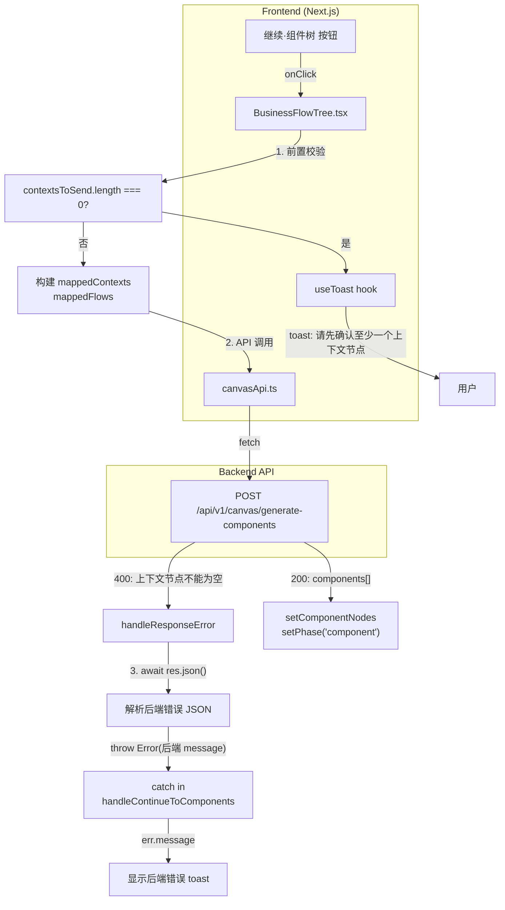

# Architecture — vibex-canvas-silent-400

**项目**: vibex-canvas-silent-400
**版本**: v1.0
**日期**: 2026-04-17
**状态**: Architect Approved

---

## 1. 执行摘要

**问题**: Canvas 三步流程第三步（生成组件树）存在静默 400 错误——用户未勾选/确认任何上下文节点时点击"继续·组件树"，后端返回 400 但前端 toast 仅显示通用错误 `"生成组件树失败"`，用户不知如何操作。

**根因**: 两个独立 bug：
1. `BusinessFlowTree.tsx` — `handleContinueToComponents` 缺少 `contextsToSend` 空数组前置校验，无效请求直击 API
2. `canvasApi.ts` — `handleResponseError` 中 `res.json()` 缺少 `await`，后端详细错误信息被吞掉

**方案**: 前端修复（无后端依赖），改动量极小，风险极低。

---

## 2. Tech Stack

| 层级 | 技术 | 版本 | 理由 |
|------|------|------|------|
| 前端框架 | Next.js + React | 14/15 | 现有架构 |
| 状态管理 | Zustand | latest | 现有架构 |
| Toast | useToast hook | 现有 | 已有基础设施 |
| 测试框架 | Vitest + React Testing Library | latest | 现有项目测试栈 |

**无新增依赖**。所有改动均为已有代码修复。

---

## 3. 架构图



**图注**: 三处改动点用 ①②③ 标注：
- ① `BusinessFlowTree.tsx` — 前置校验 + toast 提示
- ② `canvasApi.ts` — `handleResponseError` 添加 `await`
- ③ `BusinessFlowTree.tsx` — 按钮 disabled 逻辑增强（可选，但已在 PRD 中要求）

---

## 4. 改动范围

### 4.1 `BusinessFlowTree.tsx`

**文件**: `vibex-fronted/src/components/canvas/BusinessFlowTree.tsx`

**改动 1**: `handleContinueToComponents` 中，`contextsToSend` 构建后增加前置校验

```typescript
// contextsToSend 构建后（约第 782 行后）：
if (contextsToSend.length === 0) {
  toast.showToast('请先确认至少一个上下文节点后再生成组件树', 'error');
  return;
}
```

**改动 2**: "继续·组件树"按钮 disabled 逻辑增强

当前：
```tsx
disabled={componentGenerating}
```

改为：
```tsx
disabled={componentGenerating || contextsToSend.length === 0}
```

注：`contextsToSend` 在 render 阶段不可直接访问，需要通过 `contextNodes` 和 `selectedNodeIds` 派生：

```typescript
const activeContexts = contextNodes.filter((ctx) => ctx.isActive !== false);
const selectedContextSet = new Set(selectedNodeIds.context);
const contextsToSend =
  selectedContextSet.size > 0
    ? activeContexts.filter((ctx) => selectedContextSet.has(ctx.nodeId))
    : activeContexts;

const canGenerateComponents =
  flowNodes.length > 0 && contextsToSend.length > 0 && !componentGenerating;
```

### 4.2 `canvasApi.ts`

**文件**: `vibex-fronted/src/lib/canvas/api/canvasApi.ts`

**改动**: `handleResponseError` 函数（约第 145 行），`res.json()` 前加 `await`：

当前（Bug）：
```typescript
const err = res.json().catch(() => ({ error: `HTTP ${res.status}` }));
throw new Error((err as { error?: string }).error ?? defaultMsg);
```

改为：
```typescript
const err = await res.json().catch(() => ({ error: `HTTP ${res.status}` }));
throw new Error((err as { error?: string }).error ?? defaultMsg);
```

### 4.3 全局扫描（验证）

扫描项目中所有 `res.json()` 调用，确保均有 `await`：

```bash
grep -rn "res\.json()" vibex-fronted/src/
# 预期：所有 res.json() 调用的父节点为 AwaitExpression
```

---

## 5. API 定义（无变更）

本修复不涉及 API 接口变更。以下为相关 API 摘要：

### POST /api/v1/canvas/generate-components

**请求**:
```typescript
interface GenerateComponentsRequest {
  contexts: Array<{ id: string; name: string; description: string; type: string }>;
  flows: Array<{ id?: string; name: string; contextId: string; steps: Array<{ name: string; actor: string }> }>;
  sessionId: string;
}
```

**成功响应 (200)**:
```typescript
interface GenerateComponentsResponse {
  success: true;
  components: ComponentNode[];
  confidence?: number;
}
```

**错误响应 (400)**:
```typescript
// 当前后端返回格式：
{ "error": "上下文节点不能为空" }

// 修复后前端能正确解析此 JSON 并显示：
// toast: "上下文节点不能为空"
```

---

## 6. 数据模型

无新增数据模型。以下为相关状态字段：

| Store | 字段 | 类型 | 说明 |
|-------|------|------|------|
| `useContextStore` | `contextNodes` | `BoundedContextNode[]` | 上下文节点列表 |
| `useContextStore` | `selectedNodeIds.context` | `string[]` | 用户选中的上下文 ID |
| `useFlowStore` | `flowNodes` | `BusinessFlowNode[]` | 流程节点列表 |
| 本地 state | `componentGenerating` | `boolean` | 生成中锁 |

**派生计算**（无状态新增）：
```typescript
const contextsToSend = selectedContextSet.size > 0
  ? activeContexts.filter(ctx => selectedContextSet.has(ctx.nodeId))
  : activeContexts;
// activeContexts = contextNodes.filter(ctx => ctx.isActive !== false)
```

---

## 7. 性能影响评估

| 指标 | 评估 | 说明 |
|------|------|------|
| **Bundle size** | 无变化 | 无新增依赖 |
| **Runtime performance** | 无影响 | 仅增加一个数组长度检查（O(n)） |
| **API 调用量** | 减少无效请求 | 前置校验拦截空数组请求，减少 400 错误响应 |
| **用户体验** | 显著改善 | 无效操作有明确提示，无需猜测 |
| **回归风险** | 低 | 仅修改校验逻辑，正常路径不受影响 |

**结论**: 性能影响为零或正向（减少无效 API 调用）。

---

## 8. 测试策略

### 8.1 测试框架

| 类型 | 框架 | 说明 |
|------|------|------|
| 单元测试 | Vitest + RTL | 已有测试栈 |
| 集成测试 | Vitest | 覆盖 handleResponseError |
| E2E（可选） | Playwright | 验证真实用户路径 |

### 8.2 测试用例

#### F1.1: contextsToSend 空校验

```typescript
// AC1: contextsToSend 为空时，toast 显示具体提示
it('shows specific toast when contextsToSend is empty', async () => {
  const toastMock = vi.fn();
  vi.mocked(useToast).mockReturnValue({ showToast: toastMock } as any);

  const contextNodes = [
    { nodeId: 'c1', name: 'Ctx1', isActive: false }, // 未确认
    { nodeId: 'c2', name: 'Ctx2', isActive: false }, // 未确认
  ];

  renderBusinessFlowTree({ contextNodes, flowNodes: [{ nodeId: 'f1', name: 'Flow1', steps: [] }] });

  await userEvent.click(screen.getByRole('button', { name: /继续·组件树/i }));

  expect(toastMock).toHaveBeenCalledWith(
    '请先确认至少一个上下文节点后再生成组件树',
    'error'
  );
});

// AC2: 校验后函数正确 early return，不触发 API 调用
it('does not call fetchComponentTree when contextsToSend is empty', async () => {
  const fetchMock = vi.fn().mockRejectedValue(new Error('API called'));
  vi.mocked(canvasApi.fetchComponentTree).mockImplementation(fetchMock);

  renderBusinessFlowTree({ contextNodes: [{ nodeId: 'c1', isActive: false }], flowNodes: [...] });

  await userEvent.click(screen.getByRole('button', { name: /继续·组件树/i }));

  expect(fetchMock).not.toHaveBeenCalled();
});
```

#### F1.2: 按钮 disabled 逻辑

```typescript
// AC1: contextsToSend 为空时，按钮 disabled === true
it('disables button when contextsToSend is empty', () => {
  renderBusinessFlowTree({
    contextNodes: [{ nodeId: 'c1', name: 'Ctx1', isActive: false }],
    flowNodes: [{ nodeId: 'f1', name: 'Flow1', steps: [] }],
  });
  expect(screen.getByRole('button', { name: /继续·组件树/i })).toBeDisabled();
});

// AC2: contextsToSend 有效时，按钮可点击
it('enables button when contextsToSend is valid', () => {
  renderBusinessFlowTree({
    contextNodes: [{ nodeId: 'c1', name: 'Ctx1', isActive: true }],
    flowNodes: [{ nodeId: 'f1', name: 'Flow1', steps: [] }],
  });
  expect(screen.getByRole('button', { name: /继续·组件树/i })).toBeEnabled();
});
```

#### F2.1: handleResponseError async/await 修复

```typescript
// AC1: 正确解析后端 JSON 错误响应
it('correctly parses backend JSON error with await', async () => {
  const mockResponse = {
    ok: false,
    status: 400,
    json: vi.fn().mockResolvedValue({ error: '上下文节点不能为空' }),
  } as unknown as Response;

  await expect(
    handleResponseError(mockResponse, 'defaultMsg')
  ).rejects.toThrow('上下文节点不能为空');
});

// AC2: 非 JSON 响应正确 fallback
it('falls back to defaultMsg for non-JSON response', async () => {
  const mockResponse = {
    ok: false,
    status: 400,
    json: vi.fn().mockRejectedValue(new Error('parse error')),
  } as unknown as Response;

  await expect(
    handleResponseError(mockResponse, 'defaultMsg')
  ).rejects.toThrow('defaultMsg');
});
```

#### 正常路径回归

```typescript
// 有效 contexts + flows → 正常生成组件树
it('generates component tree with valid contexts and flows', async () => {
  vi.mocked(canvasApi.fetchComponentTree).mockResolvedValue([{ nodeId: 'comp1', name: 'Page1', type: 'page' }]);

  renderBusinessFlowTree({
    contextNodes: [{ nodeId: 'c1', name: 'Ctx1', isActive: true }],
    flowNodes: [{ nodeId: 'f1', name: 'Flow1', steps: [{ stepId: 's1', name: 'Step1', actor: 'User' }] }],
  });

  await userEvent.click(screen.getByRole('button', { name: /继续·组件树/i }));

  expect(canvasApi.fetchComponentTree).toHaveBeenCalledWith(
    expect.objectContaining({
      contexts: expect.arrayContaining([expect.objectContaining({ id: 'c1' })]),
      flows: expect.arrayContaining([expect.objectContaining({ name: 'Flow1' })]),
    })
  );
});
```

### 8.3 覆盖率要求

| 文件 | 覆盖率目标 |
|------|-----------|
| `BusinessFlowTree.tsx` | > 80%（新增校验逻辑 100%） |
| `canvasApi.ts` | > 80%（handleResponseError 100%） |

---

## 9. 风险评估

| 风险 | 等级 | 缓解措施 |
|------|------|----------|
| 误判用户意图（用户只想过滤而非要求全选） | 低 | 逻辑与 CanvasPage.tsx 保持一致：选中则使用选中项，否则使用全部 active 项 |
| toast 消息与 PRD 不一致 | 低 | 消息文本硬编码，单元测试覆盖 |
| `handleResponseError` 修改影响其他 API | 中 | 回归测试覆盖所有 API 错误路径（getStatus、createSnapshot 等） |
| 前置校验误杀（contextsToSend 为空但用户可通过其他路径生成） | 低 | 仅影响这一处入口，不影响其他生成路径 |

---

## 10. 执行决策

- **决策**: 已采纳
- **执行项目**: vibex-canvas-silent-400
- **执行日期**: 待 coord 排期
- **优先级**: P2
- **实施路径**: 方案 A（前端前置校验）+ F2.1（async/await 修复），并行实施
- **依赖**: 无后端依赖，纯前端修复
