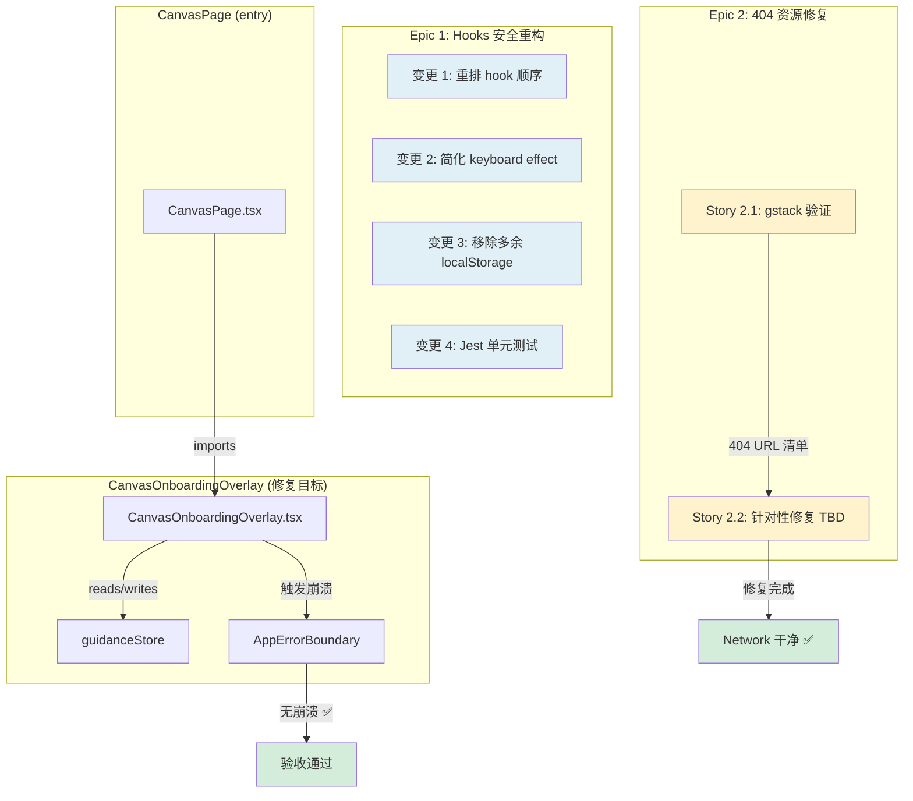

# Architecture: VibeX Canvas Urgent Bugs — P0 紧急修复

**Agent**: Architect
**Date**: 2026-04-11
**Project**: vibex-canvas-urgent-bugs
**Baseline**: `79ebe010`
**Status**: Active

---

## 1. 执行摘要

两个 P0 bug 影响 VibeX Canvas 核心流程：

| Bug | 根因 | 修复策略 |
|-----|------|----------|
| Bug-1: React Hooks Violation | `CanvasOnboardingOverlay` 中 useCallback 定义在 early return 之后，处于架构临界状态 | 重构 hook 顺序，绝对安全模式 |
| Bug-2: 4 个 404 资源 | 路径不一致（`/templates/ecommerce/` vs `e-commerce/`）+ 外部 SDK 加载 | gstack 验证定位 → 针对性修复 |

**Epic 1 立即执行（方案明确）；Epic 2 待 Story 2.1 gstack 验证后补充具体修复方案。**

---

## 2. Tech Stack

| Layer | Technology | Version | Rationale |
|-------|-----------|---------|-----------|
| Runtime | React | 18.x | 现有项目依赖 |
| State | Zustand | 5.x (现有) | guidanceStore 已在用，无新增依赖 |
| Styling | CSS Modules | 现有 | 已有 `CanvasOnboardingOverlay.module.css` |
| Testing | Jest + React Testing Library | 现有 | 项目已有测试基础设施 |
| Verification | gstack (Playwright-based) | 现有 | 已集成 browser 自动化验证 |
| Linting | ESLint + react-hooks plugin | 现有 | 强制 hooks 规则合规 |

**无新增依赖** — Bug 修复是纯重构/验证，不引入新库。

---

## 3. Architecture Diagram



### Epic 1 Hook 调用顺序架构

```
export const CanvasOnboardingOverlay = memo(function() {

  // === 阶段 1: 所有 hooks (无条件定义，不允许 early return) ===
  const overlayRef = useRef(null);
  const completed = useGuidanceStore(s => s.canvasOnboardingCompleted);
  const dismissed = useGuidanceStore(s => s.canvasOnboardingDismissed);
  const currentStep = useGuidanceStore(s => s.canvasOnboardingStep);
  const nextOnboardingStep = useGuidanceStore(s => s.nextOnboardingStep);
  const prevOnboardingStep = useGuidanceStore(s => s.prevOnboardingStep);
  const completeCanvasOnboarding = useGuidanceStore(s => s.completeCanvasOnboarding);
  const dismissCanvasOnboarding = useGuidanceStore(s => s.dismissCanvasOnboarding);
  const startCanvasOnboarding = useGuidanceStore(s => s.startCanvasOnboarding);

  // useCallback 也在此阶段（在所有 hooks 之后，early return 之前）
  const handleDismiss = useCallback(() => { ... }, [dismissCanvasOnboarding]);
  const handleComplete = useCallback(() => { ... }, [completeCanvasOnboarding]);
  const handleNext = useCallback(() => { ... }, [nextOnboardingStep]);
  const handlePrev = useCallback(() => { ... }, [prevOnboardingStep]);

  // useEffect hooks
  useEffect(auto-start);
  useEffect(keyboard 直接调用 store action);

  // === 阶段 2: 所有 early returns (在所有 hooks 之后) ===
  if (completed || dismissed) return null;
  if (currentStep === 0) return null;

  // === 阶段 3: JSX render ===
  return <div>...</div>;
});
```

---

## 4. API Definitions

### 4.1 Zustand Store (现有 API, 无变更)

```typescript
// src/stores/guidanceStore.ts
interface GuidanceStore {
  // State
  canvasOnboardingCompleted: boolean;
  canvasOnboardingDismissed: boolean;
  canvasOnboardingStep: number; // 0 = 未开始, 1-3 = 步骤

  // Actions
  startCanvasOnboarding(): void;
  nextOnboardingStep(): void;
  prevOnboardingStep(): void;
  completeCanvasOnboarding(): void;
  dismissCanvasOnboarding(): void;
}
```

**Epic 1 不新增/不修改任何 API。** guidanceStore 接口保持不变。

### 4.2 Epic 2 API (TBD — 依赖 Story 2.1 产出)

Epic 2 的接口变更取决于 404 资源的具体来源：
- 若 `/templates/ecommerce/` 路径错误 → 修正为 `/templates/e-commerce/`
- 若动态 import 路径问题 → 修正 `@/lib/canvas/templateLoader` import
- 若 404 来自外部 SDK → 验证环境网络，或调整超时策略

**Story 2.1 (gstack 验证) 完成后，此节补充完整。**

---

## 5. Data Model

### 5.1 OnboardingStepData (Epic 1, 现有类型)

```typescript
// CanvasOnboardingOverlay.tsx 内联类型
interface OnboardingStepData {
  step: number;           // 1-3
  title: string;
  description: string;
  targetArea: 'tabbar' | 'treepanel' | 'input' | 'projectbar';
  targetSelector: string; // CSS selector
  icon: React.ReactNode;
}

const ONBOARDING_STEPS: OnboardingStepData[] = [
  { step: 1, title: '三树结构', targetArea: 'tabbar', ... },
  { step: 2, title: '节点操作', targetArea: 'treepanel', ... },
  { step: 3, title: '快捷键加速', targetArea: 'projectbar', ... },
];
```

**数据模型不变。**

### 5.2 Epic 2 数据模型 (TBD)

Story 2.1 gstack 验证完成后，补充 404 资源的具体数据。

---

## 6. Testing Strategy

### 6.1 Epic 1: Hooks 安全重构

#### 测试框架
- **Jest** (现有) + **React Testing Library** (现有)
- 测试文件: `vibex-fronted/src/components/guidance/__tests__/CanvasOnboardingOverlay.test.tsx` (新建)

#### 覆盖率要求
- 语句覆盖率 ≥ 85%
- 核心路径（Skip / Complete / keyboard navigation）覆盖率 100%

#### 核心测试用例

| # | 测试用例 | Category | expect() 断言 | 注意事项 |
|---|----------|----------|---------------|----------|
| T1 | 跳过引导流程 | Happy path | `expect(screen.queryByRole('button', { name: 'Try Again' })).not.toBeInTheDocument()` | |
| T2 | 完成引导流程 | Happy path | `expect(screen.getByRole('button', { name: '完成' })).toBeInTheDocument()` | |
| T3 | 连续快速点击 Skip 5 次 | Edge case | `expect(screen.queryByRole('button', { name: 'Try Again' })).not.toBeInTheDocument()` | |
| T4 | Step 0 不渲染 overlay | Edge case | `expect(screen.queryByRole('dialog')).not.toBeInTheDocument()` | ⚠️ **需用 `jest.useFakeTimers()`** mock 800ms setTimeout，否则 auto-start effect 导致 flaky |
| T5 | ESC 键关闭引导 | Integration | `expect(mockStore.dismissCanvasOnboarding).toHaveBeenCalled()` | |
| T6 | Next/Prev 步骤切换 | Happy path | `expect(screen.getByText('节点操作')).toBeInTheDocument()` | |
| T7 | localStorage 多余写入已移除 | Error path | `expect(localStorage.setItem).not.toHaveBeenCalledWith('vibex-canvas-onboarded', 'true')` | ⚠️ Story 1.1 **强制移除** handleDismiss/Complete 中的 localStorage.setItem |
| T8 | completed/dismissed 状态不渲染 | Edge case | `expect(screen.queryByRole('dialog')).not.toBeInTheDocument()` | |
| T9 | store action 无参数调用 | Error path | `expect(mockStore.dismissCanvasOnboarding).toHaveBeenCalledWith()` <br> `expect(mockStore.completeCanvasOnboarding).toHaveBeenCalledWith()` | ⚠️ 补充验证 AC-1.1.4（无参数调用）|
| T10 | ErrorBoundary 正常捕获错误 | Integration | `expect(screen.getByRole('button', { name: 'Try Again' })).toBeInTheDocument()` | ⚠️ 验证 AppErrorBoundary 正确工作 |

#### T4 时序问题说明

auto-start effect 在 mount 后 800ms 才调用 `startCanvasOnboarding()`，使 `currentStep` 从 0 → 1。测试必须 fake timers：

```tsx
it('step 0 时不渲染 overlay', async () => {
  const mockStore = createMockStore({ canvasOnboardingStep: 0 });
  jest.useFakeTimers();
  render(<CanvasOnboardingOverlay />, { wrapper: MockProvider(mockStore) });
  expect(screen.queryByRole('dialog')).not.toBeInTheDocument();
  jest.useRealTimers();
});
```

#### Mock 策略

```typescript
const createMockStore = () => ({
  canvasOnboardingCompleted: false,
  canvasOnboardingDismissed: false,
  canvasOnboardingStep: 1,
  nextOnboardingStep: jest.fn(),
  prevOnboardingStep: jest.fn(),
  completeCanvasOnboarding: jest.fn(),
  dismissCanvasOnboarding: jest.fn(),
  startCanvasOnboarding: jest.fn(),
});
```

**教训 (来自 `docs/learnings/canvas-testing-strategy.md`)**: 使用 `mockReturnValue` 模拟真实行为，避免过度简化的 mock 掩盖 bug。

#### ESLint 验证
```bash
npx eslint src/components/guidance/CanvasOnboardingOverlay.tsx --rule 'react-hooks/rules-of-hooks: error'
```
期望: 0 errors, 0 warnings

### 6.2 Epic 2: 404 资源修复

#### 测试框架
- **gstack browser** (Playwright-based): 手动验证 Story 2.1
- **jest fetch mock**: Story 2.2 修复后补充

#### Story 2.1 (gstack 验证 — 前置条件)

> ⚠️ **审查改进**: 观察窗口从 1.5s 扩展至 5s，覆盖懒加载触发的 404。gstack base URL 必须明确（dev: localhost:3000, staging: 待定）。

```bash
# 验证步骤
# 1. 明确 base URL（开发环境）
gstack goto /canvas
sleep 5    # 扩展至 5s，覆盖懒加载

# 2. 捕获 console 和 Network 面板
# 3. 多次刷新确认复现性（至少 2/3）

# 4. 对比开发环境 vs 预发布环境（如有）
gstack goto http://staging.example.com/canvas
sleep 5
```

**产出**: `docs/vibex-canvas-urgent-bugs/404-verification-report.md`
- 404 URL 列表（具体 URL + 触发时间）
- 来源代码位置（文件:行号）
- 复现性确认（3次刷新中复现次数）
- 分类：可修复（路径错误/资源缺失）vs 环境相关（外部 SDK/网络）

#### Story 2.2 (TBD — 依赖 Story 2.1)

验收标准待 gstack 验证后补充。

---

## 7. 风险评估

| Risk | Likelihood | Impact | Mitigation |
|------|-----------|--------|------------|
| Epic 1 重构引入新 bug | Low | High | Jest 单元测试覆盖；gstack 重现验证 |
| Epic 2 修复方向错误 | Medium | Medium | Story 2.1 必须先完成，用 gstack 定位实际 404 URL |
| Epic 2 gstack 环境与生产差异 | Medium | Medium | Story 2.1 明确 base URL 并对比 dev vs staging |
| Story 1.1 源代码与实现计划不一致 | Medium | Medium | 源代码 L78-L84 仍有 localStorage.setItem，Story 1.1 强制移除 |
| Epic 2 修复 404 后引入新 404 | Medium | Low | Story 2.2 修复后执行全量回归验证 |
| 依赖链过长导致 effect 频繁重绑定 | Low | Low | keyboard effect 直接调用 store action，减少依赖项 |
| Epic 2 Story 2.2 工时无法估算 | High | Medium | 强制 Story 2.1 先完成，剩余不确定性由 PM 处理 |

---

## 8. 关键文件清单

| 文件 | 操作 | 变更描述 |
|------|------|----------|
| `vibex-fronted/src/components/guidance/CanvasOnboardingOverlay.tsx` | 修改 | Hook 顺序重构 + keyboard effect 简化 |
| `vibex-fronted/src/components/guidance/__tests__/CanvasOnboardingOverlay.test.tsx` | 新增 | Jest 单元测试 |
| `vibex-fronted/src/components/guidance/CanvasOnboardingOverlay.module.css` | 不变 | 样式无变更 |
| `vibex-fronted/src/stores/guidanceStore.ts` | 不变 | API 无变更 |
| `vibex-fronted/src/components/canvas/CanvasPage.tsx` | 不变 | 集成点无变更 |
| 待定 (Epic 2 Story 2.2) | 待定 | 依赖 Story 2.1 gstack 验证 |

---

## 9. 依赖关系

```
Epic 1: Hooks 安全重构
├── Story 1.1: Hook 重构 (1h) [独立]
│   └── 产出: 重构后代码
└── Story 1.2: Jest 单元测试 (1h) [依赖 Story 1.1]
    └── 产出: 测试文件 + 覆盖率报告

Epic 2: 404 资源修复
├── Story 2.1: gstack 验证 (1h) [独立，可与 Epic 1 并行]
│   └── 产出: 404-verification-report.md
└── Story 2.2: 针对性修复 (TBD) [依赖 Story 2.1]
    └── 产出: 具体文件修复
```

---

## 10. 执行决策

- **决策**: 有条件采纳（Epic 1 立即执行，Epic 2 待 Story 2.1 完成后补充方案）
- **执行项目**: vibex-canvas-urgent-bugs
- **执行日期**: 2026-04-11

---

## 11. Open Questions

| # | 问题 | Owner | 状态 |
|---|------|-------|------|
| OQ-1 | Epic 2 Story 2.2 的具体修复方案？ | Dev | **阻塞** — 等待 Story 2.1 gstack 验证 |
| OQ-2 | Epic 2 Story 2.2 的工时估算？ | PM | **阻塞** — 等待 Story 2.1 产出 |
| OQ-3 | Bug-1 崩溃的具体错误信息？ | Dev | Story 1.1 完成时可确认 |

---

## 12. 审查改进（基于技术审查）

> 本节记录技术审查后的改进项，已纳入文档。

### P0 改进（已纳入）

| 改进项 | 来源 | 纳入位置 |
|--------|------|----------|
| T4 需用 `jest.useFakeTimers()` mock setTimeout | 审查报告 | Testing Strategy T4 |
| T7 需在 Story 1.1 强制移除 localStorage.setItem | 审查报告 | Testing Strategy T7 |
| source code vs 实现计划不一致风险 | 审查报告 | 风险评估 |

### P1 改进（已纳入）

| 改进项 | 来源 | 纳入位置 |
|--------|------|----------|
| 增加 T9 store action 无参数调用断言 | 审查报告 | Testing Strategy T9 |
| 增加 T10 ErrorBoundary 显式测试 | 审查报告 | Testing Strategy T10 |
| Story 2.1 明确 gstack base URL 和对比环境 | 审查报告 | Story 2.1 |
| Story 2.2 区分可修复 vs 环境相关 404 | 审查报告 | Story 2.2 |
| Story 2.1 扩展观察窗口至 5s | 审查报告 | Story 2.1 |

### P2 改进（已纳入）

| 改进项 | 来源 | 纳入位置 |
|--------|------|----------|
| `targetSelector` 考虑改用 data 属性（data-onboarding-target） | 审查报告 | 备注建议 |
| Epic 2 修复后全量回归验证 | 审查报告 | 风险评估 |
