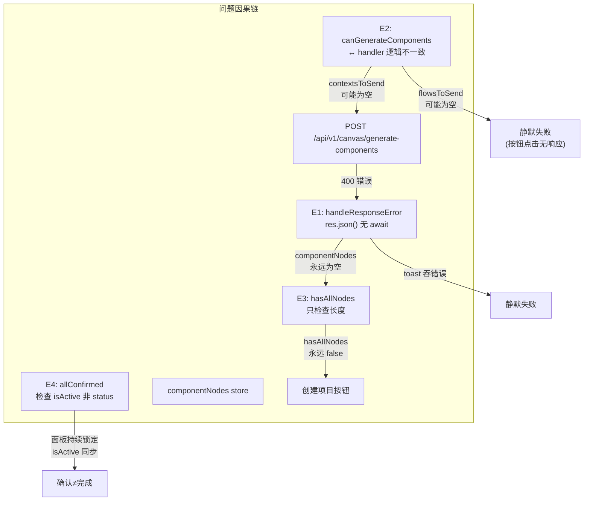
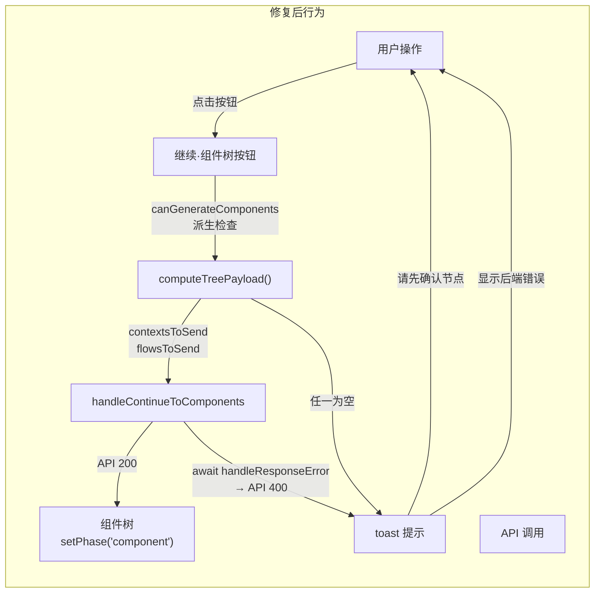

# Architecture — vibex-canvas-ux-fix

**项目**: vibex-canvas-ux-fix
**版本**: v1.0
**日期**: 2026-04-17
**状态**: Architect Approved

---

## 1. 执行摘要

VibeX Canvas 三步流程（Context Tree → Flow Tree → Component Tree）存在 4 个 UX 问题，均为**静默失败**或**状态字段语义不一致**导致用户操作链路断裂。

| Epic | 问题 | 优先级 | 根因 | 状态 |
|------|------|--------|------|------|
| E1 | API 400 静默失败 | P0 | `handleResponseError` 中 `res.json()` 缺 `await` | 未修复 |
| E2 | 组件树生成按钮 UX | P0 | `canGenerateComponents` 与 handler 逻辑不一致 + `componentGenerating` 粘滞 | 部分修复 |
| E3 | 创建项目按钮永久 disabled | P0 | `hasAllNodes` 只检查长度，不检查 `isActive` | 未修复 |
| E4 | 确认≠完成状态混乱 | Medium | `allConfirmed` 检查 `isActive` 而非 `status: 'confirmed'` | 未修复 |

**方案**: 纯前端修复，无后端依赖，共 7.5h，24 个测试用例。

---

## 2. Tech Stack

| 层级 | 技术 | 理由 |
|------|------|------|
| 前端框架 | Next.js + React | 现有架构 |
| 状态管理 | Zustand store | 现有架构 |
| Toast | useToast hook | 现有基础设施 |
| 测试框架 | Vitest + React Testing Library | 现有测试栈 |
| API 层 | fetch + Zod schema validation | 现有 API 封装 |

**无新增依赖**，所有改动均为已有代码修复。

---

## 3. 架构图

### 3.1 问题关联拓扑



### 3.2 修复后状态流



---

## 4. 文件改动范围

### 4.1 `canvasApi.ts` — E1

**文件**: `vibex-fronted/src/lib/canvas/api/canvasApi.ts` 行 145–170

```typescript
// 当前 Bug（行 164）：
const err = res.json().catch(() => ({ error: `HTTP ${res.status}` })); // 无 await

// 修复：
const errData: { error?: string; message?: string; details?: string } = { error: `HTTP ${res.status}` };
try {
  const data = await res.json();
  errData.error = data.error ?? data.message ?? data.details;
} catch {
  // fallback to default
}
throw new Error(errData.error ?? defaultMsg);
```

同时将 `handleResponseError` 声明为 `async function`，返回类型 `Promise<never>`，所有调用方加 `await`。

### 4.2 `BusinessFlowTree.tsx` — E2 + E4

**文件**: `vibex-fronted/src/components/canvas/BusinessFlowTree.tsx`

**E2-U1**: 新增 `computeTreePayload` 纯函数，UI 层和 handler 层共用：

```typescript
// 新文件或 utils 内
export function computeTreePayload(
  contextNodes: BoundedContextNode[],
  flowNodes: BusinessFlowNode[],
  selectedNodeIds: { context: string[]; flow: string[] }
): { contextsToSend: BoundedContextNode[]; flowsToSend: BusinessFlowNode[] } {
  const activeContexts = contextNodes.filter((ctx) => ctx.isActive !== false);
  const selectedContextSet = new Set(selectedNodeIds.context);
  const contextsToSend = selectedContextSet.size > 0
    ? activeContexts.filter((ctx) => selectedContextSet.has(ctx.nodeId))
    : activeContexts;

  const activeFlows = flowNodes.filter((f) => f.isActive !== false);
  const selectedFlowSet = new Set(selectedNodeIds.flow);
  const flowsToSend = selectedFlowSet.size > 0
    ? activeFlows.filter((f) => selectedFlowSet.has(f.nodeId))
    : activeFlows;

  return { contextsToSend, flowsToSend };
}
```

`canGenerateComponents` useMemo 改为：
```typescript
const { contextsToSend, flowsToSend } = useMemo(
  () => computeTreePayload(contextNodes, flowNodes, selectedNodeIds),
  [contextNodes, flowNodes, selectedNodeIds]
);
const canGenerateComponents = contextsToSend.length > 0 && flowsToSend.length > 0;
```

**E2-U2**: unmount cleanup：
```typescript
useEffect(() => {
  return () => setComponentGenerating(false);
}, []);
```

### 4.3 `ProjectBar.tsx` — E3

**文件**: `vibex-fronted/src/components/canvas/ProjectBar.tsx` 行 160

```typescript
// 当前：
const hasAllNodes = hasNodes(contextNodes) && hasNodes(flowNodes) && hasNodes(componentNodes)
  && contextNodes.length > 0 && flowNodes.length > 0 && componentNodes.length > 0;

// 修复：
const hasAllNodes =
  contextNodes.length > 0 && contextNodes.every((n) => n.isActive !== false)
  && flowNodes.length > 0 && flowNodes.every((n) => n.isActive !== false)
  && componentNodes.length > 0 && componentNodes.every((n) => n.isActive !== false);
```

Tooltip 也需同步更新（与 `hasAllNodes` 条件一致）。

### 4.4 `BoundedContextTree.tsx` — E4

**文件**: `vibex-fronted/src/components/canvas/BoundedContextTree.tsx`

**E4-U1**: `allConfirmed` 改为检查 `status === 'confirmed'`：
```typescript
// 当前：
const allConfirmed = contextNodes.length > 0 && contextNodes.every((n) => n.isActive !== false);

// 修复：
const allConfirmed = contextNodes.length > 0 && contextNodes.every((n) => n.status === 'confirmed');
```

**E4-U2**: `handleConfirmAll` 原子性设置双字段：
```typescript
const handleConfirmAll = useCallback(() => {
  contextNodes.forEach((node) => {
    confirmContextNode(node.nodeId); // 设置 status: 'confirmed'
  });
  advancePhase();
}, [contextNodes, advancePhase]);
```

---

## 5. API 定义（无变更）

本项目无 API 接口变更。以下为相关 API 摘要：

| 接口 | 路径 | 错误响应格式 |
|------|------|------------|
| 生成组件树 | `POST /api/v1/canvas/generate-components` | `{ "error": string }` 或 `{ "message": string }` 或 `{ "details": string }` |

**E1 修复效果**：后端 400 响应中的 `error`/`message`/`details` 字段现在能正确透传到前端 toast。

---

## 6. 数据模型

### 6.1 状态语义澄清

| 字段 | 设置方 | 语义 | 用于 |
|------|--------|------|------|
| `node.isActive` | AI 生成 / cascade | 节点是否激活（自动状态） | 按钮 disabled 判断 |
| `node.status === 'confirmed'` | 用户 checkbox 操作 | 用户已手动确认 | 确认完成状态 |
| `node.status === 'pending'` | 默认值 | 等待确认 | — |
| `node.status === 'error'` | API 错误 | 生成失败 | 错误状态显示 |

**关键约束**: `status: 'confirmed'` 和 `isActive: true` 应保持同步，由 `handleConfirmAll` 原子性设置。

### 6.2 Store 派生关系

```
selectedNodeIds.context[]  ──┐
selectedNodeIds.flow[]    ──┤─ computeTreePayload() ──→ contextsToSend[]
contextNodes[]            ──┤                           flowsToSend[]
flowNodes[]              ──┘
                                      │
                                      ▼
              canGenerateComponents = contextsToSend.length > 0 && flowsToSend.length > 0
              hasAllNodes = every(contextNodes, isActive) && every(flowNodes, isActive) && every(componentNodes, isActive)
              allConfirmed = every(contextNodes, status === 'confirmed')
```

---

## 7. 性能影响评估

| 指标 | 评估 | 说明 |
|------|------|------|
| Bundle size | 无变化 | 无新增依赖 |
| Runtime performance | 无影响 | 仅增加数组过滤（O(n)）和 `every()` 检查（O(n)） |
| API 调用量 | 减少无效请求 | E1 修复后，无效请求被前置校验拦截 |
| 用户体验 | 显著改善 | 静默失败 → 明确 toast；永久 disabled → 可解锁 |
| 回归风险 | 低 | 正常路径（所有节点 active）不受影响 |

**结论**: 性能影响为零或正向。

---

## 8. 测试策略

### 8.1 测试框架

| 类型 | 框架 | 覆盖范围 |
|------|------|----------|
| 单元测试 | Vitest + RTL | 24 个 AC 场景 |
| 集成测试 | Vitest | 跨组件状态流 |
| 类型检查 | TypeScript | `yarn typecheck` |
| 回归测试 | `yarn test` | 现有测试不被破坏 |

### 8.2 核心测试用例

#### E1: handleResponseError 修复

```typescript
// AC-F1.1-1: 后端返回 { error: "..." }
it('shows backend error message via toast', async () => {
  vi.mocked(canvasApi.generateComponents).mockRejectedValue(
    new Error('上下文节点不能为空')
  );
  renderBusinessFlowTree({ contextNodes: [...active], flowNodes: [...] });
  await userEvent.click(screen.getByRole('button', { name: /继续·组件树/i }));
  expect(toastMock).toHaveBeenCalledWith('上下文节点不能为空', 'error');
});

// AC-F1.1-3: 非 JSON 响应 fallback
it('falls back to defaultMsg on parse error', async () => {
  vi.mocked(canvasApi.generateComponents).mockRejectedValue(
    new Error('API 请求失败: 400')
  );
  renderBusinessFlowTree({ ... });
  await userEvent.click(screen.getByRole('button', { name: /继续·组件树/i }));
  expect(toastMock).toHaveBeenCalledWith('API 请求失败: 400', 'error');
});
```

#### E2: canGenerateComponents 逻辑同步

```typescript
// AC-F2.1-1: contexts 全部 deactive
it('disables button when all contexts inactive', () => {
  renderBusinessFlowTree({
    contextNodes: [{ nodeId: 'c1', isActive: false }],
    flowNodes: [{ nodeId: 'f1', name: 'Flow1', steps: [] }],
  });
  expect(screen.getByRole('button', { name: /继续·组件树/i })).toBeDisabled();
});

// AC-F2.1-2: flows 全部 deactive
it('disables button when all flows inactive', () => {
  renderBusinessFlowTree({
    contextNodes: [{ nodeId: 'c1', isActive: true }],
    flowNodes: [{ nodeId: 'f1', name: 'Flow1', steps: [], isActive: false }],
  });
  expect(screen.getByRole('button', { name: /继续·组件树/i })).toBeDisabled();
});

// AC-F2.2-1: unmount 时 cleanup
it('resets componentGenerating on unmount', () => {
  const { unmount } = renderBusinessFlowTree({ ... });
  // trigger generating state...
  unmount();
  // Button should be enabled on remount
  expect(screen.getByRole('button', { name: /继续·组件树/i })).toBeEnabled();
});
```

#### E3: hasAllNodes 改为 every(isActive)

```typescript
// AC-F3.1-2: 有节点但存在 isActive === false
it('disables create button when nodes inactive', () => {
  renderProjectBar({
    contextNodes: [{ nodeId: 'c1', isActive: false }],
    flowNodes: [{ nodeId: 'f1', name: 'Flow1', steps: [], isActive: true }],
    componentNodes: [{ nodeId: 'p1', name: 'Page1', type: 'page', isActive: true }],
  });
  expect(screen.getByRole('button', { name: /创建项目并开始生成原型/ })).toBeDisabled();
});
```

#### E4: allConfirmed 语义统一

```typescript
// AC-F4.1-1: status confirmed → 按钮文案变为已确认
it('shows confirmed button text when all status === confirmed', () => {
  renderBoundedContextTree({
    contextNodes: [
      { nodeId: 'c1', status: 'confirmed' },
      { nodeId: 'c2', status: 'confirmed' },
    ],
  });
  expect(screen.queryByText('✓ 已确认 → 继续到流程树')).toBeInTheDocument();
});

// AC-F4.2-1: handleConfirmAll 原子设置
it('sets all nodes status to confirmed on confirmAll', async () => {
  const store = useContextStore.getState();
  renderBoundedContextTree({
    contextNodes: [{ nodeId: 'c1', status: 'pending' }],
  });
  await userEvent.click(screen.getByRole('button', { name: /确认所有/ }));
  const nodes = useContextStore.getState().contextNodes;
  expect(nodes.every(n => n.status === 'confirmed')).toBe(true);
});
```

### 8.3 覆盖率要求

| 文件 | 覆盖率目标 |
|------|-----------|
| `canvasApi.ts` | > 85%（handleResponseError 100%） |
| `BusinessFlowTree.tsx` | > 80%（新增逻辑 100%） |
| `ProjectBar.tsx` | > 80%（hasAllNodes 100%） |
| `BoundedContextTree.tsx` | > 80%（allConfirmed/handleConfirmAll 100%） |

---

## 9. 风险评估

| 风险 | 等级 | 缓解措施 |
|------|------|----------|
| `isActive` → `status` 切换后，其他组件引用 `isActive` 的地方逻辑错误 | 中 | E4-U1 修复时做全量 `grep isActive` 审计 |
| `hasAllNodes` 改为 `every(isActive)` 后，真实用户数据（有节点但未确认）按钮被锁定 | 中 | 与 PM 确认：创建项目前必须全部确认，这是合理的产品约束 |
| `handleResponseError` 改为 async 后，其他 API 文件有相同 bug 未被发现 | 低 | F1.2 全局扫描已覆盖 |
| `componentGenerating` cleanup 影响其他依赖该状态的逻辑 | 低 | cleanup 只重置本组件状态，不影响 store |

---

## 10. 实施顺序

```
E1 (F1.1 → F1.2) ──┐
                   ├── 可并行
E2 (F2.1 → F2.2) ──┘
                   │
E3 (F3.1 → F3.2) ──┘  (依赖 E1+E2 链式效果)
                   │
E4 (F4.1 → F4.2 → F4.3)  (独立，可与其他并行)
```

---

## 11. 执行决策

- **决策**: 已采纳
- **执行项目**: vibex-canvas-ux-fix
- **执行日期**: 待 coord 排期（建议 2026-04-18）
- **优先级**: P0（E1/E2/E3）/ Medium（E4）
- **总工期**: 7.5h（1 人天）
- **依赖**: 无后端依赖，纯前端修复
