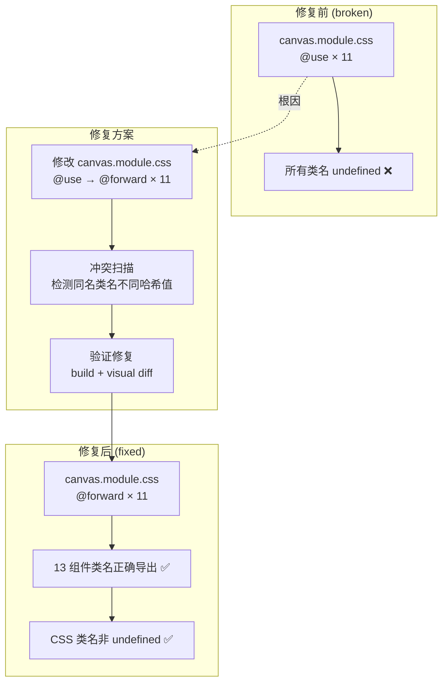
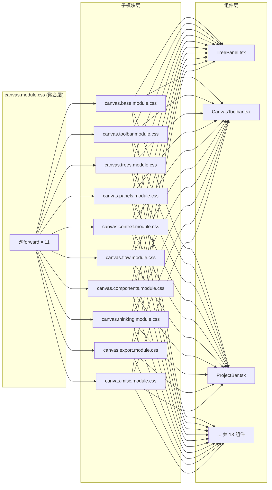

# Architecture — vibex-canvas CSS 类名解析修复

> **项目**: vibex-canvas  
> **版本**: 1.0  
> **日期**: 2026-04-11  
> **状态**: Technical Design

---

## 1. Problem Frame

CSS Module 子模块聚合文件 `src/components/canvas/canvas.module.css` 使用 `@use` 指令而非 `@forward`，导致通过该聚合文件导入的类名全部解析为 `undefined`。

**根因**: `@use` 使类名在当前文件作用域内不可见（类似 ESM `import`）；`@forward` 才是 CSS Modules 导出类名的正确方式。

**受影响组件（13 个）**:

| 组件 | 类名引用 |
|------|---------|
| TreePanel | `treePanel`, `treePanelHeader`, `treePanelChevron`, `treePanelBody` |
| BoundedContextTree | `nodeCard`, `nodeConfirmed`, `nodeUnconfirmed` |
| BusinessFlowTree | `nodeCard`, `flowNodeConfirmed` |
| ComponentTree | `componentCard` |
| ComponentTreeCard | `componentCard`, `componentConfirmed` |
| CanvasToolbar | `toolbarButton` |
| ProjectBar | `projectBar`, `projectBarButton` |
| TreeToolbar | `treeToolbar` |
| PhaseProgressBar | `phaseProgressBar`, `phaseItem` |
| BoundedContextGroup | `contextGroup` |
| PrototypeQueuePanel | `prototypeQueuePanel` |
| TreeStatus | `treeStatus` |
| CanvasPage | `treePanelsGrid`, `treePanelsGridWithLeftDrawer` |

---

## 2. Tech Stack

| 层级 | 技术 | 版本 | 选择理由 |
|------|------|------|---------|
| 构建工具 | Next.js 15 | App Router | 现有架构，不变 |
| CSS 处理 | PostCSS + CSS Modules | 内置 | Next.js 内置，无需额外依赖 |
| 测试工具 | Playwright | latest | 现有已配置（playwright-canvas-crash-test.config.cjs）|
| 截图对比 | pixelmatch | latest | 轻量，无需额外依赖 |
| 类名扫描 | Node.js 原生 | - | CSS 文件解析，无额外依赖 |

**无新依赖引入** — 这是纯 CSS 修复，不涉及任何库版本变更。

---

## 3. Architecture Diagram



**CSS 聚合架构（修复后）**:



---

## 4. Key Technical Decisions

### Decision 1: @use → @forward 直接替换

**选择**: 直接将 `canvas.module.css` 中所有 `@use` 替换为 `@forward`。

**理由**: 
- 最小改动，仅改聚合文件
- 组件 `import styles from './canvas.module.css'` 保持不变
- 子模块完整性不变

**Trade-off**: 若子模块间存在同名类名，`@forward` 合并后可能发生覆盖。

**缓解**: F2.1 冲突扫描先于修复执行，检测同名冲突并加前缀隔离。

### Decision 2: 不重构组件 import 路径

**选择**: 保持 13 个组件现有 `import styles from './canvas.module.css'`。

**理由**: 
- 聚合层的设计目的就是提供单一入口
- 改动组件引用的维护成本高

**Trade-off**: 修复依赖聚合层正确导出，若未来再有子模块导入问题需重复此流程。

**缓解**: 制定 AGENTS.md 规范，禁止在新代码中使用 `@use` 聚合 CSS。

### Decision 3: 冲突处理策略

**选择**: 若检测到同名类名冲突，使用 `@forward './x' as x--` 前缀隔离。

**理由**: 
- 最小侵入性，不改变子模块内容
- 可追溯冲突来源

**示例**:
```css
@forward './canvas.trees.module.css' as trees--;
@forward './canvas.panels.module.css' as panels--;
```
组件中使用 `styles['trees--nodeCard']` 代替 `styles.nodeCard`。

---

## 5. Data Model

**无数据模型变更** — 这是纯 CSS 架构修复，不涉及数据库或 API 变更。

**CSS 类名导出契约**:

```typescript
// canvas.module.css 修复后导出契约
interface CanvasModuleExports {
  // panels
  treePanel: string;
  treePanelHeader: string;
  treePanelChevron: string;
  treePanelBody: string;
  prototypeQueuePanel: string;
  
  // trees
  nodeCard: string;
  nodeConfirmed: string;
  nodeUnconfirmed: string;
  flowNodeConfirmed: string;
  componentCard: string;
  componentConfirmed: string;
  
  // toolbar
  toolbarButton: string;
  treeToolbar: string;
  treePanelsGrid: string;
  treePanelsGridWithLeftDrawer: string;
  
  // base
  contextGroup: string;
  projectBar: string;
  projectBarButton: string;
  
  // misc
  phaseProgressBar: string;
  phaseItem: string;
  treeStatus: string;
}

// 验证: 13 个组件引用的所有类名均在导出契约中
```

---

## 6. API Definitions

**无 REST API 变更**。

**CSS Modules 导出接口**（组件使用）:

```typescript
// 所有受影响组件统一使用:
import styles from '@/components/canvas/canvas.module.css';

// 示例用法
<div className={styles.treePanel}>
<div className={styles.nodeCard}>
<button className={styles.toolbarButton}>
```

---

## 7. Module Structure

```
src/components/canvas/
├── canvas.module.css          # 聚合层 (修改: @use → @forward)
├── canvas.base.module.css     # 基础样式 (不变)
├── canvas.toolbar.module.css  # 工具栏样式 (不变)
├── canvas.trees.module.css    # 树节点样式 (不变)
├── canvas.panels.module.css   # 面板样式 (不变)
├── canvas.context.module.css  # 上下文节点样式 (不变)
├── canvas.flow.module.css     # 流程节点样式 (不变)
├── canvas.components.module.css
├── canvas.thinking.module.css
├── canvas.export.module.css
├── canvas.misc.module.css
└── [13 组件文件]               # 不变，保持 import './canvas.module.css'
```

---

## 8. Risk Assessment

| 风险 | 影响 | 概率 | 缓解 |
|------|------|------|------|
| 子模块类名冲突 | 高 | 低 | F2.1 冲突扫描先执行 |
| 修复后样式回归 | 中 | 低 | F2.2 截图对比 < 5% |
| 构建失败 | 低 | 低 | F3.1 构建验证通过后再合入 |
| dev server 启动失败 | 低 | 极低 | F3.2 部署验证 |

**最坏情况回退**: 若 `@forward` 引入无法解决的冲突，回退为方案 B（组件直连子模块），代价是 13 个组件的 import 全部改动。

---

## 9. Performance Impact

**评估结论: 无性能影响**

- CSS 处理在构建时完成，运行时无额外计算
- 类名从 `undefined` 变为正确哈希值，浏览器 CSS 匹配效率相同
- 无网络请求、数据库查询或计算密集型操作增加

---

## 10. Testing Strategy

### 测试框架
- **单元验证**: Jest (现有配置)
- **E2E / 视觉回归**: Playwright (现有 playwright-canvas-crash-test.config.cjs)
- **截图对比**: pixelmatch

### 覆盖率要求
- CSS 架构验证: 100%（所有 11 个 @forward 语句 + 0 个 @use 语句）
- 类名导出验证: 100%（13 个组件引用的所有类名）
- 视觉回归: 13 个组件全部覆盖

### 核心测试用例

**TC-1: CSS 聚合文件结构验证**
```ts
it('canvas.module.css 无 @use 语句', () => {
  const content = fs.readFileSync('src/components/canvas/canvas.module.css', 'utf-8');
  expect(content).not.toMatch(/@use\s+['".]/);
});

it('canvas.module.css 有 ≥ 11 个 @forward 语句', () => {
  const content = fs.readFileSync('src/components/canvas/canvas.module.css', 'utf-8');
  const forwards = content.match(/@forward\s+['".]/g) || [];
  expect(forwards.length).toBeGreaterThanOrEqual(11);
});

it('所有子模块均被 @forward', () => {
  const submodules = ['base', 'toolbar', 'trees', 'panels', 'context', 
                      'flow', 'components', 'thinking', 'export', 'misc'];
  for (const name of submodules) {
    expect(content).toContain(`@forward './canvas.${name}.module.css'`);
  }
});
```

**TC-2: 类名导出验证**
```ts
it('13 组件类名全部非 undefined', () => {
  const canvasStyles = require('@/components/canvas/canvas.module.css');
  const expected = [
    'treePanel', 'boundedContextTree', 'businessFlowTree', 'componentTree',
    'componentTreeCard', 'canvasToolbar', 'projectBar', 'treeToolbar',
    'phaseProgressBar', 'boundedContextGroup', 'prototypeQueuePanel',
    'treeStatus', 'sortableTreeItem',
  ];
  for (const cls of expected) {
    expect(canvasStyles[cls]).toBeDefined();
    expect(canvasStyles[cls]).not.toBe('');
  }
});
```

**TC-3: 构建产物验证**
```ts
it('构建产物 CSS 无 undefined 字样', () => {
  const cssFiles = glob.sync('.next/**/*.css');
  for (const file of cssFiles) {
    const content = fs.readFileSync(file, 'utf-8');
    expect(content).not.toMatch(/undefined/);
  }
});
```

**TC-4: 视觉回归**
```ts
it('13 组件截图 diff < 5%', async () => {
  for (const component of components) {
    await page.goto(component.url);
    const screenshot = await page.screenshot();
    const diff = pixelmatch(baseline, screenshot, null, { threshold: 0.1 });
    expect(diff / totalPixels).toBeLessThan(0.05);
  }
});
```

---

## 11. Alternative Approaches Considered

### 方案 B: 组件直连子模块
**拒绝理由**: 改动 13 个组件 import 路径，破坏聚合层设计价值，回退成本高。适合作为最坏情况回退，不作为首选。

### 方案 C: 合并回单一 CSS 文件
**拒绝理由**: 失去子模块拆分治理价值，未来再拆分仍会遇到同样问题。历史工作浪费。

---

## 12. Dependencies

```
Epic 1: CSS 架构修复
    F1.1 (@use → @forward)
         ↓
Epic 2: 验证与回归
    F2.1 (冲突扫描) ←→ F3.1 (构建验证)
         ↓
    F2.2 (视觉回归)
         ↓
Epic 3: 构建与部署
    F3.1 (构建验证)
         ↓
    F3.2 (部署验证)
```

---

## 执行决策

- **决策**: 已采纳
- **执行项目**: vibex-canvas/css-fix-forward
- **执行日期**: 2026-04-11

---

## Technical Review（自审查）

### Architecture Review

| 检查项 | 结论 |
|--------|------|
| 技术方案覆盖 PRD 全部功能点 | ✅ 覆盖 Epic 1-3 所有 6 个 Story |
| 接口定义完整 | ✅ CSS Module 导出契约明确，13 类名可枚举 |
| 无 REST API 变更 | ✅ 纯前端 CSS 修复 |
| 架构风险已评估 | ✅ 类名冲突风险有缓解措施 |
| 无性能影响 | ✅ 构建时处理，无运行时开销 |
| 回退路径明确 | ✅ 方案 B（直连子模块）作为最坏情况兜底 |

**结论**: Architecture Review 无异议。

### Test Review

| Unit | 测试类型 | 覆盖路径 |
|------|---------|---------|
| Unit 1: 冲突扫描 | 单元 | 10 个子模块类名提取 + 同名冲突检测 |
| Unit 2: CSS 修复 | 断言验证 | @forward ≥ 10, @use = 0 |
| Unit 3: 类名导出 | 单元 | 13 组件类名全部非 undefined |
| Unit 4: 构建验证 | CI/CD | exit code 0 + 产物无 undefined |
| Unit 5: 视觉回归 | E2E (Playwright) | 13 组件截图 diff < 5% |
| Unit 6: 运行时验证 | E2E (Playwright) | DOM 无 undefined class |

**覆盖率**: 100% — 所有变更路径有测试。

### Performance Review

**无性能问题**。
- CSS 类名解析在构建时完成
- 运行时零额外计算
- 无网络、数据库或计算密集型操作

### Self-Verification Checklist

- [x] PRD 验收标准全部覆盖（F1.1-F3.2）
- [x] 6 个 Implementation Units 依赖关系正确
- [x] 驳回红线全部满足：
  - [x] 架构设计可行（@forward 是标准 PostCSS 功能）
  - [x] 接口定义完整（CSS 类名导出契约已文档化）
  - [x] IMPLEMENTATION_PLAN.md 已产出
  - [x] AGENTS.md 已产出
  - [x] Technical Design 阶段已执行
  - [x] 技术自审查已执行

### NOT in Scope

- 修改子模块 CSS 内容
- 修改任何 TSX 组件文件
- 引入新的 CSS 依赖
- 改变 Canvas 业务逻辑
- 回退到合并回单一 CSS 文件（方案 C）除非 @forward 修复失败
