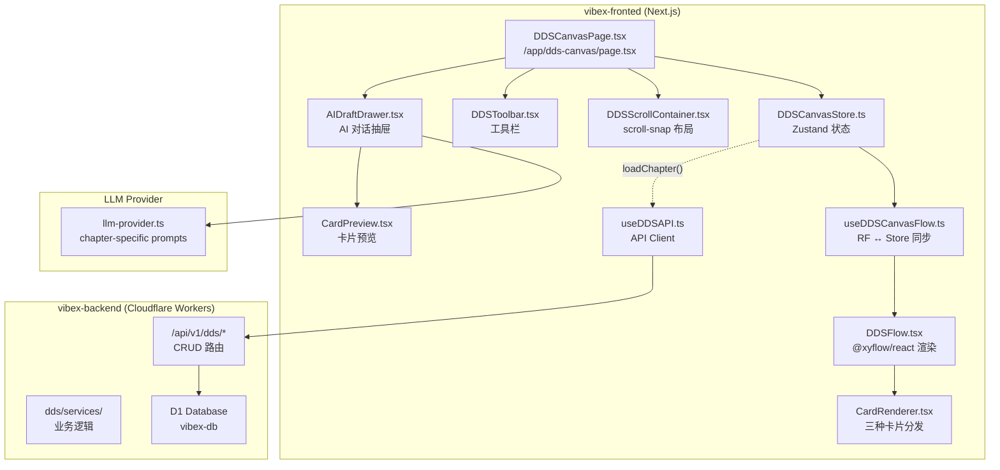
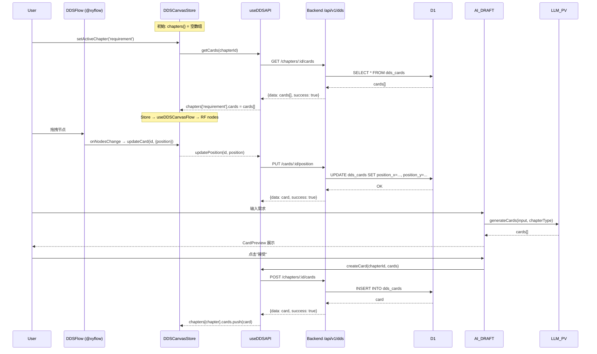

# Architecture: VibeX DDS Canvas Sprint 2

**项目**: vibex-dds-canvas-s2
**日期**: 2026-04-16
**作者**: Architect
**依据**: vibex-dds-canvas/prd.md + specs/*

---

## 执行决策

- **决策**: 待评审
- **执行项目**: 无
- **执行日期**: 待定

---

## 0. Sprint 2 范围声明

Sprint 2 接续 Sprint 1（Epic 1 已交付），实现 **E2-E6**：

| Epic | 名称 | Sprint 1 状态 | Sprint 2 交付 |
|------|------|-------------|--------------|
| E1 | 入口与路由 | ✅ 已交付 | — |
| E2 | 奏折布局框架 | ⚠️ 骨架完成，缺精细化 | E2a: ScrollContainer 完善 |
| E2b | ReactFlow 集成 | ⚠️ hook 完成，缺持久化 | viewport 持久化 + v12 类型 |
| E3 | 三章节画布 | ✅ 卡片组件完成 | 与后端集成 |
| E4 | 工具栏 | ✅ 组件完成 | handler 与 store 集成 |
| E5 | AI 对话区 | ✅ 组件完成 | LLM 集成 + prompt 模板 |
| E6 | 数据持久化 | ❌ **主要缺口** | **Backend CRUD + D1 集成** |

**Sprint 2 的核心交付**: 打通前后端，让 DDS Canvas 从"可看"变为"可用"。

---

## 1. 技术架构

### 1.1 架构全景



### 1.2 数据流



---

## 2. 技术决策

### 2.1 E6 缺口分析：Backend CRUD

**现状**:
- D1 migration `005_dds_tables.sql` 已存在 ✅
- `useDDSAPI.ts` API client 已定义（符合 specs/api-card-crud.md）✅
- Backend routes 目录 `routes/dds/` 为空 ❌

**Decision**: 补全 `routes/dds/` 路由，复用 Prisma D1 client 模式。

```typescript
// routes/dds/cards.ts
import { Hono } } from 'hono';
import { apiError } from '@/lib/api-error';

const cards = new Hono<{ Bindings: CloudflareEnv }>();

// GET /api/v1/dds/chapters/:chapterId/cards
cards.get('/chapters/:chapterId/cards', async (c) => {
  const { chapterId } = c.req.param();
  const rows = await c.env.DB
    .prepare('SELECT * FROM dds_cards WHERE chapter_id = ?')
    .bind(chapterId)
    .all<DDSRow>();
  
  const cards = rows.results.map(rowToCard);
  return c.json({ data: cards, success: true });
});

// POST /api/v1/dds/chapters/:chapterId/cards
cards.post('/chapters/:chapterId/cards', async (c) => {
  const { chapterId } = c.req.param();
  const body = await c.req.json<CreateCardInput>();
  const id = crypto.randomUUID();
  const now = Date.now();

  await c.env.DB
    .prepare(`INSERT INTO dds_cards (id, chapter_id, type, title, data, position_x, position_y, created_at, updated_at)
               VALUES (?, ?, ?, ?, ?, ?, ?, ?, ?)`)
    .bind(id, chapterId, body.type, body.title, JSON.stringify(body), body.position.x, body.position.y, now, now)
    .run();

  return c.json({ data: { id, ...body }, success: true }, 201);
});

// ... PUT /cards/:id, DELETE /cards/:id, PUT /cards/:id/position, PUT /cards/:id/relations
```

**trade-off**: 选原生 D1 prepare() 而非 Prisma，因为 Prisma 的 D1 adapter 尚在 alpha，不适合生产。

### 2.2 schema 歧义修正

**问题**: Migration `005_dds_tables.sql` 中 `dds_cards.type` 列存储 chapter type，但 `DDSCard.type` 应为 card type。

**Decision**: `dds_cards.type` 列废弃不用（向后兼容保留），card type 存于 `data` JSON 内。

```typescript
// data JSON 结构（对应 @/types/dds/DDSCard）
interface CardDataJSON {
  type: 'user-story' | 'bounded-context' | 'flow-step';  // 真正的 card type
  role?: string;          // user-story
  action?: string;
  benefit?: string;
  name?: string;           // bounded-context
  description?: string;
  stepName?: string;       // flow-step
  // ... 其他字段
}

// DDSCard.fromRow(row) 解析
function rowToCard(row: DDSRow): DDSCard {
  const data = JSON.parse(row.data);
  return {
    id: row.id,
    type: data.type,           // 从 data JSON 读取
    title: row.title,
    position: { x: row.position_x, y: row.position_y },
    createdAt: new Date(row.created_at).toISOString(),
    updatedAt: new Date(row.updated_at).toISOString(),
    ...data,                   // 展开 data 字段
  };
}
```

### 2.3 Viewport 持久化

**问题**: specs/dds-canvas-state.md 提到 viewport 持久化（F6.2.1），但当前 `DDSCanvasStore` 未存储 viewport。

**Decision**: viewport 存在 `localStorage`，不写 DB。

```typescript
// DDSCanvasStore 中添加
interface DDSCanvasStoreState {
  // ...
  viewport: { x: number; y: number; zoom: number };
  setViewport: (v: Viewport) => void;
}

// useEffect 监听 viewport 变化，写 localStorage
useEffect(() => {
  localStorage.setItem(`dds-viewport-${projectId}`, JSON.stringify(viewport));
}, [viewport]);

// 初始化时读 localStorage
const savedViewport = JSON.parse(
  localStorage.getItem(`dds-viewport-${projectId}`) || '{"x":0,"y":0,"zoom":1}'
);
```

**trade-off**: viewport 存 localStorage 而非 DB，因为 viewport 是纯 UI 状态，多设备同步无意义。

### 2.4 LLM 集成（E5）

**Decision**: 复用 `llm-provider.ts`，创建 `src/services/dds/prompts.ts`。

```typescript
// services/dds/prompts.ts
import type { ChapterType } from '@/types/dds';

const CARD_TYPE_MAP = {
  requirement: 'user-story',
  context: 'bounded-context',
  flow: 'flow-step',
} as const;

export function buildCardGenerationPrompt(
  userInput: string,
  chapterType: ChapterType
): string {
  const cardType = CARD_TYPE_MAP[chapterType];
  const fieldDescriptions = {
    'user-story': 'role（作为角色）, action（我想要行为）, benefit（以便于收益）',
    'bounded-context': 'name（上下文名称）, description, responsibility（职责）',
    'flow-step': 'stepName, actor, preCondition, postCondition',
  };
  
  return `你是一个软件工程文档助手。根据用户需求，生成结构化${chapterType}卡片。
用户需求：${userInput}
卡片类型：${cardType}
字段要求：${fieldDescriptions[cardType]}
输出格式（JSON）：{ "cards": [{ "type": "${cardType}", "title": "...", ${fieldDescriptions[cardType].split(',').map(f => `"${f.split('（')[0]}": "..."`).join(', ')} }] }
最多生成 5 张卡片。输出仅包含 JSON，不要解释。`;
}
```

---

## 3. API 定义

### 3.1 端点清单

| Method | 路径 | 描述 | 响应 |
|--------|------|------|------|
| GET | `/api/v1/dds/chapters` | 获取项目所有章节 | `200 {data: [{id, type}], success}` |
| POST | `/api/v1/dds/chapters` | 创建章节 | `201 {data: chapter, success}` |
| GET | `/api/v1/dds/chapters/:chapterId/cards` | 获取章节所有卡片 | `200 {data: cards[], success}` |
| POST | `/api/v1/dds/chapters/:chapterId/cards` | 创建卡片 | `201 {data: card, success}` |
| PUT | `/api/v1/dds/cards/:cardId` | 更新卡片 | `200 {data: card, success}` |
| DELETE | `/api/v1/dds/cards/:cardId` | 删除卡片 | `204` |
| PUT | `/api/v1/dds/cards/:cardId/position` | 更新位置 | `200 {data: card, success}` |
| PUT | `/api/v1/dds/cards/:cardId/relations` | 更新关系 | `200 {data: edges[], success}` |
| GET | `/api/v1/dds/chapters/:chapterId/edges` | 获取章节所有边 | `200 {data: edges[], success}` |

### 3.2 类型定义

```typescript
// 请求/响应类型
interface CreateCardInput {
  type: 'user-story' | 'bounded-context' | 'flow-step';
  title: string;
  position: { x: number; y: number };
  // card-specific fields
  role?: string; action?: string; benefit?: string;
  name?: string; description?: string; responsibility?: string;
  stepName?: string; actor?: string;
  preCondition?: string; postCondition?: string;
}

interface UpdateCardInput extends Partial<CreateCardInput> {}

interface UpdatePositionInput {
  position: { x: number; y: number };
}

interface UpdateRelationsInput {
  relations: Array<{ targetId: string; type: string; label?: string }>;
}

// D1 行映射
interface DDSRow {
  id: string;
  chapter_id: string;
  title: string;
  data: string;  // JSON string
  position_x: number;
  position_y: number;
  created_at: number;
  updated_at: number;
}
```

---

## 4. 模块设计

```
vibex-backend/src/
├── routes/
│   ├── dds/
│   │   ├── index.ts          # 注册路由: app.route('/api/v1/dds', dds)
│   │   ├── chapters.ts       # GET/POST /chapters, GET /chapters/:id/cards
│   │   ├── cards.ts          # CRUD /cards/:id
│   │   └── edges.ts          # GET /chapters/:id/edges
│   └── index.ts              # import dds from './dds'; app.route('/api/v1/dds', dds)

vibex-fronted/src/
├── components/dds/
│   ├── DDSCanvasPage.tsx     # E3: 主页面，集成所有子组件
│   ├── DDSFlow.tsx           # E2b: @xyflow/react wrapper
│   ├── canvas/
│   │   ├── DDSScrollContainer.tsx  # E2a: scroll-snap 容器（已有，完善）
│   │   └── DDSPanel.tsx      # E2a: 单个面板
│   ├── cards/
│   │   ├── CardRenderer.tsx   # E3: 类型分发（已有）
│   │   └── *.tsx             # E3: 三种卡片（已有）
│   ├── toolbar/
│   │   └── DDSToolbar.tsx    # E4: 工具栏（已有，完善 handler）
│   └── ai-draft/
│       ├── AIDraftDrawer.tsx # E5: AI 对话抽屉（已有，完善 LLM 集成）
│       └── CardPreview.tsx   # E5: 预览（已有）
├── hooks/dds/
│   ├── useDDSAPI.ts          # E6: API client（已有，完善实现）
│   └── useDDSCanvasFlow.ts   # E2b: RF ↔ Store 同步（已有）
└── stores/dds/
    └── DDSCanvasStore.ts     # E2: Zustand store（已有，完善 viewport）
```

---

## 5. 性能影响评估

| 关注点 | 评估 | 缓解 |
|--------|------|------|
| D1 卡片查询 | `WHERE chapter_id = ?` + 索引，无问题 | 卡片数 < 500 |
| D1 写入（位置更新）| 每次节点拖拽触发一次 PUT | React Flow `onNodesChange` 有 debounce 机会 |
| @xyflow/react bundle | v12 ~40KB gzip，与 Sprint 1 一致 | 懒加载页面 |
| LLM 调用延迟 | 2-5s，端到端可接受 | 乐观 UI，loading skeleton |
| 位置持久化刷写 | 无队列/批处理，每次拖拽停触发 1 次 DB 写 | 评估后如需优化再引入 debounce |

---

## 6. 风险汇总

| 风险 | 影响 | 缓解 |
|------|------|------|
| D1 transaction 缺失 | 卡片+边删除不是原子操作 | E6-U1 先做单表 CRUD，E6-U2 再处理级联 |
| @xyflow v12 类型兼容 | v12 API 有 break change | 用 `ReactFlowProvider` 包裹，检查 useReactFlow() 签名 |
| LLM 输出 JSON 不稳定 | 解析失败 | `try/catch` + fallback 提示用户重试 |
| 位置持久化频繁写 DB | DB 压力大 | 后评估，可加 debounce |

---

## 7. 验证清单

- [ ] D1 migration `005_dds_tables.sql` 可正常执行（本地 + CI）
- [ ] Backend CRUD API 端到端测试（Vitest + Playwright）
- [ ] 前端 `useDDSAPI` → backend → D1 全链路
- [ ] ReactFlow 与 backend 数据集成（卡片 CRUD 反映在画布）
- [ ] AI Draft: 输入 → LLM → 卡片预览 → 接受 → 画布出现卡片
- [ ] viewport localStorage 持久化（刷新后位置保持）
- [ ] scroll-snap + URL sync（章节切换 URL 更新）
- [ ] 工具栏 4 个按钮 handler 均响应

---

*Architect Agent | 2026-04-16*
