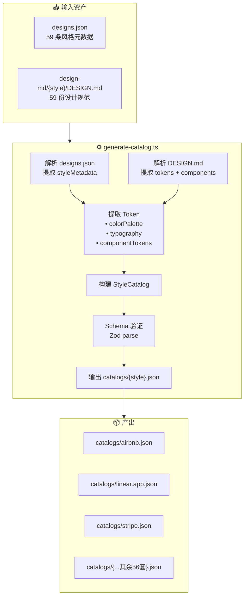
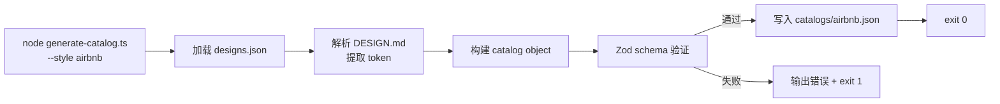

# vibex-design-component-library — 架构设计方案

**项目**: vibex-design-component-library
**任务**: design-architecture
**日期**: 2026-04-14
**作者**: Architect Agent
**状态**: ✅ 完成

---

## 1. 执行摘要

构建工具链，将 `awesome-design-md-cn` 的 59 套设计风格转换为 json-render catalog JSON 物料库，供 AI 在生成组件时选择和匹配风格。

**决策**:
- Phase 1（P0，2d）：脚本可执行 + 3 个示例 catalog 验证
- Phase 2（P1，1d）：批量生成 59 套 + 风格特征组件 schema
- Phase 3：AI 标签匹配流程（待定）

---

## 2. Tech Stack

| 层级 | 技术 | 理由 |
|------|------|------|
| 脚本语言 | Node.js + TypeScript | 读取 JSON + Markdown，与前端项目同构 |
| Markdown 解析 | 正则表达式 | DESIGN.md 格式固定，regex 足够且零依赖 |
| 脚本运行 | `tsx` 或 `ts-node` | 直接执行 TS，无需编译步骤 |
| 输入数据 | `designs.json` + `design-md/{style}/DESIGN.md` | 已有资产 |
| 输出格式 | 静态 JSON（`catalogs/*.json`） | 运行时零解析开销，CDN 可缓存 |

**不做变更**: 现有 `catalog.ts`、`registry.tsx`、json-render 包版本。

---

## 3. 架构图（Mermaid）

### 3.1 工具链架构



### 3.2 脚本内部流程



---

## 4. API 定义（脚本接口）

### 4.1 CLI 接口

```bash
# 单风格生成
node scripts/generate-catalog.ts --style <slug>

# 示例
node scripts/generate-catalog.ts --style airbnb
node scripts/generate-catalog.ts --style linear.app
node scripts/generate-catalog.ts --style stripe

# 批量生成
node scripts/generate-catalog.ts --all

# 验证输出
node scripts/generate-catalog.ts --validate --style airbnb
```

### 4.2 StyleCatalog JSON Schema

```typescript
// src/lib/canvas-renderer/catalogs/style-catalog.ts

interface StyleCatalog {
  // === 元数据 ===
  version: string;               // "1.0"
  style: string;                 // slug: "airbnb"
  displayName: string;            // "Airbnb"
  styleZh: string;                // 中文名（如有）
  tags: string[];                // 风格标签 ["民宿", "旅行", "温馨"]
  styleKeywords: string[];        // 风格关键词
  useCases: string[];             // 适用场景
  bestFor: string[];              // 推荐场景
  avoidFor: string[];             // 避免场景
  positioningZh: string;         // 品牌定位描述

  // === Color Tokens ===
  colorPalette: {
    primary: string;             // 主色 hex: "#ff385c"
    primaryHover?: string;
    secondary?: string;
    background: string;          // 背景色
    surface?: string;             // 卡片/面板色
    textPrimary: string;          // 主文本色
    textSecondary?: string;
    border?: string;
    error?: string;
    success?: string;
    // 扩展 token（风格特有）
    [key: string]: string | undefined;
  };

  // === Typography Tokens ===
  typography: {
    fontFamily: string;           // "Airbnb Cereal VF, Circular, ..."
    fontFamilyMono?: string;      // 等宽字体
    headingWeight: number;        // 标题字重: 700
    bodyWeight: number;            // 正文字重: 400
    headingSize: string;          // "28px"
    bodySize: string;             // "14px"
    letterSpacing?: string;        // 标题字间距: "-0.18px"
    lineHeightHeading?: string;
    lineHeightBody?: string;
    openTypeFeatures?: string[];   // e.g. ["salt", "tnum"]
  };

  // === Component Design Tokens ===
  componentTokens: {
    Button?: {
      primaryBg: string;
      primaryColor: string;
      radius: string;             // "8px"
      paddingX: string;
      paddingY: string;
      shadow?: string;
    };
    Card?: {
      background: string;
      borderRadius: string;
      shadow: string;
      padding: string;
    };
    Input?: {
      border: string;
      borderRadius: string;
      focusRing: string;
      background: string;
    };
    // 其他组件 token 按需扩展
  };

  // === json-render Catalog (基础组件定义) ===
  catalog: {
    version: string;              // "1.0"
    components: {
      Page?: ComponentSchema;
      Form?: ComponentSchema;
      DataTable?: ComponentSchema;
      DetailView?: ComponentSchema;
      Modal?: ComponentSchema;
      Button?: ComponentSchema;
      Card?: ComponentSchema;
      Badge?: ComponentSchema;
      StatCard?: ComponentSchema;
      Empty?: ComponentSchema;
    };
  };

  // === 解析元数据 ===
  _meta: {
    generatedAt: string;          // ISO timestamp
    designMdPath: string;
    sourceCommit?: string;
  };
}

interface ComponentSchema {
  props?: Record<string, unknown>;
  slots?: string[];
  description?: string;
}
```

---

## 5. 数据模型

### 5.1 designs.json → styleMetadata

```typescript
// 从 designs.json 提取的元数据
interface StyleMetadata {
  slug: string;
  displayName: string;
  styleZh?: string;
  tags: string[];           // tagsZh
  styleKeywords: string[];
  useCases: string[];
  bestFor: string[];
  avoidFor: string[];
  positioningZh: string;
  designMdPath: string;    // 相对路径
}
```

### 5.2 DESIGN.md → DesignTokens

```typescript
// 从 DESIGN.md 解析的 token
interface DesignTokens {
  colors: Record<string, string>;    // name → hex
  typography: TypographySpec;
  componentTokens: Record<string, Record<string, string>>;
}
```

---

## 6. 关键代码设计

### 6.1 脚本入口 `generate-catalog.ts`

```typescript
// vibex-fronted/scripts/generate-catalog.ts

import { parseArgs } from 'node:util';
import { readFileSync, writeFileSync, existsSync } from 'node:fs';
import { resolve } from 'node:path';
import { StyleCatalogSchema } from '../src/lib/canvas-renderer/catalogs/style-catalog';
import { parseDesignMd } from './parsers/design-md';
import { parseDesignsIndex } from './parsers/designs-index';

const ROOT = resolve(__dirname, '..');
const AWESOME_DESIGN = '/project/awesome-design-md-cn';
const OUTPUT_DIR = resolve(ROOT, 'src/lib/canvas-renderer/catalogs');

async function main() {
  const { values } = parseArgs({
    options: {
      style: { type: 'string' },
      all: { type: 'boolean', default: false },
      validate: { type: 'boolean', default: false },
    },
  });

  if (values.all) {
    const index = parseDesignsIndex(`${AWESOME_DESIGN}/data/designs.json`);
    for (const meta of index) {
      await generateCatalog(meta);
    }
    console.log(`✅ Generated ${index.length} catalogs`);
    return;
  }

  if (values.style) {
    const index = parseDesignsIndex(`${AWESOME_DESIGN}/data/designs.json`);
    const meta = index.find((s) => s.slug === values.style);
    if (!meta) { console.error(`Style not found: ${values.style}`); process.exit(1); }
    await generateCatalog(meta, values.validate);
    return;
  }

  console.error('Usage: generate-catalog.ts --style <slug> | --all [--validate]');
  process.exit(1);
}

async function generateCatalog(meta: StyleMetadata, validate = false) {
  const designMdPath = `${AWESOME_DESIGN}/design-md/${meta.slug}/DESIGN.md`;
  if (!existsSync(designMdPath)) {
    console.warn(`⚠️  DESIGN.md not found for ${meta.slug}, skipping`);
    return;
  }

  const designMd = readFileSync(designMdPath, 'utf-8');
  const tokens = parseDesignMd(designMd, meta.slug);

  const catalog: StyleCatalog = {
    version: '1.0',
    style: meta.slug,
    displayName: meta.displayName,
    styleZh: meta.styleZh,
    tags: meta.tags,
    styleKeywords: meta.styleKeywords,
    useCases: meta.useCases,
    bestFor: meta.bestFor,
    avoidFor: meta.avoidFor,
    positioningZh: meta.positioningZh,
    colorPalette: tokens.colors,
    typography: tokens.typography,
    componentTokens: tokens.componentTokens,
    catalog: buildBaseCatalog(),
    _meta: {
      generatedAt: new Date().toISOString(),
      designMdPath: `design-md/${meta.slug}/DESIGN.md`,
    },
  };

  if (validate) {
    const parsed = StyleCatalogSchema.safeParse(catalog);
    if (!parsed.success) {
      console.error(`❌ Schema validation failed for ${meta.slug}:`, parsed.error.message);
      process.exit(1);
    }
    console.log(`✅ ${meta.slug} validation passed`);
  }

  const outPath = resolve(OUTPUT_DIR, `${meta.slug}.json`);
  writeFileSync(outPath, JSON.stringify(catalog, null, 2), 'utf-8');
  console.log(`📄 Generated: ${outPath}`);
}

main().catch((err) => { console.error(err); process.exit(1); });
```

### 6.2 DESIGN.md 解析器

```typescript
// vibex-fronted/scripts/parsers/design-md.ts

interface ParsedTokens {
  colors: Record<string, string>;
  typography: {
    fontFamily: string;
    fontFamilyMono?: string;
    headingWeight: number;
    bodyWeight: number;
    headingSize: string;
    bodySize: string;
    letterSpacing?: string;
    openTypeFeatures?: string[];
  };
  componentTokens: Record<string, Record<string, string>>;
}

// 提取 hex 颜色: #ff385c, rgb(), rgba()
const HEX_COLOR = /#([0-9a-fA-F]{3,8})\b/g;
const CSS_VAR = /var\((--[^)]+)\)/g;

export function parseDesignMd(md: string, style: string): ParsedTokens {
  const colors: Record<string, string> = {};

  // 提取 Primary Brand 色（第一个主色）
  const primaryMatch = md.match(/\*\*Primary Brand\*\*[^#]*#([0-9a-fA-F]{3,8})/);
  if (primaryMatch) colors.primary = primaryMatch[0].match(/#([0-9a-fA-F]{3,8})/)?.[0] ?? '';

  // 提取 Text Scale 色
  const textMatch = md.match(/\*\*Near Black\*\*[^#]*#([0-9a-fA-F]{3,8})/) ||
                    md.match(/\*\*Primary Text\*\*[^#]*#([0-9a-fA-F]{3,8})/);
  if (textMatch) {
    const hex = textMatch[0].match(/#([0-9a-fA-F]{3,8})/)?.[0] ?? '';
    colors.textPrimary = hex;
    colors.background = '#ffffff'; // 默认白底
  }

  // 提取字体
  const fontMatch = md.match(/\*\*Primary\*\*[^`]*`([^`]+)`/);
  const fontFamily = fontMatch ? fontMatch[1].trim() : 'system-ui';

  // 提取字重
  const headingWeight = parseInt(md.match(/Heading[^0-9]*(\d{3})/)?.[1] ?? '600');
  const bodyWeight = parseInt(md.match(/Body[^0-9]*(\d{3})/)?.[1] ?? '400');

  // 提取字号
  const headingSizeMatch = md.match(/Section Heading[^0-9]*(\d+)px/);
  const headingSize = headingSizeMatch ? `${headingSizeMatch[1]}px` : '28px';
  const bodySizeMatch = md.match(/Body \/ Link[^0-9]*(\d+)px/);
  const bodySize = bodySizeMatch ? `${bodySizeMatch[1]}px` : '14px';

  // 提取字间距
  const lsMatch = md.match(/letter-spacing[:\s]*(-?[\d.]+)px/i);
  const letterSpacing = lsMatch ? `${lsMatch[1]}px` : undefined;

  // 提取 OpenType features
  const otFeatures = [...md.matchAll(/"([a-z0-9]+)"/g)]
    .map((m) => m[1])
    .filter((f) => f.length <= 10);

  // 提取组件 token（Button / Card / Input）
  const componentTokens: Record<string, Record<string, string>> = {};
  
  const buttonSection = md.match(/\*\*Buttons\*\*([\s\S]*?)(?=\*\*|##|$)/)?.[1] ?? '';
  const buttonRadius = buttonSection.match(/Radius[:\s]*(\d+)px/)?.[1] ?? '8';
  componentTokens['Button'] = {
    radius: `${buttonRadius}px`,
    paddingX: buttonSection.match(/Padding[:\s]*(\d+)px/)?.[1] ? `${buttonSection.match(/Padding[:\s]*(\d+)px/)[1]}px` : '12px',
  };

  return {
    colors: { primary: colors.primary || '#6366f1', background: '#ffffff', textPrimary: colors.textPrimary || '#111827', ...colors },
    typography: {
      fontFamily,
      headingWeight,
      bodyWeight,
      headingSize,
      bodySize,
      letterSpacing,
      openTypeFeatures: otFeatures.length > 0 ? otFeatures : undefined,
    },
    componentTokens,
  };
}
```

### 6.3 StyleCatalog Zod Schema

```typescript
// src/lib/canvas-renderer/catalogs/style-catalog.ts

import { z } from 'zod';

export const ComponentSchemaSchema = z.object({
  props: z.record(z.unknown()).optional(),
  slots: z.array(z.string()).optional(),
  description: z.string().optional(),
});

export const StyleCatalogSchema = z.object({
  version: z.string(),
  style: z.string(),
  displayName: z.string(),
  styleZh: z.string().optional(),
  tags: z.array(z.string()),
  styleKeywords: z.array(z.string()),
  useCases: z.array(z.string()),
  bestFor: z.array(z.string()),
  avoidFor: z.array(z.string()),
  positioningZh: z.string(),
  colorPalette: z.record(z.string()),
  typography: z.object({
    fontFamily: z.string(),
    fontFamilyMono: z.string().optional(),
    headingWeight: z.number(),
    bodyWeight: z.number(),
    headingSize: z.string(),
    bodySize: z.string(),
    letterSpacing: z.string().optional(),
    lineHeightHeading: z.string().optional(),
    lineHeightBody: z.string().optional(),
    openTypeFeatures: z.array(z.string()).optional(),
  }),
  componentTokens: z.record(z.record(z.string())).optional(),
  catalog: z.object({
    version: z.string(),
    components: z.record(ComponentSchemaSchema).optional(),
  }),
  _meta: z.object({
    generatedAt: z.string(),
    designMdPath: z.string(),
    sourceCommit: z.string().optional(),
  }),
});

export type StyleCatalog = z.infer<typeof StyleCatalogSchema>;
```

---

## 7. 目录结构

```
vibex-fronted/
├── scripts/
│   └── generate-catalog.ts          # 入口脚本
│   └── parsers/
│       ├── design-md.ts             # DESIGN.md 解析器
│       └── designs-index.ts          # designs.json 解析器
├── src/lib/canvas-renderer/catalogs/
│   ├── style-catalog.ts             # StyleCatalog Zod Schema
│   ├── airbnb.json                  # 生成输出
│   ├── linear.app.json
│   ├── stripe.json
│   └── ...                          # 其余 56 套
```

---

## 8. 测试策略

### 8.1 测试用例

```typescript
// scripts/generate-catalog.test.ts

describe('parseDesignMd', () => {
  it('提取 primary color', () => {
    const tokens = parseDesignMd(airbnbDesignMd, 'airbnb');
    expect(tokens.colors.primary).toMatch(/^#[0-9a-f]{6}$/i);
  });

  it('提取 fontFamily', () => {
    const tokens = parseDesignMd(airbnbDesignMd, 'airbnb');
    expect(tokens.typography.fontFamily).toContain('Airbnb');
  });

  it('headingWeight 为数字', () => {
    const tokens = parseDesignMd(airbnbDesignMd, 'airbnb');
    expect(typeof tokens.typography.headingWeight).toBe('number');
  });

  it('DESIGN.md 不存在时返回空 tokens', () => {
    const tokens = parseDesignMd('', 'nonexistent');
    expect(tokens.colors.primary).toBeTruthy();
  });
});

describe('StyleCatalogSchema', () => {
  it('有效 catalog 通过验证', () => {
    const catalog = JSON.parse(readFileSync('catalogs/airbnb.json', 'utf-8'));
    const result = StyleCatalogSchema.safeParse(catalog);
    expect(result.success).toBe(true);
  });

  it('缺少必填字段时验证失败', () => {
    const invalid = { style: 'airbnb' };
    const result = StyleCatalogSchema.safeParse(invalid);
    expect(result.success).toBe(false);
  });
});

describe('generate-catalog 脚本', () => {
  it('单风格生成 < 5s', async () => {
    const start = Date.now();
    execSync('node scripts/generate-catalog.ts --style airbnb');
    const elapsed = Date.now() - start;
    expect(elapsed).toBeLessThan(5000);
  });

  it('--all 生成全部 59 套', () => {
    execSync('node scripts/generate-catalog.ts --all');
    const files = readdirSync('src/lib/canvas-renderer/catalogs').filter((f) => f.endsWith('.json'));
    expect(files.length).toBeGreaterThanOrEqual(59);
  });
});
```

---

## 9. 性能影响评估

| 指标 | 值 | 评估 |
|------|------|------|
| 单风格生成时间 | < 1s（DESIGN.md ~20KB） | 无性能问题 |
| 全量 59 套生成 | < 30s | CI 可接受 |
| 脚本内存占用 | < 100MB | 无问题 |
| 输出 JSON 大小 | ~10-50KB/文件 | 可接受，共 ~2-3MB |

**结论**: 脚本执行对开发体验无负面影响。静态 JSON 输出无需运行时解析。

---

## 10. 风险评估

| 风险 | 等级 | 缓解 |
|------|------|------|
| DESIGN.md 格式不稳定导致解析失败 | 高 | Phase 1 先做 3 个风格验证；每个风格输出前 Zod 验证 |
| `design-md/linear` 应为 `linear.app` | 低 | 设计时使用 `slug` 而非文件名 |
| 部分风格 DESIGN.md 缺失颜色/字体信息 | 中 | 提供默认值 fallback（`primary: '#6366f1'`, `system-ui`） |
| 59 套全量生成耗时长 | 低 | `--all` 仅 CI 环境使用 |

---

## 11. 不兼容变更

**无**。现有 `catalog.ts`、`registry.tsx` 不被修改，零破坏性。

---

## 12. 执行决策

- **决策**: 已采纳
- **执行项目**: vibex-design-component-library
- **执行日期**: 2026-04-14
- **Phase 1**: 2d（工具链 + 3 个示例 catalog）
- **Phase 2**: 1d（批量生成）
