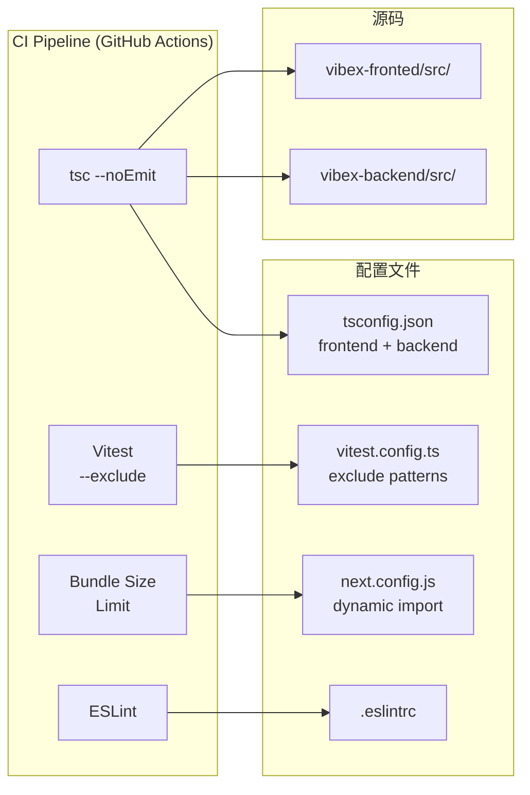

# Architecture: VibeX Dev 提案 — 开发体验与工程质量

> **类型**: Developer Experience  
> **日期**: 2026-04-14  
> **依据**: prd.md (vibex-dev-proposals-20260414_143000)

---

## 1. Problem Frame

VibeX Dev 提出 14 项开发体验和工程质量改进，分布在 4 个 Epic：TypeScript/Testing 修复 (E1)、Bundle 优化 (E2)、代码规范 (E3)、安全清理 (E4)。

---

## 2. System Architecture

### 2.1 Architecture Diagram



### 2.2 模块划分

| Epic | 模块 | 涉及文件 | 类型 |
|------|------|---------|------|
| E1 | TypeScript/Testing | tsconfig.json, vitest.config | 修复 |
| E2 | Bundle Optimization | next.config.js, 重组件 | 优化 |
| E3 | Code Standards | .eslintrc, 代码文件 | 规范 |
| E4 | Security Cleanup | API routes, middleware | 修复 |

---

## 3. Technical Decisions

### 3.1 E1: TypeScript 配置修复

**问题**: tsconfig.json 配置错误，frontend 包含 backend 类型，backend 缺少 Workers 类型。

**frontend tsconfig.json 当前问题**:
```json
{
  "compilerOptions": {
    "jsx": "preserve",
    "plugins": [{ "name": "next" }]  // ❌ next plugin 在非 Next.js 文件上报错
  }
}
```

**修复方案**:
```json
// frontend: 分离严格检查范围
{
  "compilerOptions": {
    "jsx": "preserve",
    "plugins": [{ "name": "next" }]
  },
  "include": ["src/app/**/*", "src/components/**/*"],
  "exclude": ["node_modules", "src/**/*.test.ts", "src/**/*.test.tsx"]
}

// backend: 添加 Cloudflare Workers 类型
{
  "compilerOptions": {
    "types": ["@cloudflare/workers-types"],
    "lib": ["ES2022", "WebWorker"]
  }
}
```

### 3.2 E1: Vitest 排除模式修复

**问题**: `coverage/` 目录未被排除，CI 中覆盖率计算错误。

**修复方案**:
```typescript
// vitest.config.ts
export default defineConfig({
  exclude: [
    '**/*.test.ts',
    '**/*.test.tsx',
    '**/node_modules/**',
    '**/coverage/**',    // ← 新增
    '**/dist/**',
    '**/test-results/**'
  ]
});
```

**CI 测试命令**:
```yaml
# GitHub Actions
- name: Run tests
  run: pnpm test --coverage
  env:
    CI: true
```

### 3.3 E2: Bundle Size 监控与 Dynamic Import

**问题**: Bundle 体积未监控，MermaidRenderer × 3 + TemplateSelector × 3 全部同步加载。

**Bundle Size 监控**:
```bash
# 安装 bundlesize
pnpm add -D bundlesize

# .bundlesizerc
[{
  "path": ".next/static/chunks/pages/**/*.js",
  "maxSize": "200kb"
}]
```

**Dynamic Import 候选**:
| 组件 | 当前方式 | 优化方式 | 节省 |
|------|---------|---------|------|
| `MermaidRenderer` (×3) | 同步 import | `dynamic()` | ~150KB each |
| `TemplateSelector` (×3) | 同步 import | `dynamic()` | ~80KB each |
| `FlowRenderer` | 同步 import | `dynamic()` | ~100KB |
| `BoundedContextGraph` | 同步 import | `dynamic()` | ~60KB |

**next.config.js 配置**:
```javascript
const nextConfig = {
  experimental: {
    optimizePackageImports: ['@tanstack/react-query', 'zustand'],
  },
  webpack: (config) => {
    // 对大组件使用重写规则
    config.resolve.alias['@/components/mermaid/MermaidRenderer'] =
      '@/components/mermaid/MermaidRenderer.lazy';
    return config;
  }
};
```

**lazy 包装器**:
```typescript
// components/mermaid/MermaidRenderer.lazy.ts
import dynamic from 'next/dynamic';
import { MermaidRendererSkeleton } from './Skeleton';

export const MermaidRendererLazy = dynamic(
  () => import('./MermaidRenderer'),
  {
    loading: () => <MermaidRendererSkeleton />,
    ssr: false,  // Mermaid 仅客户端渲染
  }
);
```

### 3.4 E3: Hooks 命名规范

**问题**: Hooks 命名不一致，部分为 `useXXX`，部分为 `getXXX`。

**规范**: 强制使用 `use{Entity}{Action}` 模式。

**ESLint 规则**:
```json
{
  "rules": {
    "custom-rules/use-entity-action": ["error", {
      "pattern": "^use[A-Z][a-zA-Z]+[A-Z][a-zA-Z]+$"
    }]
  }
}
```

**现有违规 Hooks** (需要重命名):
- `useProjectSettings` → `useProjectSettingsQuery` / `useProjectSettingsMutation`
- `useMessages` → `useMessagesQuery`

### 3.5 E3: TODO → Issue 自动化

**问题**: 代码中的 TODO 不会自动生成 Issue。

**方案**: husky pre-commit hook + @commitlint。

```bash
# 安装
pnpm add -D husky @commitlint/cli
pnpm husky install

# .husky/pre-commit
#!/bin/sh
grep -rn "TODO:" src/ --include="*.ts" --include="*.tsx" | \
  while IFS=: read -r file line todo; do
    echo "⚠️  TODO found at $file:$line — create an issue before committing"
  done
```

### 3.6 E4: console.log 清理

**问题**: 代码中存在大量 `console.log`，生产环境不应输出。

**方案**: ESLint + CI 检查。

```json
// .eslintrc
{
  "rules": {
    "no-console": ["warn", { "allow": ["warn", "error"] }]
  }
}
```

**CI 检查命令**:
```bash
# 检查生产环境不应有的日志
! grep -rn "console\.log\|console\.debug" \
  --include="*.ts" --include="*.tsx" \
  src/ \
  --exclude-dir=node_modules \
  --exclude-dir=coverage \
  --exclude="*.test.ts" --exclude="*.test.tsx"
```

### 3.7 E4: Auth Middleware 覆盖率

**问题**: 部分 API 路由缺少 auth 检查。

**方案**: 测试套件 + auth audit。

```bash
# 审计脚本
node scripts/audit-auth.js
# 输出: routes/ 中缺少 auth 验证的文件列表
```

---

## 4. CI Pipeline Design

```yaml
# .github/workflows/ci.yml
name: CI

on: [push, pull_request]

jobs:
  typecheck:
    runs-on: ubuntu-latest
    steps:
      - uses: actions/checkout@v4
      - uses: pnpm/action-setup@v3
      - run: pnpm install --frozen-lockfile
      - run: pnpm tsc --noEmit
        working-directory: vibex-fronted
      - run: pnpm tsc --noEmit
        working-directory: vibex-backend

  test:
    runs-on: ubuntu-latest
    steps:
      - uses: actions/checkout@v4
      - uses: pnpm/action-setup@v3
      - run: pnpm install --frozen-lockfile
      - run: pnpm test --coverage
      - uses: codecov/codecov-action@v4

  lint:
    runs-on: ubuntu-latest
    steps:
      - uses: actions/checkout@v4
      - uses: pnpm/action-setup@v3
      - run: pnpm install --frozen-lockfile
      - run: pnpm lint
      - name: Check console.log
        run: bash scripts/ci-no-console.sh

  bundle-size:
    runs-on: ubuntu-latest
    steps:
      - uses: actions/checkout@v4
      - uses: pnpm/action-setup@v3
      - run: pnpm install --frozen-lockfile
      - run: pnpm build
      - uses: testdouble/create-pr-comment@v1
        with:
          Bundlesize: |
            **Bundle size**: $(du -sh .next/static)
            **Budget**: 500KB
```

---

## 5. Performance & CI Impact

| Epic | CI 影响 | 工时 |
|------|---------|------|
| E1 TypeScript | tsc 首次全量检查，慢 30s | 1h |
| E1 Vitest | 排除 coverage 后快 20% | 0.5h |
| E2 Bundle | CI 新增 bundlesize 检查 | 2h |
| E3 Lint | 轻微增加 (eslint 已有) | 0.5h |
| E4 console | 新增 grep 步骤，< 5s | 0.5h |

---

## 6. Security Considerations

| Epic | 安全问题 | 修复 |
|------|---------|------|
| E4 | console.log 可能泄露敏感数据 | ESLint no-console + CI 检查 |
| E4 | 部分 API 无 auth 验证 | Auth audit + 修复 |

---

## 7. Open Questions

| 问题 | 状态 | 决定 |
|------|------|------|
| bundlesize 阈值设定 | 待定 | 基于当前 bundle 体积 + 20% |
| E3 hooks 违规数量 | 待审计 | 用 grep 统计后决定重构策略 |
| TODO→Issue 自动化复杂度 | 高 | 简单 grep + 警告，暂不自动建 Issue |

---

*Architect Agent | 2026-04-14*
