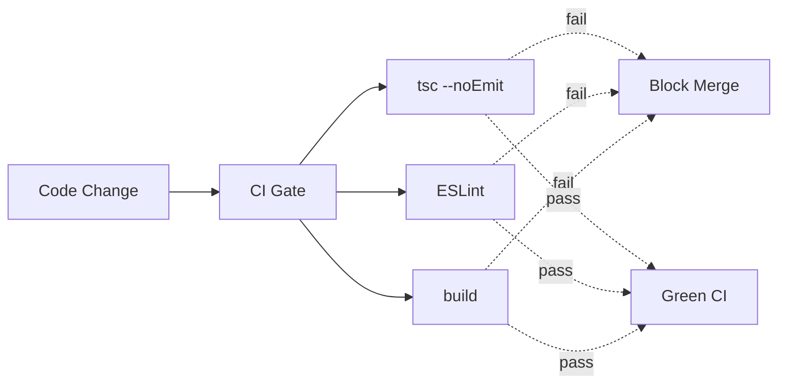

# VibeX 构建修复 — 技术架构设计

**项目**: vibex-dev-proposals-vibex-build-fixes-20260411
**角色**: Architect
**日期**: 2026-04-11
**状态**: 设计完成

---

## 1. 技术栈

| 技术 | 选型 | 理由 |
|------|------|------|
| 前端构建 | Next.js pnpm build | 现有构建系统 |
| 后端构建 | pnpm build | 现有构建系统 |
| 类型检查 | TypeScript (tsc) | 现有 |
| CI/CD | GitHub Actions | 现有 CI |
| Lint | ESLint | 现有 |

## 2. 架构图



## 3. 模块划分

| Epic | 描述 | 工时 |
|------|------|------|
| Epic 1 | 构建修复（立即执行） | 15 min |
| Epic 2 | CI/CD 增强（Dev 视角） | 7h |

## 4. 技术风险评估

| 风险 | 级别 | 缓解 |
|------|------|------|
| 构建再次中断 | 低 | CI 门禁检测 |
| Epic 1 已完成 | ✅ | commit 378f8a56 |

## 5. 测试策略

```bash
# 前端构建验证
cd vibex-fronted && pnpm exec tsc --noEmit

# 后端构建验证
cd vibex-backend && pnpm build
```

## 6. 执行决策

- **决策**: 已采纳
- **执行日期**: 2026-04-11

---

## 7. 技术审查 (Self-Review)

| 检查项 | 结果 | 说明 |
|--------|------|------|
| 架构可行性 | ✅ 通过 | 纯构建修复，无架构复杂度 |
| 功能点覆盖 | ✅ 通过 | 所有 Epic 均已覆盖 |
| 风险评估 | ✅ 通过 | 风险点明确 |
| 实施计划 | ✅ 通过 | IMPLEMENTATION_PLAN.md 已生成 |
| 开发约束 | ✅ 通过 | AGENTS.md 已生成 |

