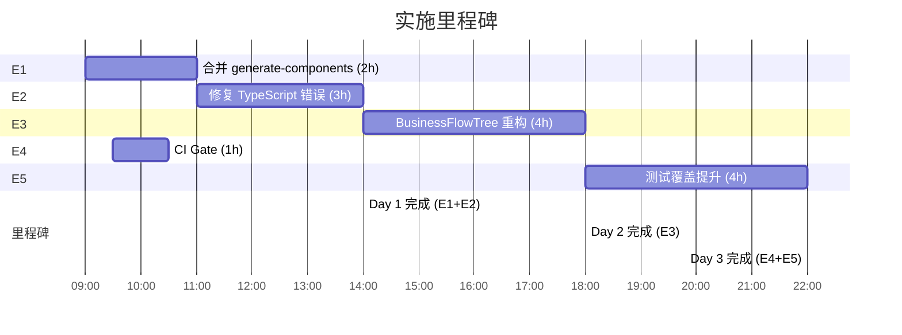

# 实施计划 — vibex-dev-proposals-20260406

**Agent**: architect  
**Date**: 2026-04-06  
**范围**: P0-P1 技术债务修复  
**总工时**: 9h（核心工作）+ 5h（CI + 测试覆盖）

---

## 概述

本计划基于 analysis.md 和 architecture.md 编制，针对 4 个核心问题（P0-1、P0-2、P1-1、P1-2）制定分阶段实施路径。P0 问题必须首先解决，P1 问题在 P0 完成后并行推进。

---

## 阶段一：E1 合并 generate-components 实现

**工时**: 2h  
**优先级**: P0  
**前置条件**: 无

### 目标

消除两套 `generate-components` 实现并存的局面，统一 Prompt 模板到单一文件，删除 Hono 旧实现。

### 步骤

| 步骤 | 操作 | 产出物 | 验收 |
|------|------|--------|------|
| 1.1 | 确认前端调用来源（代码搜索 + 日志分析） | 调用端点确认 | 明确是 Next.js route 还是 Hono route |
| 1.2 | 创建统一 Prompt 模板 `src/lib/prompts/generate-components.ts` | Prompt 模板文件 | 包含完整 flowSummary + contextSummary（含 ctx.id） |
| 1.3 | 更新 `route.ts` 使用统一 Prompt 模板 | 修改后的 route.ts | 引用 `src/lib/prompts/generate-components.ts` |
| 1.4 | 修复 `route.ts` 中 `contextSummary` 缺少 `ctx.id` 的 BUG | 修改后的 route.ts | `contextSummary` 包含 `ctx.id` 字段 |
| 1.5 | 从 `src/routes/v1/canvas/index.ts` 删除 generate-components 逻辑 | 修改后的 index.ts | generate-components 逻辑已移除 |
| 1.6 | 手动验证：前端调用 generate-components，功能正常 | — | API 返回正确 flowId，无 unknown |

### 退出标准

- `src/lib/prompts/generate-components.ts` 存在且被唯一引用
- `route.ts` 和 `index.ts` 中只有一处有 generate-components 逻辑
- Prompt 中 `contextSummary` 包含 `ctx.id`

---

## 阶段二：E2 修复 TypeScript 错误

**工时**: 3h  
**优先级**: P0  
**前置条件**: E1 完成

### 目标

清除 Frontend 9 个 + Backend 18 个 TypeScript 错误，使 `tsc --noEmit` 在前后端均通过。

### 步骤

#### 2.1 Frontend TypeScript 修复（1h）

| 步骤 | 操作 | 验收 |
|------|------|------|
| 2.1.1 | `cd frontend && npx tsc --noEmit` 获取错误列表 | 9 条错误清晰列出 |
| 2.1.2 | 按错误数量排序，主要修复 `openapi.ts` | openapi.ts 类型错误清零 |
| 2.1.3 | 逐文件修复剩余错误 | 0 errors |

#### 2.2 Backend TypeScript 修复（2h）

| 步骤 | 操作 | 验收 |
|------|------|------|
| 2.2.1 | `cd backend && npx tsc --noEmit` 获取错误列表 | 18 条错误清晰列出 |
| 2.2.2 | 修复 `route.test.ts` 的 3 个测试失败（类型不匹配） | 3 tests 编译通过 |
| 2.2.3 | 修复剩余 15 个类型错误 | 0 errors |

#### 2.3 CI Gate 准备（可并行，0.5h 计入 E4）

```yaml
# backend/.github/workflows/ci.yml 新增 step
- name: TypeScript Check
  run: npx tsc --noEmit
```

### 退出标准

```bash
cd frontend && npx tsc --noEmit   # 输出: Found 0 errors.
cd backend && npx tsc --noEmit   # 输出: Found 0 errors.
```

---

## 阶段三：E3 BusinessFlowTree 重构

**工时**: 4h  
**优先级**: P1  
**前置条件**: E2 完成（TS 错误清零后开始，避免重构时引入新错误）

### 目标

将 920 行 `BusinessFlowTree.tsx` 拆分为职责清晰的模块，满足 SRP，可独立测试。

### 步骤

| 步骤 | 操作 | 产出物 | 验收 |
|------|------|--------|------|
| 3.1 | 创建 `src/components/BusinessFlowTree/` 目录 | 目录结构 | 目录已创建 |
| 3.2 | 提取 7 个 `useCallback` 到 `useHandleContinueToComponents.ts` | 业务逻辑 hook | hook 可独立导出 |
| 3.3 | 提取数据转换到 `buildFlowTreeData.ts` | 纯函数文件 | 可单元测试 |
| 3.4 | 创建 `BusinessFlowTreeRenderer.tsx`（纯渲染组件） | 渲染组件 | 无 API 调用，无业务逻辑 |
| 3.5 | 组合 `BusinessFlowTree.tsx` 为 index 文件 | 入口文件 | 行数 < 50 |
| 3.6 | 编写 `useHandleContinueToComponents.test.ts` | 单元测试 | 测试覆盖核心逻辑 |
| 3.7 | 运行现有 BFT 测试，确保功能不受影响 | — | `npm test BusinessFlowTree` 全部通过 |
| 3.8 | 删除原始 920 行文件 | — | 文件已删除 |

### 文件结构

```
src/components/BusinessFlowTree/
├── index.tsx                    # 入口，< 50 行
├── BusinessFlowTreeRenderer.tsx # 纯渲染
├── useHandleContinueToComponents.ts  # 业务逻辑 hook
├── useHandleContinueToComponents.test.ts  # 独立测试
└── buildFlowTreeData.ts         # 数据转换纯函数
```

### 退出标准

- `BusinessFlowTree.tsx` 入口文件 < 50 行
- `BusinessFlowTreeRenderer.tsx` 无 API 调用，无 `useCallback`
- `useHandleContinueToComponents.test.ts` 通过
- 现有集成测试全部通过

---

## 阶段四：E4 工具链 CI Gate（1h，并行于 E2/E3）

**工时**: 1h  
**优先级**: P1  
**前置条件**: E2 第一轮修复后开始

### 目标

在 CI 流程中强制执行 TypeScript 类型检查，防止技术债务再次累积。

### 步骤

| 步骤 | 操作 | 产出物 |
|------|------|--------|
| 4.1 | 在 `frontend/.github/workflows/` 创建/更新 CI workflow | CI 配置 |
| 4.2 | 添加 `npx tsc --noEmit` step | 类型检查 |
| 4.3 | 在 `backend/.github/workflows/` 更新 CI workflow | CI 配置 |
| 4.4 | 添加 `npx tsc --noEmit` step | 类型检查 |
| 4.5 | 验证 CI pipeline 正确执行 | — |

### 退出标准

- CI pipeline 包含 `tsc --noEmit` step 且执行成功
- `tsc --noEmit` 失败时 CI 无法 merge（通过 required checks 配置）

---

## 阶段五：E5 前端测试覆盖提升（4h）

**工时**: 4h  
**优先级**: P1  
**前置条件**: E3 完成（重构后更易于测试）

### 目标

将前端测试从 68 tests 提升，补充 canvas 核心组件测试。

### 步骤

| 步骤 | 操作 | 验收 |
|------|------|------|
| 5.1 | `TreePanel.test.tsx` | 8-10 tests |
| 5.2 | `CanvasToolbar.test.tsx` | 6-8 tests |
| 5.3 | `CanvasPage.test.tsx`（store 集成测试） | 10-15 tests |

### 退出标准

- canvas 核心组件测试覆盖显著提升
- 新增测试全部通过

---

## 里程碑总览



---

## 工时汇总

| 阶段 | 工时 | 累计 |
|------|------|------|
| E1: 合并 generate-components | 2h | 2h |
| E2: 修复 TypeScript 错误 | 3h | 5h |
| E3: BusinessFlowTree 重构 | 4h | 9h |
| E4: CI Gate | 1h | 10h |
| E5: 测试覆盖提升 | 4h | 14h |
| **总计** | **14h** | — |

---

## 风险与缓解

| 风险 | 概率 | 影响 | 缓解措施 |
|------|------|------|----------|
| 合并 generate-components 影响前端调用 | 低 | 高 | 先确认调用来源，合并后人工验证 |
| 重构 BusinessFlowTree 引入回归 | 中 | 高 | 现有测试全部通过后再删除原始文件 |
| TypeScript 修复后 CI 首次失败 | 高 | 中 | CI 配置后先 PR 测试，确认通过再合并 |
| E2/E3 并行时互相干扰 | 低 | 中 | 严格按顺序：E1 → E2 → E3 |

---

*本文档由 Architect Agent 编制，作为 implementation 执行的标准依据。*
