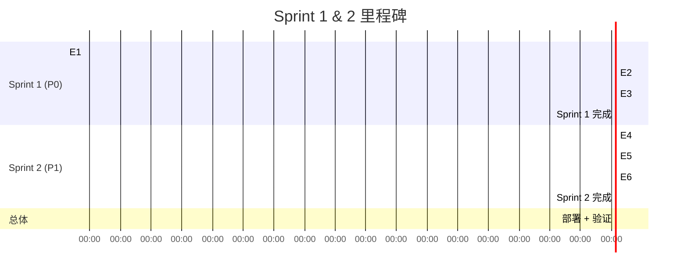

# 实施计划 — vibex-dev-proposals-20260406

**Agent**: architect  
**Date**: 2026-04-06  
**范围**: P0 × 3 + P1 × 3 技术债务修复  
**总工时**: 5.1h

---

## 概述

基于 PRD 6 个 Epic，制定两阶段实施计划：
- **Sprint 1（P0，1.1h）**：修复 3 个阻塞性 Bug
- **Sprint 2（P1，4.0h）**：推进 3 个稳定性改进

---

## Sprint 1: P0 修复（1.1h）

### Epic 1: OPTIONS 预检路由修复（0.5h）

#### 详细步骤

**S1.1 调整 OPTIONS handler 注册顺序**

1. 打开 `vibex-backend/src/routes/v1/gateway.ts`
2. 找到 `protected_` 子应用定义（约第 107 行）
3. 将 `protected_.options('/*', ...)` handler 移到 `protected_.use('*', authMiddleware)` **之前**
4. 验证两个位置都有 `v1.options('/*', ...)` 和 `protected_.options('/*', ...)`

**修复前**:
```typescript
const protected_ = new Hono<{ Bindings: CloudflareEnv }>();

// CORS preflight — 在 authMiddleware 之后 ⚠️
protected_.options('/*', (c) => { ... });

protected_.use('*', authMiddleware); // ← 预检被拦截
```

**修复后**:
```typescript
const protected_ = new Hono<{ Bindings: CloudflareEnv }>();

// CORS preflight — 在 authMiddleware 之前 ✅
protected_.options('/*', (c) => {
  c.res.headers.set('Access-Control-Allow-Origin', '*');
  c.res.headers.set('Access-Control-Allow-Methods', 'GET, POST, PUT, DELETE, OPTIONS');
  c.res.headers.set('Access-Control-Allow-Headers', 'Content-Type, Authorization');
  return c.text('', 204);
});

protected_.use('*', authMiddleware);
```

**S1.2 回归验证**

1. 启动本地 Workers: `pnpm --filter vibex-backend dev`
2. `curl -X OPTIONS -I http://localhost:8787/v1/projects`
3. 验证返回 `204 No Content` + CORS headers
4. `curl http://localhost:8787/v1/projects` 验证 GET 不受影响（返回 200 或 401）
5. 运行回归测试: `pnpm --filter vibex-backend test`

#### 退出标准

- `curl -X OPTIONS /v1/projects` → `HTTP/1.1 204 No Content`
- `curl -I /v1/projects` → 不返回 500
- `gateway.test.ts` 中 OPTIONS 相关测试通过

---

### Epic 2: Canvas Context 多选修复（0.3h）

#### 详细步骤

**S2.1 修复 checkbox onChange**

1. 打开 `vibex-fronted/src/components/canvas/BoundedContextTree.tsx`
2. 找到 `ContextCard` 组件中的 checkbox（约第 200-220 行）
3. 移除 `onChange` 中的 `toggleContextNode` 调用

**修复前**:
```tsx
<input
  type="checkbox"
  checked={node.status === 'confirmed'}
  onChange={() => {
    toggleContextNode(node.nodeId);       // ← 移除
    onToggleSelect?.(node.nodeId);          // 保留
  }}
/>
```

**修复后**:
```tsx
<input
  type="checkbox"
  checked={node.status === 'confirmed'}
  onChange={(e) => {
    e.stopPropagation();                    // 防止冒泡到 card click
    onToggleSelect?.(node.nodeId);         // 只触发多选
  }}
/>
```

4. 确保 `toggleContextNode` 在 `ContextCard` 顶部不再被解构（否则需要从 props 传入）

**S2.2 手动测试**

1. 启动 frontend: `pnpm --filter vibex-fronted dev`
2. 打开 Canvas 页面，进入 Context 树
3. 点击 checkbox → `selectedNodeIds` 更新，checkbox 选中样式出现
4. Ctrl+Click card body → 多选（不依赖 checkbox）
5. 确认 "删除选中" 按钮可见且功能正常

#### 退出标准

- 点击 checkbox → `onToggleSelect` 被调用，`toggleContextNode` 不被调用
- 选中状态正确显示（CSS `selected` class）
- 回归: checkbox 原有 confirmed 状态切换不受影响（通过页面其他按钮）

---

### Epic 3: generate-components flowId（0.3h）

#### 详细步骤

**S3.1 修复 prompt 中 contextSummary 格式**

1. 打开 `vibex-backend/src/app/api/v1/canvas/generate-components/route.ts`
2. 找到 `contextSummary` 构建逻辑（约第 100 行）

**修复前**:
```typescript
const contextSummary = contexts
  .map((c) => `- [${c.id}] ${c.name}: ${c.description}`)
  .join('\n');
```

**修复后**:
```typescript
const contextSummary = contexts
  .map((c) => `- [${c.id}] ${c.name}: ${c.description}`)
  .join('\n');
// contextSummary 格式已经是 [id] name: desc（已包含 id）
// 确认 prompt 中约束足够强
```

3. 验证 prompt 中已包含对 `flowId` 和 `ctx.id` 的约束（如未包含则补充）

**S3.2 后端 fallback 保护**

1. 在 `components` 映射时增加 fallback:

```typescript
const components: ComponentResponse[] = rawComponents.map((comp) => ({
  id: generateId(),
  name: comp.name || '未命名组件',
  flowId: comp.flowId && comp.flowId !== 'unknown'
    ? comp.flowId
    : flows[0]?.id || '',     // ← fallback
  contextId: comp.contextId || contexts[0]?.id || '',
  // ...
}));
```

**S3.3 测试验证**

1. 调用 API: `curl -X POST http://localhost:3000/api/v1/canvas/generate-components`
2. 验证返回的 `components[].flowId` 不为 `unknown`

#### 退出标准

- API 返回 `flowId` 格式为 `flow-xxx`（非 `unknown`）
- `contextSummary` 输出包含 `[ctx-xxx]` 格式的 id

---

## Sprint 2: P1 改进（4.0h）

### Epic 4: SSE 超时 + 连接清理（1.5h）

#### 详细步骤

**S4.1 AbortController 超时（0.5h）**

1. 打开 `vibex-backend/src/services/llm-provider.ts`
2. 找到 `streamChat` 方法（约第 680 行）
3. 验证/修改 `signal` 选项:

```typescript
// 修复前（llm-provider.ts line ~686）:
signal: options?.signal ?? AbortSignal.timeout(provider.timeout),

// 修复后: SSE 场景默认 10s，可被外部 signal 覆盖
signal: options?.signal ?? AbortSignal.timeout(10_000),
```

4. 同样检查 `chat` 方法（约第 634 行）

**S4.2 cancel() 清理（1.0h）**

1. 打开 `vibex-backend/src/services/ai-service.ts`
2. 找到 `chatStream` 方法（约第 542 行）
3. 添加 `cancel()` 清理逻辑:

```typescript
async chatStream(/* ... */): Promise<void> {
  const messages: ChatMessage[] = context?.history || [];
  messages.push({ role: 'user', content: message });

  // 统一超时控制
  const controller = new AbortController();
  const timeoutMs = 10_000;
  let timer: ReturnType<typeof setTimeout> | null = null;

  timer = setTimeout(() => {
    controller.abort();
  }, timeoutMs);

  try {
    for await (const chunk of this.llmProvider.streamChat({
      messages,
      temperature: options?.temperature ?? this.config.defaultTemperature,
      maxTokens: options?.maxTokens ?? this.config.maxTokens,
      signal: controller.signal, // 外部控制 signal
    })) {
      // 收到数据，重置 timer
      if (timer) clearTimeout(timer);
      timer = setTimeout(() => controller.abort(), timeoutMs);

      onChunk(chunk);
      if (chunk.done || chunk.error) {
        break;
      }
    }
  } finally {
    if (timer) clearTimeout(timer);
  }
}

// ReadableStream.cancel() 清理
// 如果 chatStream 返回 ReadableStream，则 cancel 必须清理:
return new ReadableStream({
  start(controller) {
    // 注册 chunks → controller.enqueue()
  },
  cancel() {
    if (timer) clearTimeout(timer);
    controller.abort();
  }
});
```

**S4.3 测试**

```typescript
// __tests__/ai-service-timeout.test.ts
describe('SSE timeout cleanup', () => {
  it('clearTimeout called when stream cancelled', async () => {
    const clearSpy = vi.spyOn(global, 'clearTimeout');
    const stream = createTestStreamWithTimer();
    await stream.cancel();
    expect(clearSpy).toHaveBeenCalled();
  });

  it('AbortController.abort called on timeout', () => {
    const abortSpy = vi.spyOn(AbortController.prototype, 'abort');
    // 模拟 10s 无响应
    jest.advanceTimersByTime(10_001);
    expect(abortSpy).toHaveBeenCalled();
  });
});
```

#### 退出标准

- `llm-provider.ts` 中 `AbortSignal.timeout(10_000)` 生效
- `ai-service.ts` 中 `cancel()` 调用 `clearTimeout`
- Jest 测试通过

---

### Epic 5: 分布式限流（1.5h）

#### 详细步骤

**S5.1 Cache API 优先读写（1.0h）**

1. 打开 `vibex-backend/src/lib/rateLimit.ts`
2. 修改 `recordRequest` 函数，使 CacheStore 优先:

```typescript
// 修复: CacheStore 优先读，双写
async function recordRequest(key: string, windowSeconds: number): Promise<{ count: number; resetTime: number }> {
  const now = Date.now();
  const resetTime = Math.ceil((now + windowSeconds * 1000) / 1000);
  const fk = fullKey(key, windowSeconds);

  // 1. CacheStore 优先读（跨 Worker 共享）
  if (cacheStore.isAvailable()) {
    const cacheEntry = await cacheStore.get(fk);
    if (cacheEntry) {
      cacheEntry.count++;
      cacheEntry.resetTime = resetTime;
      await cacheStore.put(fk, cacheEntry, windowSeconds);
      await inMemoryStore.put(fk, cacheEntry); // 同步到内存
      return { count: cacheEntry.count, resetTime };
    }
  }

  // 2. InMemoryStore 读
  const current = await inMemoryStore.get(fk);
  const count = (current?.count ?? 0) + 1;
  const entry: CacheEntry = { count, resetTime };

  // 3. 双写
  if (cacheStore.isAvailable()) {
    await cacheStore.put(fk, entry, windowSeconds);
  }
  await inMemoryStore.put(fk, entry);

  return { count, resetTime };
}
```

**S5.2 wrangler 配置验证（0.5h）**

1. 检查 `vibex-backend/wrangler.jsonc`:

```jsonc
{
  // 确保有 Cache API 权限
  "kv_namespaces": [],
  // Cloudflare Workers 默认有 caches.default 访问权限
  // 如需显式声明:
  " caches ": { "edges": [] }
}
```

**S5.3 集成测试**

```typescript
// __tests__/rate-limit.test.ts
describe('Distributed rate limiting with CacheStore', () => {
  beforeEach(() => { inMemoryStore.clear(); });

  it('CacheStore.get called before InMemoryStore', async () => {
    const cacheGetSpy = vi.spyOn(cacheStore, 'get').mockResolvedValue(null);
    await recordRequest('user:test', 60);
    expect(cacheGetSpy).toHaveBeenCalled();
  });

  it('concurrent 100 requests have consistent count', async () => {
    const results = await Promise.all(
      Array.from({ length: 100 }, () => recordRequest('user:stress', 60))
    );
    const counts = results.map(r => r.count);
    // 由于 CacheStore 共享，所有请求应该看到一致计数
    expect(Math.max(...counts) - Math.min(...counts)).toBeLessThanOrEqual(2);
  });
});
```

#### 退出标准

- `rateLimit` 中 `CacheStore` 优先读写
- `recordRequest` 逻辑覆盖 CacheStore + InMemoryStore 双写
- Jest 测试通过

---

### Epic 6: test-notify 去重（1.0h）

#### 详细步骤

**S6.1 修复 generateKey 调用（0.5h）**

1. 打开 `vibex-fronted/scripts/test-notify.js`
2. 找到 `sendNotification` 函数中的 `generateKey` 调用

**修复前**:
```javascript
const dedupKey = generateKey(status);  // ⚠️ 缺少 message 参数
const { skipped, remaining } = checkDedup(dedupKey);
```

**修复后**:
```javascript
// 增加足够熵的 message 参数
const dedupKey = generateKey(
  status,
  `${duration}:${tests}:${errors}:${config.commit}`
);
const { skipped, remaining } = checkDedup(dedupKey);
```

**S6.2 集成测试（0.5h）**

```bash
# 手动测试
node scripts/test-notify.js --status passed --duration 10s --tests 50 --errors 0
# 立即再运行一次
node scripts/test-notify.js --status passed --duration 10s --tests 50 --errors 0
# 预期: 第二次 skip（⏭️ Skip duplicate notification）

# 运行 Jest 测试
pnpm --filter vibex-fronted test scripts/__tests__/dedup.test.js
```

#### 退出标准

- `generateKey` 第二个参数非空
- `checkDedup` 正确识别 5 分钟内重复
- dedup.test.js 全部通过

---

## 部署清单

### 预部署检查

| 检查项 | 命令 | 预期结果 |
|--------|------|----------|
| TypeScript 编译 | `cd vibex-backend && npx tsc --noEmit` | 0 errors |
| 后端测试 | `cd vibex-backend && pnpm test` | 全部通过 |
| 前端测试 | `cd vibex-fronted && pnpm test` | 全部通过 |
| ESLint | `pnpm lint` | 无 error |
| 覆盖率 | `pnpm test -- --coverage` | > 80% |

### 部署步骤

```bash
# 1. 确保所有测试通过
pnpm --filter vibex-backend test
pnpm --filter vibex-fronted test

# 2. 构建
pnpm --filter vibex-backend build
pnpm --filter vibex-fronted build

# 3. 部署 Backend（Cloudflare Workers）
cd vibex-backend && wrangler deploy

# 4. 部署 Frontend
cd vibex-fronted && pnpm deploy  # 或 CI/CD pipeline
```

---

## 回滚方案

### E1 回滚（OPTIONS）

```bash
# 如果 OPTIONS 返回异常，回滚 gateway.ts
git checkout HEAD~1 -- vibex-backend/src/routes/v1/gateway.ts
wrangler deploy
```

**降级影响**: CORS 预检失败，所有跨域请求受影响（高优先级立即回滚）

### E2 回滚（Canvas checkbox）

```bash
# 回滚 BoundedContextTree.tsx
git checkout HEAD~1 -- vibex-fronted/src/components/canvas/BoundedContextTree.tsx
```

**降级影响**: checkbox 行为恢复到修复前（多选功能不受影响，仅 checkbox 点击行为回退）

### E3 回滚（flowId）

```bash
# 回滚 generate-components/route.ts
git checkout HEAD~1 -- vibex-backend/src/app/api/v1/canvas/generate-components/route.ts
```

**降级影响**: AI 输出 flowId 仍可能为 unknown（影响组件树显示）

### E4 回滚（SSE timeout）

```bash
# 回滚 ai-service.ts 和 llm-provider.ts
git checkout HEAD~1 -- vibex-backend/src/services/ai-service.ts
git checkout HEAD~1 -- vibex-backend/src/services/llm-provider.ts
```

**降级影响**: SSE 超时恢复到 60s（Worker 可能挂死）

### E5 回滚（分布式限流）

```bash
# 回滚 rateLimit.ts
git checkout HEAD~1 -- vibex-backend/src/lib/rateLimit.ts
wrangler deploy
```

**降级影响**: 限流恢复到内存 Map（多 Worker 不一致）

### E6 回滚（test-notify 去重）

```bash
# 回滚 test-notify.js
git checkout HEAD~1 -- vibex-fronted/scripts/test-notify.js
```

**降级影响**: 可能收到重复 Slack 通知（低优先级）

---

## 成功标准

| 验收项 | 检查方法 | 达标 |
|--------|---------|------|
| OPTIONS 返回 204 | `curl -X OPTIONS -I /v1/projects` | HTTP 204 |
| Canvas checkbox 多选 | 手动测试 + unit test | `onToggleSelect` 调用，`toggleContextNode` 不调用 |
| flowId 非 unknown | API 响应检查 | `flowId.match(/^flow-/)` |
| SSE 10s 超时 | Jest mock timer 测试 | `AbortController.timeout(10000)` |
| SSE cancel 清理 | Jest clearTimeout spy | `clearTimeout` 调用次数 ≥ 1 |
| CacheStore 优先 | Spy on `cacheStore.get` | 优先于 `inMemoryStore.get` |
| dedup 5 分钟窗口 | 连续两次调用 | 第二次 `skipped: true` |
| TypeScript 0 errors | `tsc --noEmit` | 0 errors |
| 测试覆盖率 | `pnpm test -- --coverage` | > 80% |

---

## 里程碑总览



---

*本文档由 Architect Agent 编制，作为 Dev Agent 的执行标准依据。*
