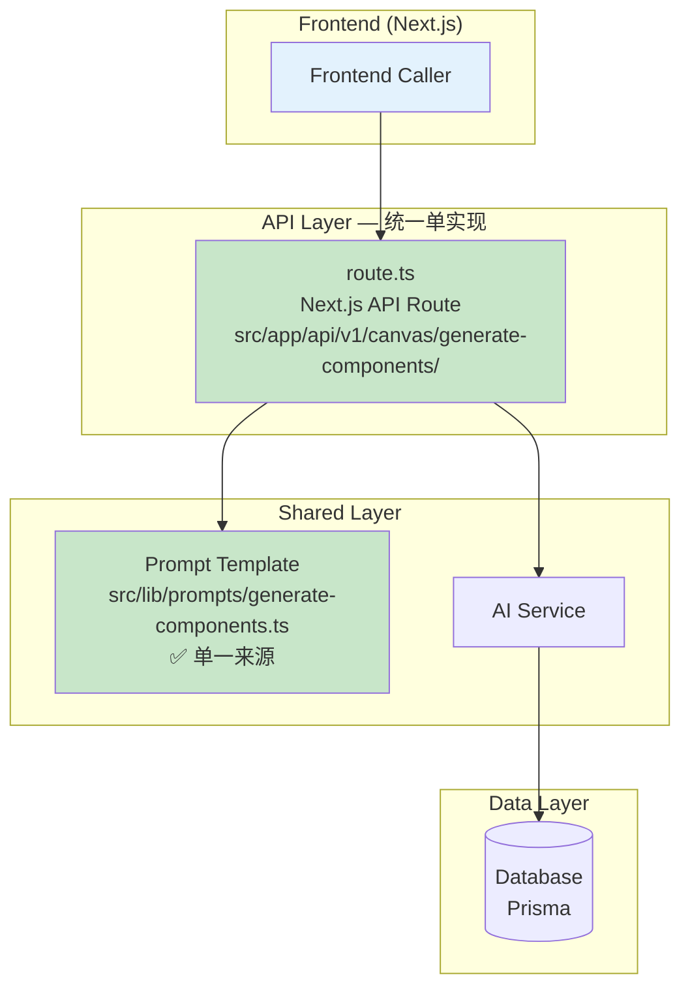
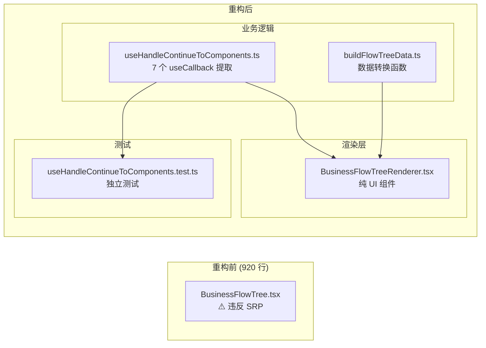
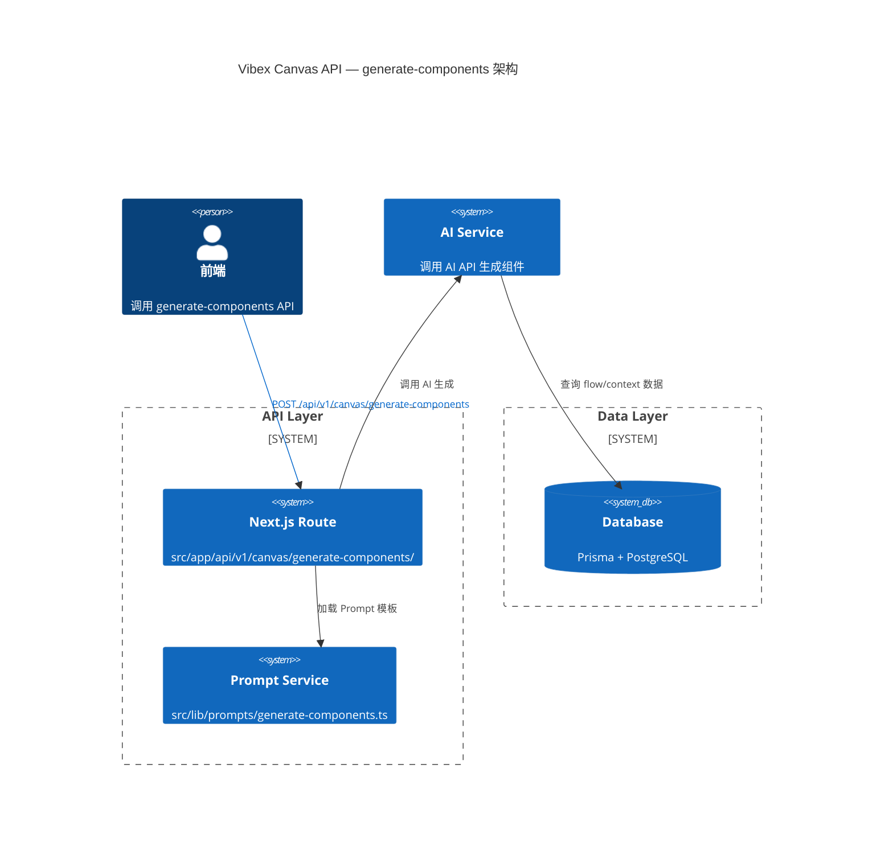

# 系统架构文档 — vibex-dev-proposals-20260406

**Agent**: architect  
**Date**: 2026-04-06  
**Status**: Ready for implementation  
**范围**: vibex-frontend + vibex-backend 技术债务修复

---

## 1. Tech Stack（不引入新依赖）

| 层级 | 技术选型 | 版本要求 | 说明 |
|------|----------|----------|------|
| Frontend | Next.js | 15.x | App Router，已有 |
| Frontend | React | 19.x | 已有 |
| Frontend | TypeScript | 5.x | 严格模式，修复错误 |
| Frontend | Zustand | 5.x | 状态管理，已有 |
| Frontend | Vitest | 2.x | 测试框架，已有 |
| Backend | Hono | 4.x | 逐步迁移中 | — (新路由用 Next.js)
| Backend | Next.js API Routes | 15.x | 新路由优先使用 |
| Backend | TypeScript | 5.x | 严格模式，修复错误 |
| Backend | Jest | 29.x | 测试框架，已有 |
| Backend | Prisma | 6.x | ORM，已有 |
| Runtime | Cloudflare Workers | Latest | 部署目标，已有 |
| Lint | ESLint | 9.x | 统一配置 |

**架构原则**: 不引入新依赖，修复工作基于现有技术栈完成。

---

## 2. 核心问题：两套 generate-components 实现并存

### 2.1 当前架构（问题状态）

```mermaid
graph TD
    subgraph "Frontend (Next.js)"
        FC["Frontend Caller"]
    end

    subgraph "API Layer — 两套并存"
        RT["route.ts<br/>Next.js API Route<br/>src/app/api/v1/canvas/generate-components/"]
        HN["index.ts<br/>Hono Route<br/>src/routes/v1/canvas/"]
    end

    subgraph "Shared Services"
        PS["Prompt Service<br/>生成 AI Prompt"]
        AS["AI Service<br/>调用 AI API"]
    end

    subgraph "Data Layer"
        DB[("Database<br/>Prisma")]
    end

    FC -->|"调用哪个?"| RT
    FC -->|"未知调用| HN
    RT --> PS
    HN --> PS
    PS --> AS
    AS --> DB

    style RT fill:#ffcccc
    style HN fill:#ffe0b3
    style FC fill:#e3f2fd
```

### 2.2 风险分析

| 风险 | 描述 | 影响 |
|------|------|------|
| Prompt 分歧 | 两处 Prompt 随时间漂移，AI 行为不一致 | 用户体验不一致 |
| BUG 遗漏 | 一处修复了 `flowId`，另一处漏了 `contextSummary.ctx.id` | AI 输出错误数据 |
| 维护成本 | 任何 Prompt 改动需同步两处 | 开发效率降低 50% |
| 调用不明 | 不清楚前端实际调用的是哪个端点 | 调试困难 |
| 冗余资源 | 两套路由占用 bundle size 和内存 | 性能损耗 |

### 2.3 修复后架构（目标状态）



---

## 3. 修复方案

### 3.1 合并 generate-components 实现

**目标**: 淘汰 Hono 实现（`src/routes/v1/canvas/index.ts`），统一到 Next.js API Route（`src/app/api/v1/canvas/generate-components/route.ts`）。

**实施步骤**:

1. **确认前端调用来源**: 通过日志或代码审查，确认前端实际调用的是哪个端点
2. **统一 Prompt 模板**: 将 Prompt 提取到 `src/lib/prompts/generate-components.ts`
   - 包含 `flowSummary`、`contextSummary`（含 `ctx.id`）完整字段
   - 明确要求 AI 输出 `flowId`（已修复）、禁止 `unknown`
3. **更新 Next.js Route**: 使用统一的 Prompt 模板
4. **删除 Hono 实现**: 移除 `src/routes/v1/canvas/index.ts` 中的 generate-components 逻辑
5. **验证**: 确保前端功能不受影响

**Prompt 模板约束**（新增）:
```typescript
// 每个组件必须包含：
// - flowId: 所属流程ID（从上述流程列表中选择，禁止填 unknown）
// - contextSummary: 包含 ctx.id, ctx.name, ctx.description
// - props: 字段禁止出现 unknown
```

### 3.2 TypeScript 严格化

**目标**: `tsc --noEmit` 在 CI 中必须通过。

| 层级 | 当前错误 | 修复策略 |
|------|----------|----------|
| Frontend (9 errors) | `openapi.ts` 等 | 集中修复类型定义 |
| Backend (18 errors) | `route.test.ts` + 15 others | 修复测试类型 + 其他错误 |

**CI Gate**（新增）:
```yaml
# .github/workflows/ci.yml
- name: TypeScript check
  run: |
    cd frontend && npx tsc --noEmit
    cd ../backend && npx tsc --noEmit
```

### 3.3 BusinessFlowTree 重构

**目标**: 将 920 行单文件拆分为职责清晰的模块。



**文件拆分**:

| 原文件/逻辑 | 拆分后文件 | 职责 |
|-------------|------------|------|
| `BusinessFlowTree.tsx` | `BusinessFlowTreeRenderer.tsx` | 纯渲染，无业务逻辑 |
| 7 × `useCallback` | `useHandleContinueToComponents.ts` | 业务逻辑 hook |
| `buildFlowTreeData` | `buildFlowTreeData.ts` | 数据转换纯函数 |
| — | `useHandleContinueToComponents.test.ts` | 独立可测试 |
| `__tests__/BFT` | 继承到新文件 | 保留现有测试 |

---

## 4. 组件关系图



---

## 5. 实施计划

| 阶段 | 任务 | 工时 | 依赖 | 验收标准 |
|------|------|------|------|----------|
| **E1** | 合并 generate-components | 2h | — | Prompt 统一为单一文件，两套实现只保留一个 |
| **E2** | 修复 TypeScript 错误 | 3h | E1 | `tsc --noEmit` 前端 + 后端均通过 |
| **E3** | BusinessFlowTree 重构 | 4h | E2 | 文件 < 200 行，`useHandleContinueToComponents.test.ts` 通过 |
| **E4** | 添加工具链 CI Gate | 1h | E2 | CI 流程包含 `tsc --noEmit` 检查 |
| **E5** | 补充前端测试覆盖 | 4h | E3 | canvas 核心组件测试覆盖提升 |

**总计**: 14h（核心修复 P0-P1: 9h + CI Gate: 1h + 测试覆盖: 4h）

**里程碑**:

- **Day 1 (5h)**: E1 + E2 完成 → TypeScript clean + 统一 Prompt
- **Day 2 (4h)**: E3 完成 → BusinessFlowTree 重构完成
- **Day 3 (5h)**: E4 + E5 完成 → CI 完善 + 测试覆盖提升

---

## 6. 验收标准

| 验收项 | 检查方法 |
|--------|----------|
| generate-components 统一 | `rg "route.ts\|index.ts" --type ts` 只在一处找到 generate-components 逻辑 |
| Prompt 模板统一 | `src/lib/prompts/generate-components.ts` 存在且被唯一引用 |
| TypeScript 0 errors | `cd frontend && npx tsc --noEmit && cd ../backend && npx tsc --noEmit` 均输出 0 errors |
| BusinessFlowTree 可测试 | `npm test useHandleContinueToComponents` 通过 |
| CI 包含类型检查 | `.github/workflows/ci.yml` 包含 `tsc --noEmit` step |

---

*本文档由 Architect Agent 生成。Tech Stack 不引入新依赖，所有修复基于现有技术栈完成。*
