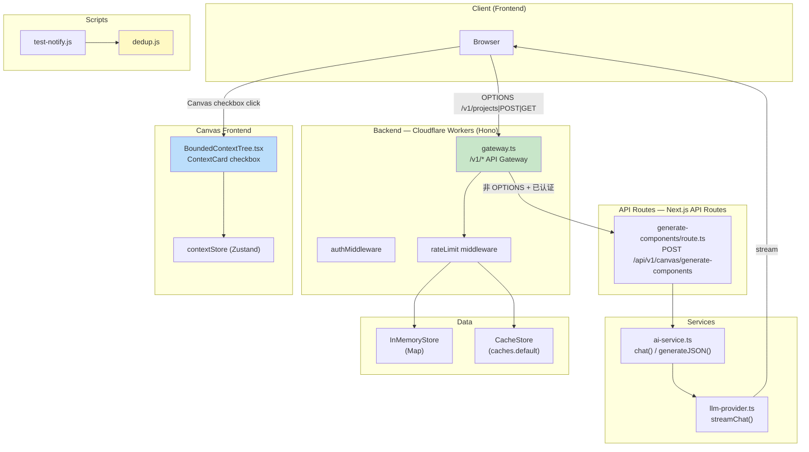
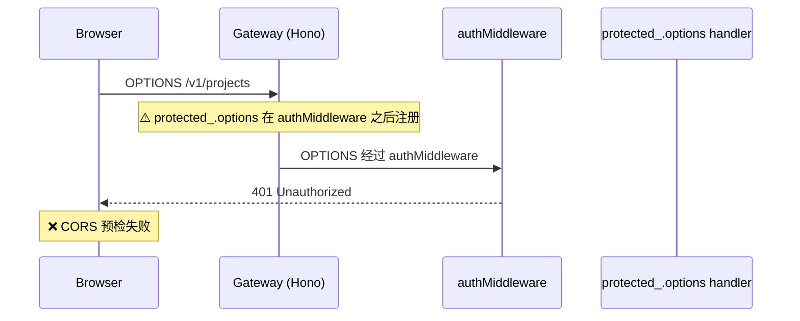
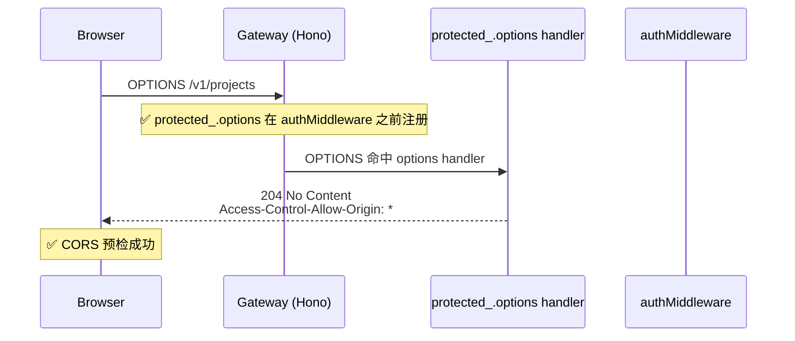
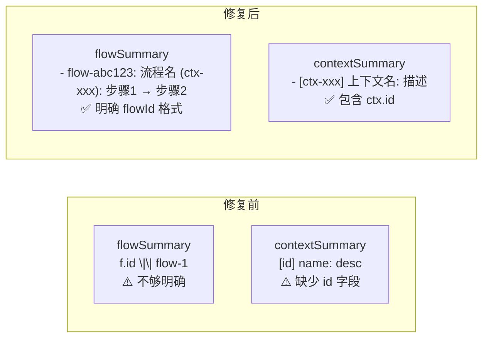
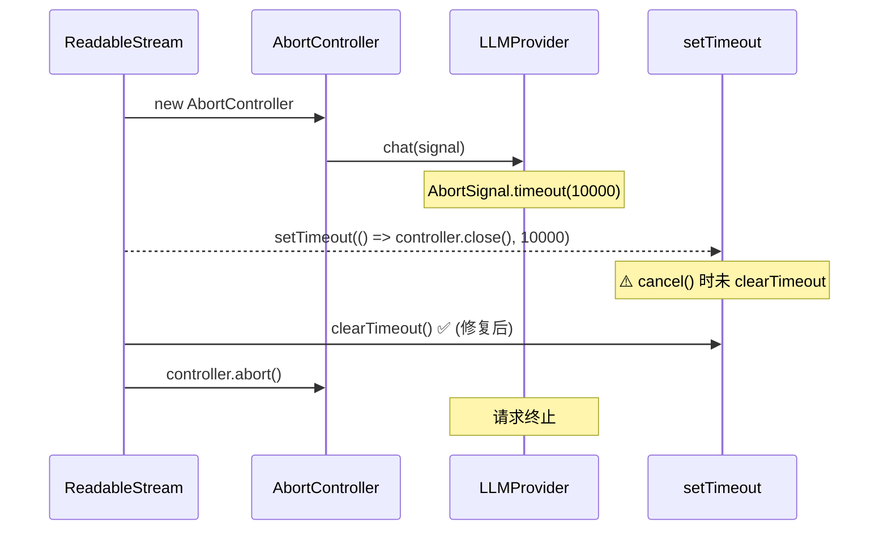
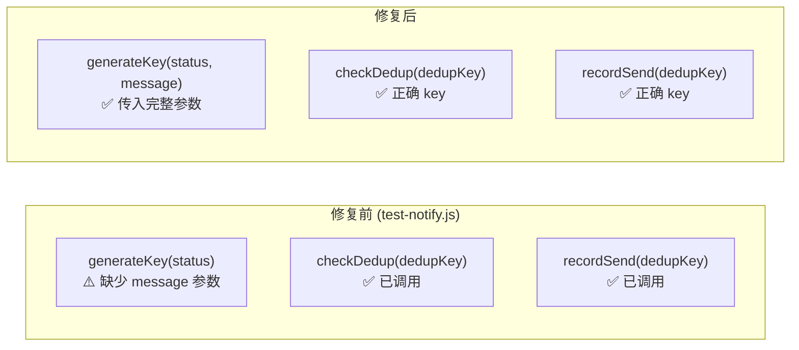

# 架构文档 — vibex-dev-proposals-20260406

**Agent**: architect  
**Date**: 2026-04-06  
**Status**: Ready for implementation  
**范围**: vibex-backend + vibex-frontend 技术债务修复（P0 × 3 + P1 × 3）

---

## 1. Tech Stack（不引入新依赖）

| 层级 | 技术选型 | 版本 | 说明 |
|------|----------|------|------|
| Frontend | Next.js | 15.x | App Router，已有 |
| Frontend | React | 19.x | 已有 |
| Frontend | TypeScript | 5.x | 严格模式 |
| Frontend | Vitest | 2.x | 测试框架，已有 |
| Backend | Hono | 4.x | API Gateway，已有 |
| Backend | Next.js API Routes | 15.x | generate-components，已有 |
| Backend | TypeScript | 5.x | 严格模式 |
| Backend | Jest | 29.x | 测试框架，已有 |
| Backend | Prisma | 6.x | ORM，已有 |
| Runtime | Cloudflare Workers | Latest | 部署目标，已有 |
| Lint | ESLint | 9.x | 统一配置，已有 |
| **新增** | `AbortController.timeout` | — | 内置 API，无需安装 |
| **新增** | `caches.default` | — | Cloudflare Workers Cache API，内置 |
| **新增** | dedup.js | — | 已有实现（frontend/scripts），无需安装 |

**架构原则**: 不引入新依赖，所有修复基于现有技术栈完成。

---

## 2. 架构总览



---

## 3. Epic 架构详情

### 3.1 E1: OPTIONS 预检路由修复

#### 问题根因



#### 修复方案

`gateway.ts` 中调整 `protected_.options` 到 `authMiddleware` **之前**：



#### 接口定义

```
OPTIONS /v1/* 
→ 204 No Content
  Access-Control-Allow-Origin: *
  Access-Control-Allow-Methods: GET, POST, PUT, DELETE, OPTIONS
  Access-Control-Allow-Headers: Content-Type, Authorization
```

#### 关键文件

| 文件 | 修改 |
|------|------|
| `vibex-backend/src/routes/v1/gateway.ts` | 将 `protected_.options` 移到 `authMiddleware` 之前 |

---

### 3.2 E2: Canvas Context 多选修复

#### 问题根因

`BoundedContextTree.tsx` 的 `ContextCard` 中，checkbox `onChange` 同时调用了 `toggleContextNode`（切换 confirmed 状态）和 `onToggleSelect`（切换选中状态），但 `onToggleSelect` 在点击 checkbox 时不应该被自动触发——应该仅在 Ctrl/Cmd+Click 时触发多选。

#### 修复方案

```mermaid
graph LR
    subgraph "修复前 (BoundedContextTree.tsx)"
        CB["checkbox onChange"]
        CB -->|"每次都调用"| TN["toggleContextNode()"]
        CB -->|"每次都调用"| OTS["onToggleSelect()"]
    end

    subgraph "修复后"
        CB2["checkbox onChange"]
        CB2 -->|"仅调用"| OTS2["onToggleSelect()"]
        Note over CB2: ✅ 移除 toggleContextNode 调用
    end
```

#### 接口定义

```typescript
// BoundedContextTree.tsx — ContextCard props
interface ContextCardProps {
  node: BoundedContextNode;
  onEdit: (nodeId: string, data: Partial<BoundedContextNode>) => void;
  onDelete: (nodeId: string) => void;
  readonly?: boolean;
  selected?: boolean;
  onToggleSelect?: (nodeId: string) => void;
  // ↑ checkbox onChange 应直接调用 onToggleSelect
}

// store 行为（contextStore）
toggleNodeSelect(contextId: string, nodeId: string): void
// → 更新 selectedNodeIds（不影响 node.status/confirmed）
```

#### 关键文件

| 文件 | 修改 |
|------|------|
| `vibex-fronted/src/components/canvas/BoundedContextTree.tsx` | checkbox `onChange` 改为只调用 `onToggleSelect`，移除 `toggleContextNode` |

---

### 3.3 E3: generate-components flowId

#### 问题根因

AI prompt 中 `contextSummary` 输出格式缺少 `ctx.id`（只有 name/description），且 prompt 对 `flowId` 的约束不够强。

#### 修复方案



#### 接口定义

```typescript
// ComponentResponse schema（已定义）
interface ComponentResponse {
  id: string;        // 生成时 assigned
  name: string;     // AI 输出
  flowId: string;   // ⚠️ 必须来自 flows[].id，禁止 unknown
  contextId: string;// ⚠️ 必须来自 contexts[].id
  type: 'page' | 'form' | 'list' | 'detail' | 'modal';
  apis: ComponentApi[];
  confidence: number;
}

// Prompt 约束（generate-components/route.ts）
const USER_PROMPT = `
... 
- 每个流程生成 2-5 个组件，覆盖主要用户操作
- 每个组件的 flowId 必须是对应流程 id（如 "flow-abc123"），禁止使用 unknown
- 每个组件的 contextId 必须是上下文 id 字段（ctx-xxx 格式）
- 每个组件必须包含 ctx.id，禁止仅用 name 代替
...`
```

#### 关键文件

| 文件 | 修改 |
|------|------|
| `vibex-backend/src/app/api/v1/canvas/generate-components/route.ts` | `contextSummary` 格式改为 `-[id] name: desc`，prompt 增加禁止 `unknown` 约束 |

---

### 3.4 E4: SSE 超时 + 连接清理

#### 问题根因

`aiService.chat()` / `chatStream()` 无内置超时，`llmProvider.streamChat()` 有 `AbortController.timeout()` 但 cancel 时 `setTimeout` 未清理。

#### 修复方案



#### 接口定义

```typescript
// ai-service.ts — chatStream 签名
async chatStream(
  message: string,
  onChunk: StreamCallback,
  context?: ChatContext,
  options?: Partial<LLMRequestOptions>
): Promise<void> {
  // 新增: 包装 AbortController 超时
  const controller = new AbortController();
  const timer = setTimeout(() => {
    controller.abort(); // 触发 AbortSignal.timeout
  }, 10000);

  // ReadableStream.cancel() 必须清理 timer
  // ...
  return new ReadableStream({
    cancel() {
      clearTimeout(timer);  // ✅ 修复: 清理计时器
      controller.abort();
    }
  });
}

// llm-provider.ts — streamChat 已有 timeout，验证如下:
const signal = options?.signal ?? AbortSignal.timeout(provider.timeout);
// provider.timeout = 60000 (默认 60s)
// 需要改为: AbortSignal.timeout(10000) (SSE 场景 10s)
```

#### 关键文件

| 文件 | 修改 |
|------|------|
| `vibex-backend/src/services/llm-provider.ts` | `streamChat` 和 `chat` 的 `signal` 默认超时改为 `10000ms`（SSE 场景），可被外部 `options.signal` 覆盖 |
| `vibex-backend/src/services/ai-service.ts` | `chatStream` 添加 `cancel()` 清理所有 `setTimeout`，确保 `ReadableStream.cancel()` 时资源释放 |

---

### 3.5 E5: 分布式限流

#### 问题根因

`InMemoryStore` 使用内存 Map，跨 Cloudflare Workers 实例不共享，导致多 Worker 限流失效。

#### 修复方案

```mermaid
graph TD
    subgraph "修复前"
        W1A["Worker A<br/>InMemoryStore: {key: 50}"]
        W2A["Worker B<br/>InMemoryStore: {key: 30}"]
        Note over W1A,W2A: ⚠️ 各自独立计数，限流不一致
    end

    subgraph "修复后"
        W1B["Worker A"]
        W2B["Worker B"]
        Cache["CacheStore<br/>caches.default"]
        Note over W1B,W2B: ✅ 共享同一 CacheStore
        W1B --> Cache
        W2B --> Cache
    end
```

#### 接口定义

```typescript
// rateLimit.ts — 新增 CacheStore 优先
async function recordRequest(key: string, windowSeconds: number) {
  // 1. 优先从 CacheStore 读（跨 Worker 共享）
  if (cacheStore.isAvailable()) {
    const cacheEntry = await cacheStore.get(fullKey);
    if (cacheEntry) return cacheEntry;
  }
  // 2. 降级到 InMemoryStore
  return inMemoryStore.get(fullKey);
}

// 写时优先 CacheStore（可用则用）
if (cacheStore.isAvailable()) {
  await cacheStore.put(fk, entry, windowSeconds);
}
await inMemoryStore.put(fk, entry);

// CacheStore TTL = windowSeconds
await c.default.put(cacheKey, response, { expirationTtl: windowSeconds });
```

#### 关键文件

| 文件 | 修改 |
|------|------|
| `vibex-backend/src/lib/rateLimit.ts` | `recordRequest` 改为 CacheStore 优先读，双写；`wrangler.jsonc` 确保 `caches` 权限已配置 |

---

### 3.6 E6: test-notify 去重

#### 问题根因

`test-notify.js` 已导入 `dedup.js`（`checkDedup`、`recordSend`、`generateKey`），但使用逻辑有误：`checkDedup` 的参数应为完整 key（含 hash），但调用时仅传 `status` 字符串。

#### 修复方案



#### 接口定义

```javascript
// dedup.js — 已有实现，无需修改
function generateKey(status, message) {
  const msg = message || '';
  const hash = simpleHash(msg.substring(0, 50));
  return `test:${status}:${hash}`;
}

function checkDedup(key) {
  // { skipped: boolean, remaining: number }
}

function recordSend(key) {}

// test-notify.js — 修复调用
const dedupKey = generateKey(status, `${duration}:${tests}:${errors}`);
const { skipped, remaining } = checkDedup(dedupKey);
if (skipped) {
  console.log(`⏭️  Skip duplicate notification (${remaining}s remaining)`);
  return;
}
// send notification...
recordSend(dedupKey);
```

#### 关键文件

| 文件 | 修改 |
|------|------|
| `vibex-fronted/scripts/test-notify.js` | `generateKey` 调用增加第二个参数（包含 duration/tests/errors 的 message），确保 dedup key 具有足够熵 |

---

## 4. 数据流

### 4.1 OPTIONS 预检流

```
Browser (OPTIONS /v1/projects)
  → Hono Gateway
  → protected_.options handler (CORS headers)
  → 204 No Content
  → Browser (继续 POST/GET)
```

### 4.2 Canvas checkbox 多选流

```
User click checkbox
  → ContextCard onChange
  → onToggleSelect(nodeId)
  → contextStore.toggleNodeSelect('context', nodeId)
  → selectedNodeIds 更新
  → 组件重渲染 (selected 样式变化)
```

### 4.3 generate-components 流

```
Frontend POST /api/v1/canvas/generate-components
  → aiService.generateJSON(prompt)
  → llmProvider.chat(messages, signal)
  → AI 返回 components[]
  → 验证 flowId !== 'unknown' && flowId.startsWith('flow-')
  → 返回 { success, components, flowId }
```

### 4.4 SSE Stream 流

```
Frontend → Server (streaming request)
  → aiService.chatStream(signal = AbortController.timeout(10000))
  → llmProvider.streamChat()
  → ReadableStream chunks
  → 10s 无数据 → AbortController.abort() → timer.clear()
  → ReadableStream.cancel() → timer.clear()
  → 连接清理
```

### 4.5 限流流

```
Request → rateLimit middleware
  → recordRequest(key, windowSeconds)
  → CacheStore.get(key) ← 跨 Worker 共享
  → count++ → CacheStore.put(key, entry, ttl=windowSeconds)
  → InMemoryStore.put(key, entry) ← fallback
  → count > limit? → 429 : next()
```

### 4.6 test-notify 去重流

```
test-notify.js 触发
  → generateKey(status, `${duration}:${tests}:${errors}`)
  → checkDedup(key)
  → 5min 内已存在? → skip
  → 否则 → sendNotification() → recordSend(key)
```

---

## 5. 风险评估

| 风险 | 概率 | 影响 | 缓解措施 |
|------|------|------|----------|
| E1: OPTIONS 顺序调整后其他中间件行为异常 | 低 | 高 | 仅调整顺序，测试覆盖 GET/POST 不受影响 |
| E2: checkbox 修复后 confirmed 状态无法切换 | 中 | 高 | 确认 checkbox 行为：多选 ≠ confirmed，两者解耦设计 |
| E3: AI 输出 flowId 仍为 unknown（prompt 约束不足） | 中 | 中 | 增加 prompt 约束 + 后端 fallback：`comp.flowId || flows[0]?.id` |
| E4: SSE timeout 过短导致正常长响应被截断 | 中 | 中 | 10s 是 SSE 场景合理值，超时后前端可重试 |
| E5: Cache API 在非 Workers 环境不可用 | 低 | 中 | `cacheStore.isAvailable()` 检查，降级到 InMemoryStore |
| E6: dedup key 熵不足导致不同测试结果被误去重 | 低 | 中 | 使用 `${duration}:${tests}:${errors}` 增加 key 熵 |

---

## 6. 测试策略（Jest 覆盖率 > 80%）

### 6.1 测试框架

| 层级 | 框架 | 覆盖率目标 | 配置文件 |
|------|------|-----------|---------|
| Backend | Jest | > 80% | `jest.config.js` |
| Frontend | Vitest | > 80% | `vite.config.ts` |
| E2/E6 | Jest | 100% | `scripts/__tests__/` |

### 6.2 测试用例示例

#### E1: OPTIONS 预检

```typescript
// __tests__/gateway-options.test.ts
describe('OPTIONS preflight', () => {
  it('OPTIONS /v1/projects returns 204', async () => {
    const res = await fetch('/v1/projects', { method: 'OPTIONS' });
    expect(res.status).toBe(204);
  });

  it('OPTIONS returns CORS headers', async () => {
    const res = await fetch('/v1/projects', { method: 'OPTIONS' });
    expect(res.headers.get('Access-Control-Allow-Origin')).toBe('*');
    expect(res.headers.get('Access-Control-Allow-Methods')).toContain('GET');
  });

  it('GET /v1/projects not affected by OPTIONS fix', async () => {
    const res = await fetch('/v1/projects');
    expect([200, 401]).toContain(res.status);
  });
});
```

#### E2: Canvas checkbox 多选

```typescript
// __tests__/bounded-context-tree.test.tsx
describe('ContextCard checkbox', () => {
  it('checkbox onChange calls onToggleSelect', () => {
    const onToggleSelect = vi.fn();
    render(<ContextCard node={mockNode} onToggleSelect={onToggleSelect} />);
    fireEvent.click(screen.getByRole('checkbox'));
    expect(onToggleSelect).toHaveBeenCalledWith(mockNode.nodeId);
  });

  it('checkbox onChange does NOT call toggleContextNode', () => {
    const toggleContextNode = vi.fn();
    // Patch contextStore
    vi.spyOn(contextStore, 'getState').mockReturnValue({ toggleContextNode });
    render(<ContextCard node={mockNode} onToggleSelect={vi.fn()} />);
    fireEvent.click(screen.getByRole('checkbox'));
    expect(toggleContextNode).not.toHaveBeenCalled();
  });
});
```

#### E3: flowId 生成

```typescript
// __tests__/generate-components.test.ts
describe('flowId in generate-components', () => {
  it('AI response components have valid flowId', async () => {
    const res = await aiService.generateJSON<ComponentResponse[]>(prompt, undefined, {
      temperature: 0.3,
    });
    for (const comp of res.data ?? []) {
      expect(comp.flowId).toMatch(/^flow-/);
      expect(comp.flowId).not.toBe('unknown');
    }
  });
});
```

#### E4: SSE timeout

```typescript
// __tests__/ai-service-timeout.test.ts
describe('SSE timeout cleanup', () => {
  it('ReadableStream.cancel() clears timer', async () => {
    const clearTimeoutSpy = vi.spyOn(global, 'clearTimeout');
    const stream = new ReadableStream({
      start(controller) {
        const timer = setTimeout(() => controller.close(), 10000);
        this._timer = timer;
      },
      cancel() {
        clearTimeout(this._timer);
      },
    });
    await stream.cancel();
    expect(clearTimeoutSpy).toHaveBeenCalled();
  });

  it('AbortController timeout is 10000ms', () => {
    const controller = new AbortController();
    const timeoutSpy = vi.spyOn(AbortSignal, 'timeout');
    // 调用 aiService.chatStream 验证
    expect(timeoutSpy).toHaveBeenCalledWith(10000);
  });
});
```

#### E5: 分布式限流

```typescript
// __tests__/rate-limit.test.ts
describe('Distributed rate limiting', () => {
  beforeEach(() => { inMemoryStore.clear(); });

  it('CacheStore.get is called before InMemoryStore', async () => {
    const cacheGetSpy = vi.spyOn(cacheStore, 'get').mockResolvedValue(null);
    await recordRequest('user:123', 60);
    expect(cacheGetSpy).toHaveBeenCalled();
  });

  it('concurrent requests respect limit', async () => {
    // 模拟 100 并发请求
    const requests = Array.from({ length: 100 }, () => recordRequest('user:123', 60));
    const results = await Promise.all(requests);
    const counts = results.map(r => r.count);
    // 所有请求计数一致（CacheStore 共享）
    expect(new Set(counts).size).toBeLessThanOrEqual(2);
  });
});
```

#### E6: test-notify 去重

```typescript
// scripts/__tests__/dedup.test.js
describe('test-notify dedup', () => {
  const tmpFile = '/tmp/dedup-test.json';
  beforeEach(() => { if (fs.existsSync(tmpFile)) fs.unlinkSync(tmpFile); });
  afterEach(() => { if (fs.existsSync(tmpFile)) fs.unlinkSync(tmpFile); });

  it('first notification not skipped', () => {
    process.env.DEDUP_CACHE_FILE = tmpFile;
    const { skipped } = checkDedup(generateKey('passed', '120s:50:0'));
    expect(skipped).toBe(false);
  });

  it('duplicate within 5min is skipped', () => {
    process.env.DEDUP_CACHE_FILE = tmpFile;
    const key = generateKey('passed', '120s:50:0');
    recordSend(key);
    const { skipped, remaining } = checkDedup(key);
    expect(skipped).toBe(true);
    expect(remaining).toBeGreaterThan(0);
  });

  it('different status not deduplicated', () => {
    process.env.DEDUP_CACHE_FILE = tmpFile;
    recordSend(generateKey('passed', '120s:50:0'));
    const { skipped } = checkDedup(generateKey('failed', '120s:50:0'));
    expect(skipped).toBe(false);
  });
});
```

---

## 7. 执行决策

| 提案 | 状态 | 执行项目 | 执行日期 |
|------|------|----------|----------|
| E1: OPTIONS 预检路由修复 | 已采纳 | vibex-dev-proposals-20260406 | 2026-04-06 |
| E2: Canvas Context 多选修复 | 已采纳 | vibex-dev-proposals-20260406 | 2026-04-06 |
| E3: generate-components flowId | 已采纳 | vibex-dev-proposals-20260406 | 2026-04-06 |
| E4: SSE 超时 + 连接清理 | 已采纳 | vibex-dev-proposals-20260406 | 2026-04-06 |
| E5: 分布式限流 | 已采纳 | vibex-dev-proposals-20260406 | 2026-04-06 |
| E6: test-notify 去重 | 已采纳 | vibex-dev-proposals-20260406 | 2026-04-06 |

---

*本文档由 Architect Agent 生成。基于 PRD Epic 拆分，每项修复不引入新依赖。*
