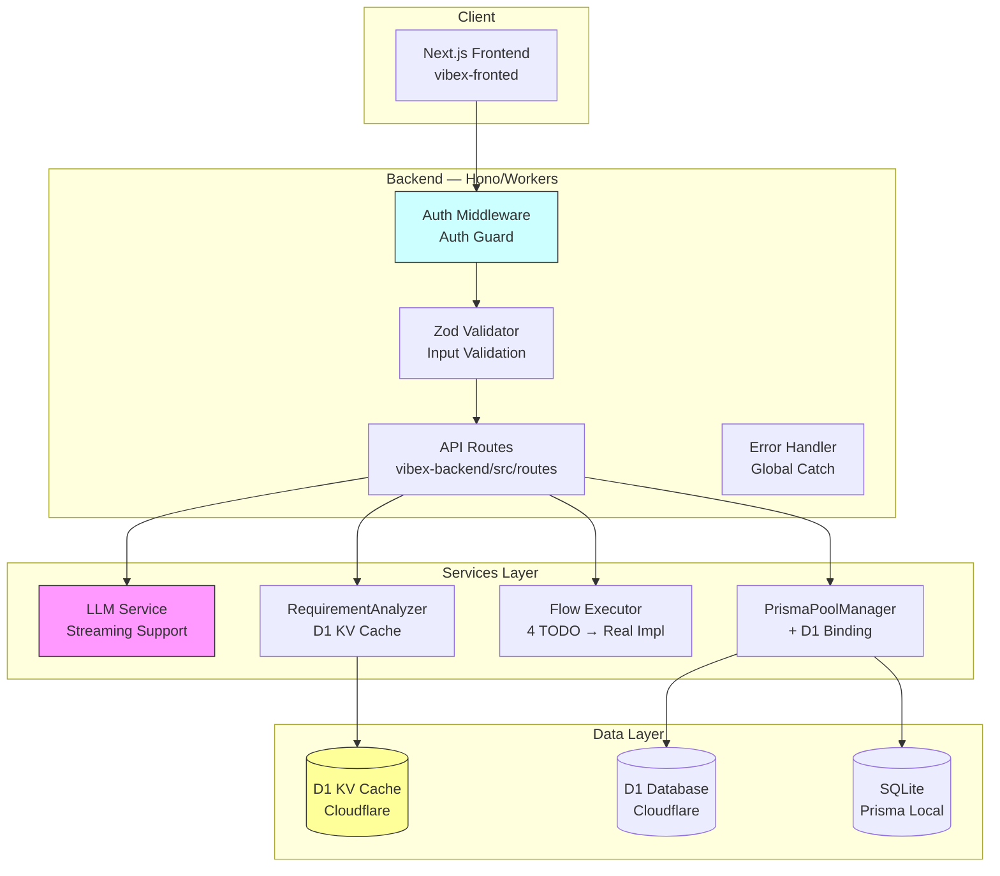
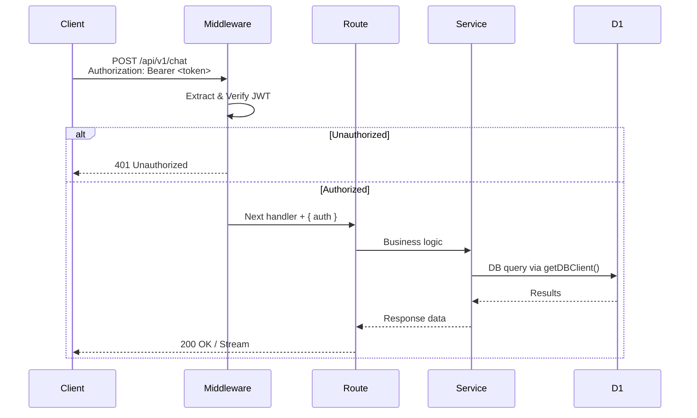
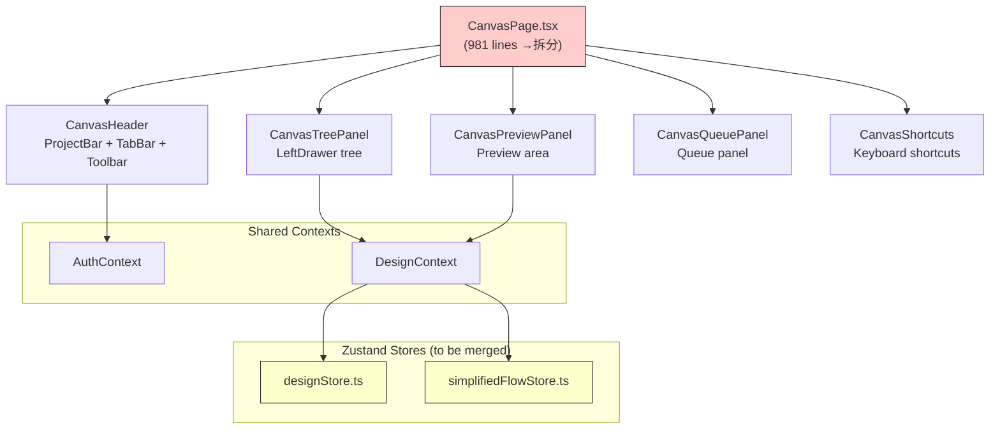
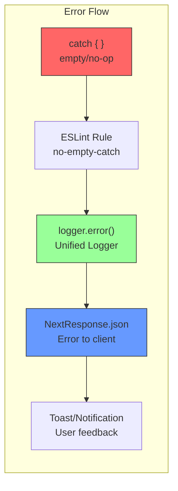
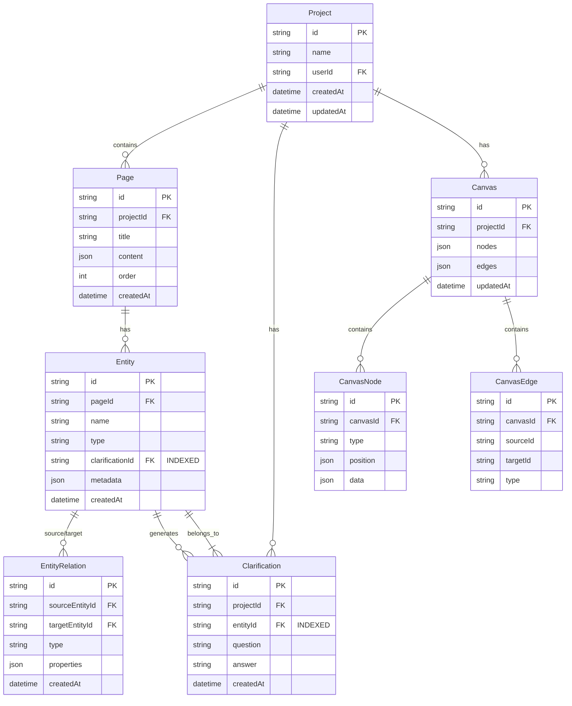

# Architecture Document — Vibex Dev Proposals (2026-04-10)

**Project**: vibex-dev-proposals-vibex-proposals-20260410  
**Author**: Architect Agent  
**Date**: 2026-04-10  
**Status**: Ready for Review

---

## 1. Tech Stack

### 1.1 Stack Overview

| Layer | Technology | Version | Notes |
|-------|-----------|---------|-------|
| Frontend Runtime | Next.js (App Router) | 15.x | React 19, TypeScript strict |
| Frontend State | Zustand | 5.x | Multiple stores (to be refactored) |
| Frontend Graph | @xyflow/react | 12.x | ReactFlow for canvas |
| Backend Runtime | Hono + Cloudflare Workers | Hono 4.x | Dual deploy: Node.js local / Workers prod |
| Database ORM | Prisma | 5.x | SQLite local, D1 (Cloudflare) prod |
| Database KV | Cloudflare D1 + KV | — | Cache layer (replacing in-memory Map) |
| Validation | Zod | 3.x | Schema validation for API inputs |
| Testing (FE) | Vitest + Playwright | Vitest 2.x | Unit + E2E |
| Testing (BE) | Vitest | Vitest 2.x | Unit + integration |
| CI/CD | GitHub Actions | — | Test gate to include backend |

### 1.2 Tech Decisions

#### TD-01: D1 KV as Cache Layer
- **Decision**: Replace `Map()` in-memory cache with Cloudflare D1 KV binding
- **Rationale**: Workers are stateless between invocations; in-memory Map leaks across requests on cold starts
- **Trade-off**: D1 KV has ~ms latency vs ~µs for Map, acceptable for requirement analyzer cache

#### TD-02: Unified DB Client (`getDBClient()`)
- **Decision**: Single `getDBClient()` factory replacing all direct `new PrismaClient()` instantiations
- **Rationale**: Workers bundle Prisma poorly; D1 binding bypasses Prisma for production queries
- **Trade-off**: Prisma features (relations, transactions) only available in local mode

#### TD-03: `withAuth` Middleware Pattern
- **Decision**: Create `withAuth()` HOC/wrapper for all protected routes
- **Rationale**: Consistent auth across 16+ routes; avoids manual auth checks per route
- **Trade-off**: Slight runtime overhead per request (~1ms), acceptable for security

#### TD-04: DOMPurify for Mermaid SVG Sanitization
- **Decision**: Use DOMPurify to sanitize SVG output from Mermaid renderer
- **Rationale**: `dangerouslySetInnerHTML` with LLM-generated content is XSS risk
- **Trade-off**: DOMPurify has ~5-10ms parse overhead, acceptable for render-once flows

---

## 2. Architecture Diagrams

### 2.1 System Context



### 2.2 API Route Auth Flow



### 2.3 Component Architecture (Frontend Refactoring)



### 2.4 Error Handling Architecture



---

## 3. API Definitions

### 3.1 New Auth Middleware

```typescript
// lib/apiAuth.ts
export interface AuthUser {
  userId: string;
  email: string;
  role: string;
}

export interface AuthContext {
  auth: AuthUser;
  env: CloudflareEnv;
}

export type AuthenticatedHandler = (
  request: NextRequest,
  context: AuthContext
) => Promise<Response>;

export function withAuth(handler: AuthenticatedHandler) {
  return async (request: NextRequest, context: { env: CloudflareEnv }) => {
    const authUser = await getAuthUser(request, context.env.JWT_SECRET);
    if (!authUser) {
      return NextResponse.json({ error: 'Unauthorized' }, { status: 401 });
    }
    return handler(request, { ...context, auth: authUser });
  };
}

// Usage: export const POST = withAuth(async (req, { auth, env }) => { ... });
```

### 3.2 Unified DB Client

```typescript
// lib/db.ts
export interface DBClient {
  prepare(sql: string): D1Statement;
  query<T = unknown>(sql: string, params?: unknown[]): Promise<T[]>;
}

export function getDBClient(env: CloudflareEnv, isWorkers = false): DBClient {
  if (isWorkers) {
    return createD1Client(env.D1_DB);
  }
  return createPrismaClient();
}

function createD1Client(d1: D1Database): DBClient {
  return {
    prepare: (sql) => d1.prepare(sql),
    async query<T>(sql: string, params?: unknown[]): Promise<T[]> {
      const stmt = d1.prepare(sql);
      const result = params ? stmt.bind(...params) : stmt;
      const { results } = await result.all();
      return results as T[];
    },
  };
}
```

### 3.3 Input Validation Schemas

```typescript
// schemas/canvas.ts
import { z } from 'zod';

export const generateCanvasSchema = z.object({
  projectId: z.string().uuid('Invalid projectId format'),
  pageIds: z.array(z.string()).min(1, 'At least one pageId required'),
  options: z.object({
    includeRelations: z.boolean().optional().default(true),
    mode: z.enum(['fast', 'full']).optional().default('full'),
  }).optional(),
});

export const generateContextsSchema = z.object({
  requirementText: z.string().max(5000, 'Requirement text too long (max 5000 chars)'),
  projectId: z.string().uuid().optional(),
});

export const chatMessageSchema = z.object({
  message: z.string().min(1).max(2000),
  history: z.array(z.object({
    role: z.enum(['user', 'assistant']),
    content: z.string(),
  })).optional(),
});
```

### 3.4 Logger Service

```typescript
// lib/logger.ts
export type LogLevel = 'debug' | 'info' | 'warn' | 'error';
const BLOCKED_KEYS = ['entityId', 'token', 'usage', 'sk-', 'password', 'secret', 'key'];

const LOG_LEVEL = (process.env.LOG_LEVEL ?? 'info') as LogLevel;
const LEVELS: Record<LogLevel, number> = { debug: 0, info: 1, warn: 2, error: 3 };

function shouldLog(level: LogLevel): boolean {
  return LEVELS[level] >= LEVELS[LOG_LEVEL];
}

function sanitizeLogMeta(meta?: Record<string, unknown>): Record<string, unknown> {
  if (!meta) return {};
  const sanitized: Record<string, unknown> = {};
  for (const [k, v] of Object.entries(meta)) {
    if (BLOCKED_KEYS.some(b => k.toLowerCase().includes(b))) {
      sanitized[k] = '[REDACTED]';
    } else if (typeof v === 'object' && v !== null) {
      sanitized[k] = sanitizeLogMeta(v as Record<string, unknown>);
    } else {
      sanitized[k] = v;
    }
  }
  return sanitized;
}

export const logger = {
  debug: (...args: unknown[]) => shouldLog('debug') && console.log('[DEBUG]', ...args),
  info: (...args: unknown[]) => shouldLog('info') && console.log('[INFO]', ...args),
  warn: (...args: unknown[]) => shouldLog('warn') && console.warn('[WARN]', ...args),
  error: (ctx: string, meta?: Record<string, unknown>) => {
    if (!shouldLog('error')) return;
    console.error(`[ERROR] ${ctx}`, sanitizeLogMeta(meta));
  },
};
```

### 3.5 Flow Execution (TODO → Implementation)

```typescript
// lib/prompts/flow-execution.ts
export interface FlowStep {
  id: string;
  type: 'llm' | 'code' | 'wait';
  config: Record<string, unknown>;
}

export interface FlowStepResult {
  stepId: string;
  output: unknown;
  status: 'success' | 'failed' | 'skipped';
  error?: string;
  durationMs: number;
}

export interface FlowExecutionResult {
  flowId: string;
  steps: FlowStepResult[];
  completedAt: string;
  durationMs: number;
}

export async function executeFlow(
  params: { flowId: string; steps: FlowStep[]; context?: Record<string, unknown> },
  env: CloudflareEnv
): Promise<FlowExecutionResult> {
  const start = Date.now();
  const results: FlowStepResult[] = [];

  for (const step of params.steps) {
    const stepStart = Date.now();
    try {
      switch (step.type) {
        case 'llm': {
          const output = await executeLLMStep(step, params.context, env);
          results.push({ stepId: step.id, output, status: 'success', durationMs: Date.now() - stepStart });
          break;
        }
        case 'code': {
          const output = await executeCodeStep(step, params.context);
          results.push({ stepId: step.id, output, status: 'success', durationMs: Date.now() - stepStart });
          break;
        }
        case 'wait': {
          const delay = (step.config.durationMs as number) ?? 1000;
          await new Promise(r => setTimeout(r, delay));
          results.push({ stepId: step.id, output: { waitedMs: delay }, status: 'success', durationMs: Date.now() - stepStart });
          break;
        }
        default:
          results.push({ stepId: step.id, output: null, status: 'skipped', durationMs: Date.now() - stepStart });
      }
    } catch (err) {
      results.push({
        stepId: step.id,
        output: null,
        status: 'failed',
        error: err instanceof Error ? err.message : String(err),
        durationMs: Date.now() - stepStart,
      });
    }
  }

  return {
    flowId: params.flowId,
    steps: results,
    completedAt: new Date().toISOString(),
    durationMs: Date.now() - start,
  };
}
```

### 3.6 Chat History Fix

```typescript
// app/api/v1/chat/route.ts — fix history not being passed to LLM
export const chatRoute = withAuth(async (request, { auth, env }) => {
  const body = await request.json();
  const { message, history } = chatMessageSchema.parse(body);

  // FIX: Actually use history
  const historyMessages: ChatMessage[] = (history || []).map(h => ({
    role: h.role as 'user' | 'assistant',
    content: h.content,
  }));
  const messages: ChatMessage[] = [...historyMessages, { role: 'user', content: message }];

  const llm = getLLMService(env);
  const response = await llm.chat(messages);
  return NextResponse.json({ response });
});
```

---

## 4. Data Model

### 4.1 Entity Relationship (Core Domain)



### 4.2 Database Indexes (Post-Fix)

```sql
-- NEW: clarificationId index on Entity table
CREATE INDEX IF NOT EXISTS idx_entity_clarification_id ON Entity(clarificationId);

-- Existing indexes (verify existence)
CREATE INDEX IF NOT EXISTS idx_project_user ON Project(userId);
CREATE INDEX IF NOT EXISTS idx_page_project ON Page(projectId);
CREATE INDEX IF NOT EXISTS idx_entity_page ON Entity(pageId);
CREATE INDEX IF NOT EXISTS idx_clarification_project ON Clarification(projectId);
CREATE INDEX IF NOT EXISTS idx_canvas_project ON Canvas(projectId);
```

### 4.3 Cache Strategy (D1 KV)

```mermaid
graph LR
    Req["RequirementAnalyzer<br/>Request"] --> Check["getCache(key)"]
    Check -->|HIT| Return["Return cached<br/>EntityRelations"]
    Check -->|MISS| Analyze["Analyze & Generate"]
    Analyze --> Store["setCache(key, result)"]
    Store --> D1KV["D1 KV<br/>CACHE_KV binding"]
    D1KV --> Return

    subgraph "Isolation"
        ColdStart["Cold Start<br/>Workers"]
        ColdStart -.->|Map() cleared| Lost["In-memory lost"]
        ColdStart -.->|D1 KV persists| Persist["Persistent across<br/>warm invocations"]
    end

    style D1KV fill:#ff9,stroke:#333
    style Persist fill:#9f9,stroke:#333
```

**Cache Key Strategy**: `requirement:${projectId}:${hash(requirementText)}`  
**TTL**: 1 hour (configurable via env `CACHE_TTL_SECONDS`)

---

## 5. Testing Strategy

### 5.1 Testing Pyramid

```
        ┌──────────────────────────────────────┐
        │           E2E (Playwright)            │  ~15 tests
        │  Canvas flows, Auth, Chat history    │
        ├──────────────────────────────────────┤
        │      Integration (Vitest)             │  ~50 tests
        │  API routes, Flow execution, DB ops  │
        ├──────────────────────────────────────┤
        │         Unit (Vitest)                │  ~100 tests
        │  Services, Utils, Schema validation   │
        └──────────────────────────────────────┘
```

**Coverage Target**: > 80% line coverage for backend services, > 70% for frontend components

### 5.2 Backend Unit Test Examples

#### ST-01: Streaming Response `this` Binding

```typescript
// __tests__/services/llm.test.ts
describe('LLMService.createStreamingResponse', () => {
  it('should not throw ReferenceError when stream starts', async () => {
    const svc = new LLMService(testEnv);
    const response = svc.createStreamingResponse({
      messages: [{ role: 'user', content: 'test' }],
    });
    expect(response).toBeInstanceOf(Response);
    expect(response.headers.get('Content-Type')).toBe('text/event-stream');
  });

  it('should produce readable chunks from stream', async () => {
    const svc = new LLMService(testEnv);
    const response = svc.createStreamingResponse({
      messages: [{ role: 'user', content: 'test' }],
    });
    const reader = response.body!.getReader();
    const { done } = await reader.read();
    expect(done).toBe(false);
  });
});
```

#### ST-03: Multi-Entity Relations Query

```typescript
// __tests__/services/requirement-analyzer.test.ts
describe('getRelationsForEntities', () => {
  it('should return relations for multiple entity IDs', async () => {
    const analyzer = new RequirementAnalyzerService(testEnv);
    const entities = await createTestEntities(3);
    const relations = await analyzer.getRelationsForEntities(entities.map(e => e.id));
    expect(relations.length).toBeGreaterThanOrEqual(2);
    const entityIds = new Set(entities.map(e => e.id));
    relations.forEach(r => {
      expect(entityIds.has(r.sourceEntityId) || entityIds.has(r.targetEntityId)).toBe(true);
    });
  });

  it('should return empty array for empty input', async () => {
    const relations = await new RequirementAnalyzerService(testEnv).getRelationsForEntities([]);
    expect(relations).toEqual([]);
  });
});
```

#### ST-05: Log Sanitization

```typescript
// __tests__/lib/logger.test.ts
describe('logger.sanitizeLogMeta', () => {
  const sensitiveData = {
    entityId: 'abc123', token: 'sk-test-token',
    usage: { prompt_tokens: 100 }, userId: 'user-456',
  };

  it('should redact entityId, token, usage from logs', () => {
    const sanitized = sanitizeLogMeta(sensitiveData);
    expect(sanitized.entityId).toBe('[REDACTED]');
    expect(sanitized.token).toBe('[REDACTED]');
    expect(sanitized.usage).toBe('[REDACTED]');
    expect(sanitized.userId).toBe('user-456');
  });

  it('should not contain sensitive keys in output', () => {
    const output = captureStdout(() => logger.error('test', sensitiveData));
    expect(output).not.toMatch(/entityId|token|usage|sk-/);
  });
});
```

#### ST-07: Flow Execution

```typescript
// __tests__/lib/flow-execution.test.ts
describe('executeFlow', () => {
  it('should execute wait step and return output', async () => {
    const result = await executeFlow({
      flowId: 'test', steps: [{ id: 's1', type: 'wait', config: { durationMs: 10 } }],
    }, testEnv);
    expect(result.steps[0].status).toBe('success');
    expect(result.steps[0].output).toEqual({ waitedMs: 10 });
    expect(result.steps[0].durationMs).toBeGreaterThan(0);
  });

  it('should not return { success: true, data: null }', async () => {
    const result = await executeFlow({ flowId: 'test', steps: [{ id: 's1', type: 'wait', config: { durationMs: 1 } }] }, testEnv);
    expect(result.steps[0]).not.toEqual({ stepId: 's1', output: null, status: 'failed', error: undefined });
  });
});
```

### 5.3 Frontend Test Coverage

| Story | Test File | Target |
|-------|-----------|--------|
| D-P1-1: `as any` removal | `__tests__/components/visualization/*.test.tsx` | Type errors = failures |
| D-P1-2: Empty catch | `__tests__/components/chat/*.test.tsx` | Error boundary tests |
| D-P1-3: CanvasPage split | `__tests__/components/canvas/*.test.tsx` | Each sub-component |
| D-P1-4: XSS sanitization | `__tests__/MermaidRenderer.test.tsx` | DOMPurify on SVG |
| D-P1-5: ReactFlow usage | `__tests__/components/ui/*.test.tsx` | Hook boundary tests |
| D-P2-2: Chat history | `__tests__/lib/api/chat.test.ts` | History preserved |
| D-P3-1: Canvas E2E | `playwright-canvas-crash-test.config.cjs` | Full user flows |

### 5.4 CI Integration

```yaml
# .github/workflows/test.yml
- name: Backend Tests
  run: pnpm --filter vibex-backend run test:ci
- name: Frontend Tests
  run: pnpm --filter vibex-fronted run test:ci
- name: E2E Tests
  run: pnpm --filter vibex-fronted run test:e2e
```

---

## 6. Key Implementation Patterns

### 6.1 Frontend Type Safety (D-P1-1)

```typescript
// Before (unsafe): const CardTreeNode = (props: any) => { ... }
// After (correct):
import type { NodeProps } from '@xyflow/react';
interface CardTreeNodeData { label: string; icon?: string; status?: 'active' | 'inactive'; }
type CardTreeNodeProps = NodeProps<CardTreeNodeData>;
const CardTreeNode = ({ data, selected, id }: CardTreeNodeProps) => { ... }
```

### 6.2 Error Boundary (D-P0-2, D-P1-2)

```typescript
export class ErrorBoundary extends Component<Props, State> {
  static getDerivedStateFromError(error: Error) { return { hasError: true, error }; }
  componentDidCatch(error: Error, info: React.ErrorInfo) {
    logger.error('react_error_boundary', { error: error.message, stack: info.componentStack });
  }
  render() {
    if (this.state.hasError) return this.props.fallback ?? <DefaultErrorUI />;
    return this.props.children;
  }
}
```

### 6.3 XSS Prevention (D-P1-4)

```typescript
import DOMPurify from 'dompurify';
const sanitizedSvg = DOMPurify.sanitize(mermaidSvg, {
  USE_PROFILES: { svg: true, svgFilters: true },
  FORBID_TAGS: ['script', 'foreignObject'],
  FORBID_ATTR: ['onerror', 'onload', 'onclick'],
});
```

---

## 7. File Change Map

### Backend (vibex-backend/src/)

| File | Change | Story |
|------|--------|-------|
| `lib/apiAuth.ts` | **NEW** — auth middleware | D-P0-1 |
| `lib/db.ts` | Extend `getDBClient()`, D1 compat layer | ST-02 |
| `lib/logger.ts` | **NEW** — unified logger with sanitization | ST-05, D-P0-2 |
| `lib/errorHandler.ts` | Fix `as any`, `details?: unknown` | D-P2-4, D-P3-2 |
| `services/llm.ts` | Fix `thisLLMService` binding | ST-01 |
| `services/requirement-analyzer.ts` | D1 KV cache, multi-ID relations | ST-03, ST-04 |
| `lib/prompts/flow-execution.ts` | Implement 4 TODO stubs | ST-07 |
| `app/api/v1/chat/route.ts` | withAuth, history fix, Zod validation | D-P0-1, D-P2-2, D-P0-3 |
| `app/api/v1/canvas/generate*/route.ts` | withAuth, Zod validation | D-P0-1, D-P0-3 |
| `app/api/v1/canvas/stream/route.ts` | withAuth, error logging | D-P0-1, D-P0-2 |
| `app/api/v1/canvas/status/route.ts` | withAuth | D-P0-1 |
| `app/api/v1/canvas/export/route.ts` | withAuth, error logging | D-P0-1, D-P0-2 |
| `app/api/v1/canvas/project/route.ts` | withAuth | D-P0-1 |
| `app/api/v1/ai-ui-generation/route.ts` | withAuth, error logging | D-P0-1, D-P0-2 |
| `app/api/v1/domain-model/[projectId]/route.ts` | withAuth | D-P0-1 |
| `app/api/v1/prototype-snapshots/route.ts` | withAuth, error logging | D-P0-1, D-P0-2 |
| `app/api/v1/agents/[id]/route.ts` | withAuth | D-P0-1 |
| `app/api/v1/pages/[id]/route.ts` | withAuth | D-P0-1 |
| `app/api/v1/canvas/snapshots.ts` | Error logging | D-P0-2 |
| `migrations/xxx_add_clarification_index.sql` | **NEW** — clarificationId index | ST-08 |
| `.github/workflows/test.yml` | Add backend test gate | D-P2-6 |

### Frontend (vibex-fronted/src/)

| File | Change | Story |
|------|--------|-------|
| `lib/logger.ts` | **NEW** — frontend logger | D-P1-6 |
| `components/visualization/CardTreeNode/CardTreeNode.tsx` | Fix `as any`, remove useReactFlow from Node | D-P1-1, D-P1-5 |
| `components/ui/DomainRelationGraph.tsx` | Remove nested ReactFlowProvider | D-P2-3 |
| `components/ui/FlowEditor.tsx` | Remove nested ReactFlowProvider | D-P2-3 |
| `components/visualization/MermaidRenderer/MermaidRenderer.tsx` | DOMPurify sanitization | D-P1-4 |
| `components/canvas/CanvasPage.tsx` | **REFACTOR** into sub-components | D-P1-3 |
| `components/canvas/CanvasHeader.tsx` | **NEW** — split from CanvasPage | D-P1-3 |
| `components/canvas/CanvasTreePanel.tsx` | **NEW** — split from CanvasPage | D-P1-3 |
| `components/canvas/CanvasPreviewPanel.tsx` | **NEW** — split from CanvasPage | D-P1-3 |
| `stores/designStore.ts` | **MERGE** with simplifiedFlowStore | D-P2-1 |
| `stores/simplifiedFlowStore.ts` | **MERGE** into designStore | D-P2-1 |
| `stores/ddd/init.ts` | Remove eslint-disable hooks | D-P2-5 |

---

## 8. Security Considerations

### 8.1 Auth Middleware — Never Skip
- All `/api/v1/*` routes (except `/api/v1/auth/login`, `/api/v1/auth/register`, `/api/v1/health`) must use `withAuth`
- JWT secret from `env.JWT_SECRET`, never hardcoded
- Token expiry enforced server-side

### 8.2 Input Validation — Defense in Depth
```
User Input → Zod Schema → Type Coercion → Business Logic → DB
     ↓            ↓              ↓
  Reject 400   Coerce types   Guard against injection
```

### 8.3 Log Sanitization — Always Active
- `entityId`, `token`, `usage`, `sk-`, `password`, `secret`, `key` are always redacted
- Never log raw request bodies that may contain PII
- Production builds should strip `console.*` entirely via terser plugin
