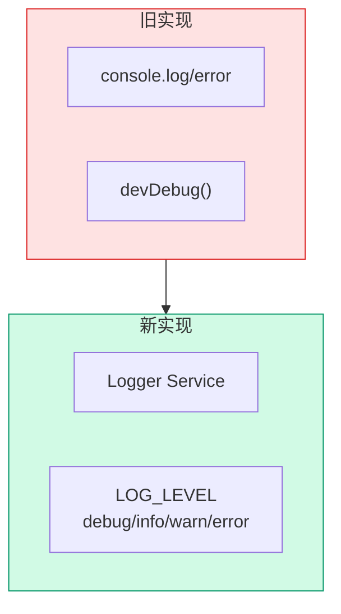
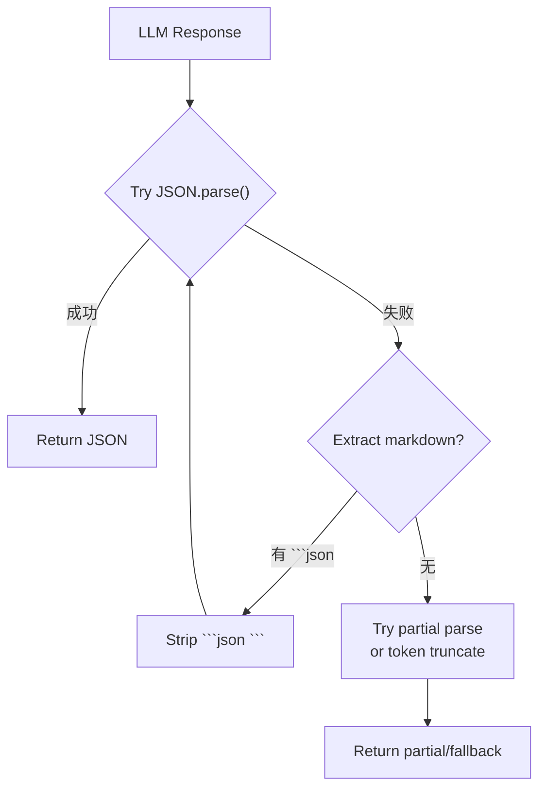

# Architecture: VibeX Backend Dev Proposals 2026-04-11

> **项目**: vibex-dev-proposals-vibex-proposals-20260411  
> **作者**: Architect  
> **日期**: 2026-04-11  
> **版本**: v1.0

---

## 执行决策

| 决策 | 状态 | 执行项目 | 执行日期 |
|------|------|----------|----------|
| 结构化日志替代 console | **已采纳** | vibex-dev-proposals-vibex-proposals-20260411 | 2026-04-11 |
| logger 分级替代 devDebug | **已采纳** | vibex-dev-proposals-vibex-proposals-20260411 | 2026-04-11 |
| JSON 解析降级策略 | **已采纳** | vibex-dev-proposals-vibex-proposals-20260411 | 2026-04-11 |

---

## 1. Tech Stack

| 组件 | 技术选型 | 版本 | 说明 |
|------|----------|------|------|
| **日志** | pino | ^8.0 | 结构化 JSON 日志 |
| **环境** | env | LOG_LEVEL | 分级控制 |
| **熔断** | 自实现 | — | 错误计数 + 阈值 |

---

## 2. 架构图

### 2.1 日志分层



### 2.2 JSON 解析降级



---

## 3. 日志服务设计

### 3.1 Logger Service

```typescript
// lib/logger.ts
import pino from 'pino';

const LOG_LEVEL = process.env.LOG_LEVEL || 'info';

export const logger = pino({
  level: LOG_LEVEL,
  formatters: {
    level: (label) => ({ level: label }),
  },
});

// devDebug 替换
export function debug(label: string, data?: object) {
  if (LOG_LEVEL === 'debug') {
    logger.debug({ label, ...data });
  }
}

// 结构化 error
export function logError(ctx: {
  projectId?: string;
  operation: string;
  error: Error;
  metadata?: object;
}) {
  logger.error({
    projectId: ctx.projectId,
    operation: ctx.operation,
    errorMessage: ctx.error.message,
    errorStack: ctx.error.stack,
    ...ctx.metadata,
  });
}
```

### 3.2 connectionPool 修复

```typescript
// 修复前
console.log('New connection:', connectionId);

// 修复后
import { logger } from '@/lib/logger';

logger.info('connection_added', {
  connectionId,
  total: this.connections.size,
  userId: connection.userId,
});

logger.info('connection_removed', { connectionId });
logger.warn('connection_timeout', { connectionId, duration: elapsed });
```

### 3.3 console.error 结构化

```typescript
// 修复前
console.error('Failed to load preview:', error);

// 修复后
import { logError } from '@/lib/logger';

logError({
  projectId: ctx.projectId,
  operation: 'load_preview',
  error,
  metadata: { previewId: ctx.previewId },
});
```

---

## 4. JSON 解析降级设计

### 4.1 JSON 提取器

```typescript
// lib/jsonExtractor.ts
export function extractJSON(response: string): { data: object | null; method: 'direct' | 'markdown' | 'partial' } {
  // 1. 直接解析
  try {
    return { data: JSON.parse(response), method: 'direct' };
  } catch { /* continue */ }

  // 2. 提取 markdown 包裹
  const markdownMatch = response.match(/```json\s*([\s\S]*?)\s*```/);
  if (markdownMatch) {
    try {
      return { data: JSON.parse(markdownMatch[1].trim()), method: 'markdown' };
    } catch { /* continue */ }
  }

  // 3. 部分解析（最后一个完整对象）
  const partial = extractLastCompleteObject(response);
  return { data: partial, method: 'partial' };
}

function extractLastCompleteObject(text: string): object | null {
  // 从后向前找最后一个完整 JSON 对象
  let depth = 0;
  let start = -1;
  for (let i = text.length - 1; i >= 0; i--) {
    if (text[i] === '}') {
      if (depth === 0) start = i;
      depth++;
    } else if (text[i] === '{') {
      depth--;
      if (depth === 0 && start !== -1) {
        try {
          return JSON.parse(text.slice(i, start + 1));
        } catch { break; }
      }
    }
  }
  return null;
}
```

---

## 5. 熔断设计

### 5.1 connectionPool 熔断

```typescript
// connectionPool.ts
interface CircuitBreaker {
  failures: number;
  threshold: number;
  lastFailure: number;
  resetTimeout: number; // ms
}

const circuitBreaker: CircuitBreaker = {
  failures: 0,
  threshold: 5,
  lastFailure: 0,
  resetTimeout: 60000, // 1 min
};

function handleMessageError(error: Error) {
  circuitBreaker.failures++;
  circuitBreaker.lastFailure = Date.now();

  logError({
    operation: 'handle_message',
    error,
  });

  if (circuitBreaker.failures >= circuitBreaker.threshold) {
    logger.warn('circuit_breaker_opened', {
      failures: circuitBreaker.failures,
      threshold: circuitBreaker.threshold,
    });
    triggerHealthCheck();
  }

  // 重置
  if (Date.now() - circuitBreaker.lastFailure > circuitBreaker.resetTimeout) {
    circuitBreaker.failures = 0;
  }
}
```

---

## 6. 验收标准

| 检查项 | 命令 | 目标 |
|--------|------|------|
| 无 console.log | `grep -rn "console\.log" vibex-backend/src/` | 0 结果 |
| 无 devDebug | `grep -rn "devDebug" vibex-backend/src/` | 0 结果 |
| 结构化 logger | `grep -rn "logger\." vibex-backend/src/` | >0 结果 |
| 无 TODO | `grep -rn "// TODO" vibex-backend/src/routes/` | 0 结果 |
| 无 backup | `find vibex-backend/src -name "*.backup*"` | 0 结果 |
| JSON 解析 | 测试 markdown 包裹 JSON | 正确解析 |

---

*文档版本: v1.0 | 最后更新: 2026-04-11*
