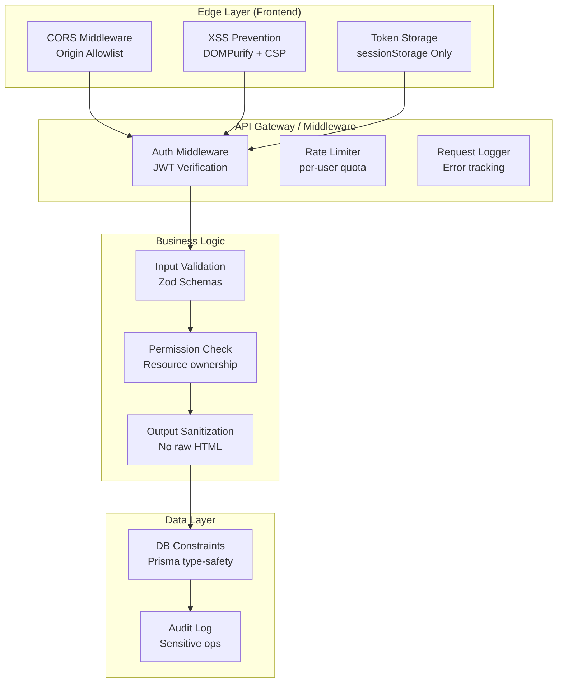
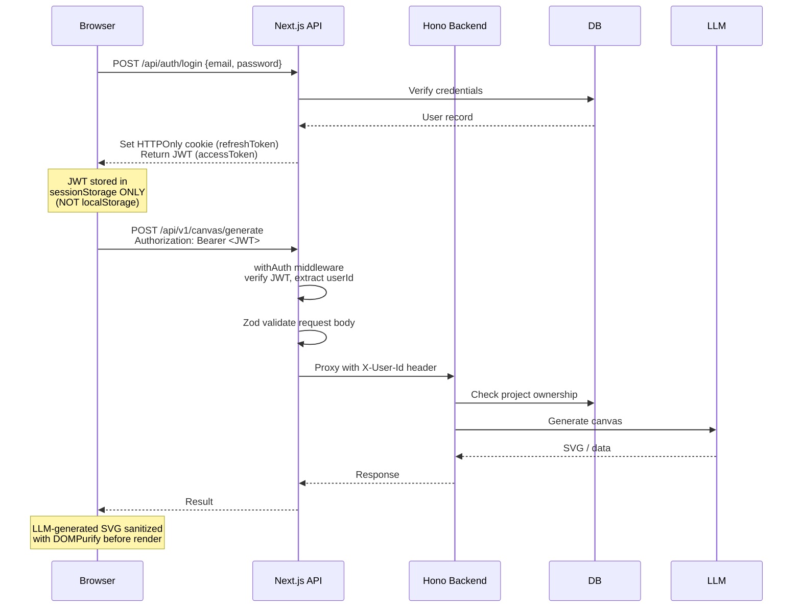
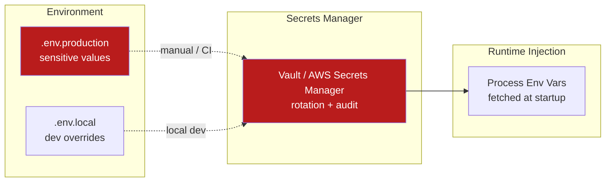
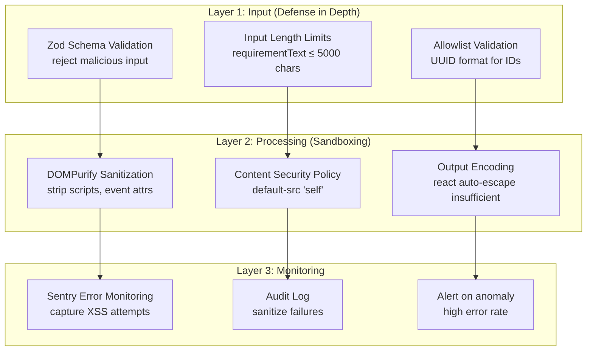

# Vibex Dev Security Architecture

**项目**: vibex-dev-security-20260410  
**版本**: 1.0  
**架构师**: Architect  
**日期**: 2026-04-10  
**状态**: 草稿

---

## 1. 威胁模型 (Threat Model)

### 1.1 资产分类

| 资产 | 敏感级别 | 威胁 |
|------|----------|------|
| Auth Token (JWT) | 🔴 极高 | XSS 窃取、会话劫持 |
| API Keys (OpenAI, etc.) | 🔴 极高 | 密钥泄露、资源滥用 |
| User Project Data | 🟠 高 | 未授权访问、数据泄露 |
| LLM Quota | 🟠 高 | DoS、费用超支 |
| User Input (prompts) | 🟡 中 | Prompt 注入、畸形数据 |

### 1.2 攻击向量

```
┌─────────────────────────────────────────────────────────┐
│                    攻击面分析                              │
├─────────────────────────────────────────────────────────┤
│  XSS         │ DOM-based XSS via user-generated content │
│  Auth Bypass │ API routes missing auth middleware        │
│  Input Abuse │ 畸形请求绕过校验导致 DB 异常 / DoS          │
│  Token Theft │ localStorage → sessionStorage 未迁移      │
│  Secret Leak │ .env 硬编码 / API key 前端暴露            │
│  CORS Misconfig│ wildcard origin 导致跨域滥用            │
│  CSRF        │ 无 token 验证的 state-mutating API       │
│  SSTI/Inject │ Mermaid content → dangerouslySetInnerHTML │
└─────────────────────────────────────────────────────────┘
```

### 1.3 DREAD 风险评估

| ID | 威胁 | D | R | E | A | D | Score | 优先级 |
|----|------|---|---|---|---|---|-------|--------|
| T1 | API routes 无认证 → 任意用户消耗 LLM 配额 | 10 | 10 | 9 | 10 | 8 | 47 | P0 |
| T2 | localStorage 存储 token → XSS 窃取 | 9 | 8 | 10 | 9 | 9 | 45 | P0 |
| T3 | MermaidRenderer dangerouslySetInnerHTML → XSS | 8 | 8 | 9 | 8 | 8 | 41 | P1 |
| T4 | canvas generate 无输入校验 → DoS / DB 异常 | 7 | 8 | 8 | 8 | 7 | 38 | P0 |
| T5 | 空 catch 块 → 错误静默丢失，生产无法追踪 | 5 | 9 | 9 | 8 | 6 | 37 | P0 |
| T6 | API keys 前端暴露 / .env 泄露 | 10 | 7 | 9 | 7 | 8 | 41 | P1 |
| T7 | CORS wildcard → 跨域数据窃取 | 7 | 7 | 8 | 7 | 7 | 36 | P1 |

---

## 2. 安全控制架构

### 2.1 分层安全模型



### 2.2 Auth Flow



### 2.3 Token Security — sessionStorage Only

**决策**: 认证 token 必须存储在 `sessionStorage`，禁止使用 `localStorage`。

| 存储位置 | 跨标签页共享 | XSS 攻击窗口 | 适用场景 |
|----------|------------|-------------|---------|
| localStorage | ✅ 是 | 大（持久化） | ❌ 禁用 |
| sessionStorage | ❌ 否 | 小（当前标签） | ✅ Auth tokens |
| HTTPOnly Cookie | ✅ 是 | 中（可跨域） | ✅ Refresh tokens |

```typescript
// ✅ 正确：sessionStorage
sessionStorage.setItem('auth_token', jwt);
sessionStorage.getItem('auth_token');
sessionStorage.removeItem('auth_token');

// ❌ 错误：localStorage
localStorage.setItem('auth_token', jwt);  // 禁止！
```

**实现要求**:
- Auth hook 只读写 sessionStorage
- 页面卸载 (beforeunload) 后自动清理
- 不支持标签页间 token 共享（需要重新登录）

### 2.4 CORS 配置

```typescript
// vibex-backend/src/middleware/cors.ts

const ALLOWED_ORIGINS = process.env.CORS_ALLOWED_ORIGINS?.split(',') ?? [
  'https://vibex.app',
  'https://www.vibex.app',
];

export const corsMiddleware = cors({
  origin: (origin, ctx) => {
    // 允许没有 Origin header 的请求（同源）
    if (!origin) return true;
    // 允许明确配置的域名
    return ALLOWED_ORIGINS.includes(origin);
  },
  credentials: true,
  allowMethods: ['GET', 'POST', 'PUT', 'DELETE', 'OPTIONS'],
  allowHeaders: ['Content-Type', 'Authorization', 'X-User-Id'],
  maxAge: 86400, // 24h preflight cache
});
```

**CORS 原则**:
- ❌ 禁止 `origin: '*'`
- ❌ 禁止 `credentials: true` 配合 wildcard
- ✅ 显式 allowlist，区分 dev/staging/prod
- ✅ Preflight OPTIONS 缓存 24h

### 2.5 Secrets Management



**密钥层级**:

| 层级 | 示例 | 管理方式 |
|------|------|---------|
| L1: 用户凭据 | password, JWT | bcrypt hash + JWT |
| L2: 服务密钥 | OpenAI key, DB password | env vars, Vault |
| L3: 内部密钥 | JWT_SECRET, SESSION_SECRET | env vars, rotated |
| L4: 公开 | CORS_ALLOWED_ORIGINS | git-safe |

**实现约束**:
- API keys 不得硬编码在源码中
- 前端只能访问带 `NEXT_PUBLIC_` 前缀的 env var
- 后端所有密钥通过 `process.env` 注入
- 生产密钥通过 CI/CD secrets 注入，不落磁盘

---

## 3. XSS 防护体系

### 3.1 三层防御



### 3.2 MermaidRenderer 安全修复

```typescript
// Before (XSS risk)
<div dangerouslySetInnerHTML={{ __html: svgContent }} />

// After (Safe)
import DOMPurify from 'dompurify';

const sanitizeSvg = (svg: string): string => {
  const clean = DOMPurify.sanitize(svg, {
    USE_PROFILES: { svg: true, svgFilters: true },
    ALLOWED_TAGS: ['svg', 'g', 'path', 'rect', 'circle', 'text', ...],
    ALLOWED_ATTR: ['id', 'class', 'd', 'fill', 'stroke', ...],
  });
  return clean;
};

<div dangerouslySetInnerHTML={{ __html: sanitizeSvg(svgContent) }} />
```

### 3.3 Content Security Policy

```typescript
// next.config.js
const securityHeaders = [
  {
    key: 'Content-Security-Policy',
    value: [
      "default-src 'self'",
      "script-src 'self' 'unsafe-inline' 'unsafe-eval'",
      "style-src 'self' 'unsafe-inline'",
      "img-src 'self' data: https: blob:",
      "font-src 'self'",
      "connect-src 'self' https://api.openai.com https://api.anthropic.com",
      "frame-ancestors 'none'",
      "base-uri 'self'",
      "form-action 'self'",
    ].join('; '),
  },
  {
    key: 'X-Frame-Options',
    value: 'DENY',
  },
  {
    key: 'X-Content-Type-Options',
    value: 'nosniff',
  },
  {
    key: 'Referrer-Policy',
    value: 'strict-origin-when-cross-origin',
  },
  {
    key: 'Permissions-Policy',
    value: 'camera=(), microphone=(), geolocation=()',
  },
];
```

---

## 4. Input Validation 架构

### 4.1 统一校验层

```typescript
// shared/src/validation/schemas.ts
import { z } from 'zod';

export const projectIdSchema = z.string().uuid({ message: 'Invalid project ID format' });

export const canvasGenerateSchema = z.object({
  projectId: projectIdSchema,
  pageIds: z.array(z.string()).min(1, 'At least one page required'),
  requirements: z.string().max(5000).optional(),
  options: z.object({
    style: z.enum(['minimal', 'detailed', 'flow']).default('flow'),
  }).optional(),
});

export const chatMessageSchema = z.object({
  message: z.string().min(1).max(10000),
  history: z.array(z.object({
    role: z.enum(['user', 'assistant']),
    content: z.string(),
  })).max(50).optional(),
});
```

### 4.2 Middleware 集成

```typescript
// shared/src/middleware/validate.ts
export function withValidation<T extends z.ZodSchema>(
  schema: T,
  handler: (data: z.infer<T>, ctx: RouteContext) => Promise<Response>
) {
  return async (req: NextRequest, ctx: RouteContext) => {
    const parseResult = schema.safeParse(await req.json());
    if (!parseResult.success) {
      return NextResponse.json(
        { error: 'Validation failed', details: parseResult.error.flatten() },
        { status: 400 }
      );
    }
    return handler(parseResult.data, ctx);
  };
}

// Usage
export const POST = withValidation(canvasGenerateSchema, async (data, ctx) => {
  // data is fully typed and validated
  const { projectId, pageIds, requirements } = data;
  // ...
});
```

---

## 5. Auth Middleware 架构

### 5.1 统一认证中间件

```typescript
// shared/src/middleware/auth.ts

export type AuthUser = {
  userId: string;
  email: string;
  role: 'user' | 'admin';
};

export async function getAuthUser(req: Request): Promise<AuthUser | null> {
  const authHeader = req.headers.get('Authorization');
  if (!authHeader?.startsWith('Bearer ')) return null;

  const token = authHeader.slice(7);
  try {
    const payload = jwt.verify(token, process.env.JWT_SECRET!) as JWTPayload;
    return { userId: payload.sub, email: payload.email, role: payload.role };
  } catch {
    return null;
  }
}

export function withAuth(
  handler: (req: Request, ctx: RouteContext & { auth: AuthUser }) => Promise<Response>
) {
  return async (req: Request, ctx: RouteContext): Promise<Response> => {
    const auth = await getAuthUser(req);
    if (!auth) {
      return NextResponse.json({ error: 'Unauthorized' }, { status: 401 });
    }
    return handler(req, { ...ctx, auth });
  };
}

// Public routes (no auth required)
export const PUBLIC_ROUTES = [
  '/api/auth/login',
  '/api/auth/register',
  '/api/health',
  '/api/auth/oauth/google',
  '/api/auth/oauth/github',
];
```

### 5.2 路由级守卫

```typescript
// Before: manual auth in each route ❌
export async function POST(req: NextRequest) {
  const token = req.headers.get('Authorization');
  if (!token) return 401;
  // ...
}

// After: middleware wrapper ✅
export const POST = withAuth(async (req, { auth }) => {
  // auth.userId is guaranteed present
  const projects = await db.project.findMany({ where: { userId: auth.userId } });
  return NextResponse.json(projects);
});
```

---

## 6. 架构决策记录 (ADRs)

### ADR-001: Token Storage — sessionStorage Only

**状态**: 已采纳  
**决策**: 认证 token 必须存储在 sessionStorage  
**理由**: localStorage 持久化特性扩大 XSS 攻击窗口；sessionStorage 在标签页关闭后自动清理，攻击窗口更小  
**代价**: 不支持多标签页共享登录态（需重新登录）

### ADR-002: Auth Middleware — 集中式认证

**状态**: 已采纳  
**决策**: 所有 API route 通过统一的 `withAuth` wrapper 添加认证  
**理由**: 避免开发者遗漏认证检查（P0-1 问题根因）；可集中审计和日志  
**代价**: 需要改造现有 16+ 个无认证路由

### ADR-003: XSS 防护 — DOMPurify + CSP

**状态**: 已采纳  
**决策**: 所有 LLM 生成的 SVG/HTML 必须经过 DOMPurify 清洗  
**理由**: dangerouslySetInnerHTML 直接渲染 LLM 输出是已知 XSS 风险  
**代价**: DOMPurify 引入轻微性能开销（可接受）

### ADR-004: Input Validation — Zod 统一校验

**状态**: 已采纳  
**决策**: 所有 API body 通过 Zod schema 校验  
**理由**: 防止畸形数据写入数据库和触发 LLM 异常  
**代价**: 需为每个 route 定义 schema

---

## 7. 技术选型

| 组件 | 选型 | 版本 | 理由 |
|------|------|------|------|
| Auth | JWT (jose) | ^5.2 | Edge runtime 兼容 |
| Validation | Zod | ^3.x | TypeScript-first, type inference |
| Sanitization | DOMPurify | ^3.x | XSS mitigation, SVG support |
| Secrets | env vars + Vault | — | 简单够用，生产上 Vault |
| Logging | logger (shared) | — | 统一格式，level 控制 |
| Error Tracking | Sentry | ^8.x | Source maps, alerts |

---

## 8. 测试策略

| 测试类型 | 覆盖目标 | 工具 |
|----------|----------|------|
| Unit | Zod schemas, auth middleware | Vitest |
| Integration | API routes with auth | Supertest |
| E2E Security | Token storage, XSS attempts | Playwright |
| Manual Review | Threat model, CORS config | Security Auditor |

**关键测试用例**:

```typescript
// 1. Token storage is sessionStorage, not localStorage
test('auth token is stored in sessionStorage', async () => {
  await login();
  expect(sessionStorage.getItem('auth_token')).not.toBeNull();
  expect(localStorage.getItem('auth_token')).toBeNull();
});

// 2. XSS payload in Mermaid content is sanitized
test('XSS in Mermaid content is sanitized', async () => {
  const maliciousSvg = '<svg><script>alert(1)</script></svg>';
  const clean = sanitizeSvg(maliciousSvg);
  expect(clean).not.toContain('<script>');
});

// 3. Unauthenticated API returns 401
test('unauthenticated canvas/generate returns 401', async () => {
  const res = await apiClient.post('/api/v1/canvas/generate', {});
  expect(res.status).toBe(401);
});

// 4. Invalid UUID returns 400
test('invalid projectId format returns 400', async () => {
  const res = await apiClient.post('/api/v1/canvas/generate', {
    projectId: 'not-a-uuid',
    pageIds: ['123'],
  });
  expect(res.status).toBe(400);
  expect(res.body.error).toContain('Validation failed');
});
```

---

*Architecture - 2026-04-10*
