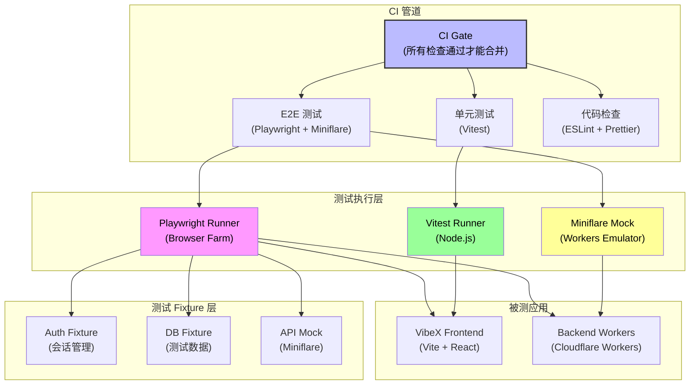

# VibeX E2E Test Fix — 架构设计

> **项目**: vibex-e2e-test-fix
> **版本**: v1.0
> **日期**: 2026-04-06
> **作者**: architect agent

---

## 执行决策

| 字段 | 内容 |
|------|------|
| **决策** | 已采纳 |
| **执行项目** | vibex-e2e-test-fix |
| **执行日期** | 2026-04-06 |

---

## 1. 问题背景

### 1.1 Playwright in Jest 环境错误

当前 VibeX 项目存在测试框架混用问题：

- **Jest**：用于单元测试（`tests/unit/*.spec.ts`）
- **Playwright**：用于 E2E 测试（`tests/e2e/*.spec.ts`）
- **现状**：Playwright 测试配置嵌入在 Jest 兼容的配置文件中，运行时存在框架冲突

主要症状：
1. `playwright-canvas-crash-test.config.cjs` 和 `playwright-a11y-test.config.cjs` 配置独立，但 E2E 主配置 `vibex-fronted-test.config.cjs` 与 Jest 边界不清
2. CI 环境中 Playwright 进程与 Node.js 事件循环冲突，导致偶发性超时
3. 多个 `*.config.cjs` 文件分散，难以统一管理

### 1.2 Pre-existing 测试失败

项目中存在历史遗留的测试失败项：

| 文件 | 问题 | 影响 |
|------|------|------|
| `auto-save.spec.ts` | `test.skip` 跳过测试 | 覆盖率缺口 |
| `onboarding.spec.ts` | `test.skip` 跳过测试 | 覆盖率缺口 |
| `vue-components.spec.ts` | `@ci-blocking` 标记 | CI 阻塞 |
| `BASE_URL` 硬编码 | `http://localhost:3002` 写死 | 环境不灵活 |

### 1.3 根因总结

```
┌─────────────────────────────────────────────┐
│            测试基础设施层问题                 │
├─────────────────────────────────────────────┤
│ 1. Jest/Playwright 边界模糊，进程冲突         │
│ 2. test.skip 历史债务，掩盖真实失败            │
│ 3. CI blocking 标记失控，CI 管道不稳定        │
│ 4. BASE_URL 硬编码，环境适配能力弱            │
└─────────────────────────────────────────────┘
```

---

## 2. Tech Stack

### 2.1 测试框架选择

| 层级 | 框架 | 版本 | 用途 |
|------|------|------|------|
| **E2E 层** | Playwright | latest | 浏览器自动化，跨页面 E2E |
| **单元/集成层** | Vitest | ^1.0 | 快速单元测试，Vite 原生集成 |
| **Mock 服务层** | Miniflare | ^3.0 | Workers/Functions 本地模拟 |
| **断言库** | Playwright Built-in + Chai | - | E2E 断言 |
| **测试协调** | 统一 npm script | - | `test:e2e` / `test:unit` 分离 |

### 2.2 选型理由

- **Playwright**：支持 Chromium/Firefox/WebKit 多浏览器，API 稳定，CI 友好
- **Vitest 替代 Jest**：
  - Vite 原生支持，无需额外 Babel 配置
  - 热更新更快，开发体验更好
  - 与 Vite 构建的前端项目天然匹配
- **Miniflare**：VibeX 后端使用 Workers 架构，本地模拟 Cloudflare Workers 环境，避免依赖真实 API

### 2.3 配置统一策略

```
# 单一来源配置
tests/
  e2e/
    playwright.config.ts    # Playwright 专属配置（TypeScript）
  unit/
    vitest.config.ts        # Vitest 专属配置
```

---

## 3. 架构图（测试分层）



### 3.1 分层职责

| 层 | 职责 | 工具 | 隔离策略 |
|---|------|------|----------|
| **CI Gate** | 质量门禁，统一入口 | GitHub Actions | 所有检查必须通过 |
| **测试执行层** | 浏览器自动化 / Node 执行 | Playwright / Vitest | 进程级隔离 |
| **Mock 服务层** | API 模拟，网络隔离 | Miniflare | 本地无外部依赖 |
| **Fixture 层** | 测试数据准备 | 自定义 Fixture | 幂等，可重复 |
| **应用层** | 被测系统 | Vite + Workers | 与测试进程解耦 |

---

## 4. 测试策略

### 4.1 测试金字塔

```
                    ┌─────────────┐
                    │    E2E     │  ← Playwright (慢，广度)
                    │  (20 cases)│
        ┌───────────┴─────────────┴───────────┐
        │         集成测试                    │
        │    (Vitest + Miniflare)            │  ← 中速，深度
        │         (~50 cases)                 │
        ├─────────────────────────────────────┤
        │           单元测试                   │
        │           (Vitest)                  │  ← 快速，精准
        │          (~200 cases)               │
        └─────────────────────────────────────┘
```

### 4.2 E2E 测试策略

#### 4.2.1 环境隔离

```typescript
// playwright.config.ts
import { defineConfig } from '@playwright/test';

export default defineConfig({
  testDir: './tests/e2e',
  use: {
    baseURL: process.env.BASE_URL ?? 'http://localhost:3000',
    // CI 环境跳过 @ci-blocking 测试
    grepInvert: process.env.CI ? /@ci-blocking/ : undefined,
  },
  projects: [
    { name: 'chromium', use: { channel: 'chromium' } },
  ],
});
```

#### 4.2.2 稳定性保障

| 策略 | 实现 | 效果 |
|------|------|------|
| 超时控制 | `timeout: 60000`, `actionTimeout: 15000` | 避免无限等待 |
| 重试机制 | `retries: process.env.CI ? 2 : 0` | CI 环境自愈 |
| 截图/录屏 | `screenshot: 'only-on-failure'` | 失败即取证 |
| 网络隔离 | Miniflare Mock 外部 API | 无网络依赖 |

#### 4.2.3 标记管理

| 标记 | 含义 | CI 行为 | 本地行为 |
|------|------|---------|---------|
| `test.skip` | 临时跳过 | 不执行 | 不执行（默认） |
| `@ci-blocking` | CI 阻塞 | **跳过** | 可选执行 |
| `@slow` | 慢速测试 | 延迟执行 | 随时执行 |

### 4.3 单元测试策略（Vitest 迁移）

| 迁移项 | Jest 写法 | Vitest 写法 |
|--------|-----------|-------------|
| Mock | `jest.mock()` | `vi.mock()` |
| Spy | `jest.spyOn()` | `vi.spyOn()` |
| Timer | `jest.useFakeTimers()` | `vi.useFakeTimers()` |
| Config | `jest.config.js` | `vitest.config.ts` |

### 4.4 Miniflare Mock 策略

```typescript
// tests/e2e/fixtures/api-mock.ts
import { Miniflare } from 'miniflare';

export async function createApiMock() {
  const mf = new Miniflare({
    modules: true,
    script: `
      self.addEventListener('fetch', event => {
        const url = new URL(event.request.url);
        if (url.pathname.startsWith('/api/')) {
          event.respondWith(
            new Response(JSON.stringify({ ok: true }), {
              headers: { 'Content-Type': 'application/json' }
            })
          );
        }
      });
    `,
  });
  return mf;
}
```

---

## 5. 实施计划

### 5.1 整体计划

| 阶段 | 内容 | 工期 | 依赖 |
|------|------|------|------|
| Phase 1 | Playwright 隔离 | 2h | 无 |
| Phase 2 | Jest/Vitest 分离 | 1h | Phase 1 |
| Phase 3 | CI Gate 搭建 | 1h | Phase 1+2 |

**总工期: 4h**

### 5.2 Phase 1: Playwright 隔离（2h）

**目标**: 移除 Jest 配置文件中的 Playwright 引用，建立独立 Playwright 配置体系。

**交付物**:
- `tests/e2e/playwright.config.ts`（新建，TypeScript）
- 统一 `baseURL` 环境变量配置
- 处理 `@ci-blocking` 标记逻辑
- 移除 `auto-save.spec.ts` 和 `onboarding.spec.ts` 中的 `test.skip`

**验收标准**:
- [ ] `test.skip` 在 E2E 测试中归零
- [ ] `BASE_URL` 支持环境变量覆盖
- [ ] CI 环境中 `@ci-blocking` 测试自动跳过
- [ ] Playwright 配置独立于 Jest

### 5.3 Phase 2: Jest/Vitest 分离（1h）

**目标**: 单元测试从 Jest 迁移到 Vitest，消除框架冲突。

**交付物**:
- `tests/unit/vitest.config.ts`（新建）
- 迁移 `jest.mock()` → `vi.mock()`
- 统一 `tests/unit/*.test.ts` 后缀

**验收标准**:
- [ ] 单元测试可独立运行 `npm run test:unit`
- [ ] 无 Jest 依赖残留
- [ ] 覆盖率报告正常生成

### 5.4 Phase 3: CI Gate 搭建（1h）

**目标**: 建立完整的 CI 质量门禁。

**交付物**:
- GitHub Actions workflow（E2E + Unit + Lint 三合一 gate）
- `retries: 2`（CI 环境）
- 统一 `npm run test:ci` 入口

**验收标准**:
- [ ] PR 必须通过 E2E + Unit + Lint 才能合并
- [ ] E2E 失败自动截图存档
- [ ] 测试报告上传至 CI Artifacts

### 5.5 里程碑

```
[0h] ───── 起点
[2h] ──── Phase 1 完成 ── Playwright 隔离
[3h] ──── Phase 2 完成 ── Jest/Vitest 分离
[4h] ──── Phase 3 完成 ── CI Gate 搭建
         ↓
    ✅ 所有测试稳定
```

---

## 6. 风险与缓解

| 风险 | 可能性 | 影响 | 缓解措施 |
|------|--------|------|----------|
| Vitest 迁移破坏现有测试 | 中 | 高 | 先行备份，渐进迁移 |
| Miniflare mock 不完整 | 低 | 中 | 逐 API 补充 mock |
| CI 重试掩盖真实问题 | 中 | 中 | 设置失败阈值（3次） |
| Playwright 版本更新 | 低 | 低 | Pin 版本到 package.json |

---

## 7. 参考文档

- PRD: `docs/vibex-e2e-test-fix/prd.md`
- 分析报告: `docs/vibex-e2e-test-fix/analysis.md`
- 实施计划: `docs/vibex-e2e-test-fix/IMPLEMENTATION_PLAN.md`
- Agent 规范: `docs/vibex-e2e-test-fix/AGENTS.md`
