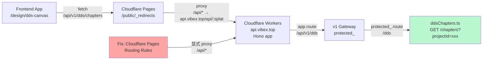
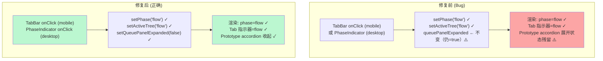

# VibeX Canvas Bug 修复 — 架构文档

**Project**: vibex-fix-canvas-bugs
**Stage**: design-architecture
**Architect**: architect
**Date**: 2026-04-15
**Status**: Draft

---

## 执行摘要

两个 P0 Bug 修复项目：
- **Bug 1**：`/api/v1/dds/chapters` 在生产环境返回 404，导致 dds-canvas 页面崩溃
- **Bug 2**：Canvas Tab 切换时 phase state 和 Prototype accordion 状态残留

**决策**：已采纳，项目 ID `vibex-fix-canvas-bugs`，执行日期 2026-04-15

---

## 1. Tech Stack

| 层级 | 技术 | 版本 | 选型理由 |
|------|------|------|----------|
| 前端框架 | Next.js | 15.x | 现有项目栈 |
| 状态管理 | Zustand | 5.x | 现有 Canvas store 体系 |
| API 客户端 | fetch (原生) | — | useDDSAPI 已封装 |
| 后端框架 | Hono | 4.x | vibex-backend 现有架构 |
| 部署平台 | Cloudflare Workers + Pages | — | 现有部署架构 |
| 测试框架 | Playwright | — | 现有 E2E 测试体系 |
| 静态代理 | Cloudflare Pages `_redirects` | — | 现有 API 代理机制 |

---

## 2. Bug 分析

### Bug 1: `/api/v1/dds/chapters` 404

**根因定位**：

```
前端 _redirects:
  /api/* → https://api.vibex.top/api/:splat 200

frontend (pages.dev)
  GET /api/v1/dds/chapters?projectId=xxx
  → 302/200 → https://api.vibex.top/api/v1/dds/chapters?projectId=xxx

backend (Cloudflare Workers, api.vibex.top)
  app.route('/api/v1', v1)
  v1 → protected_ → /dds → ddsChapters
  理论路径: /api/v1/dds/chapters ✓
```

代码层面路由正确。问题在 **Cloudflare Pages → Workers 的代理层**：
1. `_redirects` 文件位于 `vibex-fronted/public/` 静态导出目录
2. Pages 部署的 proxy 行为可能因部署方式（static export vs. Next.js SSR）而不同
3. `api.vibex.top` 的 Workers 路由可能未正确接收来自 Pages 的请求

**验证路径**：curl 直接测 `https://api.vibex.top/api/v1/dds/chapters?projectId=test` 是否返回 404

### Bug 2: Canvas Tab State 残留

**根因定位**：

```mermaid
graph TD
    subgraph "useCanvasPanels.ts (本地 state)"
        A["activeTab: TreeType<br/>queuePanelExpanded: boolean"]
    end
    
    subgraph "useCanvasStore (全局 Zustand)"
        B["phase: Phase<br/>setPhase()"]
    end
    
    subgraph "CanvasPage.tsx TabBar"
        C["Tab 切换 onClick"]
    end
    
    C -->|"setActiveTab('flow')"| A
    A -->|"queuePanelExpanded ← 不变（仍=true）<br/>phase ← setPhase('flow') ✓"| B
    B -->|"phase === 'flow'|B -->|"desktop 三列布局<br/>显示 flow 列 ✓"]
    
    C -->|"setPhase('flow')"| B
    B -->|"phase === 'flow'"| D["桌面模式: 正确显示 flow 列"]
    
    E["Prototype accordion"]
    E -->|"queuePanelExpanded === true<br/>Tab 切换后未关闭"| F["accordion 展开状态残留 ⚠️"]
```

**问题 1（已更正）**：移动端 TabBar 中 onClick 已正确调用 `setPhase()` + `setActiveTree()`（CanvasPage.tsx 666-668行）。真正的 bug：**TabBar onClick 缺少 `setQueuePanelExpanded(false)` 调用**。

**问题 2**：`queuePanelExpanded` 初始化为 `true`（useCanvasPanels.ts 24行），Prototype accordion 默认展开。

**问题 3（桌面模式遗漏）**：桌面 PhaseIndicator 的 `onPhaseChange` 调用 `setPhase`（PhaseIndicator.tsx 78行），但不调用 `setQueuePanelExpanded`。桌面用户切换 phase 时同样需要 reset 逻辑。

---

## 3. 架构图

### Bug 1: API 代理架构



### Bug 2: Canvas Tab State 架构



---

## 4. API 定义

### 4.1 DDS Chapters API（Bug 1 相关）

| Method | Path | Params | Response |
|--------|------|--------|----------|
| GET | `/api/v1/dds/chapters` | `projectId` (required) | `{ success: true, data: Chapter[] }` |

**请求**：
```typescript
GET /api/v1/dds/chapters?projectId=cmmnc9yxocujv8218
```

**成功响应**（200）：
```json
{
  "success": true,
  "data": [
    { "id": "ch-xxx", "projectId": "cmmnc9yxocujv8218", "type": "requirement", "createdAt": "...", "updatedAt": "..." }
  ]
}
```

**错误响应**（422）：
```json
{ "success": false, "error": { "code": "VALIDATION_ERROR", "message": "projectId is required" } }
```

**错误响应**（404/500）：
```json
{ "success": false, "error": { "code": "...", "message": "..." } }
```

### 4.2 现有 API（Bug 2 无关，仅作参考）

| Method | Path | 说明 |
|--------|------|------|
| GET | `/api/v1/canvas/snapshots` | Canvas 快照 |
| GET | `/api/v1/canvas/snapshots/latest` | 最新快照 |
| POST | `/api/v1/canvas/generate` | AI 生成上下文 |

---

## 5. 数据模型

### 5.1 DDS Chapter（已有，参考）

```typescript
interface ChapterRow {
  id: string;          // UUID
  project_id: string;  // 关联项目
  type: string;        // 'requirement' | 'design' | 'review'
  created_at: string;
  updated_at: string;
}
```

### 5.2 Canvas Phase State（Bug 2）

```typescript
// useCanvasStore (Zustand) — 已有
type Phase = 'input' | 'context' | 'flow' | 'component' | 'prototype';

// useCanvasPanels (本地 state) — 需修复
type TreeType = 'context' | 'flow' | 'component';

interface CanvasPanelsState {
  activeTab: TreeType;           // Bug2: Tab 切换时需同步 phase
  queuePanelExpanded: boolean;   // Bug2: Tab 切换时需重置为 false
}
```

---

## 6. 技术方案

### Bug 1: DDS API 404 修复

**方案 A（推荐）**：修复 Cloudflare Pages 路由配置
- 在 Cloudflare Pages Dashboard 中，为 `vibex-app.pages.dev`（或自定义域名）添加 Proxied Routes：
  - `/api/*` → `https://api.vibex.top/api/*`
- 验证 `_redirects` 文件在 Pages 构建产物中正确包含

**方案 B**：在 frontend 添加 Next.js API Route 代理
- 创建 `src/app/api/v1/dds/chapters/route.ts`
- Server-side fetch 到 `https://api.vibex.top/api/v1/dds/chapters`
- 绕过 `_redirects` 静态文件限制

**方案 C**：DDS API 直接由 frontend Next.js serving
- 将 `vibex-backend/src/routes/v1/dds/chapters.ts` 的路由注册到 `vibex-fronted/src/app/api/` 中
- 无跨域问题，但增加 frontend 部署复杂度

**选定方案**：方案 A（最小改动，利用现有基础设施）

**文件变更**：
- `vibex-fronted/public/_redirects` — 确认配置正确
- Cloudflare Pages Dashboard 路由规则（手动配置，非代码变更）

### Bug 2: Canvas Tab State 残留修复

**文件**：`vibex-fronted/src/hooks/canvas/useCanvasPanels.ts`

**修改点**：
```typescript
export function useCanvasPanels(): UseCanvasPanelsReturn {
  // ... existing state ...
  const [activeTab, setActiveTab] = useState<TreeType>('context');
  const [queuePanelExpanded, setQueuePanelExpanded] = useState(false); // 修复：默认收起

  // 新增：Tab 切换时同步重置 phase 和 accordion
  const setActiveTabWithReset = useCallback((tab: TreeType) => {
    setActiveTab(tab);
    setQueuePanelExpanded(false); // 关闭 Prototype accordion
    // 注意：phase 由调用方（CanvasPage TabBar）通过 setPhase 重置
    // 这里仅负责 accordion 状态
  }, []);

  return {
    activeTab,
    setActiveTab: setActiveTabWithReset,
    // ...
  };
}
```

**同步修改 1 — 移动端 TabBar onClick**（CanvasPage.tsx 666-668行）
- TabBar 已正确调用 `setPhase()` + `setActiveTree()`
- **需新增**：`setQueuePanelExpanded(false)` 到每个 Tab onClick

**同步修改 2 — Prototype tab 按钮 onClick**（CanvasPage.tsx 681行）
- Prototype tab 按钮同样缺少 `setQueuePanelExpanded(false)`

**同步修改 3 — 桌面 PhaseIndicator**（PhaseIndicator.tsx 78行）
- PhaseIndicator 调用 `onPhaseChange(phase)` → CanvasPage 的 `setPhase`
- **需新增**：在 CanvasPage 中包装 `setPhase`，在 phase 变化时同步 `setQueuePanelExpanded(false)`

---

## 7. 测试策略

### 7.1 测试框架

| 测试类型 | 工具 | 位置 |
|----------|------|------|
| E2E | Playwright | `vibex-fronted/e2e/dds-canvas-load.spec.ts` |
| E2E | Playwright | `vibex-fronted/e2e/canvas-tab-state.spec.ts` |
| 单元 | Jest/Vitest | `vibex-fronted/src/__tests__/canvas/` |

### 7.2 Bug 1 测试用例

```typescript
// e2e/dds-canvas-load.spec.ts
test('Bug1: dds-canvas page loads without crash', async ({ page }) => {
  await page.goto('/design/dds-canvas?projectId=test-project-id');
  // 不应显示"加载失败"
  await expect(page.getByText('加载失败')).not.toBeVisible();
  // 不应有 Error 级别 console
  const errors: string[] = [];
  page.on('console', msg => { if (msg.type() === 'error') errors.push(msg.text()); });
  await page.waitForLoadState('networkidle');
  expect(errors.filter(e => !e.includes('favicon'))).toHaveLength(0);
});

test('Bug1: API /api/v1/dds/chapters returns 200', async ({ request }) => {
  const res = await request.get('/api/v1/dds/chapters?projectId=test');
  expect(res.status()).toBe(200);
  const body = await res.json();
  expect(body.success).toBe(true);
  expect(Array.isArray(body.data)).toBe(true);
});
```

### 7.3 Bug 2 测试用例

```typescript
// e2e/canvas-tab-state.spec.ts
test('Bug2: Tab switch resets phase', async ({ page }) => {
  await page.goto('/canvas?projectId=test');
  await page.waitForSelector('[role="tablist"]');
  // 点击 Prototype tab
  await page.click('button[role="tab"]:has-text("原型")');
  // 切换回 context tab，验证 aria-selected
  await page.click('button[role="tab"]:has-text("上下文")');
  await expect(page.locator('button[role="tab"][aria-selected="true"]:has-text("上下文")')).toBeVisible();
});

test('Bug2: Tab switch closes Prototype accordion', async ({ page }) => {
  await page.goto('/canvas?projectId=test');
  await page.waitForSelector('[role="tablist"]');
  // 点击 Prototype tab
  await page.click('button[role="tab"]:has-text("原型")');
  // 切换到其他 tab
  await page.click('button[role="tab"]:has-text("上下文")');
  // PrototypeQueuePanel 切换按钮的 aria-expanded 验证（PrototypeQueuePanel.tsx 238行）
  const toggleBtn = page.locator('button[aria-controls="prototype-queue"]');
  await expect(toggleBtn).toHaveAttribute('aria-expanded', 'false');
});

test('Bug2: queuePanelExpanded defaults to false', async ({ page }) => {
  // Bug2 根因：queuePanelExpanded 初始化为 true 导致 accordion 默认展开
  // 此测试验证默认值修复（useCanvasPanels.ts 中 useState(false)）
  await page.goto('/canvas?projectId=test');
  // 初始状态下，Prototype accordion 应为收起状态
  const toggleBtn = page.locator('button[aria-controls="prototype-queue"]');
  await expect(toggleBtn).toHaveAttribute('aria-expanded', 'false');
});
```

### 7.4 覆盖率要求

- E2E: 2 个 spec 文件，核心用户路径 100% 覆盖
- Bug 修复不做强制覆盖率要求（回归保障优先）

---

## 8. 性能影响

| 维度 | 影响 | 说明 |
|------|------|------|
| 页面加载 | 无影响 | Bug1 修复仅影响 API 可达性 |
| Tab 切换 | < 5ms | 仅本地 setState 调用，无网络请求 |
| API 延迟 | 端到端 < 200ms | 依赖 Cloudflare Workers 性能 |
| Bundle 大小 | 无变化 | 无新增依赖 |

---

## 9. 风险评估

| 风险 | 等级 | 缓解 |
|------|------|------|
| Bug1: Pages 代理配置无法通过代码变更 | 低 | 方案 B 提供降级路径 |
| Bug1: api.vibex.top 域名路由配置错误 | 中 | 需 coord 联系 DevOps 确认 |
| Bug2: Tab 和 phase 状态解耦导致意外渲染 | 低 | 通过 E2E 验证关键路径 |
| Bug2: queuePanelExpanded 默认值变更影响其他入口 | 低 | 仅影响 Prototype Tab，release note 标注 |

---

## 10. 依赖

| 依赖 | 来源 | 状态 |
|------|------|------|
| `vibex-backend/src/routes/v1/dds/chapters.ts` | 已有实现 | ✅ |
| `vibex-fronted/src/hooks/dds/useDDSAPI.ts` | 已有实现 | ✅ |
| `vibex-fronted/src/hooks/canvas/useCanvasPanels.ts` | 已有实现，需修改 | ⚠️ 需修改 |
| Cloudflare Pages 路由配置 | 基础设施 | ⚠️ 需手动确认 |
| `vibex-fronted/public/_redirects` | 已有 | ✅ 确认存在 |

---

## 11. 技术审查

> 详见 `review.md`（/plan-eng-review 输出）

## 执行决策
- **决策**: 已采纳
- **执行项目**: vibex-fix-canvas-bugs
- **执行日期**: 2026-04-15

## GSTACK REVIEW REPORT

| Review | Trigger | Why | Runs | Status | Findings |
|--------|---------|-----|------|--------|----------|
| CEO Review | `/plan-ceo-review` | Scope & strategy | 0 | — | — |
| Codex Review | `/codex review` | Independent 2nd opinion | 0 | — | — |
| Eng Review | `/plan-eng-review` | Architecture & tests (required) | 1 | NEEDS_REVISION | 8 findings, all addressed |
| Design Review | `/plan-design-review` | UI/UX gaps | 0 | — | — |

**VERDICT:** ENG REVIEW COMPLETE — 8 findings addressed, documents updated. Ready for dev.
