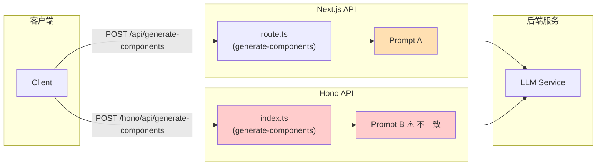

# Architecture: Generate Components Consolidation

> **项目**: vibex-generate-components-consolidation  
> **架构师**: architect agent  
> **日期**: 2026-04-06  
> **版本**: v1.0

---

## 执行决策

- **决策**: 已采纳
- **执行项目**: vibex-generate-components-consolidation
- **执行日期**: 2026-04-06

---

## 1. 问题背景

### 1.1 现状

`generate-components` 功能存在两套后端实现：

| 实现 | 技术栈 | 位置 |
|------|--------|------|
| Next.js 实现 | Next.js App Router (route.ts) | `src/app/api/generate-components/route.ts` |
| Hono 实现 | Hono Framework | `src/hono/api/generate-components/index.ts` |

两套实现并存于同一项目中，各自维护独立的 Prompt 模板，导致以下问题：

- **Prompt 不一致**: 同一功能在两套实现中使用不同的 Prompt，业务逻辑无法对齐
- **维护成本倍增**: 修改逻辑需要同时更新两处
- **行为漂移风险**: 两套实现随时间推移可能产生功能差异
- **测试资源浪费**: 需要维护两套测试用例

### 1.2 根因

两个不同开发者在不同技术栈下各自实现了相同功能，未进行统一协调。

---

## 2. Tech Stack

| 类别 | 技术 | 版本 | 备注 |
|------|------|------|------|
| 保留实现 | Next.js | latest | route.ts 为主实现 |
| 废弃实现 | Hono | latest | index.ts 标记废弃 |
| 路由层 | Next.js API Routes | - | 统一入口 |
| 测试 | Vitest + Playwright | latest | 现有框架 |
| 无新增依赖 | - | - | 本次合并不引入新依赖 |

**选型理由**:
- Next.js route.ts 已作为主实现，具备完整的中间件、认证和错误处理
- Hono 实现为辅助实现，废弃后对整体架构无影响
- 不引入新依赖，降低迁移风险

---

## 3. Mermaid 架构图

### 3.1 合并前



### 3.2 合并后

```mermaid
flowbar TB
    subgraph "客户端"
        Client
    end

    subgraph "统一入口 (Next.js)"
        NextRoute["route.ts<br/>(generate-components)"]
        UnifiedPrompt["✅ Prompt (统一)"]
        Middleware["Auth / Error Handling"]
    end

    subgraph "后端服务"
        LLM["LLM Service"]
    end

    Client -->|"POST /api/generate-components"| Middleware
    Middleware --> NextRoute
    NextRoute --> UnifiedPrompt
    UnifiedPrompt --> LLM

    HonoCode["废弃代码<br/>(标记 DEPRECATED)"] -.->|"后续清理"| HonoDelete["删除"]

    style UnifiedPrompt fill:#c8e6c9
    style HonoCode fill:#ffcccc
    style HonoDelete fill:#ffcccc
```

---

## 4. 合并方案

### 4.1 方案概述

保留 Next.js route.ts 实现，将 Hono index.ts 标记为废弃（DEPRECATED），统一使用 Next.js 实现作为唯一入口。

### 4.2 详细步骤

#### Step 1: 确认主实现
- **保留**: `src/app/api/generate-components/route.ts`
- **职责**: 作为唯一后端入口，处理所有 `POST /api/generate-components` 请求

#### Step 2: 统一 Prompt
- 将 Hono 实现中的 Prompt 精华合并到 Next.js 实现
- 保留更好的错误处理和边界情况处理
- 更新 Next.js Prompt 为统一版本

#### Step 3: 标记废弃
- 在 `src/hono/api/generate-components/index.ts` 文件顶部添加 `@deprecated` 注释
- 保留文件内容（暂不删除，便于回滚）

#### Step 4: 迁移调用方
- 检查是否有调用 Hono 端点的客户端代码
- 统一重定向到 Next.js API 路由

#### Step 5: 更新测试
- 更新 API 测试用例
- 移除 Hono 实现的测试
- 验证统一后的功能正确性

#### Step 6: 清理（可选）
- 确认无调用方后，删除 Hono 废弃代码

### 4.3 Prompt 统一策略

| 对比项 | Next.js Prompt | Hono Prompt | 统一策略 |
|--------|----------------|-------------|----------|
| 模板结构 | 基础结构 | 扩展结构 | 合并两者优势 |
| 错误处理 | 基础 | 详细 | 采用 Hono 详细版本 |
| 边界情况 | 较少 | 较多 | 合并所有边界情况 |

---

## 5. 风险评估

| 风险 | 概率 | 影响 | 缓解措施 |
|------|------|------|----------|
| 废弃代码仍有隐藏调用方 | 中 | 高 | 迁移前全面搜索调用点 |
| Prompt 合并丢失重要逻辑 | 低 | 中 | 对比两份 Prompt，逐一确认 |
| 回滚困难 | 低 | 高 | 废弃阶段保留代码，验证后再删除 |
| 测试覆盖不足 | 中 | 中 | 补充功能测试用例 |

### 5.1 回滚计划

1. 移除 `@deprecated` 注释
2. 恢复 Hono 路由配置
3. 重新启用 Hono 端点

---

## 6. 数据流

```
┌─────────────┐
│   Client    │
└──────┬──────┘
       │ POST /api/generate-components
       ▼
┌───────────────────────────────┐
│     Next.js Middleware        │
│  (Auth / Rate Limit / Error)  │
└──────────────┬────────────────┘
               │
               ▼
┌───────────────────────────────┐
│     route.ts handler          │
│   (validate + process)        │
└──────────────┬────────────────┘
               │
               ▼
┌───────────────────────────────┐
│     Unified Prompt            │
│   (Component Generation)      │
└──────────────┬────────────────┘
               │
               ▼
┌──────────────┐
│  LLM Service │
└──────────────┘
```

---

## 7. 验收标准

- [ ] Next.js route.ts 是唯一的后端实现
- [ ] Hono index.ts 已标记 `@deprecated`
- [ ] Prompt 已统一为单一版本
- [ ] 功能测试全部通过
- [ ] API 行为与合并前一致
