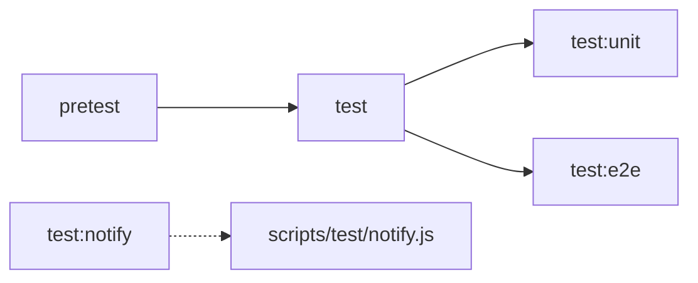

# Implementation Plan: Internal Tools Integration

**Project**: vibex-internal-tools
**Stage**: implementation-plan
**Date**: 2026-04-07
**Status**: Proposed

---

## Overview

| 属性 | 值 |
|------|-----|
| 总工时 | 6h |
| 优先级 | P0 (E1, E2), P1 (E3, E4) |
| 依赖 | PRD → Architecture |
| 风险等级 | 低 |

---

## Phase 1: Reviewer Dedup 集成 (1.5h)

### 1.1 目标
将提案去重工具集成到 coord 派生前工作流 + reviewer agent 评审流程。

### 1.2 文件清单

| 操作 | 文件 | 说明 |
|------|------|------|
| 新增 | `scripts/dedup_api.py` | HTTP API 封装 |
| 修改 | `coord/scheduler.py` | dispatch_project() 调用 dedup |
| 修改 | reviewer prompt | 添加 dedup 调用指令 |

### 1.3 步骤

**Step 1**: 创建 `scripts/dedup_api.py`
```bash
# 验证
curl -X POST http://localhost:8765/dedup \
  -H "Content-Type: application/json" \
  -d '{"title":"test","description":"test proposal"}'
# 期望: {"similarity": 0, "duplicates": [], ...}
```

**Step 2**: 修改 `coord/scheduler.py`
- 在 `dispatch_project()` 开头插入 dedup 检查
- try/except 包裹，不阻塞派发
- dedup 结果写入 task JSON

**Step 3**: 更新 reviewer prompt
- 添加 dedup curl 调用示例
- 要求 similarity > 0.7 时包含 ⚠️ 警告

### 1.4 验收标准
- [ ] dedup API 响应 < 500ms
- [ ] task JSON 包含 `dedup` 字段
- [ ] similarity > 0.7 时发送 Slack 告警

### 1.5 潜在问题
- 端口 8765 未启动 → try/except 不阻塞

---

## Phase 2: Tester Loop 修复 (2.5h)

### 2.1 目标
修复 flaky-detector bug，标准化 CI retry 策略。

### 2.2 文件清单

| 操作 | 文件 | 说明 |
|------|------|------|
| 修改 | `scripts/flaky-detector.sh` | 改用文件传参 |
| 新增 | `flaky-params.txt` | 参数文件 |
| 修改 | `playwright.config.ts` | retries: 2 |
| 修改 | `scripts/flaky-detector.py` | 支持文件参数 |

### 2.3 步骤

**Step 1**: 修复 flaky-detector.sh
```bash
# 旧: flaky-detector.sh arg1 arg2 (shell 转义问题)
# 新: flaky-detector.sh (读取 flaky-params.txt)
bash scripts/flaky-detector.sh
```

**Step 2**: 创建 `flaky-params.txt`
```bash
PLAYWRIGHT_REPORT_DIR=playwright-report
RESULTS_FILE=flaky-tests.json
PROJECT_ID=vibex-internal-tools
```

**Step 3**: 修改 playwright.config.ts
```typescript
export default defineConfig({
  retries: 2,  // 新增
  // ...
});
```

**Step 4**: CI job 添加 flaky-detector
```yaml
# .github/workflows/test.yml
- name: Flaky Test Detection
  if: failure()
  run: bash scripts/flaky-detector.sh
```

### 2.4 验收标准
- [ ] `flaky-tests.json` 正常生成
- [ ] 包含 flaky / real_failure 分类
- [ ] Playwright retries=2 生效

### 2.5 潜在问题
- Python 参数解析错误 → 改用文件传递彻底解决

---

## Phase 3: Test Commands 清理 (1.5h)

### 3.1 目标
清理 package.json 重复别名，统一入口。

### 3.2 文件清单

| 操作 | 文件 | 说明 |
|------|------|------|
| 修改 | `package.json` | 删除重复别名 |
| 新增 | `scripts/test/notify.js` | 独立通知脚本 |

### 3.3 步骤

**Step 1**: 备份当前 package.json
```bash
cp package.json package.json.bak
```

**Step 2**: 清理 package.json scripts
```json
{
  "scripts": {
    "test": "vitest run",
    "test:unit": "vitest run --reporter=verbose",
    "test:e2e": "playwright test",
    "pretest": "tsx scripts/pretest-check.ts"
  }
}
```

**删除的脚本**:
- `test` → 保留 `test`（唯一 UT 入口）
- `test:contract` → 删除（合并到 `test:unit`）
- `test:notify` → 改为 `scripts/test/notify.js`（独立调用）
- `vitest` → 删除（冗余）
- `pretest-check` → 合并到 `pretest`

**Step 3**: 创建独立通知脚本
```javascript
// scripts/test/notify.js
import { sendSlackMessage } from '../lib/slack.mjs';
// ... 原有通知逻辑
```

**Step 4**: 验证
```bash
npm run test        # OK
npm run test:unit   # OK
npm run test:e2e    # OK
npm run pretest     # OK
npm run test:notify # 应报错 (已删除)
```

### 3.4 验收标准
- [ ] `test` / `vitest` / `pretest-check` 均为 undefined
- [ ] `test:contract` undefined
- [ ] `test:notify` undefined
- [ ] `scripts/test/notify.js` 存在且可独立调用

### 3.5 潜在问题
- CI 使用了被删除的脚本 → 先 grep 确认无引用

---

## Phase 4: 文档更新 (0.5h)

### 4.1 目标
更新 CONTRIBUTING.md，添加 scripts 关系图。

### 4.2 文件清单

| 操作 | 文件 | 说明 |
|------|------|------|
| 修改 | `CONTRIBUTING.md` | 添加 scripts 关系图 |

### 4.3 步骤

在 CONTRIBUTING.md 添加:

```markdown
## Scripts 关系图


```

### 4.4 验收标准
- [ ] CONTRIBUTING.md 包含 scripts 关系图

---

## 5. Rollback Plan

| 问题 | 回滚方案 |
|------|----------|
| dedup API 不工作 | 注释掉 scheduler.py 中的 dedup 调用 |
| flaky-detector 失败 | 恢复 flaky-detector.sh 原参数方式 |
| package.json 删除错误 | `cp package.json.bak package.json` |
| CI 失败 | `git checkout -- package.json` |

---

## 6. 执行顺序

```
Phase 1 (E1) ──→ Phase 2 (E2) ──→ Phase 3 (E3) ──→ Phase 4 (E4)
   1.5h              2.5h              1.5h              0.5h
```

**注意**: Phase 1 和 Phase 2 可并行（不同文件，无依赖）。
Phase 3 需在 Phase 1/2 之后执行（避免脚本被删除后无法运行）。
