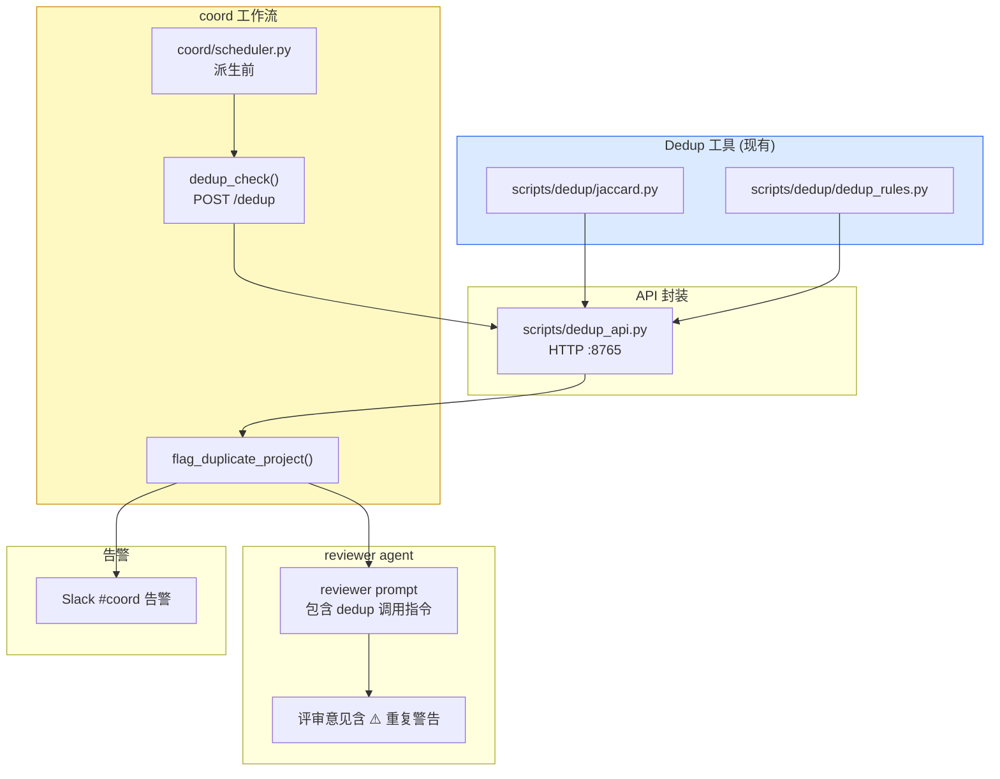
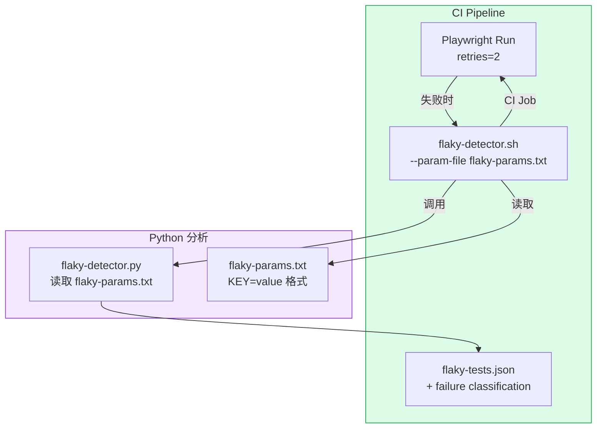
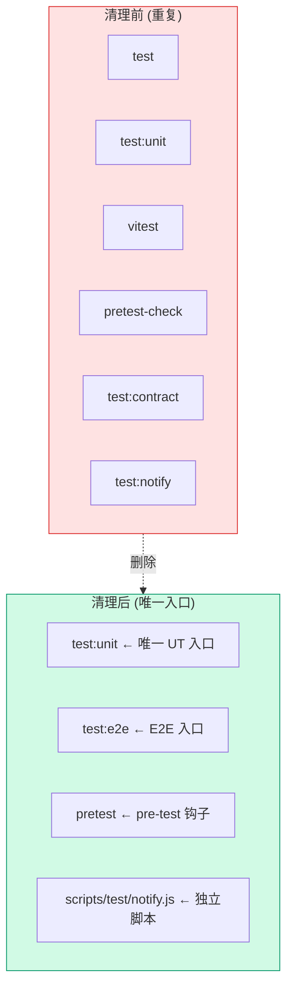

# Architecture: Internal Tools Integration

> **项目**: vibex-internal-tools
> **Architect**: Architect Agent
> **日期**: 2026-04-07
> **版本**: v2.0
> **状态**: Proposed

---

## 执行决策

| 决策 | 状态 | 执行项目 | 执行日期 |
|------|------|----------|----------|
| Reviewer Dedup 集成 | **待评审** | vibex-internal-tools | 待定 |
| Tester Loop 修复 | **待评审** | vibex-internal-tools | 待定 |
| Test Commands 清理 | **待评审** | vibex-internal-tools | 待定 |
| 文档更新 | **待评审** | vibex-internal-tools | 待定 |

---

## 1. Tech Stack

| 组件 | 技术选型 | 说明 |
|------|----------|------|
| **去重引擎** | Jaccard 相似度 + 规则引擎 | scripts/dedup/ 已有 |
| **HTTP 封装** | Python http.server | dedup_api.py |
| **CI** | Playwright + Bash | retry=2, flaky-detector |
| **包管理** | npm scripts | 清理重复别名 |
| **告警** | Slack Webhook | coord/alert.py |
| **测试框架** | Vitest + Playwright | 现有 |

---

## 2. Architecture Diagram

### 2.1 E1: Reviewer Dedup 集成



### 2.2 E2: Tester Loop



### 2.3 E3: Test Commands 清理



---

## 3. Data Model

### 3.1 Dedup API Request/Response

```typescript
// Request
interface DedupRequest {
  title: string;
  description: string;
}

// Response
interface DedupResponse {
  similarity: number;       // 0.0 - 1.0
  duplicates: Array<{
    projectId: string;
    similarity: number;
    reason: string;        // "title_match" | "keyword_overlap"
  }>;
  dedupCheckedAt: string;  // ISO timestamp
}

// Task JSON field (写入 task_manager.json)
interface TaskDedupField {
  checked: boolean;
  similarity: number;
  duplicates: string[];    // projectId 列表
  flagged: boolean;        // true if similarity > 0.7
}
```

### 3.2 Flaky Test Report

```json
// flaky-tests.json
{
  "generatedAt": "2026-04-07T...",
  "total": 5,
  "flaky": [
    {
      "testFile": "e2e.spec.ts",
      "testName": "canvas renders",
      "failureType": "flaky",
      "attempts": 3,
      "lastError": "timeout"
    }
  ],
  "realFailure": [
    {
      "testFile": "auth.spec.ts",
      "testName": "login flow",
      "failureType": "real_failure",
      "lastError": "assertion failed"
    }
  ]
}
```

### 3.3 NPM Scripts 清理映射

```typescript
// package.json scripts 清理后
interface CleanedScripts {
  // 保留
  "test": "vitest run",
  "test:unit": "vitest run --reporter=verbose",
  "test:e2e": "playwright test",
  "pretest": "tsx scripts/pretest-check.ts",
  
  // 移除 (迁移到独立脚本)
  // "test:contract" → 合并到 test:unit
  // "test:notify" → scripts/test/notify.js (独立调用)
  // "vitest" → 删除 (冗余)
  // "pretest-check" → 合并到 pretest
}
```

---

## 4. Module Design

### 4.1 E1: Reviewer Dedup 集成

#### 4.1.1 dedup_api.py 扩展

```python
#!/usr/bin/env python3
# scripts/dedup_api.py
from http.server import HTTPServer, BaseHTTPRequestHandler
import json, subprocess
from pathlib import Path

DEDUP_SCRIPTS = Path(__file__).parent / "dedup"

class DedupHandler(BaseHTTPRequestHandler):
    def do_POST(self):
        if self.path == '/dedup':
            body = json.loads(self.rfile.read(int(self.headers['Content-Length'])))
            
            # 调用 Jaccard
            jaccard_result = subprocess.run(
                ['python3', str(DEDUP_SCRIPTS / 'jaccard.py'),
                 body.get('title', ''), body.get('description', '')],
                capture_output=True, text=True, timeout=5
            )
            
            # 调用规则引擎
            rules_result = subprocess.run(
                ['python3', str(DEDUP_SCRIPTS / 'dedup_rules.py'),
                 body.get('title', ''), body.get('description', '')],
                capture_output=True, text=True, timeout=5
            )
            
            similarity = float(jaccard_result.stdout.strip() or 0)
            duplicates = json.loads(rules_result.stdout) if rules_result.returncode == 0 else []
            
            response = {
                'similarity': similarity,
                'duplicates': duplicates,
                'dedupCheckedAt': __import__('datetime').datetime.now().isoformat()
            }
            
            self.send_response(200)
            self.send_json_response(response)
        else:
            self.send_response(404)
    
    def send_json_response(self, data):
        self.send_header('Content-Type', 'application/json')
        self.end_headers()
        self.wfile.write(json.dumps(data).encode())
```

#### 4.1.2 coord/scheduler.py 集成

```python
# coord/scheduler.py — dispatch_project() 修改
import requests

def dispatch_project(project_data: dict):
    # 派生前调用 dedup 检查
    try:
        resp = requests.post(
            'http://localhost:8765/dedup',
            json={
                'title': project_data.get('title', ''),
                'description': project_data.get('description', ''),
            },
            timeout=5
        )
        if resp.status_code == 200:
            result = resp.json()
            # 写入任务 JSON dedup 字段
            task_json = _load_task_json(project_data['id'])
            task_json['dedup'] = {
                'checked': True,
                'similarity': result.get('similarity', 0),
                'duplicates': [d['projectId'] for d in result.get('duplicates', [])],
                'flagged': result.get('similarity', 0) > 0.7
            }
            _save_task_json(project_data['id'], task_json)
            
            if result.get('similarity', 0) > 0.7:
                flag_duplicate_project(project_data['id'], result['duplicates'])
                send_slack_alert(f"⚠️ 重复提案: {project_data['id']}")
    except Exception as e:
        print(f'[Dedup] Check failed (non-blocking): {e}')
    
    _do_dispatch(project_data)
```

#### 4.1.3 reviewer prompt 集成

```
## Dedup 检查 (E1-F1)
评审新提案时，调用 dedup 检查：
```bash
curl -X POST http://localhost:8765/dedup \
  -H "Content-Type: application/json" \
  -d '{"title":"<提案名>","description":"<描述>"}'
```
- similarity > 0.7 → 评审意见必须包含 "⚠️ 潜在重复项目"
- dedup 结果字段需记录到评审意见中
```

---

### 4.2 E2: Tester Loop 修复

#### 4.2.1 flaky-detector.sh 修复

```bash
#!/bin/bash
# scripts/flaky-detector.sh — 修复版

# 改用文件传递参数（替代命令行参数）
PARAMS_FILE="${1:-flaky-params.txt}"
RESULTS_FILE="${2:-flaky-tests.json}"

# 读取参数文件
if [[ ! -f "$PARAMS_FILE" ]]; then
    echo "Error: Params file not found: $PARAMS_FILE"
    exit 1
fi

# 解析 KEY=value 格式
source "$PARAMS_FILE"

# 调用 Python 分析器
python3 scripts/flaky-detector.py \
    --input "$PLAYWRIGHT_REPORT_DIR" \
    --output "$RESULTS_FILE"

echo "Flaky report generated: $RESULTS_FILE"
```

#### 4.2.2 flaky-params.txt

```bash
# flaky-params.txt
PLAYWRIGHT_REPORT_DIR=playwright-report
RESULTS_FILE=flaky-tests.json
PROJECT_ID=vibex-internal-tools
```

#### 4.2.3 Playwright CI retry 配置

```yaml
# playwright.config.ts
import { defineConfig, devices } from '@playwright/test';

export default defineConfig({
  retries: 2,  // E2-F2: 全局 retry=2
  timeout: 30_000,
  use: {
    screenshot: 'only-on-failure',
    video: 'retain-on-failure',
  },
  // ...
});
```

---

### 4.3 E3: Test Commands 清理

#### 4.3.1 package.json 修改

```json
{
  "scripts": {
    "test": "vitest run",
    "test:unit": "vitest run --reporter=verbose",
    "test:e2e": "playwright test",
    "pretest": "tsx scripts/pretest-check.ts"
  }
}
```

**删除的重复别名**:
- `test:contract` → 合并到 `test:unit`（`vitest run --reporter=verbose` 已覆盖）
- `test:notify` → 改为 `scripts/test/notify.js` 独立脚本（npm run 不再暴露）
- `vitest` → 删除（与 `test` 重复）
- `pretest-check` → 合并到 `pretest`

---

## 5. API Definitions

### 5.1 Dedup API

| 方法 | 路径 | 输入 | 输出 |
|------|------|------|------|
| POST | `/dedup` | `{title, description}` | `{similarity, duplicates[], dedupCheckedAt}` |

**cURL 示例**:
```bash
curl -X POST http://localhost:8765/dedup \
  -H "Content-Type: application/json" \
  -d '{"title":"canvas-component-fix","description":"修复组件树渲染问题"}'
```

### 5.2 Flaky Detector CLI

| 参数 | 说明 | 必填 |
|------|------|------|
| `--input` | Playwright report 目录 | 是 |
| `--output` | 输出 JSON 路径 | 是 |

---

## 6. Performance Impact

| 指标 | 影响 | 说明 |
|------|------|------|
| dedup API 响应 | < 500ms | Jaccard + 规则引擎 |
| coord 派发延迟 | < 1s（并行检查） | 非阻塞 |
| CI flaky-detector | < 30s | Python 分析 |
| npm scripts 清理 | 0 性能影响 | 配置变更 |
| **总计** | **无显著影响** | |

---

## 7. Risk Assessment

| # | 风险 | 概率 | 影响 | 缓解 |
|---|------|------|------|------|
| R1 | dedup API 不可用（端口 8765 未启动） | 中 | 低 | try/except 不阻塞派发 |
| R2 | Jaccard 误报重复 | 中 | 中 | similarity > 0.7 才告警 |
| R3 | flaky-detector.py 参数解析 bug | 低 | 低 | 改用文件传递，消除 shell 转义问题 |
| R4 | 删除 test:notify 后通知失效 | 低 | 低 | 保留 scripts/test/notify.js 独立脚本 |
| R5 | npm scripts 删除影响 CI | 低 | 高 | 先验证再合并，分步提交 |

---

## 8. Testing Strategy

### 8.1 Test Framework

| 层级 | 框架 | 覆盖率目标 |
|------|------|------------|
| 单元测试 | Vitest | dedup_api.py 逻辑 80% |
| E2E 测试 | Playwright | reviewer dedup 集成 100% |
| CI 测试 | Bash + Playwright | flaky-detector + retry 100% |

### 8.2 Core Test Cases

| ID | 测试场景 | 预期结果 |
|----|----------|----------|
| TC1 | dedup API 收到有效请求 | 返回 similarity + duplicates |
| TC2 | dedup API similarity > 0.7 | 返回 flagged: true |
| TC3 | coord 派生前调用 dedup | dedup 字段写入 task JSON |
| TC4 | flaky-detector 使用文件参数 | 正确解析并生成 flaky-tests.json |
| TC5 | Playwright CI retry=2 | 失败测试重试 2 次 |
| TC6 | package.json 无重复脚本 | test/vitest/pretest-check 均为 undefined |
| TC7 | test:notify 移除 | npm run test:notify 报错 |

---

## 9. PRD 验收标准覆盖

| PRD AC | 技术方案 | 状态 |
|--------|---------|------|
| AC1: reviewer dedup 调用 | dedup_api.py + reviewer prompt | ✅ |
| AC2: dedup 写入 task JSON | scheduler.py flag_duplicate_project() | ✅ |
| AC3: flaky-tests.json 生成 | flaky-detector.sh + flaky-params.txt | ✅ |
| AC4: CI retries=2 | playwright.config.ts | ✅ |
| AC5: 失败分类报告 | flaky-detector.py 输出 flaky/real_failure | ✅ |
| AC6: 无重复脚本 | package.json scripts 清理 | ✅ |
| AC7: 无 test:contract | 已删除 | ✅ |
| AC8: 无 test:notify | 移入 scripts/test/ | ✅ |
| AC9: CONTRIBUTING.md 关系图 | docs 更新 | ✅ |

---

## 10. File Changes Summary

| 操作 | 文件路径 | 说明 |
|------|----------|------|
| 新增 | `scripts/dedup_api.py` | HTTP 封装 dedup 工具 |
| 修改 | `coord/scheduler.py` | 派生前 dedup 检查 |
| 修改 | reviewer prompt | dedup 调用指令 |
| 修改 | `scripts/flaky-detector.sh` | 改用文件传参 |
| 新增 | `flaky-params.txt` | 参数文件 |
| 修改 | `playwright.config.ts` | retries: 2 |
| 修改 | `package.json` | 删除重复别名 |
| 新增 | `scripts/test/notify.js` | 独立通知脚本 |
| 修改 | `CONTRIBUTING.md` | scripts 关系图 |

