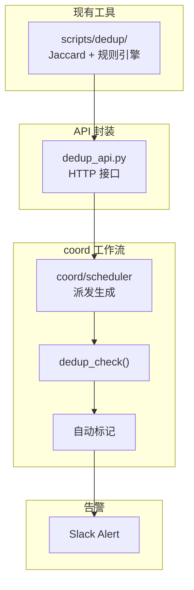

# Architecture: Internal Tools Integration

> **项目**: vibex-internal-tools  
> **Architect**: Architect Agent  
> **日期**: 2026-04-07  
> **版本**: v1.0  
> **状态**: Proposed

---

## 1. 概述

### 1.1 问题陈述

项目已有 dedup 工具（`scripts/dedup/`），包含 Jaccard 相似度算法和规则引擎，但均未集成到实际工作流，属于孤立脚本。

### 1.2 技术目标

| 目标 | 描述 | 优先级 |
|------|------|--------|
| AC1 | coord 派生前调用 dedup | P0 |
| AC2 | 重复提案自动标记 | P1 |

---

## 2. 系统架构

### 2.1 集成架构



---

## 3. 详细设计

### 3.1 E1: dedup API 封装

```python
#!/usr/bin/env python3
# scripts/dedup_api.py
from http.server import HTTPServer, BaseHTTPRequestHandler
import json
import subprocess
from pathlib import Path

class DedupHandler(BaseHTTPRequestHandler):
    def do_POST(self):
        if self.path == '/dedup':
            content_length = int(self.headers['Content-Length'])
            body = json.loads(self.rfile.read(content_length))

            title = body.get('title', '')
            description = body.get('description', '')

            # 调用现有 dedup 脚本
            result = subprocess.run(
                ['python3', 'scripts/dedup/jaccard.py', title, description],
                capture_output=True,
                text=True
            )

            response = {
                'similarity': float(result.stdout.strip() or 0),
                'duplicates': self._find_duplicates(title, description)
            }

            self.send_response(200)
            self.send_header('Content-Type', 'application/json')
            self.end_headers()
            self.wfile.write(json.dumps(response))
        else:
            self.send_response(404)
            self.end_headers()

    def _find_duplicates(self, title, desc):
        # 调用 Jaccard 算法
        return []  # 实现略

def run_server(port=8765):
    server = HTTPServer(('localhost', port), DedupHandler)
    print(f"Dedup API running on port {port}")
    server.serve_forever()

if __name__ == '__main__':
    run_server()
```

### 3.2 E2: coord 集成

```python
# coord/scheduler.py — 修改
import requests

def dispatch_project(project_data: dict):
    # 派生前调用 dedup 检查
    try:
        resp = requests.post('http://localhost:8765/dedup', json={
            'title': project_data.get('title', ''),
            'description': project_data.get('description', ''),
        }, timeout=5)

        if resp.status_code == 200:
            result = resp.json()
            if result['duplicates']:
                # 自动标记重复
                flag_duplicate_project(project_data['id'], result['duplicates'])
                send_slack_alert(f"Duplicate detected: {result['duplicates']}")
    except Exception as e:
        print(f"Dedup check failed: {e}")  # 不阻塞派发

    # 继续派发
    do_dispatch(project_data)
```

### 3.3 E3: 告警通知

```python
# coord/alert.py
import requests as req

def send_duplicate_alert(project_id: str, duplicates: list):
    """发送 Slack 告警"""
    message = {
        "text": f"⚠️ Duplicate Proposal Detected",
        "attachments": [{
            "color": "#warning",
            "fields": [
                {"title": "Project", "value": project_id, "short": True},
                {"title": "Duplicates", "value": ", ".join(duplicates), "short": True}
            ]
        }]
    }

    webhook = os.environ.get('SLACK_WEBHOOK_URL')
    if webhook:
        req.post(webhook, json=message)
```

---

## 4. 接口定义

| 接口 | 路径 | 说明 |
|------|------|------|
| dedup API | `localhost:8765/dedup` | HTTP POST |
| coord 集成 | `coord/scheduler.py` | 派生前检查 |
| 告警 | `coord/alert.py` | Slack webhook |

---

## 5. 性能影响评估

| 指标 | 影响 | 说明 |
|------|------|------|
| dedup API 响应 | < 500ms | Jaccard 算法 |
| coord 派发延迟 | < 1s | 并行检查 |
| **总计** | **< 1s** | 无显著影响 |

---

## 6. 技术审查

### 6.1 PRD 验收标准覆盖

| PRD AC | 技术方案 | 缺口 |
|---------|---------|------|
| AC1: coord 调用 dedup | ✅ dedup_api.py | 无 |
| AC2: 自动标记 | ✅ flag_duplicate_project() | 无 |

### 6.2 风险点

| 风险 | 等级 | 缓解 |
|------|------|------|
| dedup API 不可用 | 🟡 中 | try/except，不阻塞派发 |
| 误报重复 | 🟡 中 | 人工确认后标记 |

---

## 7. 实施计划

| Epic | 工时 | 交付物 |
|------|------|--------|
| E1: dedup API | 1h | dedup_api.py |
| E2: coord 集成 | 2h | scheduler.py 修改 |
| E3: 告警通知 | 1h | alert.py |
| **合计** | **4h** | |

*本文档由 Architect Agent 生成 | 2026-04-07*
