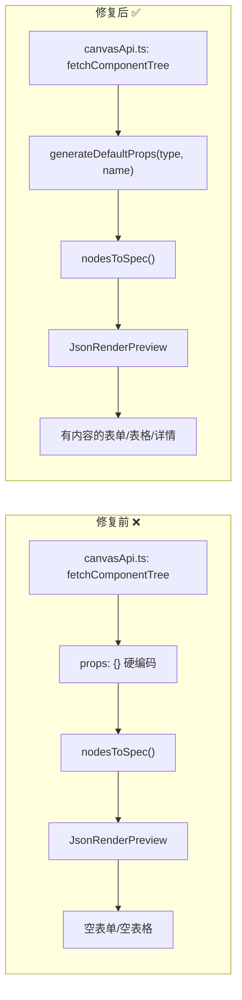
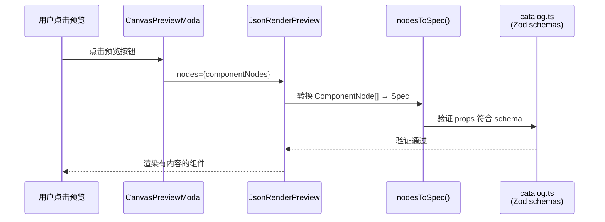

# Architecture: vibex-json-render-fix — 组件预览空白问题修复

**项目**: vibex-json-render-fix
**阶段**: design-architecture
**产出时间**: 2026-04-11 16:36 GMT+8
**Agent**: architect

---

## 1. 执行摘要

**问题**: Canvas 预览（CanvasPreviewModal → JsonRenderPreview）显示空白 — 组件节点存在但无渲染内容。

**根因**: `canvasApi.ts` 的 `fetchComponentTree()` 返回 `props: {}`（硬编码空对象）。`nodesToSpec()` 展开时仅有 `{ title }`，json-render 无法渲染有意义内容。

**修复**: 新增 `generateDefaultProps()` 辅助函数，根据组件 type 返回符合 catalog Zod schema 的默认 props。

---

## 2. Tech Stack

| 组件 | 技术选型 | 说明 |
|------|---------|------|
| **前端框架** | React 19 + TypeScript + Next.js 15 | App Router，`output: 'export'` |
| **状态管理** | Zustand | `componentStore`, `canvasPreviewStore` |
| **组件渲染** | `@json-render/core` + 自定义 Catalog | vibexCanvasCatalog 注册 5 种组件类型 |
| **API 层** | `canvasApi.ts` | `fetchComponentTree` / `generateComponents` |
| **类型系统** | Zod schemas (catalog.ts) | 约束 props 结构 |
| **测试** | Vitest (单元) + Playwright (E2E) | 3 个 E2E + 5 个单元测试 |

---

## 3. 架构图

### 3.1 修复前后对比



### 3.2 完整数据流



---

## 4. API 定义

### 4.1 核心函数签名

```typescript
// canvasApi.ts — 新增
export function generateDefaultProps(
  type: string,
  name: string
): Record<string, unknown>;

// 返回结构（符合 catalog Zod schema）
type DefaultProps =
  | { title: string; layout: 'topnav' | 'sidebar' }
  | { title: string; fields: FormField[] }
  | { title: string; columns: Column[]; rows: number; searchable: boolean }
  | { title: string; fields: DetailField[]; actions?: Action[] }
  | { title: string; size: 'sm' | 'md' | 'lg' }
  | { title: string };
```

### 4.2 fetchComponentTree 修复前后

```typescript
// ❌ 修复前
return result.components.map((comp) => ({
  flowId: ...,
  name: comp.name,
  type: comp.type,
  props: {},          // ← 始终为空对象
  api: comp.api ?? { method: 'GET', path: '/api/' + ... },
  previewUrl: undefined,
  nodeId: ...,
  confirmed: false,
  status: 'pending',
  children: [],
}));

// ✅ 修复后
return result.components.map((comp) => ({
  flowId: ...,
  name: comp.name,
  type: comp.type,
  props: generateDefaultProps(comp.type, comp.name),  // ← 有内容的默认 props
  api: comp.api ?? { method: 'GET', path: '/api/' + ... },
  previewUrl: undefined,
  nodeId: ...,
  confirmed: false,
  status: 'pending',
  children: [],
}));
```

---

## 5. 数据模型

### 5.1 默认 Props 结构（符合 Catalog Schema）

| type | props 字段 | 示例 |
|------|-----------|------|
| `page` | `layout` | `{ title: "Dashboard", layout: "topnav" }` |
| `form` | `fields[]` | `{ title: "LoginForm", fields: [{name:"email",label:"邮箱",type:"email",...}] }` |
| `list` | `columns[]`, `rows`, `searchable` | `{ title: "UserList", columns:[{key:"name",label:"名称",sortable:true}] }` |
| `detail` | `fields[]`, `actions?` | `{ title: "UserDetail", fields:[{label:"用户名",value:"..."}] }` |
| `modal` | `size` | `{ title: "ConfirmModal", size: "md" }` |
| `default` | 无额外字段 | `{ title: "MyComponent" }` |

### 5.2 Zod Schema 对应关系

```typescript
// catalog.ts — 参考
FormSchema:   { title, fields: z.array(z.object({ name, label, type, placeholder?, required })) }
ListSchema:   { title, columns: z.array(z.object({ key, label, sortable })), rows, searchable }
DetailSchema: { title, fields: z.array(z.object({ label, value })), actions? }
PageSchema:    { title, layout }
ModalSchema:  { title, size }
```

---

## 6. 测试策略

### 6.1 测试框架

- **单元**: Vitest — 测试 `generateDefaultProps()` 5 种类型的输出
- **E2E**: Playwright — `json-render-preview.spec.ts` 验证渲染效果
- **构建**: `npm run build` TypeScript 类型检查

### 6.2 单元测试用例

```typescript
// generateDefaultProps.test.ts
describe('generateDefaultProps', () => {
  it('page 类型返回 title + layout', () => {
    expect(generateDefaultProps('page', 'Dashboard'))
      .toMatchObject({ title: 'Dashboard', layout: 'topnav' });
  });

  it('form 类型返回带 fields 数组', () => {
    const props = generateDefaultProps('form', 'LoginForm');
    expect(props).toMatchObject({ title: 'LoginForm' });
    expect((props as any).fields).toBeInstanceOf(Array);
    expect((props as any).fields.length).toBeGreaterThan(0);
  });

  it('list 类型返回 columns + rows + searchable', () => {
    const props = generateDefaultProps('list', 'UserList');
    expect(props).toMatchObject({ title: 'UserList', rows: 10, searchable: true });
    expect((props as any).columns).toBeInstanceOf(Array);
  });

  it('detail 类型返回 fields 数组', () => {
    const props = generateDefaultProps('detail', 'UserDetail');
    expect(props).toMatchObject({ title: 'UserDetail' });
    expect((props as any).fields).toBeInstanceOf(Array);
  });

  it('modal 类型返回 size', () => {
    expect(generateDefaultProps('modal', 'Confirm')).toMatchObject({ size: 'md' });
  });

  it('未知类型仅返回 title', () => {
    const props = generateDefaultProps('unknown', 'Test');
    expect(props).toMatchObject({ title: 'Test' });
    expect(Object.keys(props)).toHaveLength(1);
  });
});
```

### 6.3 构建验证

```typescript
// build-verify
it('props 字段不为空', () => {
  const result = await fetchComponentTree(mockData);
  result.forEach(node => {
    expect(node.props).not.toEqual({});
  });
});
```

---

## 7. 性能影响评估

| 影响项 | 评估 |
|--------|------|
| **Bundle Size** | 无变化（仅新增一个 ~1KB 辅助函数） |
| **运行时性能** | 无影响（props 填充在组件节点创建时一次） |
| **渲染性能** | 改善 — 组件有内容，json-render 不渲染空白 |
| **API 响应** | 无影响 |

---

## 8. 执行决策

- **决策**: 已采纳
- **执行项目**: vibex-json-render-fix
- **执行日期**: 2026-04-11

---

*本文件由 Architect Agent 生成，作为 design-architecture 阶段产出。*
