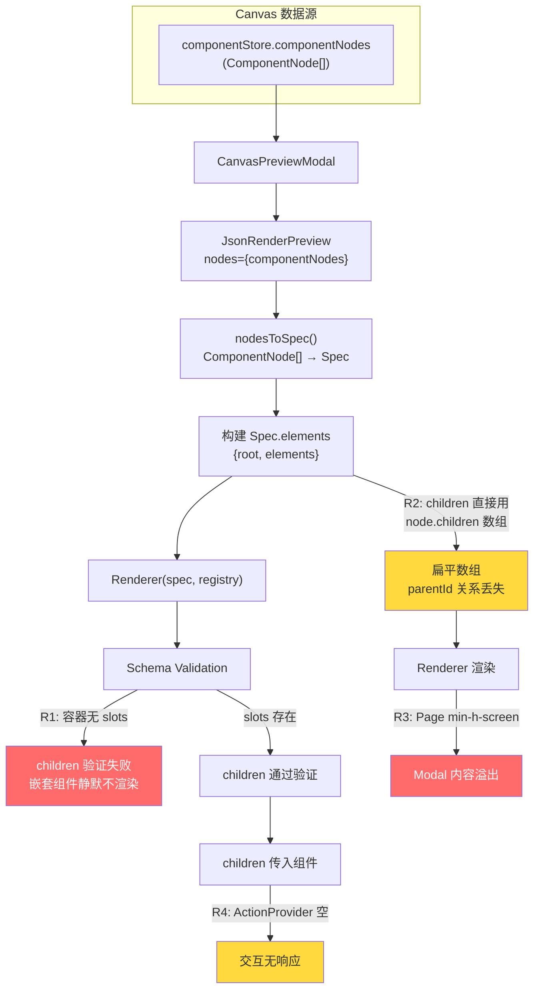
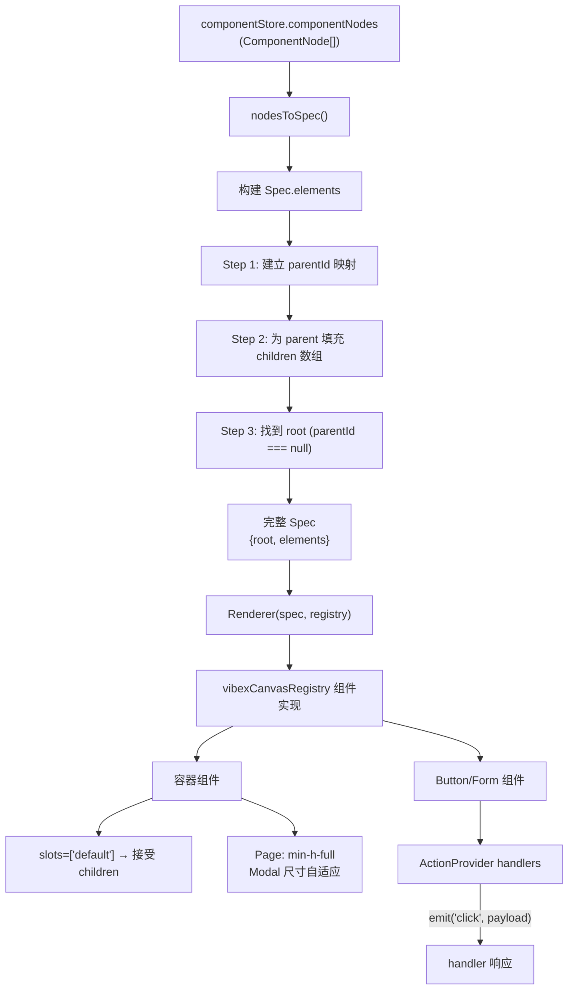

# vibex-json-render-integration — 架构设计方案

**项目**: vibex-json-render-integration
**任务**: design-architecture
**日期**: 2026-04-14
**作者**: Architect Agent
**状态**: ✅ 完成

---

## 1. 执行摘要

VibeX Canvas 的 `JsonRenderPreview` 组件存在 4 类根因缺陷，导致 Canvas 生成的嵌套组件树无法正确预览：

| # | 根因 | 严重度 | 修复位置 |
|---|------|--------|----------|
| R1 | `catalog.ts` 容器组件缺少 `slots` 声明 | P0（阻断） | catalog.ts |
| R2 | `nodesToSpec()` 未用 `parentId` 建立嵌套关系 | P0（阻断） | JsonRenderPreview.tsx |
| R3 | `Page` 组件 `min-h-screen` 在 Modal 中溢出 | P1 | registry.tsx |
| R4 | `ActionProvider` handlers 为空，事件无法触发 | P1 | JsonRenderPreview.tsx + registry.tsx |

**决策**:
- Phase 1（P0，1d）：修复 catalog slots + nodesToSpec parentId + Page 尺寸
- Phase 2（P1，1.75d）：ActionProvider 实现 + Preview Modal 适配 + 测试覆盖

---

## 2. Tech Stack

| 层级 | 技术 | 理由 |
|------|------|------|
| 渲染引擎 | `@json-render/react` + `@json-render/core` | 已有依赖 |
| 组件规范 | `defineCatalog` (Zod schema) | 已有，扩展 `slots` |
| 组件注册 | `defineRegistry` | 已有，修复合子实现 |
| 状态 | Zustand (`componentStore`) | 已有 |
| 测试 | Vitest + React Testing Library + Playwright | 已有测试栈 |

**不做变更**: json-render 依赖版本、后端 API、canvasStore 数据模型。

---

## 3. 架构图（Mermaid）

### 3.1 当前数据流（问题链路）



### 3.2 修复后数据流



---

## 4. API 定义

### 4.1 组件数据转换（新增）

**函数**: `nodesToSpec(nodes: ComponentNode[]): Spec | null`

| 输入 | 输出 | 行为 |
|------|------|------|
| `nodes = []` | `null` | 空数组直接返回 null |
| 单节点（无 children） | `{ root, elements }` | 正常转换 |
| 多节点（含嵌套） | `{ root, elements }` | 使用 parentId 建立层级 |

**Spec 格式**:
```typescript
interface Spec {
  root: string; // 根节点 nodeId
  elements: Record<string, {
    type: string;      // 'Page' | 'Form' | 'Button' | ...
    props: Record<string, unknown>;
    children: string[]; // 子节点 nodeId 数组
  }>;
}
```

### 4.2 catalog slots 声明（新增）

| 组件 | slots 声明 | 用途 |
|------|-----------|------|
| `Page` | `slots: ['default']` | 接受任意子组件 |
| `Form` | `slots: ['default']` | 接受表单内子组件 |
| `DataTable` | `slots: ['default']` | 接受工具栏/分页等子组件 |
| `DetailView` | `slots: ['default']` | 接受详情行等子组件 |
| `Modal` | `slots: ['default']` | 接受弹窗内容组件 |

---

## 5. 数据模型

无新增实体。现有 `ComponentNode` 结构无需改动：

```typescript
// 现有结构，无需修改
interface ComponentNode {
  nodeId: string;
  flowId: string;
  name: string;
  type: ComponentType;
  props: Record<string, unknown>;
  children: string[];   // 子节点 ID 数组
  parentId?: string;    // 父节点 ID
  // ...其他字段
}
```

---

## 6. 关键代码变更

### 6.1 Phase 1 — `catalog.ts` (R1: slots 补全)

```typescript
// src/lib/canvas-renderer/catalog.ts

// 新增 slots 声明（5 个容器组件）
const rawCatalog = defineCatalog(schema, {
  components: {
    Page: {
      props: z.object({ title: z.string(), description: z.string().optional() }),
      slots: ['default'],         // ← 新增
    },
    Form: {
      props: z.object({ /* ... */ }),
      slots: ['default'],          // ← 新增
    },
    DataTable: {
      props: z.object({ /* ... */ }),
      slots: ['default'],          // ← 新增
    },
    DetailView: {
      props: z.object({ /* ... */ }),
      slots: ['default'],          // ← 新增
    },
    Modal: {
      props: z.object({ /* ... */ }),
      slots: ['default'],          // ← 新增
    },
    // Button/Card/Badge/StatCard/Empty — 非容器，不需 slots
  },
});
```

### 6.2 Phase 1 — `JsonRenderPreview.tsx` (R2: parentId 嵌套)

```typescript
// src/components/canvas/json-render/JsonRenderPreview.tsx

function nodesToSpec(nodes: ComponentNode[]): Spec | null {
  if (nodes.length === 0) return null;

  // === Phase 1 修复: 使用 parentId 建立嵌套关系 ===
  // Step 1: 建立 nodeId → node 的映射
  const nodeMap = new Map(nodes.map((n) => [n.nodeId, n]));

  // Step 2: 建立 parentId → children[] 的映射
  const childrenOfParent: Record<string, string[]> = {};
  for (const node of nodes) {
    if (node.parentId) {
      if (!childrenOfParent[node.parentId]) {
        childrenOfParent[node.parentId] = [];
      }
      childrenOfParent[node.parentId].push(node.nodeId);
    }
  }

  // Step 3: 构建 elements，children 使用 parentId 映射
  const elements: Spec['elements'] = {};
  for (const node of nodes) {
    if (!node.name) continue;

    const registryType = COMPONENT_TYPE_MAP[node.type] ?? node.type;

    elements[node.nodeId] = {
      type: registryType,
      props: { ...node.props, title: node.name },
      // 优先使用 parentId 映射的 children，fallback 到 node.children
      children: childrenOfParent[node.nodeId] ?? node.children ?? [],
    };
  }

  // Step 4: 找 root（parentId === null 且 type=page）
  const root = nodes.find((n) => n.type === 'page' && !n.parentId)?.nodeId
    ?? nodes.find((n) => !n.parentId)?.nodeId
    ?? nodes[0]?.nodeId;

  return root ? { root, elements } : null;
}
```

### 6.3 Phase 1 — `registry.tsx` (R3: Page 尺寸修复)

```typescript
// src/lib/canvas-renderer/registry.tsx

// PageImpl — 修复 Preview Modal 溢出
const PageImpl = ({ props, children }: ...) => {
  const { title } = props;
  return (
    <div className="min-h-full bg-gray-50 flex flex-col">
      <header className="bg-white border-b border-gray-200 px-6 py-4 flex-shrink-0">
        <h1 className="text-lg font-semibold text-gray-900">{title}</h1>
      </header>
      <main className="p-6 flex-1 overflow-auto">{children}</main>
    </div>
  );
};
```

### 6.4 Phase 2 — ActionProvider handlers (R4)

```typescript
// src/components/canvas/json-render/JsonRenderPreview.tsx

// 定义事件类型
type CanvasAction = { type: 'click'; nodeId: string; label?: string }
  | { type: 'submit'; nodeId: string; fields: Record<string, unknown> }
  | { type: 'navigate'; path: string };

// ActionProvider handlers 实现
<ActionProvider handlers={{
  click: (payload: { nodeId: string; label?: string }) => {
    // 记录操作到 messageStore 或触发 toast
    useMessageStore.getState().addMessage({
      type: 'user_action',
      content: `点击了: ${payload.label ?? payload.nodeId}`,
    });
  },
  submit: (payload: { nodeId: string; fields: Record<string, unknown> }) => {
    // 表单提交处理
    canvasLogger.default.info('[JsonRenderPreview] 表单提交:', payload);
  },
  navigate: (payload: { path: string }) => {
    // 路由跳转
    window.location.href = payload.path;
  },
}}>
```

---

## 7. 测试策略

### 7.1 测试框架
- **单元测试**: Vitest（已有 `CanvasPreviewModal.test.tsx`）
- **E2E 测试**: Playwright（已有基础测试）

### 7.2 核心测试用例

```typescript
// nodesToSpec.test.ts（新建）

describe('nodesToSpec — parentId 嵌套', () => {
  it('单节点: 无 children，Spec 正确生成', () => {
    const nodes: ComponentNode[] = [{
      nodeId: 'n1', name: 'Test', type: 'page', children: [], props: {}, flowId: 'f1', api: { method: 'GET', path: '/', params: [] }, status: 'confirmed'
    }];
    const spec = nodesToSpec(nodes);
    expect(spec?.root).toBe('n1');
    expect(spec?.elements.n1.children).toEqual([]);
  });

  it('二层嵌套: parent.children 使用 parentId 映射填充', () => {
    const nodes: ComponentNode[] = [
      { nodeId: 'p1', name: 'Page', type: 'page', parentId: null, children: [], props: {}, flowId: 'f1', api: { method: 'GET', path: '/', params: [] }, status: 'confirmed' },
      { nodeId: 'c1', name: 'Button', type: 'button', parentId: 'p1', children: [], props: {}, flowId: 'f1', api: { method: 'GET', path: '/', params: [] }, status: 'confirmed' },
    ];
    const spec = nodesToSpec(nodes);
    expect(spec?.root).toBe('p1');
    expect(spec?.elements.p1.children).toEqual(['c1']);
  });

  it('node.children 和 parentId 不一致: 优先使用 parentId 映射', () => {
    const nodes: ComponentNode[] = [
      { nodeId: 'p1', name: 'Page', type: 'page', parentId: null, children: [], props: {}, flowId: 'f1', api: { method: 'GET', path: '/', params: [] }, status: 'confirmed' },
      { nodeId: 'c1', name: 'Button', type: 'button', parentId: 'p1', children: ['x'], props: {}, flowId: 'f1', api: { method: 'GET', path: '/', params: [] }, status: 'confirmed' },
    ];
    const spec = nodesToSpec(nodes);
    // parentId 映射优先级更高
    expect(spec?.elements.p1.children).toEqual(['c1']);
  });

  it('多层嵌套: 三层树形结构正确生成', () => {
    const nodes: ComponentNode[] = [
      { nodeId: 'p1', name: 'Page', type: 'page', parentId: null, children: [], props: {}, flowId: 'f1', api: { method: 'GET', path: '/', params: [] }, status: 'confirmed' },
      { nodeId: 'f1', name: 'Form', type: 'form', parentId: 'p1', children: [], props: {}, flowId: 'f1', api: { method: 'GET', path: '/', params: [] }, status: 'confirmed' },
      { nodeId: 'b1', name: 'Button', type: 'button', parentId: 'f1', children: [], props: {}, flowId: 'f1', api: { method: 'GET', path: '/', params: [] }, status: 'confirmed' },
    ];
    const spec = nodesToSpec(nodes);
    expect(spec?.elements.p1.children).toEqual(['f1']);
    expect(spec?.elements.f1.children).toEqual(['b1']);
  });
});
```

### 7.3 E2E 测试用例

```typescript
// json-render-nested.spec.ts（新建）

test('嵌套渲染: Page → Form → Button 三层嵌套，内容可见', async ({ page }) => {
  await page.goto('/canvas');
  // 生成嵌套组件树
  await generateNestedComponents(page);
  // 打开预览
  await page.getByTestId('preview-btn').click();
  // 验证 Page title 可见
  await expect(page.getByText('测试页面')).toBeVisible();
  // 验证 Form title 可见
  await expect(page.getByText('登录表单')).toBeVisible();
  // 验证 Button 可见（嵌套在 Form 内）
  await expect(page.getByRole('button', { name: '提交' })).toBeVisible();
});

test('Preview Modal: Page 内容不溢出，容器内可滚动', async ({ page }) => {
  await page.goto('/canvas');
  await generateLargePage(page);
  await page.getByTestId('preview-btn').click();
  const modal = page.locator('[data-testid="preview-modal"]');
  await expect(modal).toBeVisible();
  // 验证没有 overflow
  const hasOverflow = await page.evaluate(() => {
    const el = document.querySelector('[data-testid="preview-modal"]');
    return el ? el.scrollHeight > el.clientHeight : false;
  });
  expect(hasOverflow).toBe(false); // Modal 自适应高度，无溢出
});
```

---

## 8. 性能影响评估

| 操作 | 影响 | 评估 |
|------|------|------|
| parentId 映射构建 | O(n) | `nodesToSpec` 中 `new Map()` + 循环，无显著开销 |
| catalog slots 新增 | 无 | 仅类型声明，不影响运行时 |
| ActionProvider handlers | 无 | 轻量函数引用 |
| Page 尺寸修改 | 极小 | CSS 类替换，无 JS 执行 |

**结论**: Phase 1 + Phase 2 对性能无负面影响。

---

## 9. 风险评估

| 风险 | 等级 | 缓解 |
|------|------|------|
| parentId 和 children 不一致导致双重渲染 | 低 | parentId 映射优先级更高，统一以 parentId 为准 |
| catalog slots 影响已有 schema 验证 | 低 | 仅添加可选字段，不影响现有 props 校验 |
| ActionProvider handlers 引入状态副作用 | 中 | handlers 写入 messageStore，不修改核心 canvas 状态 |
| Page 尺寸修改影响已有布局 | 低 | Preview Modal 独占场景，不影响页面级渲染 |

---

## 10. 不兼容变更

**无**。所有变更均为前端渲染层，零 API 变更，零数据模型破坏性变更。

Phase 1 完成后，嵌套组件渲染为唯一可见行为变化（children 从"静默不渲染"变为"正确渲染"）。

---

## 11. 执行决策

- **决策**: 已采纳
- **执行项目**: vibex-json-render-integration
- **执行日期**: 2026-04-14
- **Phase 1**: 1d（P0 阻断修复）
- **Phase 2**: 1.75d（P1 功能增强）
